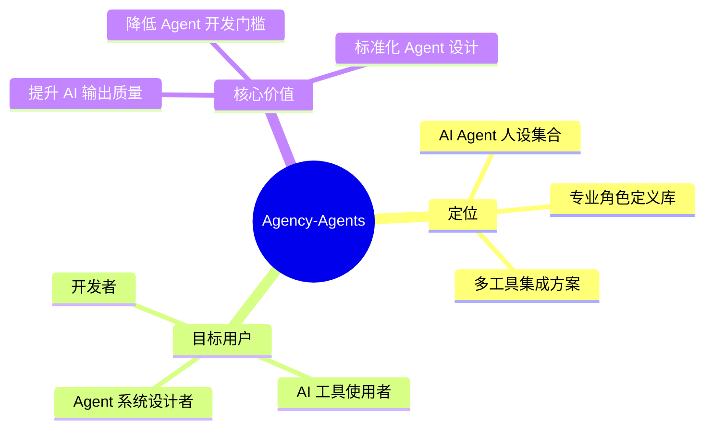
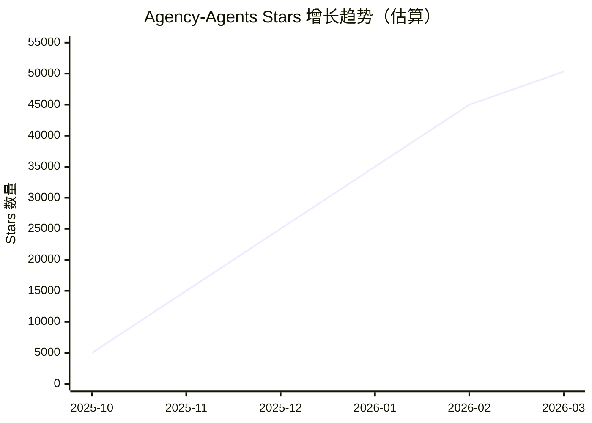
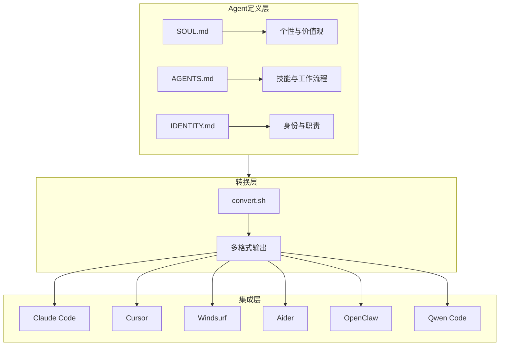
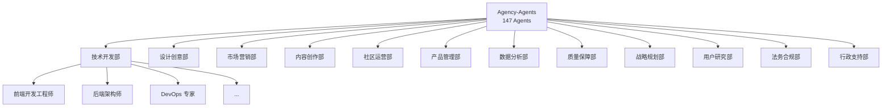
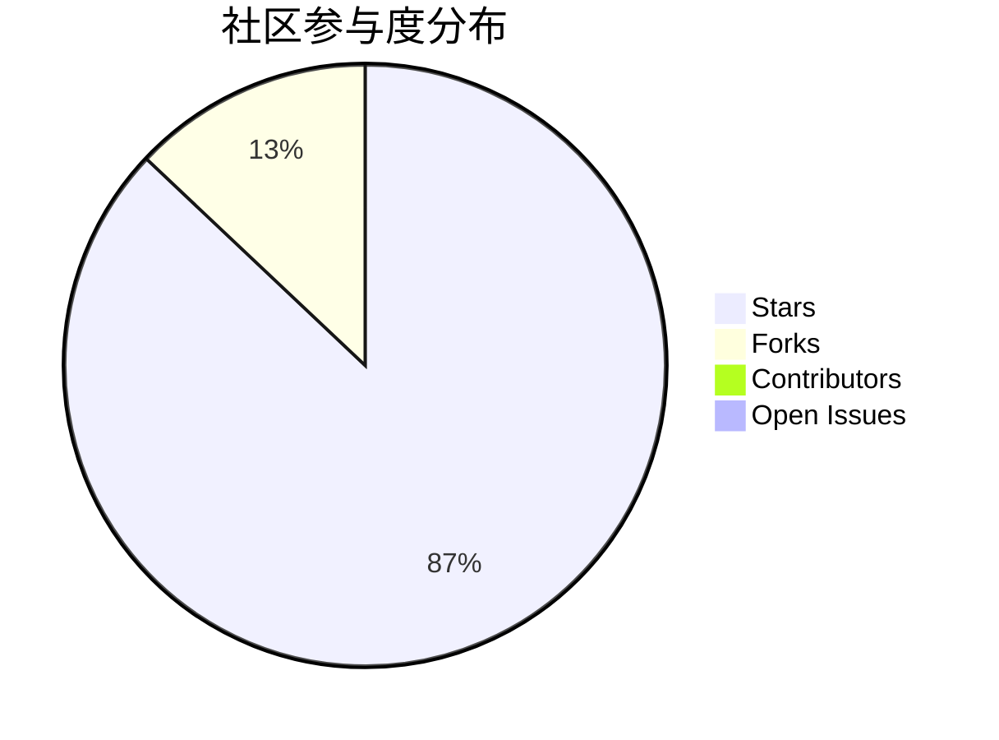
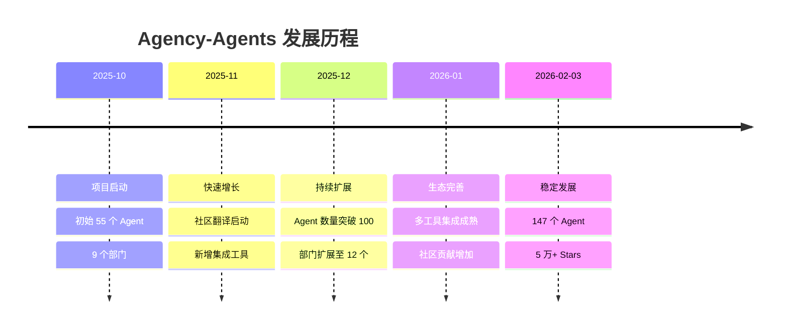
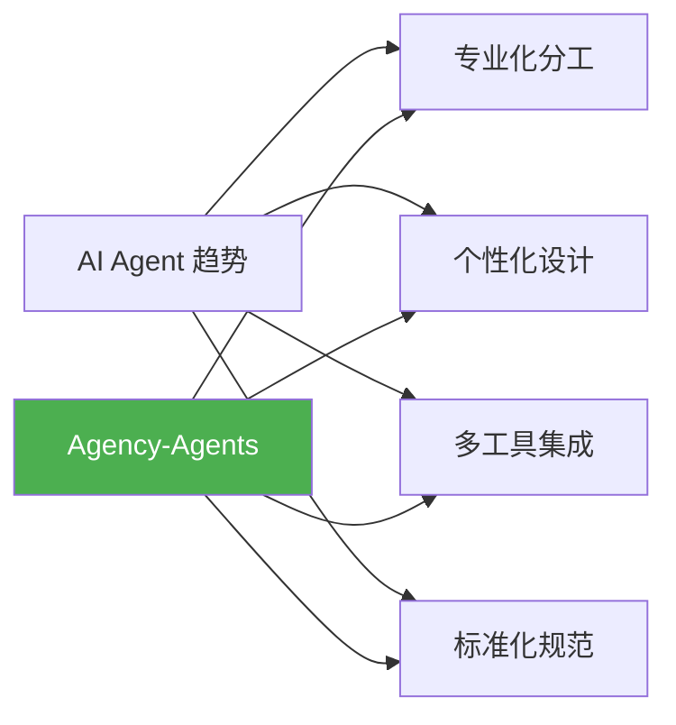
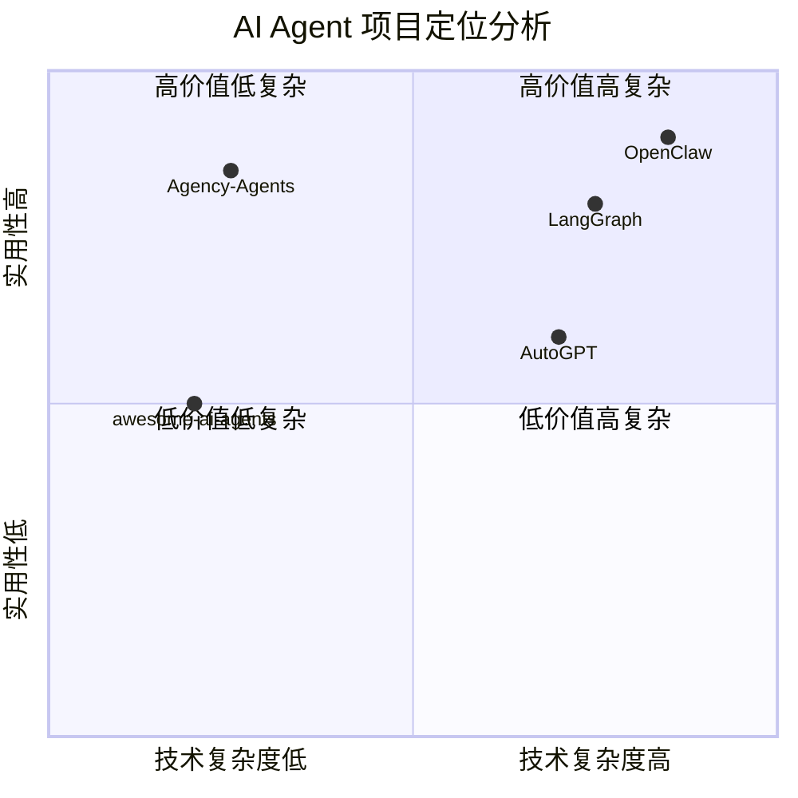
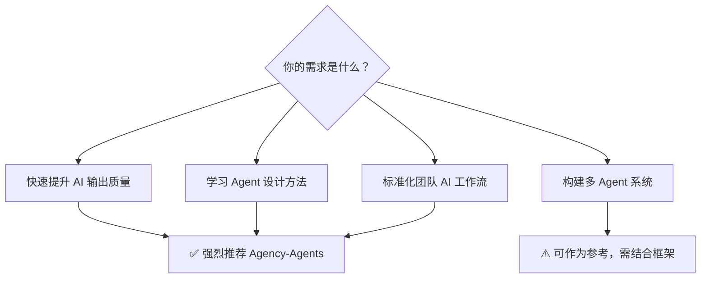

# msitarzewski/agency-agents 深度研究报告

> A complete AI agency at your fingertips - From frontend wizards to Reddit community ninjas, from whimsy injectors to reality checkers. Each agent is a specialized expert with personality, processes, and proven deliverables.

---

## 📋 目录

1. [项目概述](#项目概述)
2. [基本信息](#基本信息)
3. [技术分析](#技术分析)
4. [社区活跃度](#社区活跃度)
5. [发展趋势](#发展趋势)
6. [竞品对比](#竞品对比)
7. [总结评价](#总结评价)

---

## 项目概述

### 项目简介

**Agency-Agents** 是一个革命性的开源 AI Agent 人设集合项目，由社区驱动开发。该项目将传统的单一 AI 助手概念升级为"完整的虚拟 AI 代理公司"，包含 **147 个专业 Agent**，覆盖 **12 个业务部门**，每个 Agent 都具备独特的个性、专业技能和工作流程。

### 核心理念

项目核心理念是"**专业化分工 + 个性化设计**"：

- 每个 Agent 都有明确的岗位职责
- 每个角色都有独特的工作方式和交付物
- 强调 Agent 的"灵魂"（SOUL）设计
- 可直接用于生产环境的专业级输出

### 项目定位

---

## 基本信息

### 项目指标

| 指标 | 数值 | 说明 |
|------|------|------|
| **Stars** | 50,323 | GitHub 星标数，极高人气 |
| **Forks** | 7,493 | 社区参与度活跃 |
| **Open Issues** | 53 | 问题反馈活跃 |
| **语言** | Shell | 主要为 Agent 定义脚本 |
| **开源协议** | MIT | 商业友好，自由使用 |
| **创建时间** | 2025-10-13 | 约 5 个月历史 |
| **最近更新** | 2026-03-17 | 持续活跃维护 |
| **贡献者** | 41 | 社区协作良好 |

### 项目链接

- **GitHub**: [https://github.com/msitarzewski/agency-agents](https://github.com/msitarzewski/agency-agents)
- **作者**: [@msitarzewski](https://github.com/msitarzewski)
- **License**: MIT License

### 增长曲线

---

## 技术分析

### 技术架构

项目采用轻量级的 Shell 脚本作为主要载体，核心是 Agent 的定义规范：

### Agent 结构设计

每个 Agent 包含三个核心文件：

| 文件 | 用途 | 内容 |
|------|------|------|
| `SOUL.md` | 灵魂定义 | 个性、价值观、工作哲学 |
| `AGENTS.md` | 技能定义 | 专业技能、工作流程、交付标准 |
| `IDENTITY.md` | 身份定义 | 角色定位、职责范围、协作关系 |

### 12 大业务部门

### 多工具集成方案

项目支持 **10+ 主流 AI 编程工具**：

| 工具 | 集成方式 | 配置文件 |
|------|----------|----------|
| Claude Code | `~/.claude/agents/` | 直接复制 |
| Cursor | `.cursorrules` | 规则文件 |
| Windsurf | `.windsurfrules` | 规则文件 |
| Aider | `CONVENTIONS.md` | 单文件聚合 |
| OpenClaw | `~/.openclaw/agency-agents/` | 工作空间 |
| Qwen Code | `.qwen/agents/` | SubAgents |
| GitHub Copilot | `.github/copilot-instructions.md` | 指令文件 |
| Gemini CLI | `.gemini/AGENTS.md` | 代理定义 |
| Antigravity | `.antigravity/agents/` | 代理配置 |
| OpenCode | `.opencode/agents/` | 代理目录 |

### 代码统计

- **总代码量**: ~44,000 行 Shell 脚本
- **Agent 数量**: 147 个专业角色
- **部门数量**: 12 个业务部门
- **集成工具**: 10+ 个 AI 编程工具

---

## 社区活跃度

### 社区指标分析

### 社区活跃特征

| 维度 | 评估 | 说明 |
|------|------|------|
| **增长速度** | ⭐⭐⭐⭐⭐ | 5 个月达到 5 万星，增长极快 |
| **社区参与** | ⭐⭐⭐⭐ | 7,493 Forks，41 贡献者 |
| **问题响应** | ⭐⭐⭐⭐ | 53 个开放 Issue，持续处理 |
| **国际化** | ⭐⭐⭐⭐⭐ | 有中文、等多语言社区翻译 |
| **文档质量** | ⭐⭐⭐⭐⭐ | README 详细，示例丰富 |

### 社区翻译项目

| 语言 | 维护者 | 项目链接 |
|------|--------|----------|
| 🇨🇳 简体中文 | @jnMetaCode | [agency-agents-zh](https://github.com/jnMetaCode/agency-agents-zh) |
| 🇨🇳 简体中文 | @dsclca12 | [agent-teams](https://github.com/dsclca12/agent-teams) |

### 社区渠道

- **GitHub Discussions**: 成功案例分享
- **Issues**: Bug 报告与功能请求
- **Reddit**: r/ClaudeAI 社区讨论
- **Twitter/X**: #TheAgency 话题标签

---

## 发展趋势

### 项目演进历程

### 未来路线图

| 计划功能 | 状态 | 说明 |
|----------|------|------|
| 交互式 Agent 选择器 Web 工具 | 🔲 计划中 | 可视化 Agent 选择 |
| 多 Agent 工作流示例 | ✅ 已完成 | examples/ 目录 |
| 多工具集成脚本 | ✅ 已完成 | 10+ 工具支持 |
| 视频教程 | 🔲 计划中 | Agent 设计教程 |
| 社区 Agent 市场 | 🔲 计划中 | Agent 交易平台 |
| Agent 个性测试 | 🔲 计划中 | 项目匹配工具 |
| "每周 Agent" 展示 | 🔲 计划中 | 社区推广活动 |

### 行业趋势契合度

---

## 竞品对比

### 同类项目对比

| 项目 | Stars | 定位 | 特点 | Agent 数量 |
|------|-------|------|------|------------|
| **Agency-Agents** | 50K+ | Agent 人设集合 | 个性化+专业化 | 147 |
| awesome-ai-agents | 8K+ | Agent 资源汇总 | 框架列表 | N/A |
| LangGraph | 40K+ | Agent 框架 | 工作流编排 | N/A |
| AutoGPT | 170K+ | 自主 Agent | 任务自动化 | 1 |
| OpenClaw | 188K+ | Agent 平台 | 多 Agent 协作 | 平台级 |

### 竞争优势分析

### 核心差异化优势

| 维度 | Agency-Agents | 竞品 |
|------|---------------|------|
| **上手难度** | 极低（复制即用） | 需要编程基础 |
| **Agent 个性** | 丰富（147 种角色） | 单一或有限 |
| **工具兼容** | 广泛（10+ 工具） | 通常单一工具 |
| **社区生态** | 活跃（多语言翻译） | 参差不齐 |
| **商业友好** | MIT 协议 | 各异 |

---

## 总结评价

### 综合评分

### 优势总结

| 优势 | 说明 |
|------|------|
| 🎯 **定位精准** | 填补了 Agent 人设定义的市场空白 |
| 🚀 **增长迅猛** | 5 个月突破 5 万星，社区认可度高 |
| 🔧 **易于使用** | 复制即用，零学习成本 |
| 🌐 **生态丰富** | 支持 10+ 主流 AI 编程工具 |
| 📚 **文档完善** | README 详细，示例丰富 |
| 🌍 **国际化** | 多语言社区翻译支持 |
| 💼 **商业友好** | MIT 协议，自由商用 |

### 潜在挑战

| 挑战 | 说明 |
|------|------|
| 🔄 **维护成本** | 147 个 Agent 的持续更新需要大量精力 |
| 📏 **质量把控** | 大量 Agent 的质量一致性难以保证 |
| 🏢 **商业化** | 开源项目的可持续商业模式待探索 |
| 🔀 **碎片化** | 多工具集成可能导致版本碎片化 |

### 适用场景推荐

### 最终评价

**Agency-Agents** 是一个极具创新性和实用价值的开源项目，它成功地将 AI Agent 从"单一助手"升级为"专业团队"。项目以低门槛、高实用性的方式，为 AI 编程工具生态提供了宝贵的 Agent 人设资源。

**推荐指数**: ⭐⭐⭐⭐⭐ (5/5)

- 对于 **AI 工具使用者**：直接复制使用，立竿见影提升 AI 输出质量
- 对于 **开发者**：学习 Agent 设计规范，构建自己的 Agent 系统
- 对于 **团队管理者**：标准化 AI 工作流程，提升团队协作效率

---

## 参考资源

- [GitHub 仓库](https://github.com/msitarzewski/agency-agents)
- [中文翻译版](https://github.com/jnMetaCode/agency-agents-zh)
- [OpenClaw 集成](https://github.com/mergisi/awesome-openclaw-agents)

---

*报告生成时间: 2026-03-17*  
*数据来源: GitHub API, Web Search*
