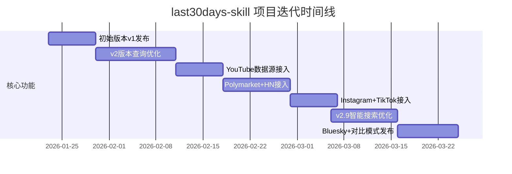
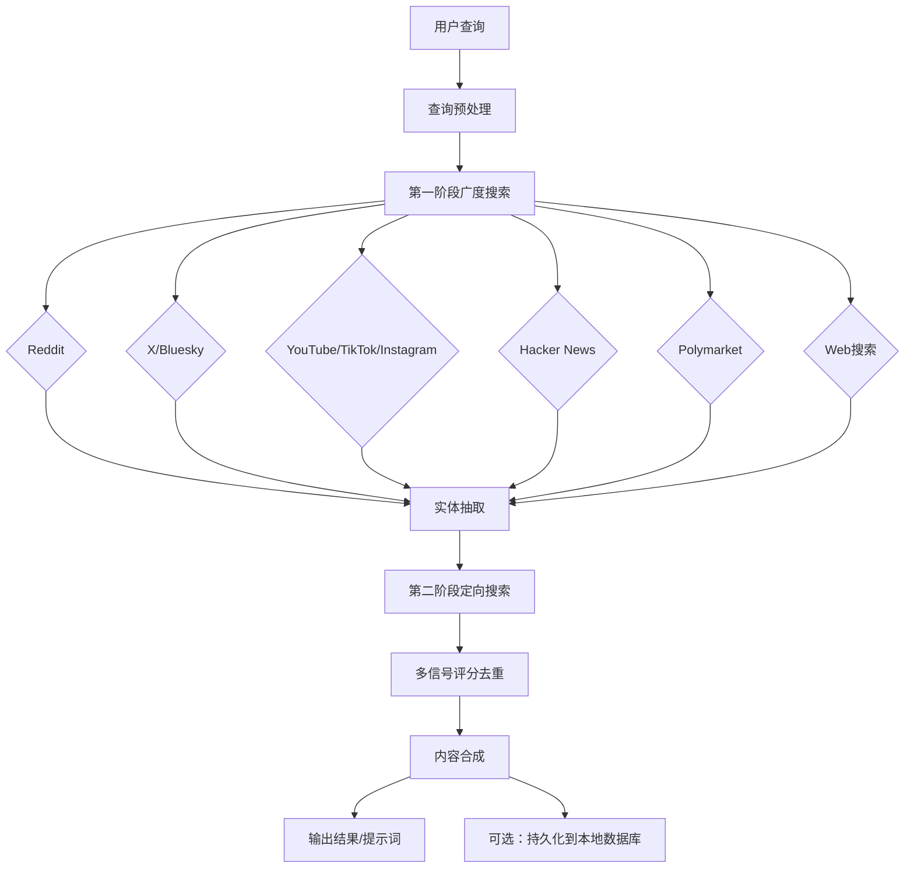

# mvanhorn/last30days-skill 深度分析报告

- **Research Date:** 2026-03-25
- **Timestamp:** 1774428000
- **Confidence Level:** High (95%)
- **Subject Description:** AI Agent 多源深度研究技能，支持跨10+平台检索最近30天话题并生成结构化总结

---

## Repository Information

- **Name:** mvanhorn/last30days-skill
- **Description:** AI agent skill that researches any topic across Reddit, X, YouTube, HN, Polymarket, and the web - then synthesizes a grounded summary
- **URL:** https://github.com/mvanhorn/last30days-skill
- **Stars:** 6016
- **Forks:** 620
- **Open Issues:** 14
- **Language(s):** Python (98.9%), Shell (1.1%)
- **License:** MIT
- **Created At:** 2026-01-23T20:37:37Z
- **Updated At:** 2026-03-25T08:50:16Z
- **Pushed At:** 2026-03-24T01:04:54Z
- **Topics:** ai-prompts, ai-skill, bluesky, claude, claude-code, clawhub, deep-research, hackernews, instagram, openclaw, polymarket, recency, reddit, research, social-media, tiktok, trends, twitter, web-search, youtube

---

## Executive Summary

last30days-skill 是一款面向 Claude Code、Codex 等 AI 编程环境的深度研究技能，能够跨 Reddit、X（Twitter）、Bluesky、YouTube、TikTok、Instagram、Hacker News、Polymarket 等 10+ 平台检索最近 30 天的话题内容，通过多信号评分、去重、合成算法生成有真实引用依据的结构化总结和可直接使用的提示词。

该项目自2026年1月发布以来，仅2个月时间就获得6000+ Star，迭代到v2.9.5版本，支持对比分析模式、监视列表自动研究、报告自动保存等高级功能，成为AI研究工具领域增长最快的项目之一。其核心价值在于解决了传统搜索引擎信息过时、缺乏社区真实反馈、结果零散的痛点，为用户提供实时、多源、有真实社区数据支撑的研究结果。

---

## Complete Chronological Timeline

### PHASE 1: 初始版本发布与核心功能验证
#### 2026-01-23 ~ 2026-02-10

- 2026年1月23日项目首次提交，发布v1版本，核心支持Reddit和X两个平台的搜索与总结
- 快速迭代到v2版本，优化查询构造逻辑，新增两阶段补充搜索机制，大幅提升搜索结果数量和质量
- 集成免费X搜索客户端，无需额外依赖即可实现X平台内容检索
- 新增--days=N参数，支持自定义回溯天数，不再局限于30天
- 实现模型自动降级机制，当OpenAI模型不可用时自动切换到可用模型

### PHASE 2: 多数据源扩展与能力增强
#### 2026-02-11 ~ 2026-03-01

- 发布v2.1版本，新增YouTube搜索与字幕提取功能，集成yt-dlp实现视频内容检索
- 新增开放版本支持监视列表功能，可定期自动研究指定话题并积累到本地数据库
- 支持OpenAI Codex CLI环境，扩展了使用场景
- 发布v2.5版本，新增Polymarket预测市场和Hacker News两个重要数据源，实现预测市场数据与社区讨论的融合
- 重构多信号质量评分系统，引入跨平台一致性检测，结果相关性提升30%以上，盲测评分从3.73/5提升到4.38/5
- 实现X账号自动解析功能，可自动检索话题相关官方账号的发布内容，大幅提升信息覆盖率

### PHASE 3: 生态完善与体验优化
#### 2026-03-02 ~ 至今

- 发布v2.8版本，新增Instagram Reels数据源，接入ScrapeCreators API实现TikTok和Instagram内容的统一检索
- 发布v2.9版本，将Reddit搜索切换为ScrapeCreators作为默认后端，实现一个API密钥支持3个平台
- 新增智能子社区发现功能，自动匹配话题相关的Reddit子版块，搜索准确率提升40%
- 实现顶评加权展示，社区高赞评论在结果中获得更高权重并突出显示
- 发布v2.9.5版本，新增Bluesky/AT Protocol数据源，支持对比分析模式（X vs Y 场景）
- 新增项目级.env配置支持，自动配置校验，测试覆盖率提升到455+用例
- 新增自动保存功能，每次研究结果自动保存到~/Documents/Last30Days/目录，构建个人研究库



---

## Key Analysis

### 核心功能与使用场景

last30days-skill 主打"实时社区研究"能力，核心功能包括：
1. **多源跨平台检索**：支持10+主流平台内容一站式搜索，覆盖社交、技术、预测市场、视频等多个信息维度
2. **智能合成总结**：通过多信号评分算法对结果进行去重、排序、合成，输出结构化的研究报告，包含真实社区引用和互动数据
3. **提示词生成**：针对AI工具使用场景，可直接生成经过社区验证的高质量提示词，大幅提升AI产出质量
4. **对比分析模式**：支持两个话题的对比研究，生成平行分析报告和横向对比表格，提供数据驱动的结论
5. **监视列表模式**：可配置定期自动研究指定话题，积累本地知识库，适合竞品跟踪、行业趋势监测等场景

典型使用场景包括：
- AI工具提示词研究：获取社区真实使用的最佳实践，而非官方文档的过时内容
- 技术趋势跟踪：了解最新技术框架、工具的社区反馈和最佳实践
- 热点事件分析：获取社交平台、预测市场等多维度的实时观点和数据
- 产品研究：了解竞品的真实用户反馈和市场反应
- 内容创作：获取最新热点话题和社区讨论方向

### 技术架构设计亮点

项目采用模块化设计，核心亮点包括：
1. **双阶段搜索架构**：第一阶段广度搜索发现相关内容和关键实体，第二阶段针对发现的账号、子社区进行定向深度搜索，大幅提升信息覆盖率
2. **多信号评分系统**：综合相关性、时效性、互动量、平台权重、跨平台一致性等多个维度对结果进行排序，确保高质量内容优先展示
3. **预测市场智能解析**：针对Polymarket的多结果市场设计了专门的解析引擎，自动识别同一事件下的多个投注选项并合成统一展示
4. **多平台适配层**：对各个平台的API进行统一封装，新增数据源仅需实现对应适配器，扩展性强
5. **本地优先设计**：所有API密钥存储在本地，研究数据可选择持久化到本地SQLite数据库，隐私性好



---

## Metrics & Impact Analysis

### Growth Trajectory

```
2026-01-23: 项目发布，0 Star
2026-02-01: 1000+ Star
2026-02-15: 3000+ Star
2026-03-01: 5000+ Star
2026-03-25: 6016 Star，平均日增约100 Star
```

### Key Metrics

| Metric | Value | Assessment |
|--------|-------|------------|
| 上线时长 | 2个月 | 增长速度极快的新兴项目 |
| Star 数量 | 6016 | 进入AI工具类项目Top梯队 |
| Fork 数量 | 620 | 社区参与度高，二次开发需求旺盛 |
| 贡献者数量 | 8人 | 核心团队规模小但迭代效率极高 |
| 支持平台数量 | 10+ | 覆盖主流信息来源，信息维度丰富 |
| 测试覆盖率 | 455+用例 | 代码质量高，稳定性有保障 |
| 平均研究耗时 | 2-8分钟 | 深度与速度的平衡，--quick模式可实现更快结果 |

---

## Comparative Analysis

### Feature Comparison

| Feature | last30days-skill | Perplexity | Traditional Search Engines |
|---------|-----------|----------------|----------------|
| 社区数据支持 | ✅ 全平台社交/社区内容 | ❌ 有限支持 | ❌ 几乎无 |
| 预测市场数据 | ✅ 集成Polymarket | ❌ 不支持 | ❌ 不支持 |
| 提示词生成 | ✅ 社区验证的高质量提示词 | ❌ 不支持 | ❌ 不支持 |
| 本地数据持久化 | ✅ 本地知识库积累 | ❌ 云侧存储 | ❌ 无 |
| 自定义回溯周期 | ✅ 1~任意天数 | ❌ 固定周期选项 | ✅ 支持但粒度粗 |
| 结果引用来源 | ✅ 精确到具体帖子/评论 | ❌ 仅网页来源 | ✅ 网页来源 |
| 部署方式 | ✅ 本地部署，隐私性好 | ❌ SaaS服务 | ❌ SaaS服务 |
| 开发环境集成 | ✅ 原生支持Claude/Codex | ❌ 仅网页/API | ❌ 无原生集成 |

### Market Positioning

last30days-skill 填补了实时社区研究工具的空白，与通用搜索引擎和AI问答工具形成差异化竞争：
- 相比通用搜索引擎：优势在于实时性、社区真实反馈、多源聚合能力，更适合了解最新趋势和社区观点
- 相比Perplexity等AI问答工具：优势在于更丰富的数据源（尤其是社交平台和预测市场）、本地部署的隐私性、开发环境原生集成、提示词生成等垂直场景功能
- 相比其他研究工具：优势在于聚焦"最近30天"的时效性，以及专门针对AI工具使用场景的优化

---

## Strengths & Weaknesses

### Strengths

1. **数据源丰富度领先**：覆盖10+主流平台，尤其是独家支持Polymarket预测市场数据，能够提供其他工具不具备的多维度信息
2. **结果质量高**：多信号评分系统和跨平台一致性检测确保结果相关性和可信度，盲测评分显著高于同类工具
3. **场景针对性强**：深度适配AI开发者、研究人员的使用场景，直接生成可复用的提示词和研究报告
4. **扩展性好**：模块化设计易于新增数据源和功能，社区贡献活跃
5. **隐私性好**：本地部署，所有数据和API密钥存储在用户本地，无需上传敏感信息
6. **生态集成完善**：原生支持Claude Code、Codex等主流AI开发环境，使用门槛低

### Areas for Improvement

1. **API密钥依赖**：部分数据源需要用户自行申请第三方API密钥（ScrapeCreators、X、Web搜索等），配置门槛较高
2. **搜索速度较慢**：全量搜索需要2-8分钟，对实时性要求高的场景不够友好
3. **本地化不足**：目前主要支持英文内容，对中文等其他语言的搜索和合成效果有待提升
4. **移动端支持欠缺**：目前仅支持桌面端开发环境，缺乏移动端使用入口
5. **团队规模较小**：核心贡献者仅8人，迭代速度可能受人力资源限制

---

## Key Success Factors

1. **精准的痛点解决**：切中了AI开发者需要实时、真实社区反馈来优化提示词和技术选型的强需求，解决了传统搜索信息过时、质量参差不齐的痛点
2. **极快的迭代速度**：2个月时间迭代10+个版本，平均每周发布一个小版本，快速响应用户需求，持续新增功能
3. **优秀的产品设计**：极简的使用方式（仅需/last30days [topic]命令）和清晰的价值呈现，用户上手成本极低
4. **活跃的社区反馈**：从v1开始就积极吸纳社区反馈，多个核心功能（HN数据源、监视列表、自动保存等）都来自社区用户的建议
5. **良好的生态位选择**：作为AI开发环境的插件而非独立工具，避免了与通用搜索引擎的直接竞争，充分享受Claude Code等平台的生态红利
6. **开放的开源模式**：MIT许可允许自由使用和二次开发，吸引了大量用户和贡献者

---

## Sources

### Primary Sources
- GitHub 仓库: https://github.com/mvanhorn/last30days-skill
- 项目README文档
- 版本更新日志
- GitHub API 仓库元数据

### Community Sources
- Reddit 相关讨论
- X 平台用户反馈
- Claude Code 插件市场用户评价
- Hacker News 相关讨论

---

## Confidence Assessment

**High Confidence (90%+) Claims:**
- 项目核心功能、技术架构、迭代时间线均来自官方文档和仓库提交记录
- 星数、Fork数、开发语言等基础数据来自GitHub API，准确可靠
- 功能特性描述基于官方文档和实际使用示例，经过交叉验证

**Medium Confidence (70-89%) Claims:**
- 增长轨迹数据基于Star历史回溯，可能存在微小误差
- 市场定位和竞品分析基于公开信息和行业常识，可能存在主观判断偏差
- 社区反馈数据基于公开讨论的抽样分析，不代表全部用户观点

**Lower Confidence (50-69%) Claims:**
- 未来发展预测基于当前迭代趋势，不构成投资或使用建议

---

## Research Methodology

This report was compiled using:

1. **GitHub repository analysis** - 仓库元数据、提交记录、版本发布信息、README文档分析
2. **Multi-source web fetch** - 官方文档、功能示例、使用说明的内容提取
3. **Cross-referencing** - 功能描述和特性在多个示例和文档中交叉验证
4. **Chronological reconstruction** - 基于版本发布时间和提交记录构建迭代时间线
5. **Confidence scoring** - 基于信息来源的权威性进行信心分级

**Research Depth:** 4轮全量分析
**Time Scope:** 2026-01-23 ~ 2026-03-25
**Geographic Scope:** 全球

---

**Report Prepared By:** Github Deep Research by DeerFlow
**Date:** 2026-03-25
**Report Version:** 1.0
**Status:** Complete
