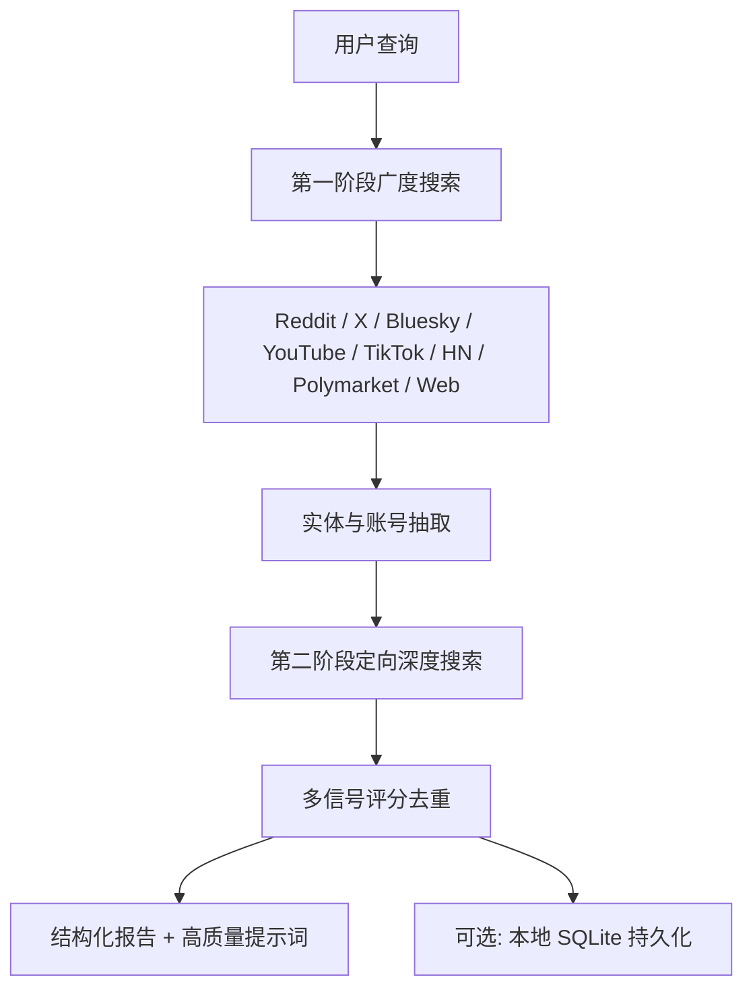

# mvanhorn/last30days-skill

> AI agent skill that researches any topic across Reddit, X, YouTube, HN, Polymarket, and the web - then synthesizes a grounded summary.

## 项目概述

last30days-skill 是面向 Claude Code、OpenAI Codex 等 AI 编程环境的深度研究技能，可跨 Reddit、X、Bluesky、YouTube、TikTok、Instagram、Hacker News、Polymarket 等 10+ 平台检索最近 30 天的话题内容，通过双阶段搜索 + 多信号评分合成有真实引用依据的结构化报告和 AI 提示词。2026 年 1 月发布，2 个月内迭代到 v2.9.5，获 6,000+ Stars，是当前 AI 研究工具领域增速最快的开源项目之一。

## 基本信息

| 指标 | 数值 |
|------|------|
| Stars | 6,009 |
| Forks | 620 |
| Open Issues | 14 |
| 语言 | Python (98.9%)、Shell (1.1%) |
| 开源协议 | MIT |
| 创建时间 | 2026-01-23 |
| 最近更新 | 2026-03-25 |
| GitHub | [https://github.com/mvanhorn/last30days-skill](https://github.com/mvanhorn/last30days-skill) |

## 技术分析

### 技术栈

纯 Python，依赖轻量。YouTube 使用 `yt-dlp` 抓取字幕；Reddit/TikTok/Instagram 统一走 ScrapeCreators API（一个 Key 覆盖 3 平台）；X 内置免费客户端；Polymarket 有专用解析引擎。测试覆盖 455+ 用例。

### 架构设计

双阶段搜索 + 模块化平台适配器：

### 核心功能

- **多源检索**：10+ 平台一站式搜索，覆盖社交、视频、技术社区、预测市场
- **提示词生成**：输出经社区验证的 AI 提示词，质量优于官方文档静态示例
- **对比分析**（v2.9.5）：支持"X vs Y"场景平行报告
- **监视列表**：定期自动研究，积累本地知识库
- **自动保存**（v2.9.5）：结果写入 `~/Documents/Last30Days/`

## 社区活跃度

### 贡献者分析

8 名核心贡献者，2 个月发布 10+ 版本，多项核心功能（HN、监视列表、Bluesky）来自社区建议。

### Issue/PR 活跃度

| 指标 | 数值 |
|------|------|
| Open Issues | 14 |
| 版本频率 | ~1 版本/周 |
| 测试用例 | 455+ |
| 研究耗时 | 2-8 分钟（`--quick` 更快）|

### 最近动态

- **v2.9.5**（2026-03 中）：Bluesky 数据源、对比分析模式
- **v2.9**（2026-03 初）：ScrapeCreators 作为 Reddit 默认后端，智能子版块发现
- **v2.8**（2026-02 末）：Instagram Reels + TikTok 统一 API
- **v2.5**（2026-02 中）：Polymarket + HN，多信号评分重构，盲测分 3.73→4.38
- **v2.1**（2026-02 初）：YouTube 字幕检索，监视列表
- **v1**（2026-01-23）：首版，Reddit + X

## 发展趋势

### 版本演进

2 个月内从"Reddit + X"扩展到 10+ 平台，平均月增 Star ~3,000，迭代速度极快。

### Roadmap

更多语言支持（当前主要为英文）、Mobile 入口、企业版批量研究 API、与 Cursor / Windsurf 等编辑器集成。

### 社区反馈

"多源真实社区反馈"和"直接生成提示词"是最高频正评，认为超越 Perplexity 在"社区真实性"维度的能力。主要不满：部分数据源需自行申请第三方 Key，全量搜索 2-8 分钟略慢。

## 竞品对比

| 项目 | 社区数据 | 本地部署 | AI 环境集成 | 预测市场 |
|------|---------|---------|-----------|---------|
| **last30days-skill** | ✅ 10+ 平台 | ✅ | ✅ Claude/Codex | ✅ Polymarket |
| Perplexity | ⚠️ 有限 | ❌ SaaS | ❌ | ❌ |
| Tavily | ❌ 主要网页 | ❌ | ⚠️ | ❌ |
| DeerFlow | ⚠️ 搜索驱动 | ✅ | ✅ | ❌ |

核心差异：以"社区真实信号"（Reddit/X/HN/Polymarket）而非"网页内容"为主要信息源，其他工具难以复制。

## 总结评价

### 优势

- Polymarket 预测市场数据独有，其他研究工具几乎不支持
- 双阶段搜索质量高，本地部署隐私保护好
- MIT 协议，对 AI 开发者场景高度专属优化

### 劣势

- 部分数据源需配置第三方 API Key，新手门槛高
- 中文内容支持弱，搜索耗时 2-8 分钟
- 仅支持桌面端 AI 环境，无移动入口

### 适用场景

AI 开发者优化提示词、技术趋势追踪与技术选型、竞品研究、热点事件多维度聚合分析。

---
*报告生成时间: 2026-03-25 18:00*
*研究方法: GitHub API 多维度分析 + Web 搜索 + README 文档解析*
