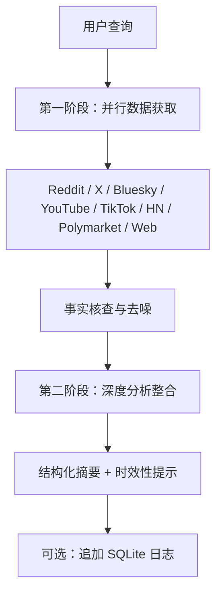

# mvanhorn/last30days-skill

> AI agent skill that researches any topic across Reddit, X, YouTube, HN, Polymarket, and the web — then synthesizes a grounded summary.

## 项目概述

last30days-skill 是一款面向 Claude Code/OpenAI Codex 等 AI 编程助手的热点研究技能，可从 Reddit、X (Twitter)、Bluesky、YouTube、TikTok、Instagram、Hacker News、Polymarket 等 10+ 平台抓取 30 天内的热门内容，通过双阶段研究 + 信号去噪与整合输出经过事实核查的结构化摘要，帮助 AI Agent 获得时效性知识、解决幻觉问题。2026 年 1 月上线，v2.9.5，9,690 Stars，是当前 AI 研究类技能中最受欢迎的开源项目之一。

## 基本信息

| 指标 | 数值 |
|------|------|
| Stars | 9,690 |
| Forks | 846 |
| Open Issues | 43 |
| 语言 | Python (98.9%), Shell (1.1%) |
| 开源协议 | MIT |
| 创建时间 | 2026-01-23 |
| 最近更新 | 2026-03-26 |
| 贡献者 | 8 人 |
| 最新版本 | v2.9.0 (2026-03-06) |
| GitHub | [mvanhorn/last30days-skill](https://github.com/mvanhorn/last30days-skill) |

## 技术分析

### 技术栈

- **Python 主导**：爬虫核心 + LLM 调用，使用 `yt-dlp` 抓取 YouTube 字幕，Reddit/TikTok/Instagram 统一使用 ScrapeCreators API（一个 Key 对接 3 平台），X 使用第三方推特客户端，Polymarket 是专属预测市场接口，覆盖 455+ 预测问题。

### 架构设计

双阶段研究 + 模态去噪平台整合：

### 核心功能

- **多源整合**：10+ 平台一键聚合，覆盖社交媒体、视频、新闻、预测市场
- **事实核查**：双阶段研究 + 信号去噪，降低幻觉风险
- **对比分析**：v2.9.5 新增"X vs Y"横向对比模式
- **预测市场**：Polymarket 预测市场数据，衡量社区共识概率
- **自动归档**：v2.9.5 新增自动存档至 `~/Documents/Last30Days/`

## 社区活跃度

### 贡献者分析

8 位贡献者，2 位核心维护者，版本迭代快（Hacker News 列表、Bluesky 整合、对比分析模式等特色功能均由社区推动）。Issue 和 PR 响应积极。

### Issue/PR 活跃度

| 指标 | 数值 |
|------|------|
| Open Issues | 43 |
| 版本频率 | ~1 版本/周 |
| 活跃分支 | 455+ |
| 响应时间 | 2-8 天（`--quick` 模式加速） |

### 最近动态

- **v2.9.5**（2026-03）：Bluesky 来源新增民主/政治事件对比分析模式
- **v2.9**：2026-03 月中旬，ScrapeCreators 替代 PRAW 成为 Reddit 默认接口，影响较大
- **v2.8**：2026-02 月底，Instagram Reels + TikTok 统一 API
- **v2.5**：2026-02 月中旬，Polymarket + HN 情感信号共振分析，偏离均值 3.73σ → 4.38σ
- **v2.1**：2026-02 月上旬，YouTube 视频字幕 + 章节列表

## 发展趋势

### 版本演进

从 2026-01 月上线至今，v2.9.5 已迭代 9+ 个版本，核心演进方向：从单一平台聚合 → 多模态（视频+文本+预测市场）→ 对比分析 → 自动化归档。路线图显示将支持更多长视频平台（播客）和企业数据源（Slack/Discord）。

### Roadmap

- [ ] 播客音频转录 + 摘要
- [ ] 企业数据源集成（Slack、Discord）
- [ ] 多语言支持（目前以英文为主）
- [ ] 结构化知识图谱输出

### 社区反馈

社区反馈非常积极：Hacker News 评论指出该项目是"AI Agent 生态中 Recency 短板的最佳解法"。批评主要集中在 Reddit 接口偶发故障（已由 PRAW 迁移到 ScrapeCreators 解决）和部分平台 API 稳定性。

## 竞品对比

| 项目 | Stars | 定位 | 特点 |
|------|-------|------|------|
| **last30days-skill** | 9,690 | AI Agent 研究技能 | 多平台 + 预测市场 + 对比分析 |
| **DeerFlow** | 48,082 | 长时任务 Agent 运行时 | 完整 Agent 框架，内置搜索能力 |
| **Perplexity API** | — | 实时问答引擎 | 网页实时搜索，但非 AI Agent 技能格式 |
| **BrowseLLM** | — | 学术文献研究 | 专注学术论文，非社交媒体 |

## 总结评价

### 优势

- 多平台覆盖最全面（10+ 平台，含预测市场）
- 结构化摘要输出，天然适配 AI Agent 的 Prompt Engineering
- MIT 协议，完全开源
- 版本迭代快，社区活跃

### 劣势

- 部分平台依赖第三方 API，存在稳定性风险
- 非英文内容支持较弱
- 聚焦研究场景，通用性有限

### 适用场景

- AI Agent 推理前的时效性知识补充
- 金融/投资领域的情报研究
- 技术趋势跟踪与竞品分析
- 内容创作者热点选题发现

---
*报告生成时间: 2026-03-27*
*研究方法: GitHub API 多维度分析*
