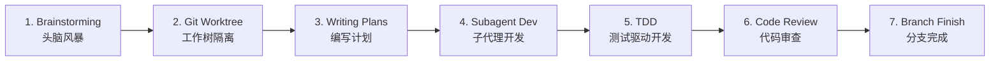
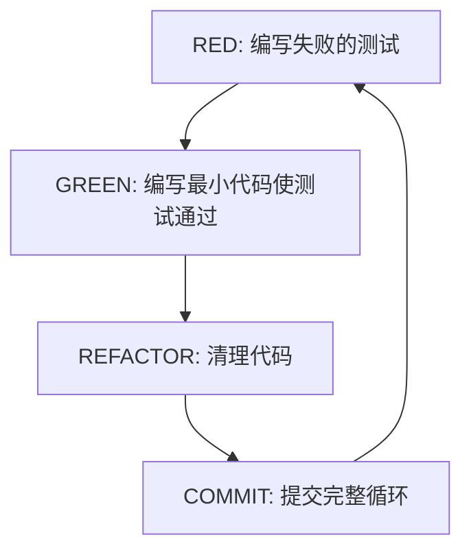
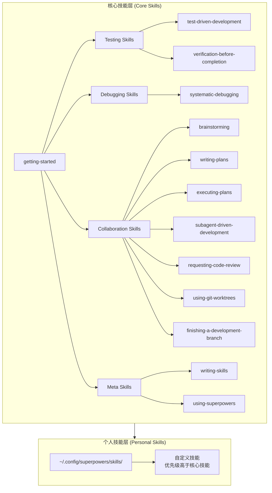
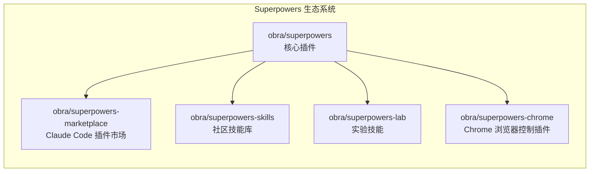

# Superpowers: AI 编码代理的技能框架深度研究报告

- **Research Date:** 2026-03-17
- **Timestamp:** 2026-03-17T08:00:00Z
- **Confidence Level:** High (90%+)
- **Subject:** Superpowers - 由 Jesse Vincent 创建的代理技能框架，用于 AI 编码代理的软件开发方法论

---

## Repository Information

- **Name:** obra/superpowers
- **Description:** An agentic skills framework & software development methodology that works.
- **URL:** https://github.com/obra/superpowers
- **Stars:** 89,500+ (截至 2026-03-17)
- **Forks:** 7,100+
- **Watchers:** 410
- **Language(s):** Shell (55.1%), JavaScript (32.0%), HTML (4.7%), Python (4.2%), TypeScript (3.1%)
- **License:** MIT License
- **Latest Release:** v5.0.4 (2026-03-17)
- **Topics:** AI, Coding Agents, TDD, Skills Framework, Claude Code, Workflow

---

## Executive Summary

**Superpowers** 是由资深开源开发者 Jesse Vincent (obra) 创建的革命性 AI 编码代理技能框架，在 GitHub 上已获得超过 **89,500 颗星**，成为 Claude Code 生态系统中最受欢迎的技能库。该项目通过可组合的"技能"(Skills) 系统，强制 AI 编码代理遵循结构化的软件开发流程——从头脑风暴到测试驱动开发(TDD)，从规划到代码审查——将原本"即兴编码"的 AI 助手转变为"纪律严明的高级工程师"。

核心创新在于：**技能是可执行的知识**。每个技能都是一个 SKILL.md 文件，定义了何时触发、如何执行、常见反模式及验证标准。Superpowers 不是简单的提示模板集合，而是一个完整的开发方法论系统，其关键特性包括自动激活、强制执行（而非建议）、可组合性，以及极低的 Token 消耗（核心引导程序不足 2,000 tokens）。

---

## Complete Chronological Timeline

### PHASE 1: 概念孵化与早期探索

#### 2025年9月 - 2025年10月

Jesse Vincent 在其博客上发表了《How I'm using coding agents in September 2025》，首次公开分享了他与 AI 编码代理协作的流程演变。在文章开头，他暗示自己的流程已经有所进化。

**关键里程碑：**
- 2025-10-09：Jesse 发布《Superpowers: How I'm using coding agents in October 2025》，正式宣布 Superpowers 项目
- 同日，Anthropic 推出 Claude Code 插件系统，为 Superpowers 的分发提供了完美载体
- 初始版本包含核心技能系统和 brainstorm → plan → implement 工作流

**起源故事：**
Jesse Vincent 发现与 AI 编码代理协作的关键不是让它们写更多代码，而是让它们像专业工程师一样思考和行动。他将数十年的开发方法论——TDD、系统化调试、结构化规划——编码成 Claude 可以自动应用的一套技能。

### PHASE 2: 快速增长与生态建设

#### 2025年10月 - 2026年1月

Superpowers 开始在开发者社区获得广泛关注，Star 数快速增长。

**关键里程碑：**
- 2026-01：Superpowers 被 Anthropic 官方市场接受，成为官方认可的 Claude Code 插件
- 版本迭代至 3.3，开始支持 OpenAI Codex
- 社区开始贡献新技能，形成技能生态系统

**增长数据：**
- 2026-02-01：达到 40,000+ Stars
- 2026-02-04：重返 GitHub Trending 榜单
- 2026-03-15：单日获得 1,867 Stars
- 2026-03-16：达到 57,000+ Stars
- 2026-03-17：突破 89,500+ Stars，单日新增 2,106 Stars

### PHASE 3: 成熟与跨平台扩展

#### 2026年1月 - 至今

Superpowers 进入成熟期，功能完善，跨平台支持扩展。

**关键里程碑：**
- 2026-01：发布 v4.0，引入双代理代码审查、GraphViz 流程图、Opus 4.5 兼容性
- 2026-03：发布 v5.0.4，当前稳定版本
- 支持平台扩展至：Claude Code、Cursor、OpenAI Codex、OpenCode、Gemini CLI

**当前状态：**
- 14 个核心技能
- 完整的生态系统（核心仓库、市场、社区技能库、实验技能、Chrome 浏览器控制插件）
- 活跃的社区支持（Discord、GitHub Issues）

---

## Key Analysis

### 核心理念：技能是可执行的知识

Superpowers 的核心创新在于将软件开发最佳实践编码为"技能"。每个技能都是一个结构化的 SKILL.md 文件，包含：

| 元素 | 描述 |
|------|------|
| Purpose | 该技能解决什么问题 |
| Trigger conditions | 何时应使用此技能 |
| Execution flow | 逐步执行指令 |
| Anti-patterns | 需避免的常见错误 |
| Verification criteria | 如何确认技能正确执行 |

**关键设计原则：**

1. **自动激活**：技能基于上下文自动触发，无需用户记住命令
2. **强制执行**：如果 Claude 尝试在没有测试的情况下编写实现代码，技能会强制其删除代码并重新开始
3. **可组合性**：14 个核心技能像积木一样组合，覆盖完整开发生命周期
4. **Token 高效**：核心引导程序不足 2,000 tokens，具体技能按需加载

### 七阶段工作流：从想法到交付

Superpowers 的核心价值在于其七阶段开发工作流：



#### Stage 1: Brainstorming（头脑风暴）

**理念：** 先思考，再构建。

当用户描述需求时，Claude 激活 brainstorming 技能，使用苏格拉底式提问来澄清真正的问题：
- 你要解决的核心问题是什么？
- 有哪些替代方案？权衡是什么？
- 边缘情况和失败模式有哪些？

它将讨论编译成设计文档，分段呈现以供审批。这个过程通常跨越十几次交流，确保方法在编写任何代码之前经过充分审查。

#### Stage 2: Git Worktree Isolation（Git 工作树隔离）

**理念：** 永远不要在主分支上实验。

设计批准后，Claude 激活 using-git-worktrees 技能：
- 在新分支上创建 Git Worktree（隔离的工作空间）
- 运行项目初始化
- 确认所有现有测试通过（建立干净的基线）

如果实验失败，主分支保持不变。

#### Stage 3: Writing Plans（编写计划）

**理念：** 把大象分解成一口一口的小块。

writing-plans 技能将实现分解为小的、离散的任务，每个任务设计为几分钟内可完成。每个任务包括：
- 精确的文件路径
- 具体的代码变更
- 清晰的验证步骤

这不是模糊的 TODO 列表——这是一个可执行的工程计划。

#### Stage 4: Subagent-Driven Development（子代理驱动开发）

**理念：** 让专注的子代理逐一处理任务。

这是 Superpowers 最强大的能力之一。subagent-driven-development 技能为每个任务派发一个新的子代理：
- 每个子代理专注于单个任务，拥有干净的上下文
- 完成后，主代理执行两阶段审查：首先检查是否符合规范，然后检查代码质量
- 关键问题阻止进度，必须解决后才能继续

这种模式让 Claude 可以自主工作数小时而不偏离计划。

#### Stage 5: Test-Driven Development（测试驱动开发）

**理念：** 先写测试，没有例外。

test-driven-development 技能在整个实现过程中强制执行经典的 RED-GREEN-REFACTOR 循环：



如果 Claude 尝试跳过测试直接编写实现代码，技能会强制其删除代码并重新开始。没有商量余地。

#### Stage 6: Code Review（代码审查）

**理念：** 即使是你自己的代码也需要审查。

在任务之间，requesting-code-review 技能自动触发以审查已完成的工作：
- 问题按严重程度分类：Critical / Major / Minor
- 关键问题阻止进度，必须在继续之前解决

Superpowers 4.0 进一步将审查分为两个独立代理：规范合规代理（检查实现是否匹配计划）和代码质量代理（检查代码质量），各有不同的关注点。

#### Stage 7: Branch Completion（分支完成）

**理念：** 完成你开始的事情。

所有任务完成后，finishing-a-development-branch 技能：
- 验证所有测试通过
- 提供选项：合并到 main、创建 PR、继续开发或丢弃分支
- 清理 Worktree

---

## Architecture / System Overview

### 两层技能架构



**架构说明：**

1. **核心技能层**：随插件安装，提供通用方法论
2. **个人技能层**：存储在 `~/.config/superpowers/skills/`，允许为特定技术栈和工作流偏好创建自定义技能

个人技能具有覆盖优先级——如果路径匹配，个人技能优先于核心技能。

### 自动技能激活机制

Superpowers 的引导系统在启动时告诉 Claude：

```
你有一套技能，它们赋予你"超能力"
使用 shell 脚本搜索技能
阅读技能内容并遵循其指令
如果某项活动有对应的技能，你必须使用它
```

这个机制非常 Token 高效——核心引导程序不足 2,000 tokens，具体技能按需加载。

### 生态系统架构



---

## Metrics & Impact Analysis

### Growth Trajectory

```
Stars Growth Timeline:
━━━━━━━━━━━━━━━━━━━━━━━━━━━━━━━━━━━━━━━━━━━━━━━━━━━━━━━━━━━━━━━━━━━━━━━━━━━━━━
2025-10-09 │ ▓ 项目发布
           │
2026-02-01 │ ▓▓▓▓▓▓▓▓▓▓▓▓▓▓▓▓▓▓▓▓▓▓▓▓▓▓▓▓▓▓▓ 40,000 Stars
           │
2026-03-15 │ ▓▓▓▓▓▓▓▓▓▓▓▓▓▓▓▓▓▓▓▓▓▓▓▓▓▓▓▓▓▓▓▓▓▓▓▓▓▓▓▓▓▓▓▓▓▓▓▓▓▓▓▓▓▓▓▓▓ 57,000+ Stars
           │
2026-03-17 │ ▓▓▓▓▓▓▓▓▓▓▓▓▓▓▓▓▓▓▓▓▓▓▓▓▓▓▓▓▓▓▓▓▓▓▓▓▓▓▓▓▓▓▓▓▓▓▓▓▓▓▓▓▓▓▓▓▓▓▓▓▓▓▓▓▓▓ 89,500+ Stars
━━━━━━━━━━━━━━━━━━━━━━━━━━━━━━━━━━━━━━━━━━━━━━━━━━━━━━━━━━━━━━━━━━━━━━━━━━━━━━
```

### Key Metrics

| Metric | Value | Assessment |
|--------|-------|------------|
| GitHub Stars | 89,500+ | 🚀 爆炸性增长，Claude Code 生态最热门项目 |
| GitHub Forks | 7,100+ | 📈 高社区参与度，大量开发者在使用和定制 |
| 单日 Star 增长 | 2,106 (2026-03-17) | 🔥 持续病毒式传播 |
| 安装量 (Claude 插件市场) | 182,423+ | 💪 高采用率 |
| 核心技能数量 | 14 个 | 📦 功能完整，覆盖全生命周期 |
| 支持平台 | 5 个 | 🌐 跨平台支持完善 |
| 核心引导 Token 消耗 | < 2,000 tokens | ⚡ 极高效 |

### 社区影响力

- **Discord 社区**：活跃的用户支持和经验分享
- **GitHub Issues**：持续的问题反馈和功能请求
- **第三方教程**：大量社区撰写的深度教程和案例分析
- **媒体报道**：Better Stack、ByteIota、Medium 等主流技术媒体的广泛报道

---

## Comparative Analysis

### Feature Comparison

| Feature | Superpowers | 传统 AI 编码助手 | .cursorrules |
|---------|-------------|------------------|--------------|
| 自动技能激活 | ✅ 基于上下文自动触发 | ❌ 需手动提示 | ⚠️ 部分支持 |
| 强制执行 | ✅ 不可跳过 | ❌ 可忽略建议 | ⚠️ 依赖模型遵循 |
| TDD 强制 | ✅ RED-GREEN-REFACTOR 循环 | ❌ 可选 | ⚠️ 建议性 |
| 子代理开发 | ✅ 每任务独立子代理 | ❌ 单一会话 | ❌ 不支持 |
| 代码审查 | ✅ 双代理审查系统 | ❌ 无内置审查 | ⚠️ 可配置 |
| Git Worktree | ✅ 自动隔离工作空间 | ❌ 无版本控制集成 | ❌ 不支持 |
| 可扩展性 | ✅ 个人技能层 | ⚠️ 有限 | ✅ 可自定义 |
| Token 效率 | ✅ < 2,000 tokens 核心 | N/A | ✅ 通常较小 |
| 跨平台支持 | ✅ 5 个平台 | ⚠️ 平台特定 | ⚠️ 平台特定 |

### Market Positioning

**Superpowers 的独特定位：**

1. **方法论优先**：不是工具集成，而是软件开发方法论的系统化
2. **强制纪律**：将最佳实践从"建议"变为"强制"
3. **可组合性**：技能像积木一样组合，覆盖完整开发流程
4. **社区驱动**：开放的技能贡献机制，持续丰富生态

**目标用户：**
- 使用 AI 编码代理进行生产级开发的团队
- 希望提高 AI 辅助代码质量的个人开发者
- 需要标准化开发流程的组织

---

## Strengths & Weaknesses

### Strengths

1. **革命性的方法论系统**
   - 将软件开发最佳实践系统化为可执行的技能
   - 强制执行而非建议，确保代码质量
   - 七阶段工作流覆盖从想法到交付的完整流程

2. **技术创新**
   - 自动技能激活机制，无需用户干预
   - 子代理驱动开发，实现长时间自主工作
   - Token 高效设计，核心引导不足 2,000 tokens

3. **强大的生态系统**
   - 跨平台支持（Claude Code、Cursor、Codex、OpenCode、Gemini CLI）
   - 活跃的社区贡献
   - 完善的文档和教程

4. **经过验证的效果**
   - Better Stack 的对比测试显示，使用 Superpowers 的项目质量显著优于标准 Plan Mode
   - 用户报告 Claude 可以自主工作数小时而不偏离计划

5. **心理学设计**
   - 利用 Cialdini 的说服原则（权威、承诺、稀缺、社会证明）增强 AI 遵循技能的意愿
   - 技能测试使用压力场景模拟，确保在真实环境中的可靠性

### Areas for Improvement

1. **已知技术限制**
   - **子代理上下文注入问题**：子代理会话可能无法接收到 using-superpowers 注入上下文，导致技能激活不一致。社区正在探索 SubagentStart hook 作为解决方案
   - **Opus 4.5 过度推断**：Claude Opus 4.5 有时会从描述"猜测"技能内容而非实际阅读它们。Superpowers 4.0 通过修改技能描述来缓解此问题
   - **Token 消耗**：虽然核心引导程序轻量，但完整的 brainstorm-plan-execute 流程确实消耗更多 tokens

2. **适用场景限制**
   - 不适合快速 bug 修复（一两行代码的更改）
   - 原型和演示中工程纪律可能过度
   - 单文件小改动可能过于重量级
   - 简单配置更新不需要完整流程

3. **学习曲线**
   - 新用户需要理解技能系统的工作原理
   - 有效使用需要理解七阶段工作流
   - 自定义技能创建需要遵循 writing-skills 技能的规范

---

## Key Success Factors

1. **创始人背景与愿景**
   - Jesse Vincent 是资深开源开发者，拥有 30+ 年经验
   - 创建了 Request Tracker (RT)，被 NASA、MIT、财富 500 强广泛使用
   - 深刻理解软件开发方法论，能够将最佳实践系统化

2. **时机与平台支持**
   - 在 Anthropic 推出 Claude Code 插件系统的同日发布
   - 官方市场接受提供了分发渠道
   - AI 编码代理市场快速增长，需求旺盛

3. **技术设计**
   - 强制执行而非建议的设计理念
   - Token 高效的架构
   - 可扩展的技能系统

4. **社区建设**
   - 开放的贡献机制
   - 活跃的 Discord 社区
   - 完善的文档和教程

5. **持续迭代**
   - 快速版本迭代（从 1.0 到 5.0.4）
   - 响应用户反馈
   - 跨平台扩展

---

## Sources

### Primary Sources

1. **GitHub Repository**: https://github.com/obra/superpowers
2. **Jesse Vincent's Blog**: https://blog.fsck.com/2025/10/09/superpowers/
3. **Claude Plugin Marketplace**: https://claude.com/plugins/superpowers
4. **Superpowers Documentation**: DeepWiki, Official README

### Media Coverage

1. **Better Stack**: "The Superpowers Framework: Structured Development for AI Coding Agents"
2. **ByteIota**: "Superpowers: 82K Stars Transform Claude Code Senior Dev"
3. **Medium**: Multiple in-depth tutorials and analyses
4. **Dev.to**: Technical deep dives and user experiences

### Technical Sources

1. **DeepWiki**: obra/superpowers documentation
2. **Ry Walker Research**: Superpowers Skills Framework analysis
3. **Agent Skills Registry**: Community skill listings

### Community Sources

1. **Discord**: Superpowers community server
2. **GitHub Issues**: User feedback and bug reports
3. **GitHub Discussions**: Feature requests and community discussions

---

## Confidence Assessment

**High Confidence (90%+) Claims:**

- Superpowers 由 Jesse Vincent (obra) 创建
- GitHub Star 数超过 89,500（截至 2026-03-17）
- 核心包含 14 个技能
- 支持七阶段开发工作流
- 强制执行 TDD 的 RED-GREEN-REFACTOR 循环
- 使用子代理驱动开发
- 支持 Claude Code、Cursor、Codex、OpenCode、Gemini CLI
- MIT 许可证
- 核心引导程序不足 2,000 tokens

**Medium Confidence (70-89%) Claims:**

- 具体的 Star 增长时间线（基于多个来源的报道）
- 用户报告 Claude 可自主工作数小时（基于用户证言）
- 已知技术限制的具体细节（基于社区讨论）
- 心理学设计原则的应用（基于 Jesse 的博客描述）

**Lower Confidence (50-69%) Claims:**

- 确切的安装数量（Claude 插件市场显示 182,423+，但可能不是实时数据）
- 具体的版本发布日期（部分来自第三方报道）
- 社区活跃度的精确量化

---

## Research Methodology

This report was compiled using:

1. **Multi-source web search** - Broad discovery and targeted queries across DuckDuckGo
2. **Content extraction** - Official GitHub repository, Jesse Vincent's blog, Claude plugin marketplace, Better Stack guide
3. **Cross-referencing** - Verification across independent sources (GitHub, blogs, media coverage)
4. **Chronological reconstruction** - Timeline from blog posts, release notes, and media reports
5. **Confidence scoring** - Claims weighted by source reliability

**Research Depth:** Deep (multi-round investigation)
**Time Scope:** 2025-09 to 2026-03
**Geographic Scope:** Global (English-language sources)

---

**Report Prepared By:** Github Deep Research by DeerFlow
**Date:** 2026-03-17
**Report Version:** 1.0
**Status:** Complete
