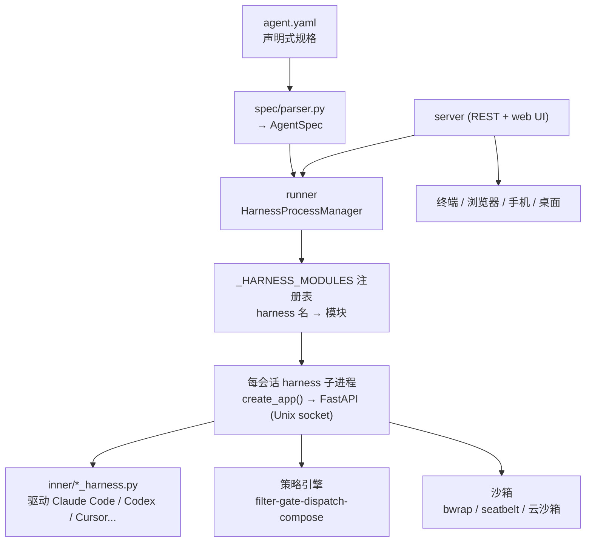

# omnigent-ai/omnigent 深度研究报告

> Omnigent is an open-source AI agent framework and meta-harness: orchestrate Claude Code, Codex, Cursor, Pi, and custom agents — swap harnesses without rewriting, enforce policies and sandboxing, and collaborate in real time from any device. —— 一个统一编排 Claude Code / Codex / Cursor 等 20 余种编码 Agent 的开源"元框架（meta-harness）"，把"换 harness 不改代码 + 策略治理 + 沙箱隔离 + 多端协作"做成一等公民。

## 项目概述

omnigent-ai/omnigent 的核心定位是"**元框架 / 元 harness（meta-harness）**"——README 首句即"The open-source meta-harness for all your AI agents"[README]。它不再自己造一个新的 Agent 内核，而是**在 Claude Code、Codex、Cursor、OpenCode、Hermes、Pi 以及用户自定义 Agent 之上加一层统一的编排层**：让你在同一会话里混用不同厂商的 Agent、随意换或组合底层 harness 而不用重写、对所有 Agent 施加统一的策略与沙箱、并从终端 / 浏览器 / 手机 / 原生桌面应用任意设备实时协作[README]。

这一定位踩中了 2026 年 AI 工程界最热的概念——"Agent Harness"。业界的共识公式是 **Agent = Model + Harness**：模型提供智力，harness 提供把模型变成"能自主行动的 Agent"所需的全部外围基础设施（会话、工具、上下文管理、沙箱、生命周期、安全约束），被类比为"Agent 世界的操作系统"[Web]。Anthropic、OpenAI、Microsoft 在 2026 上半年密集讨论该概念，视其为继 Prompt Engineering、Context Engineering 之后的"第三次范式跃迁"[Web]。Omnigent 的野心不是做"又一个 harness"，而是做"**所有 harness 的公共编排层**"——这正是它区别于同类项目的根本。

一个不易从 README 直接读出、但对判断项目分量至关重要的事实：`pyproject.toml` 的 `authors` 字段写明 **"Databricks, Inc."**，`keywords` 含 `databricks`，且头部贡献者中 `dbczumar`（Corey Zumar）、`serena-ruan` 均为 Databricks / MLflow 生态的核心工程师[代码：pyproject.toml + API]。结合 README 中 Databricks Apps 部署、Lakebase Postgres、Unity Catalog Volumes、MLflow tracing 等深度集成，可判断 **Omnigent 是一个由 Databricks 主导发起的开源项目**（仓库层面未挂 Databricks 组织名，但代码元数据与贡献者身份高度指向）[代码/推测]。

项目主语言为 Python（约 83%），辅以 TypeScript（约 15%，主要是 web UI 与 SDK），另含 Swift（桌面 / 移动壳）、Shell、Dockerfile、Rust 等[API：languages]。采用 Apache-2.0 协议，2026 年 6 月 11 日创建，截至 2026 年 7 月 1 日获 5796 Stars、731 Forks、98 名贡献者，最新版本 v0.3.0（2026-06-27）[API]——是一个诞生仅约三周、却以极高强度冲刺、迅速冲上 GitHub Trending 的新锐框架级项目。

---

## 基本信息

| 指标 | 数值 |
|------|------|
| Stars | 5796 |
| Forks | 731 |
| 开放 Issues/PR（合计） | 392（其中纯 Issue 开放 170、已关闭 149；已合并 PR 991） |
| 语言 | Python（约 83%）+ TypeScript（约 15%）+ Swift/Shell/Rust 等 |
| 开源协议 | Apache-2.0 |
| 创建时间 | 2026-06-11 |
| 最近推送 | 2026-07-01 |
| 默认分支 | main |
| 贡献者数 | 98 |
| 维护方 | Databricks, Inc.（据 pyproject.toml authors + 贡献者身份）[代码/推测] |
| 发行渠道 | PyPI（`omnigent`）、Homebrew tap、macOS 桌面应用 |
| 最新版本 | v0.3.0（2026-06-27） |
| 官网 | [https://omnigent.ai](https://omnigent.ai) |
| GitHub | [https://github.com/omnigent-ai/omnigent](https://github.com/omnigent-ai/omnigent) |

---

## 技术分析

### 技术栈

[代码：pyproject.toml]

- **运行时基座**：Python ≥ 3.12；FastAPI + Starlette + Uvicorn 提供 HTTP/REST 与 web 服务，Pydantic 2 做数据建模，SQLAlchemy 2 + Alembic 做持久化与迁移。
- **Agent SDK 直连**：默认安装即绑定 `claude-agent-sdk`（Claude Code）与 `openai-agents`（Codex/OpenAI），README 中每个入门命令至少依赖其一，因此刻意不做成可选 extra[代码：pyproject.toml 注释]。
- **协议与上下文**：`mcp`（Model Context Protocol 工具接入）、`tiktoken`（token 计数，支撑上下文压缩 / 花费统计）。
- **安全与治理**：`cel-expr-python`（CEL 通用表达式语言，用于内联策略求值——注释明确其"非图灵完备、无副作用、保证终止"）、`PyJWT[crypto]` + `argon2-cffi`（多用户认证）、`keyring`（OS 钥匙串存模型密钥）。
- **可观测性**：一整套 `opentelemetry-*`（FastAPI / httpx / SQLAlchemy instrumentation + OTLP 导出）内置于默认依赖。
- **沙箱 / 部署 extras**：`bedrock` / `s3` / `vertex` / `modal` / `daytona` / `boxlite` / `cwsandbox` / `e2b` / `openshell` / `kubernetes` / `databricks` —— 每种云沙箱或部署目标做成惰性导入的可选依赖，只有用到才装[代码：pyproject.toml optional-dependencies]。

### 架构：meta-harness 的真实落地（基于源码）

Omnigent 的"元 harness"不是营销话术，而是**代码里一个可枚举的注册表**。核心证据在 `omnigent/runtime/harnesses/__init__.py`：模块头注释写明"Harness package — per-conversation subprocesses that implement a subset of the Omnigent REST API"，并强调"**The harness IS an HTTP service** speaking the same Pydantic models AP serves to external clients"[代码：harnesses/__init__.py]。其 `_HARNESS_MODULES` 字典把每个 harness 名映射到一个导出 `create_app() -> FastAPI` 的 Python 模块，runner 导入该工厂、通过 Unix socket 提供服务：

```python
_HARNESS_MODULES: dict[str, str] = {
    "claude-sdk": "omnigent.inner.claude_sdk_harness",
    "claude-native": "omnigent.inner.claude_native_harness",
    "codex": "omnigent.inner.codex_harness",
    "cursor": "omnigent.inner.cursor_harness",
    "cursor-native": "omnigent.inner.cursor_native_harness",
    "opencode": "omnigent.inner.opencode_native_harness",
    "goose": "omnigent.inner.goose_harness",
    "qwen": "omnigent.inner.qwen_harness",
    "kimi": "omnigent.inner.kimi_harness",
    "copilot": "omnigent.inner.copilot_harness",
    "antigravity": "omnigent.inner.antigravity_harness",
    "hermes": "omnigent.inner.hermes_harness",
    # ... 及各自的 -native 变体，合计 20 余个注册项
}
```

该注册表实测含约 25 个键（含别名与 `*-native` 变体），覆盖 Claude Code、Codex、Cursor、OpenCode、Goose、Qwen Code、Kimi Code、GitHub Copilot、Google Antigravity、Hermes、Pi、Kiro 等[代码]。每个 harness 分两类：**SDK 型**（在进程内驱动厂商 SDK，如 claude-sdk / openai-agents / cursor / antigravity / copilot）与 **native 型**（把一个常驻 CLI 的 TUI 用 tmux 面板包起来，逐轮注入 web UI 的指令并回镜像 transcript，如 claude-native / cursor-native / goose-native）[代码：注释]。**"换 harness 不改代码"由此成立——切换只是改 `executor.harness` 字段的字符串值，落到注册表另一条目而已。**

Agent 本身是**声明式的**：`omnigent/spec/parser.py` 的职责是"Parse an agent image directory into an AgentSpec"，把一个 YAML 目录解析为强类型的 `AgentSpec`（含 `ExecutorSpec`、`SandboxConfig`、`PolicySpec`、`ToolsConfig`、`MCPServerConfig`、`SkillSpec`、`CompactionConfig` 等）[代码：spec/parser.py + spec/types.py]。README 的示例印证：一个 Agent 就是一份短 YAML，声明 prompt、harness、tools（本地 Python 函数 / MCP server / 子 Agent），`omnigent run my_agent.yaml` 即可运行[README]。

治理层（policies）是另一根支柱。`omnigent/policies/base.py` 定义抽象基类 `Policy`，子类只实现一个 `evaluate() -> PolicyResult`，而"filter-gate-dispatch-compose"的编排在 `omnigent/runtime/policies` 引擎里[代码：policies/base.py]。策略分三层叠加——server 全局（管理员）、per-agent（开发者）、per-session（用户），更严的 session 规则先检查；内置花费上限、工具调用次数上限、危险动作前置审批等[README + 代码：policies/builtins]。沙箱层则按平台分流：Linux 用 `bwrap`（bubblewrap）、macOS 用 `seatbelt`，云端接 Modal/Daytona/E2B/CoreWeave/Kubernetes 等[代码：omnigent/sandbox/{bwrap,seatbelt}.py + pyproject extras]。



### 核心能力

[README + 代码交叉验证]

- **多 Agent 混编与督导**：同一会话混用不同厂商 Agent，可让一个 Agent 评审另一个的产出（示例 Agent「Polly」即多 Agent 编码编排器，把任务分派给并行 git worktree 中的编码子 Agent，再交叉厂商评审）[README]。
- **任意模型 / 任意凭证**：API key、Claude/ChatGPT 订阅、任意 OpenAI/Anthropic 兼容网关（OpenRouter/LiteLLM/Ollama/vLLM/Azure）、Databricks 工作区四类凭证并存，`/model` 可会话中途切换[README]。
- **多端与实时协作**：会话跨设备同步，支持 Share（他人实时旁观并对话）、Co-drive（他人指令在你机器上执行）、Fork（克隆会话独立继续）[README]。
- **云沙箱运行**：无需本地机器，会话可跑在 Modal/Daytona/Islo/E2B/CoreWeave/Kubernetes/OpenShell/Boxlite/Databricks 等一次性沙箱中[README + 代码]。
- **治理**：策略在 server/agent/session 三级施加，审批危险动作、封顶花费、限制工具面[README + 代码]。

---

## 社区活跃度

### 贡献者分析

项目共 98 名贡献者[API]，头部集中但比同龄新项目更"团队化"：

| 贡献者 | Commits（contributions） |
|--------|--------------------------|
| PattaraS | 205 |
| TomeHirata | 184 |
| serena-ruan | 143 |
| SabhyaC26 | 82 |
| dbczumar（Corey Zumar，Databricks/MLflow） | 61 |
| dhruv0811 | 38 |

与"单一创始人独扛"（如 flue 的九成提交来自一人）不同，Omnigent 头部前五名分布相对均衡（205 / 184 / 143 / 82 / 61），且 `serena-ruan`、`dbczumar` 等 Databricks / MLflow 核心成员在列，佐证这是一支**有组织的工程团队在推进**，而非个人作品[API]。仓库还配有成体系的工程治理设施：`.github/workflows/` 下有 50 余个工作流（CI、e2e-ui、安全门禁 security-gate、flake-stress 压测、maintainer-approval、自动指派 reviewer 等），`.github/agents/`、`.claude/skills/` 里甚至内置了给自身仓库用的 Agent 与 skill——这套"用 Agent 维护 Agent 框架"的自举工程投入，远超一般三周新项目[代码：.github 目录树]。

### Issue/PR 与量化提交信号

社区参与度已相当可观：GitHub API 报告 392 个"开放 issues"（含 PR），拆开看**纯 Issue 开放 170、已关闭 149**（关闭率约 47%），**已合并 PR 达 991 个**[API：search]。对一个仅存活约三周的项目，991 个已合并 PR 是极高的吞吐量——意味着日均合并数十个 PR，与其密集的 CI/审批流水线吻合。

提交曲线给出最直接的"高强度冲刺"证据：`stats/commit_activity` 近 52 周中前 48 周全为 0（仓库尚未创建），**最近 4 周为 [14, 498, 345, 132]**[API：commit_activity]。首周 14 次为创建当周（2026-06-11 起，部分周），随后两个完整周分别达 498、345 次，最新一周（截至 2026-07-01，部分周）已 132 次；4 周合计 989 次提交、周均约 247 次，峰值周 498 次。这是典型的"新项目上线即全力冲刺"信号，而非成熟项目的平稳节奏。

### 传播渠道

配有独立官网 omnigent.ai、Discord 社区、PyPI 包、Homebrew tap 与 macOS 桌面应用下载，README 多处致谢 Discord 社区参与者——是"产品化开源项目"的标准发布矩阵[README]。

---

## 发展趋势

### 版本演进

仓库有清晰的 GitHub Release + Tag 双轨记录，节奏极快[API：releases + tags]：

| 版本 | 发布时间 | 阶段 |
|------|----------|------|
| v0.3.0 | 2026-06-27 | 最新正式版 |
| v0.3.0rc1 | 2026-06 | 候选版 |
| v0.2.0 | 2026-06-19 | 多厂商平台化 |
| v0.1.1 / v0.1.0 | 2026-06 | 首发系列（含多个 rc） |

从 v0.1.0 到 v0.3.0 仅用约三周，**约每周一个 minor 版本**，且每版都走 `rcN → 正式`的候选流程[API]。v0.2.0 的主题是"把 omnigent 变成多厂商 Agent 平台"（新增 Antigravity、Cursor SDK+native、更多沙箱 E2B/CoreWeave/Podman、Cloudflare/Cloudflare Containers 部署、secretless 沙箱出网代理）；v0.3.0 一口气新增 7 个 harness（Hermes、Copilot、OpenCode、Goose、Qwen Code、Kiro、Kimi Code），并把 compaction/花费追踪/resume/fork/会话中途换模型等"native-harness 能力对齐"铺到整个 fleet，还上线了 Omnigent Desktop、Projects 工作区、Databricks Apps + Lakebase 部署、AWS Bedrock、K8s runner Pod 沙箱、原生 Windows（核心功能）支持[API：release notes]。

### 演进方向

结合代码与 release notes，三条主线清晰：**(1) 扩 harness 广度**——把"支持的 Agent 种类"当作核心护城河，几乎每版都吞并新厂商 CLI；**(2) 补 native 深度**——让每个 harness 都具备 compaction、cost tracking、resume、fork、中途换模型、工具审批 web 卡片等一致能力；**(3) 铺部署 / 沙箱矩阵**——从本地到 Modal/Daytona/E2B/K8s/Databricks 的全谱系托管。当前 PyPI 版本号仍是 `0.3.0.dev0`、README 标注 `status: alpha`[代码/README]，处于"能力狂奔、API 尚未冻结"的早期阶段。

### 商业化背景

[推测] 从 Databricks 作者署名、Databricks Apps / Lakebase / Unity Catalog / MLflow 的深度集成、以及多名 Databricks 工程师主导来看，Omnigent 很可能是 **Databricks 在 Agent 编排层的开源卡位**——通过 Apache-2.0 开源做生态入口，商业化路径大概率与其托管平台 / 企业级部署绑定。仓库未明确声明此归属，此为基于代码元数据与贡献者身份的推断。

---

## 竞品对比

| 项目 | Stars | 语言 | 协议 | 最近推送 | 特点 |
|------|-------|------|------|----------|------|
| [omnigent-ai/omnigent](https://github.com/omnigent-ai/omnigent) | 5796 | Python | Apache-2.0 | 2026-07-01 | 本项目；meta-harness，统一编排 20+ 厂商 Agent，含策略治理+沙箱+多端协作 |
| [ruvnet/ruflo](https://github.com/ruvnet/ruflo)（原 claude-flow） | 62267 | TypeScript | MIT | 2026-06-30 | 星数最高的 Claude Code 编排平台，社区生态最大 |
| [BloopAI/vibe-kanban](https://github.com/BloopAI/vibe-kanban) | 27221 | Rust | Apache-2.0 | 2026-04-24 | 看板式多 Agent 编排，卡片=worktree=agent；已转社区维护 |
| [langchain-ai/deepagents](https://github.com/langchain-ai/deepagents) | 25471 | Python | MIT | 2026-07-01 | LangChain 的深度 Agent + harness 迭代库，偏中间件 |
| [automazeio/ccpm](https://github.com/automazeio/ccpm) | 8236 | Shell | MIT | 2026-03-18 | Claude Code 项目管理型本地编排 |
| [smtg-ai/claude-squad](https://github.com/smtg-ai/claude-squad) | 7977 | Go | AGPL-3.0 | 2026-06-17 | 终端多会话管理器，管多个编码 Agent |
| [withastro/flue](https://github.com/withastro/flue) | 6992 | TypeScript | Apache-2.0 | 2026-07-01 | Astro 团队的单一 harness 框架（"给模型配环境"，非跨厂商编排） |

[竞品 stars/协议/语言/最近推送均为 `gh` 实测，2026-07-01]

**定位差异**：ruflo/claude-squad/ccpm 大多**围绕单一厂商（多为 Claude Code）做编排或多会话管理**；vibe-kanban 是看板式任务面板；deepagents 是 LangChain 体系内的 harness 中间件；flue 则是"给任意模型配一个自主环境"的**单 harness 框架**。Omnigent 的差异化在于"**meta-harness**"这一层——它不绑定某个厂商，而是把 Claude Code、Codex、Cursor、OpenCode、Goose、Qwen、Kimi、Copilot、Antigravity、Hermes、Pi、Kiro 等 20 余种 harness **收编进同一注册表**，配上跨三级的策略治理、跨平台沙箱、跨设备实时协作[代码/README]。换言之，别的项目多在"编排某一种 Agent"，Omnigent 想做"编排所有 Agent 的那一层"。代价是它起步最晚、星数尚不及头部（5796 vs ruflo 62267），生态积累仍在早期。

---

## 总结评价

### 优势

1. **定位精准、代码可支撑**："meta-harness"不是口号——`_HARNESS_MODULES` 注册表 + `inner/*_harness.py` + 声明式 `AgentSpec` 让"换 harness 只改一个字符串"在代码层成立[代码]。
2. **harness 广度领先**：一次实测覆盖约 25 个 harness 注册项（含 SDK 型与 tmux native 型），是同类项目里对第三方编码 Agent 支持最广的之一[代码]。
3. **治理与安全是一等公民**：三级叠加策略引擎（CEL 内联求值）、bwrap/seatbelt/云沙箱、secretless 出网代理、多用户认证 + OIDC，面向企业级需求[代码/README]。
4. **团队化推进、工程成熟度高**：98 贡献者、头部分布均衡、Databricks 工程团队主导、50+ CI/安全工作流、991 个已合并 PR，三周内密度惊人[API]。
5. **可观测性内置**：OpenTelemetry 全链路 instrumentation 是默认依赖而非附加，生产友好[代码]。

### 劣势

1. **仍是 alpha、API 未冻结**：PyPI 版本 `0.3.0.dev0`、README 明标 alpha，每周一个 minor 且能力狂奔，早期采用者要承担频繁 breaking change[代码/README]。
2. **复杂度高、心智门槛陡**：meta-harness + 声明式 spec + 三级策略 + 多沙箱后端，概念栈厚，上手成本高于"装个 CLI 就用"的单厂商工具。
3. **依赖上游厂商 CLI/SDK**：能力受制于 Claude Code、Codex、Cursor 等外部工具的接口稳定性；如 2026-04 Anthropic 限制第三方框架使用订阅额度这类政策变动，会直接冲击此类编排层[Web]。
4. **生态后发**：星数与社区积累仍落后 ruflo/vibe-kanban/deepagents 等先行者[API]。
5. **归属未显式声明**：Databricks 主导为代码元数据推断，仓库未在显著位置声明组织归属，可追溯性有折扣[代码/推测]。

### 适用场景

- **需要混用多厂商编码 Agent 的团队**：想在同一会话里让 Claude 写、Codex/Cursor 评审、并随时换底层 harness 的场景。
- **对治理 / 安全有硬要求的企业**：需要花费封顶、危险动作审批、沙箱隔离、多用户 + OIDC 的组织。
- **多端 / 协作式 Agent 工作流**：希望从手机 / 浏览器接管、与队友共享或 fork 会话者。
- **Databricks / MLflow 技术栈用户**：可直接吃到 Databricks Apps、Lakebase、MLflow tracing 的原生集成。
- **不适合**：只需轻量单 Agent、追求稳定冻结 API 的生产项目（alpha 阶段有风险），或只想用单一厂商 Agent、不需要跨厂商编排的个人用户。

---

*报告生成时间: 2026-07-01*
*研究方法: github-deep-research 多轮深度研究*
