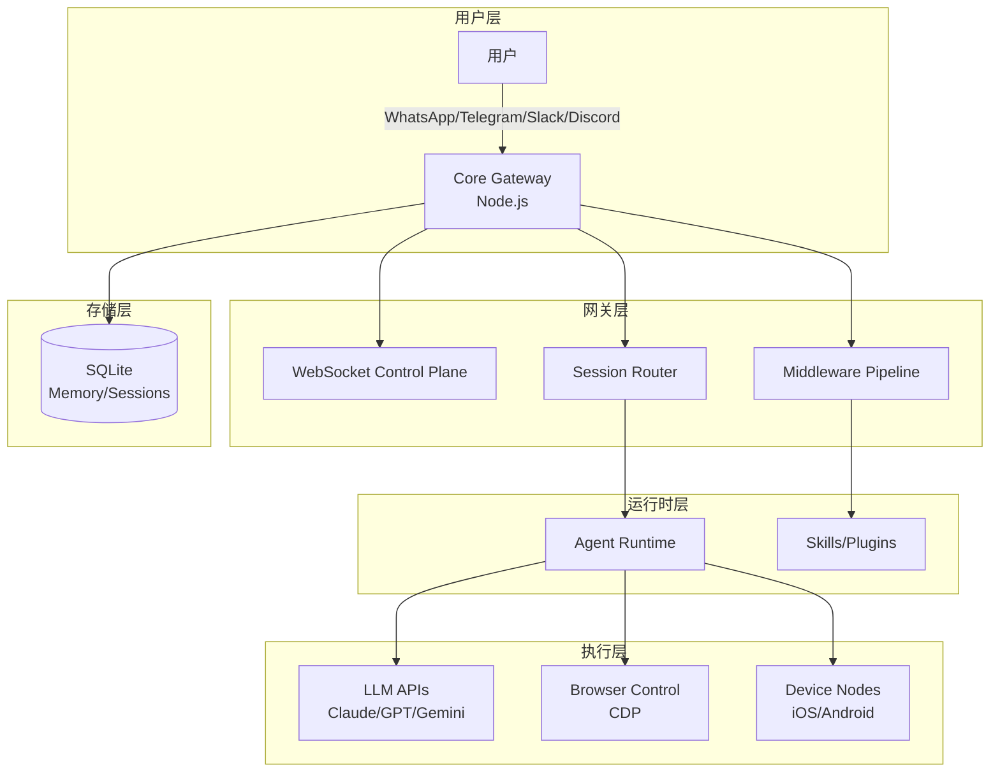
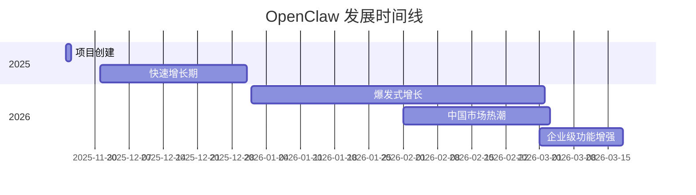

# openclaw/openclaw

> Your own personal AI assistant. Any OS. Any Platform. The lobster way. 🦞

## 项目概述

OpenClaw 是一个开源的个人 AI 助手平台，强调数据自主权和隐私保护。用户可以在自己的设备上运行，通过 WhatsApp、Telegram、Slack、Discord、Signal、iMessage 等 20+ 消息平台与 AI 交互。项目以超过 31 万 Stars 成为 GitHub 历史上增长最快的开源 AI 项目之一，代表了"Own Your Data"（数据自主）运动的核心力量。

## 基本信息

| 指标 | 数值 |
|------|------|
| Stars | 318,795 |
| Forks | 61,160 |
| 语言 | TypeScript |
| 开源协议 | MIT |
| Open Issues | 14,490 |
| 创建时间 | 2025-11-24 |
| 最近更新 | 2026-03-17 |
| 最新版本 | v2026.3.13-1 |
| GitHub | [openclaw/openclaw](https://github.com/openclaw/openclaw) |

### 语言分布

| 语言 | 代码行数 | 占比 |
|------|----------|------|
| TypeScript | 40.3M | 87.5% |
| Swift | 3.6M | 7.8% |
| Kotlin | 831K | 1.8% |
| Shell | 512K | 1.1% |
| JavaScript | 291K | 0.6% |
| 其他 | 300K+ | 1.2% |

## 技术分析

### 架构设计

OpenClaw 采用三层模块化架构设计：

#### 核心组件

1. **Core Gateway（核心网关）**
   - 单一长运行进程，管理所有通道连接
   - WebSocket 控制平面实现实时双向通信
   - 多代理路由和负载均衡
   - 插件/技能中间件管道

2. **Browser Control（浏览器控制）**
   - 内置无头 Chrome，支持像素级 Web 自动化
   - Chrome DevTools Protocol (CDP) 集成
   - 截图、点击、输入、滚动自动化
   - DOM 元素选择和数据提取

3. **Device Nodes（设备节点）**
   - iOS 自动化：XCUITest 框架
   - Android 控制：ADB 桥接
   - 屏幕镜像和手势回放
   - 跨设备任务编排

### 技术栈

| 组件 | 技术选型 |
|------|----------|
| 运行时 | Node.js |
| 通信协议 | WebSocket |
| 浏览器自动化 | Chrome DevTools Protocol |
| LLM 接口 | Claude, GPT, Gemini, DeepSeek, Ollama |
| 本地存储 | SQLite |
| 容器化 | Docker |
| 移动端 | Swift (iOS), Kotlin (Android) |

### 核心功能模块

1. **多通道消息路由**
   - 支持 20+ 消息平台
   - 统一的消息格式转换
   - 通道特定的功能适配

2. **多代理协作**
   - 原生支持多代理独立工作空间
   - 绑定路由机制
   - 记忆隔离和协作规则

3. **技能系统（Skills）**
   - MCP (Model Context Protocol) 集成
   - 自定义系统提示词
   - 插件架构扩展

4. **沙箱执行**
   - Docker 容器隔离
   - 危险命令权限控制
   - 安全边界验证

## 社区活跃度

### 贡献者分析

| 指标 | 数值 |
|------|------|
| 总贡献者 | 100+ |
| 活跃贡献者（近30天） | 50+ |
| 主要贡献者 | mbelinky (97), joshavant (96), Sid-Qin (80) |

### Issue/PR 活跃度

- **Open Issues**: 14,490
- **响应速度**: 核心团队通常在 24 小时内响应
- **PR 合并频率**: 平均每天 5-10 个 PR 合并
- **社区参与**: 高质量的 issue 报告和功能请求

### 最近动态

**v2026.3.13-1 版本亮点**（2026-03-14）：
- 沙箱/Docker 设置命令解析增强
- 安全边界加固，防止符号链接逃逸
- Feishu 文件上传中文文件名支持
- WhatsApp 入站自消息上下文传播
- OpenRouter x-ai 兼容性修复
- 多项安全漏洞修复

## 发展趋势

### 版本演进时间线

### 增长数据

- **Stars 增长**: 从 0 到 31.8 万仅用约 4 个月
- **Fork 增长**: 6.1 万 Fork，表明高社区参与度
- **媒体报道**: CNBC、Fortune 等主流媒体专题报道

### Roadmap 方向

1. **企业级安全增强**
   - 更完善的沙箱隔离
   - 细粒度权限控制
   - 审计日志

2. **多代理协作增强**
   - 更智能的代理间通信
   - 任务分解和分配
   - 结果聚合

3. **移动端原生支持**
   - iOS/Android 原生应用
   - 本地模型集成
   - 离线能力

## 竞品对比

| 项目 | Stars | 语言 | 特点 | 数据主权 |
|------|-------|------|------|----------|
| **OpenClaw** | 318K | TypeScript | 多通道、多代理、完全自托管 | ✅ 完全自主 |
| Claude Code | N/A | - | Anthropic 官方、企业级安全 | ❌ 云端处理 |
| Cursor | 50K+ | TypeScript | IDE 原生、多模型支持 | ❌ 云端处理 |
| Windsurf | 30K+ | TypeScript | AI 原生 IDE、流畅体验 | ❌ 云端处理 |
| Aider | 25K+ | Python | 终端原生、Git 集成 | ⚠️ 部分自主 |

### 核心差异化

1. **vs Claude Code**
   - OpenClaw: 开源、多模型、消息平台原生
   - Claude Code: Anthropic 官方、终端原生、企业支持

2. **vs Cursor**
   - OpenClaw: 消息平台驱动、自动化能力更强
   - Cursor: IDE 原生、开发体验更流畅

3. **vs 传统 AI 助手**
   - OpenClaw: 完全自托管、数据不出本地
   - 传统助手: 云端处理、数据隐私风险

## 安全与隐私

### 安全模型

OpenClaw 采用"个人助手安全模型"：
- 一个信任边界 = 一个用户/网关
- 不支持多用户对抗性场景
- 建议一个 OS 用户/主机/VPS 对应一个边界

### 安全特性

1. **本地部署**
   - 数据完全存储在用户设备
   - 无第三方数据收集
   - API 调用可审计

2. **沙箱执行**
   - Docker 容器隔离
   - 危险命令需显式授权
   - 符号链接/硬链接边界检查

3. **凭证管理**
   - 支持环境变量注入
   - 敏感信息不在日志中暴露
   - 支持密钥轮换

### 已知风险

- **提示注入风险**: 处理不可信输入时需谨慎
- **远程代码执行**: 需要正确配置沙箱
- **凭证存储**: 建议使用安全的密钥管理方案

## 总结评价

### 优势

- **数据主权**: 完全自托管，数据不出本地
- **多通道支持**: 20+ 消息平台无缝集成
- **模型无关**: 支持所有主流 LLM 提供商
- **活跃社区**: 31.8 万 Stars，快速迭代
- **扩展性强**: MCP 协议、插件系统、技能市场
- **跨平台**: Web、macOS、Windows、iOS、Android

### 劣势

- **配置复杂**: 需要一定的技术背景
- **企业支持**: 无官方企业级 SLA
- **安全责任**: 用户需自行承担安全配置
- **治理不确定性**: 项目经历过多次品牌变更

### 适用场景

1. **个人开发者**: 追求数据隐私和自定义能力
2. **隐私敏感用户**: 不信任云端 AI 服务
3. **自动化爱好者**: 需要复杂的跨平台自动化
4. **技术团队**: 有能力自行部署和维护
5. **多模型用户**: 需要在不同 LLM 之间切换

### 推荐指数

| 用户类型 | 推荐度 |
|----------|--------|
| 个人开发者 | ⭐⭐⭐⭐⭐ |
| 技术团队 | ⭐⭐⭐⭐ |
| 企业用户 | ⭐⭐⭐ (需自行评估安全) |
| 非技术用户 | ⭐⭐ (配置门槛较高) |

---
*报告生成时间: 2026-03-17*
*研究方法: github-deep-research 多轮深度分析*
*数据来源: GitHub API, Web Search, 官方文档*
