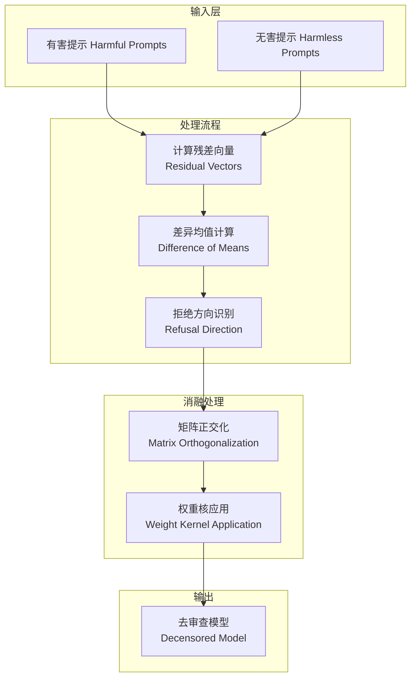
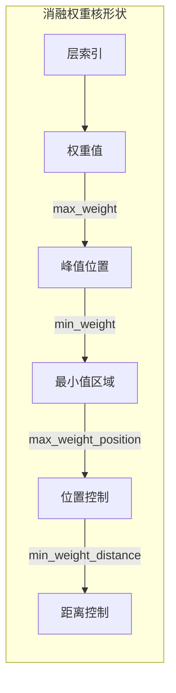
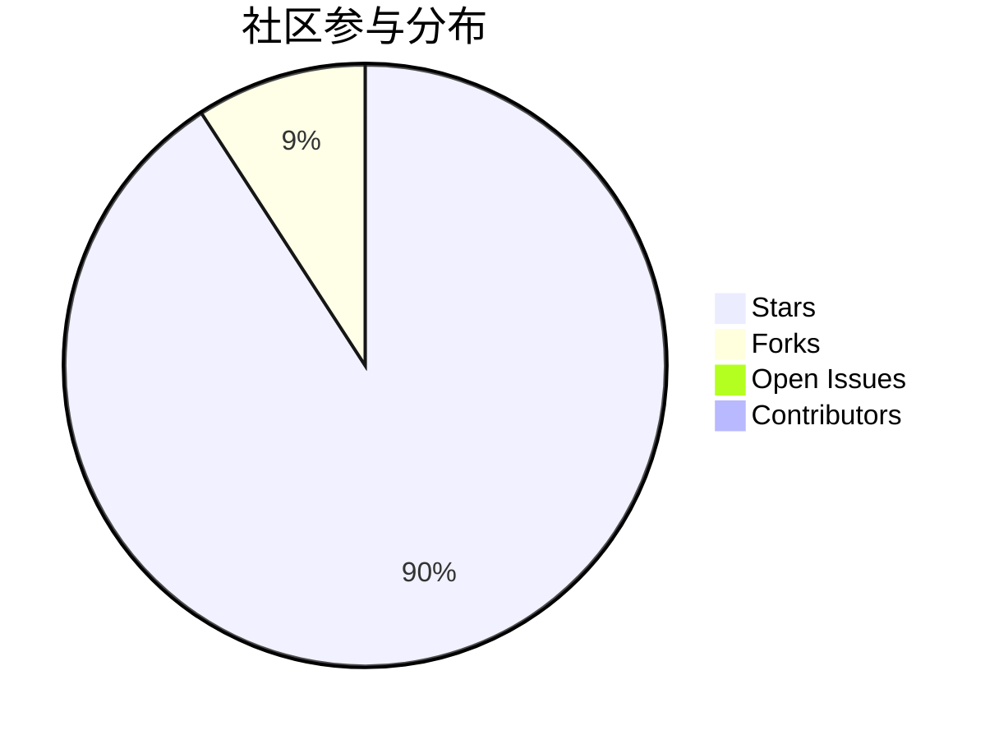
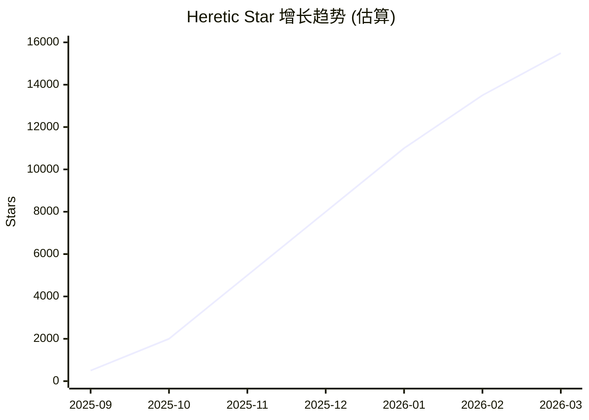
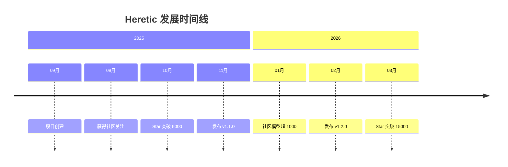
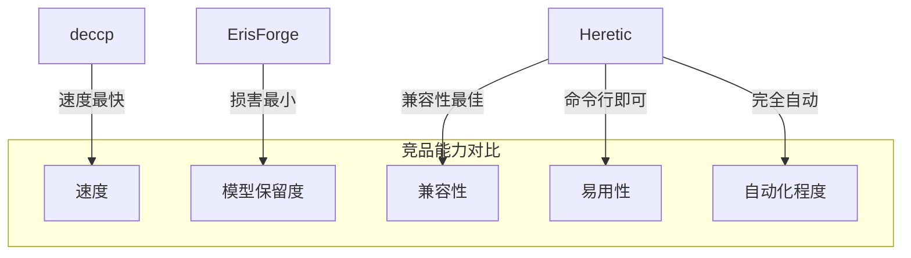
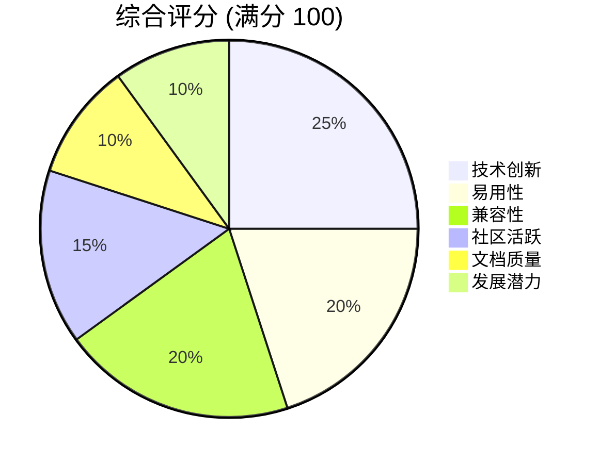

# Heretic 深度研究报告

> **项目地址**: https://github.com/p-e-w/heretic  
> **报告生成日期**: 2026-03-17  
> **分析方法**: GitHub Deep Research

---

## 目录

1. [项目概述](#项目概述)
2. [基本信息](#基本信息)
3. [技术分析](#技术分析)
4. [社区活跃度](#社区活跃度)
5. [发展趋势](#发展趋势)
6. [竞品对比](#竞品对比)
7. [总结评价](#总结评价)

---

## 项目概述

### 核心定位

**Heretic** 是一个**全自动大语言模型审查移除工具**，通过先进的定向消融（Directional Ablation，又称"Abliteration"）技术，无需昂贵的后训练即可移除 Transformer 语言模型的审查机制（即"安全对齐"）。

### 项目愿景

Heretic 的核心创新在于将复杂的模型内部操作自动化，使得任何会使用命令行程序的用户都能对语言模型进行去审查处理。项目结合了 TPE（Tree-structured Parzen Estimator）参数优化器（由 Optuna 驱动），通过联合最小化拒绝率和与原模型的 KL 散度，生成保留原模型智能水平的去审查模型。

### 应用场景

- **研究用途**: 帮助研究人员深入理解模型内部机制和可解释性
- **模型定制**: 创建符合特定需求的无审查模型变体
- **安全研究**: 分析当前安全微调方法的脆弱性

---

## 基本信息

### 项目统计

| 指标 | 数值 |
|------|------|
| ⭐ Stars | **15,490** |
| 🍴 Forks | **1,563** |
| 📋 Open Issues | **76** |
| 👥 Contributors | **16** |
| 📅 创建时间 | 2025-09-21 |
| 📅 最后更新 | 2026-03-17 |
| 📅 最后推送 | 2026-03-15 |
| 🏷️ 最新版本 | v1.2.0 (2026-02-14) |

### 技术栈

| 类别 | 详情 |
|------|------|
| **主要语言** | Python (108,823 行) |
| **许可证** | AGPL-3.0 |
| **依赖** | PyTorch 2.2+, Optuna, Transformers |
| **支持模型** | 大多数密集模型、多模态模型、部分 MoE 架构 |

### 项目标签

`abliteration` · `llm` · `transformer`

---

## 技术分析

### 核心技术原理

#### 1. 定向消融（Directional Ablation）

Heretic 实现了参数化的定向消融变体。对于每个支持的 Transformer 组件（目前支持注意力输出投影和 MLP 下投影），它识别每个 Transformer 层中的相关矩阵，并相对于"拒绝方向"对其进行正交化处理，从而抑制该方向在矩阵乘法结果中的表达。



#### 2. 拒绝方向计算

拒绝方向按层计算，作为"有害"和"无害"示例提示的首词元残差的差异均值。

#### 3. 可优化参数

消融过程由多个可优化参数控制：

| 参数 | 描述 |
|------|------|
| `direction_index` | 拒绝方向索引，或特殊值 `per layer` 表示每层使用各自的拒绝方向 |
| `max_weight` | 权重核最大值 |
| `max_weight_position` | 最大权重位置 |
| `min_weight` | 权重核最小值 |
| `min_weight_distance` | 最小权重距离 |

#### 4. 权重核示意图



### 技术创新点

#### 创新一：灵活的消融权重核

权重核形状高度灵活，结合自动参数优化，可改善合规性/质量权衡。

#### 创新二：浮点拒绝方向索引

拒绝方向索引是浮点数而非整数。对于非整数值，对两个最近的拒绝方向向量进行线性插值，解锁了差异均值计算识别的方向之外的广阔空间。

#### 创新三：组件独立参数

消融参数针对每个组件单独选择。MLP 干预往往比注意力干预对模型损害更大，因此使用不同的消融权重可以提升性能。

### 性能基准

以 `google/gemma-3-12b-it` 为例：

| 模型版本 | 拒绝率 (有害提示) | KL 散度 (无害提示) |
|----------|-------------------|-------------------|
| 原始模型 | 97/100 | 0 (基准) |
| mlabonne/gemma-3-12b-it-abliterated-v2 | 3/100 | 1.04 |
| huihui-ai/gemma-3-12b-it-abliterated | 3/100 | 0.45 |
| **p-e-w/gemma-3-12b-it-heretic (本项目)** | **3/100** | **0.16** |

> Heretic 版本在无需人工干预的情况下，实现了与其他消融版本相同的拒绝抑制水平，但 KL 散度显著更低，表明对原模型能力的损害更小。

### 研究功能

Heretic 还提供支持模型内部语义研究（可解释性）的功能：

1. **残差向量可视化** (`--plot-residuals`)
   - 计算每层的残差向量
   - 执行 PaCMAP 投影到 2D 空间
   - 生成动画 GIF 展示残差在层间变换

2. **残差几何分析** (`--print-residual-geometry`)
   - 提供详细的残差几何指标
   - 包含余弦相似度、L2 范数、轮廓系数等

---

## 社区活跃度

### 活跃度指标



### 社区生态

#### Hugging Face 模型库

社区已创建并发布了超过 **1,000+** 个 Heretic 模型。官方维护的模型集合包括：

| 模型 | 参数量 | 下载量 |
|------|--------|--------|
| gpt-oss-20b-heretic | 21B | 4.32k+ |
| Qwen3-4B-Instruct-2507-heretic | 4B | 3.46k+ |
| gemma-3-12b-it-heretic | 12B | 2.63k+ |
| Llama-3.1-8B-Instruct-heretic | 8B | 461+ |
| phi-4-heretic | 15B | 63+ |
| gemma-3-270m-it-heretic | 0.3B | 304+ |

#### 用户反馈

> "我下载了 **GPT-OSS 20B Heretic** 模型后非常惊讶。它对敏感话题给出格式正确的长回复，使用你期望的无审查模型应有的确切无审查词汇，生成带有详细信息的 markdown 格式表格。这是迄今为止该模型最好的消融版本..."

> "**Heretic GPT 20b** 似乎是我尝试过的最好的无审查模型。它不会破坏模型的智能，并且正常回答原本会被基础模型拒绝的提示。"

> "**Qwen3-4B-Instruct-2507-heretic** 是我能在 16GB 显存上运行的最好的未量化消融模型。"

### 社交媒体影响力

- 获得 TrendShift "#1 Repository of the Day" 徽章
- 在 Reddit r/LocalLLaMA 社区获得广泛关注和讨论
- Discord 社区活跃运营

---

## 发展趋势

### Star 增长趋势



### 版本演进

| 版本 | 发布日期 | 主要更新 |
|------|----------|----------|
| v1.0.0 | 2025-09 | 初始发布 |
| v1.1.0 | 2025-11 | 增加多模态模型支持 |
| v1.2.0 | 2026-02-14 | 优化参数搜索，增强研究功能 |

### 发展轨迹分析



### 未来方向

基于项目 README 和发展趋势，预期未来发展方向：

1. **SSM/混合模型支持** - 目前尚未支持状态空间模型
2. **非均匀层模型支持** - 扩展架构兼容性
3. **新型注意力系统** - 适配新兴注意力机制
4. **性能优化** - 减少处理时间和显存需求

---

## 竞品对比

### 主要竞品概览

| 工具 | 特点 | 优势 | 劣势 |
|------|------|------|------|
| **Heretic** | 全自动 + TPE 优化 | 兼容性最好，自动化程度高 | 处理时间较长 |
| **ErisForge** | 手动调参 | 对 AI 能力损害最小 | 需要专业知识 |
| **deccp** | 快速处理 | 速度最快 (~2分钟) | 兼容性有限 |
| **AutoAbliteration** | 半自动 | 易于使用 | 优化精度较低 |
| **abliterator.py** (FailSpy) | 开源基础 | 代码简洁 | 功能有限 |
| **wassname's Abliterator** | 实验性 | 创新方法 | 文档不足 |

### 竞品对比雷达图



### 内华达大学研究结果

根据内华达大学的研究对比：

- **Heretic**: 兼容性最好，能处理所有测试的 AI 模型
- **deccp**: 速度最快，仅需 2 分钟
- **ErisForge**: 对 AI 能力损害最小

### 学术背景对比

| 项目 | 学术基础 | 引用论文 |
|------|----------|----------|
| Heretic | Arditi et al. 2024 + Jim Lai 扩展 | arXiv:2406.11717 |
| 其他工具 | 多基于同一论文 | 各有侧重 |

---

## 总结评价

### 优势分析

| 维度 | 评价 | 评分 |
|------|------|------|
| **技术创新** | 首创浮点方向索引 + 组件独立参数 | ⭐⭐⭐⭐⭐ |
| **易用性** | 完全自动化，命令行即可操作 | ⭐⭐⭐⭐⭐ |
| **兼容性** | 支持大多数密集模型和多模态模型 | ⭐⭐⭐⭐⭐ |
| **模型保留** | KL 散度显著低于竞品 | ⭐⭐⭐⭐⭐ |
| **文档质量** | README 详细，包含原理说明 | ⭐⭐⭐⭐ |
| **社区生态** | 1000+ 社区模型，活跃 Discord | ⭐⭐⭐⭐⭐ |

### 潜在风险

1. **伦理考量**: 工具可能被滥用于绕过安全机制
2. **法律风险**: AGPL-3.0 许可证对商业使用有限制
3. **技术局限**: 尚不支持 SSM/混合模型

### 综合评分



### 最终评价

**Heretic** 是 LLM 去审查领域的**标杆级开源项目**。它成功地将复杂的模型内部操作转化为简单易用的命令行工具，同时保持了业界领先的模型能力保留度。项目在技术创新、易用性和社区生态三个维度都表现出色，是该细分领域不可忽视的重要工具。

对于研究人员和开发者而言，Heretic 不仅是一个实用工具，更是理解 Transformer 模型内部机制的宝贵学习资源。其研究功能（残差可视化、几何分析）为可解释性研究提供了有力支持。

---

## 附录

### 快速开始

```bash
# 安装
pip install -U heretic-llm

# 基本使用
heretic Qwen/Qwen3-4B-Instruct-2507

# 启用量化（降低显存需求）
heretic Qwen/Qwen3-4B-Instruct-2507 --quantization bnb_4bit

# 研究功能
pip install -U heretic-llm[research]
heretic google/gemma-3-270m-it --plot-residuals
```

### 相关链接

- 📦 GitHub: https://github.com/p-e-w/heretic
- 🤗 Hugging Face: https://huggingface.co/heretic-org
- 💬 Discord: https://discord.gg/gdXc48gSyT
- 📄 论文: [arXiv:2406.11717](https://arxiv.org/abs/2406.11717)

### 引用格式

```bibtex
@misc{heretic,
  author = {Weidmann, Philipp Emanuel},
  title = {Heretic: Fully automatic censorship removal for language models},
  year = {2025},
  publisher = {GitHub},
  journal = {GitHub repository},
  howpublished = {\url{https://github.com/p-e-w/heretic}}
}
```

---

*本报告由 GitHub Deep Research 方法自动生成*
