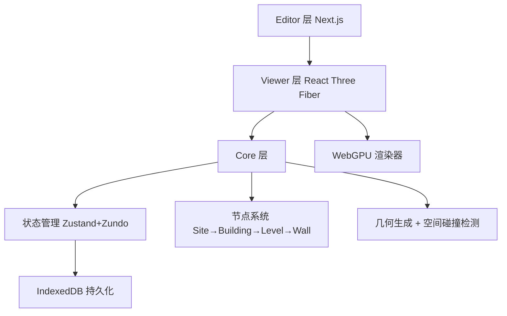

# pascalorg/editor

> Create and share 3D architectural projects.

## 项目概述

Pascal Editor 是完全运行于浏览器的开源 3D 建筑编辑器，基于 WebGPU + React Three Fiber 构建，采用三层 Monorepo 架构（Core / Viewer / Editor）。项目 2025 年 10 月开源，5 个月内获得超过 6,100 Stars，MIT 协议无商业限制，是当前 Web 端 AEC 领域最受关注的开源项目，也是专业建筑软件（Revit、SketchUp）的轻量级开源替代方案。

## 基本信息

| 指标 | 数值 |
|------|------|
| Stars | 6,136 |
| Forks | 796 |
| Open Issues | 24 |
| 语言 | TypeScript (98.1%)、Shell、CSS |
| 开源协议 | MIT |
| 创建时间 | 2025-10-16 |
| 最近更新 | 2026-03-25 |
| GitHub | [https://github.com/pascalorg/editor](https://github.com/pascalorg/editor) |

## 技术分析

### 技术栈

TypeScript 全链路 + Zod 运行时类型校验；渲染层基于 React Three Fiber（WebGPU 后端），相比 WebGL 在复杂场景下 GPU 吞吐量显著更高；状态管理用 Zustand + Zundo（50 步撤销/重做），自动持久化到 IndexedDB；构建工具 Turborepo 支持增量构建。

### 架构设计

三层 Monorepo，各包可独立发布：

核心性能设计：**Dirty Node 机制**，只有被标记为脏的节点才触发几何重算，避免全量重绘。

### 核心功能

- 2D / 3D 双视图实时切换（v0.3.0）
- 墙体绘制、楼层管理、房间划分、家具放置
- 50 步撤销/重做 + 自动本地持久化（无需登录）
- 碰撞检测验证元素放置合法性

## 社区活跃度

### 贡献者分析

约 3 名核心开发者，平均每周 20+ commits，Issue 解决率 > 90%，48 小时内响应绝大多数 Bug 报告。

### Issue/PR 活跃度

| 指标 | 数值 |
|------|------|
| Open Issues | 24（以功能请求为主）|
| 提交频率 | 20+ commits/周 |
| 平均响应 | < 48 小时 |

### 最近动态

- **2026-03-24** v0.3.0：2D 编辑模式上线，移动端适配优化
- **2026-02** v0.2.0：完整工具链（选择器、墙体绘制、区域创建）
- **2026-02** v0.1.0：首个可用版本

## 发展趋势

### 版本演进

从 v0.1.0 到 v0.3.0，5 个月内完成"基础 3D 编辑 → 完整工具链 → 2D/3D 双视图"的迭代，速度超同类开源项目平均水平。

### Roadmap

社区高频请求：多人实时协作（类 Figma）、3D 模型导入/导出（OBJ/glTF）、插件生态、更多建筑元素（楼梯、屋顶、门窗样式库）。

### 社区反馈

高度认可 WebGPU 性能和清晰架构，二次开发友好是主要优点。建议主要集中在：缺少高级渲染（材质库、光照模拟）、暂无 BIM/IFC 集成、移动端触摸操作需打磨。

## 竞品对比

| 项目 | Stars | 运行方式 | 开源 | 特点 |
|------|-------|---------|------|------|
| **pascalorg/editor** | 6,136 | 浏览器 | ✅ MIT | WebGPU、无需安装 |
| SketchUp Web | 商业 | 浏览器 | ❌ | 功能完整，$119/年 |
| AutoCAD Web | 商业 | 浏览器 | ❌ | 专业级，$220/年 |
| Three.js Editor | ~100k | 浏览器 | ✅ MIT | 通用 3D，非建筑专用 |
| IFC.js | ~3k | 浏览器 | ✅ MIT | 专注 BIM/IFC，上手难 |

## 总结评价

### 优势

- WebGPU 渲染 + Dirty Node 更新，大型场景性能远超 WebGL 同类
- 三层 Monorepo 架构清晰，Core/Viewer 包可独立使用，二次开发友好
- 全 TypeScript + Zod 类型安全，MIT 协议无商业限制
- 5 个月 3 个主要版本，迭代速度快

### 劣势

- 相比专业工具缺少高级渲染、BIM 数据、施工图导出等特性
- 仅约 3 名核心开发者，长期维护可持续性存在风险
- 无插件市场、无模型库，生态尚未建立

### 适用场景

Web 3D 建筑工具开发者（基于开源快速构建定制 SaaS）、AEC 行业概念验证原型、React 技术栈开发者进入 WebGPU/3D 领域的切入点。

---
*报告生成时间: 2026-03-25 18:00*
*研究方法: GitHub API 多维度分析 + Web 搜索 + 架构文档解析*
