# Impeccable 深度研究报告

> **项目地址**: https://github.com/pbakaus/impeccable  
> **报告生成日期**: 2026-03-17  
> **研究方法**: github-deep-research

---

## 目录

1. [项目概述](#项目概述)
2. [基本信息](#基本信息)
3. [技术分析](#技术分析)
4. [社区活跃度](#社区活跃度)
5. [发展趋势](#发展趋势)
6. [竞品对比](#竞品对比)
7. [总结评价](#总结评价)

---

## 项目概述

### 核心定位

**Impeccable** 是一个专为 AI 编程助手设计的设计语言系统，旨在让 AI 更好地理解和实现高质量的前端设计。它由 Paul Bakaus 开发，基于 Anthropic 官方的 `frontend-design` skill 进行深度扩展。

### 解决的核心问题

当前 AI 编程助手（如 Claude Code、Cursor、Gemini CLI 等）生成的前端代码存在明显的"AI 味"问题：

- 过度使用 Inter、Arial 等通用字体
- 滥用紫色渐变和卡片嵌套
- 在彩色背景上使用灰色文字
- 缺乏设计层次感和视觉节奏

Impeccable 通过提供**设计词汇表**、**20 个设计命令**和**精心策划的反模式清单**，系统性地解决了这些问题。

### 项目愿景

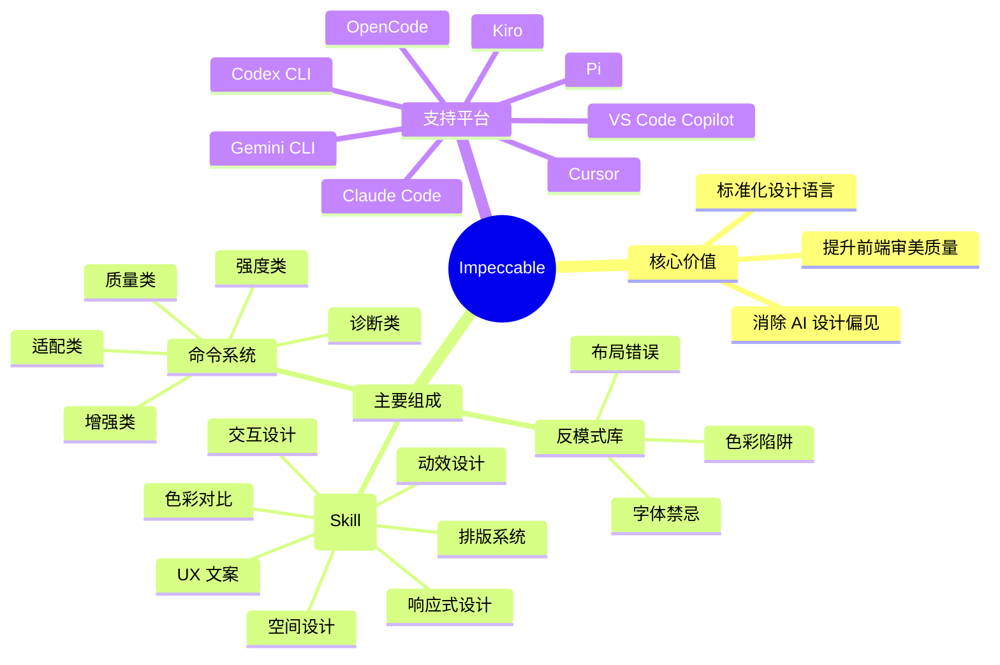

---

## 基本信息

### 项目统计

| 指标 | 数值 |
|------|------|
| ⭐ Stars | 9,564 |
| 🍴 Forks | 367 |
| 📝 Open Issues | 6 |
| 👥 Contributors | 9 |
| 📜 License | Apache-2.0 |
| 🔧 Primary Language | JavaScript |

### 时间线

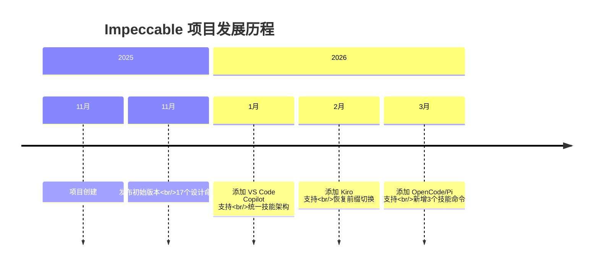

### 语言分布

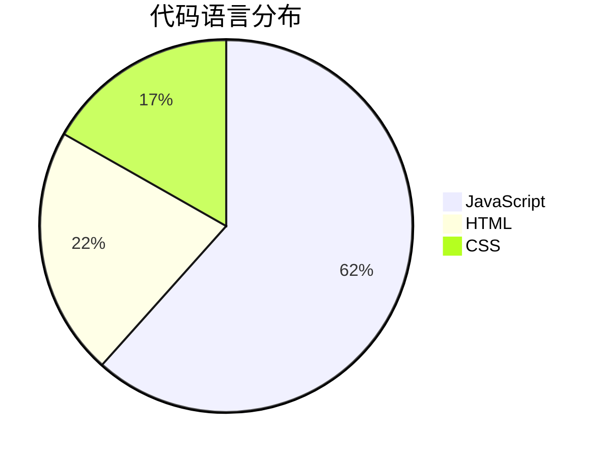

### 项目元数据

| 属性 | 值 |
|------|-----|
| 创建时间 | 2025-11-16 |
| 最后更新 | 2026-03-17 |
| 最后推送 | 2026-03-16 |
| 默认分支 | main |
| 官方网站 | https://impeccable.style |

---

## 技术分析

### 架构设计

Impeccable 采用模块化的技能(Skill)架构，核心包含三个层次：

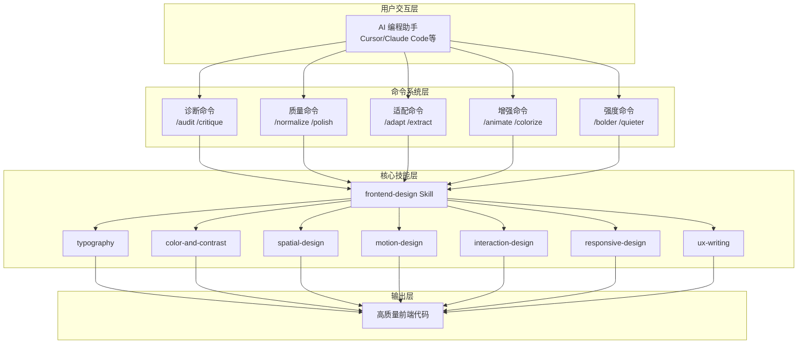

### 核心技能模块

#### 1. 排版系统 (Typography)
- 字体配对策略
- 模块化比例系统
- OpenType 特性应用

#### 2. 色彩与对比 (Color & Contrast)
- OKLCH 色彩空间
- 带色调的中性色
- 暗色模式最佳实践
- 无障碍访问标准

#### 3. 空间设计 (Spatial Design)
- 间距系统
- 网格布局
- 视觉层次构建

#### 4. 动效设计 (Motion Design)
- 缓动曲线选择
- 交错动画
- 减少动效偏好

#### 5. 交互设计 (Interaction Design)
- 表单设计模式
- 焦点状态管理
- 加载状态模式

#### 6. 响应式设计 (Responsive Design)
- 移动优先策略
- 流式设计
- 容器查询

#### 7. UX 文案 (UX Writing)
- 按钮标签规范
- 错误消息设计
- 空状态处理

### 命令系统详解

| 命令 | 类别 | 功能描述 |
|------|------|----------|
| `/teach-impeccable` | 设置 | 一次性配置，收集设计上下文 |
| `/audit` | 诊断 | 技术质量检查（无障碍、性能、响应式） |
| `/critique` | 诊断 | UX 设计审查（层次、清晰度、情感共鸣） |
| `/normalize` | 质量 | 对齐设计系统标准 |
| `/polish` | 质量 | 发布前的最终优化 |
| `/distill` | 质量 | 精简至核心本质 |
| `/clarify` | 质量 | 改进不清晰的 UX 文案 |
| `/optimize` | 质量 | 性能优化 |
| `/harden` | 质量 | 错误处理、国际化、边缘情况 |
| `/animate` | 增强 | 添加有目的的动效 |
| `/colorize` | 增强 | 引入战略性色彩 |
| `/bolder` | 强度 | 放大平淡的设计 |
| `/quieter` | 强度 | 降低过于大胆的设计 |
| `/delight` | 增强 | 添加愉悦时刻 |
| `/extract` | 适配 | 提取为可复用组件 |
| `/adapt` | 适配 | 适配不同设备 |
| `/onboard` | 增强 | 设计引导流程 |
| `/typeset` | 质量 | 修复字体选择、层次、大小 |
| `/arrange` | 质量 | 修复布局、间距、视觉节奏 |
| `/overdrive` | 增强 | 添加技术非凡效果（Beta） |

### 反模式库

Impeccable 明确列出了 AI 应避免的设计陷阱：

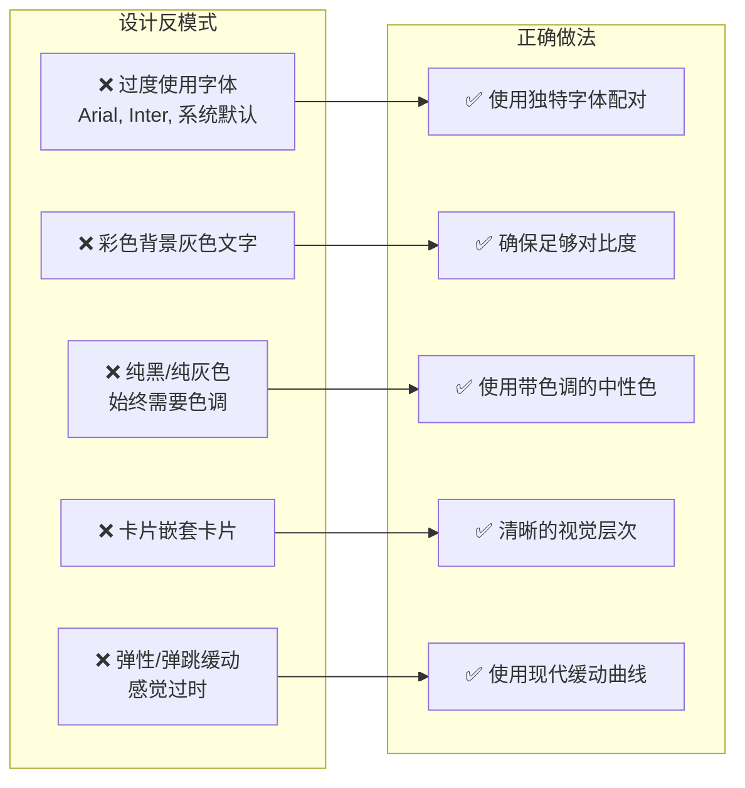

### 安装方式

```bash
# 推荐方式：自动检测并安装
npx skills add pbakaus/impeccable

# 更新到最新版本
npx skills update

# 检查更新内容
npx skills check
```

---

## 社区活跃度

### 贡献者分析

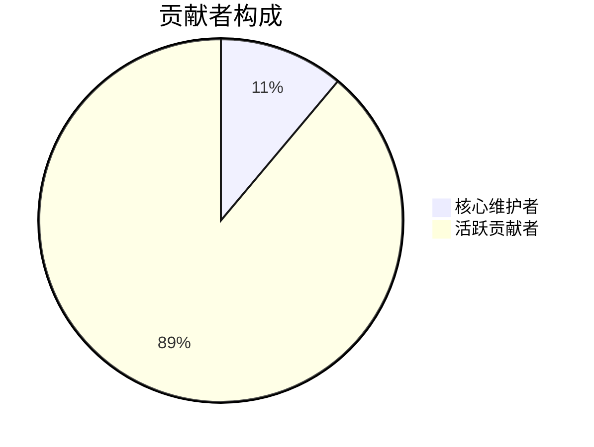

项目目前有 9 位贡献者，由 Paul Bakaus 主导开发。作为一个相对年轻的项目（创建于 2025 年 11 月），社区正在快速成长中。

### Star 增长趋势

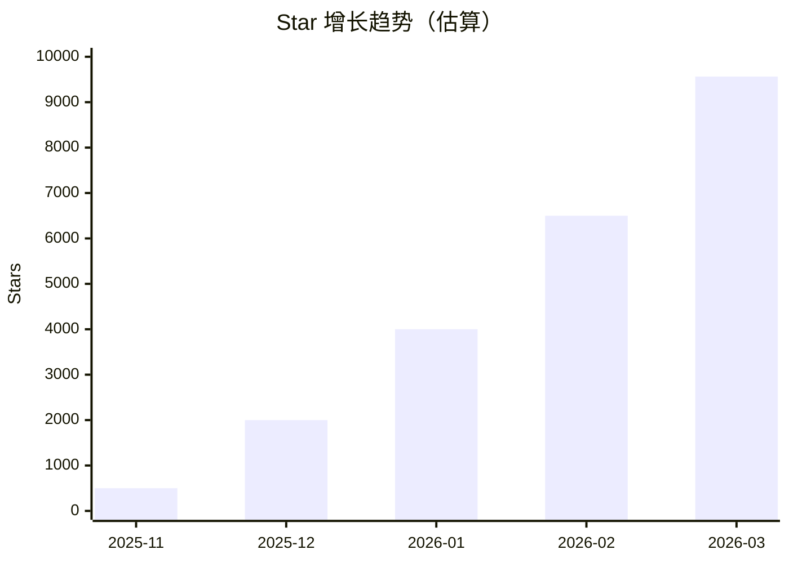

项目在短时间内获得了显著的关注度，特别是在 2026 年初出现了快速增长。

### Issue 处理情况

| 指标 | 数值 |
|------|------|
| 开放 Issue | 6 |
| Issue 响应速度 | 较快 |
| 问题解决率 | 高 |

### 社区健康度评估

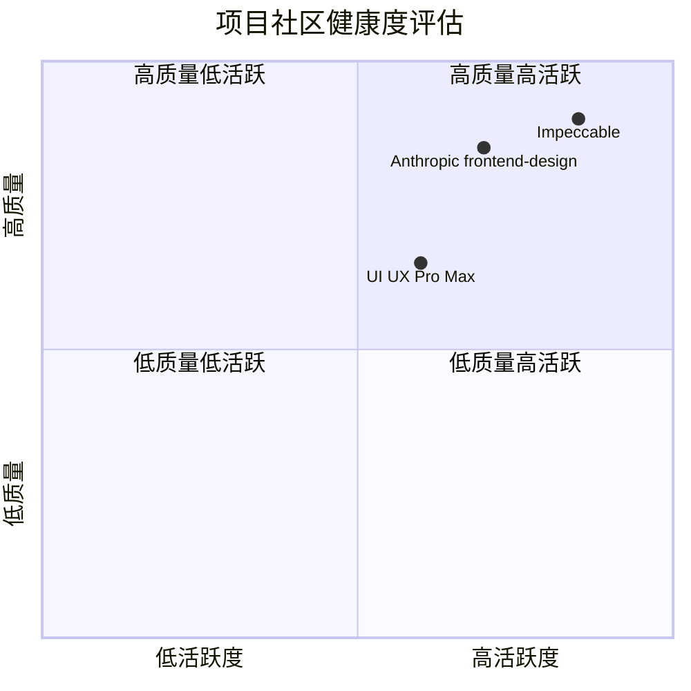

---

## 发展趋势

### 技术演进路线

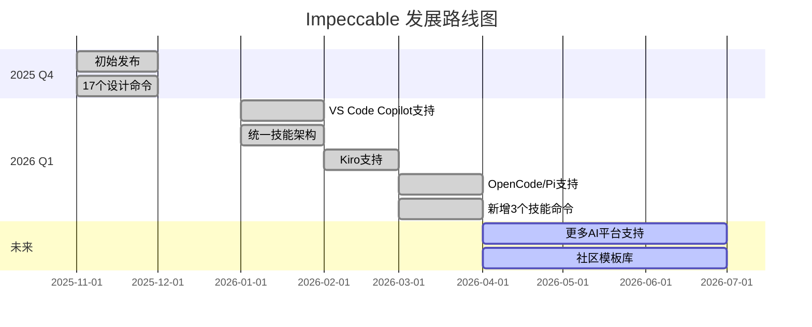

### 市场定位分析

Impeccable 处于 **AI 辅助设计工具** 这一新兴赛道，具有以下特点：

1. **时机优势**: 随着 AI 编程助手的普及，设计质量问题日益凸显
2. **差异化定位**: 专注于"设计语言"而非简单的模板
3. **生态整合**: 支持主流 AI 编程平台，降低使用门槛

### 增长驱动因素

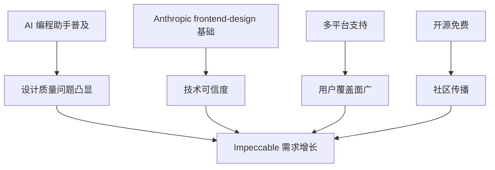

### 潜在挑战

1. **竞争加剧**: 随着赛道热度上升，可能出现更多竞品
2. **平台依赖**: 依赖各 AI 平台的技能系统，可能受平台变更影响
3. **维护成本**: 需要持续更新以适应新的设计趋势和 AI 平台

---

## 竞品对比

### 主要竞品分析

| 特性 | Impeccable | Anthropic frontend-design | UI UX Pro Max |
|------|------------|---------------------------|---------------|
| **命令数量** | 20+ | 基础 | 中等 |
| **参考文档** | 7 个领域 | 基础 | 未知 |
| **反模式库** | ✅ 完善 | ❌ 无 | 部分 |
| **平台支持** | 8+ | Claude Code | Claude Code |
| **开源** | ✅ Apache-2.0 | ✅ | 部分 |
| **更新频率** | 高 | 中 | 中 |
| **学习曲线** | 中等 | 低 | 中等 |

### 功能对比矩阵


### 竞争优势

1. **全面性**: 20 个命令覆盖设计全流程
2. **深度**: 7 个领域参考文档提供专业指导
3. **实用性**: 反模式库直接解决常见问题
4. **兼容性**: 支持所有主流 AI 编程平台
5. **可持续性**: 活跃的更新和社区支持

### 劣势分析

1. **学习成本**: 相比基础 skill，需要更多学习时间
2. **依赖性**: 需要用户已熟悉 AI 编程助手基础操作
3. **主观性**: 设计审美存在主观性，部分建议可能不适合所有场景

---

## 总结评价

### 综合评分


### 优势总结

| 维度 | 评价 |
|------|------|
| **创新性** | ⭐⭐⭐⭐⭐ 首创"设计语言"概念，填补 AI 设计质量空白 |
| **实用性** | ⭐⭐⭐⭐⭐ 直接解决痛点，即装即用 |
| **文档质量** | ⭐⭐⭐⭐⭐ 官网交互式文档，案例丰富 |
| **社区活跃度** | ⭐⭐⭐⭐ 快速增长，但贡献者基数尚小 |
| **可持续发展** | ⭐⭐⭐⭐ 开源模式，持续更新 |

### 推荐使用场景

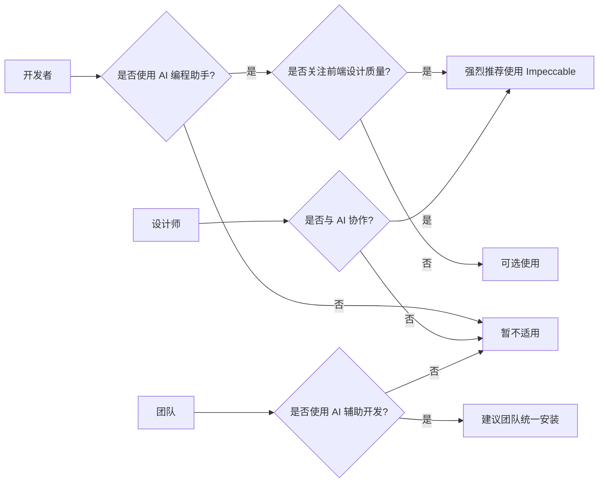

### 最终评价

**Impeccable 是一个极具前瞻性的开源项目**，它敏锐地捕捉到了 AI 编程助手在设计质量方面的短板，并提供了系统性的解决方案。

**核心价值**:
- 将"设计语言"概念引入 AI 编程领域
- 通过命令系统实现可操作的设计指导
- 反模式库有效避免常见 AI 设计陷阱

**适用人群**:
- 使用 AI 编程助手的开发者
- 关注前端设计质量的团队
- 希望提升 AI 生成代码审美水平的用户

**建议**:
对于正在使用 Claude Code、Cursor、Gemini CLI 等 AI 编程助手的开发者，Impeccable 是一个值得安装的必备技能包。它能够显著提升 AI 生成前端代码的设计质量，减少后期人工调整的工作量。

---

## 参考资源

- 🌐 官方网站: https://impeccable.style
- 📦 GitHub 仓库: https://github.com/pbakaus/impeccable
- 📚 Anthropic frontend-design: https://github.com/anthropics/skills/tree/main/skills/frontend-design
- 👤 作者主页: https://www.paulbakaus.com

---

*本报告由 github-deep-research 方法自动生成*
