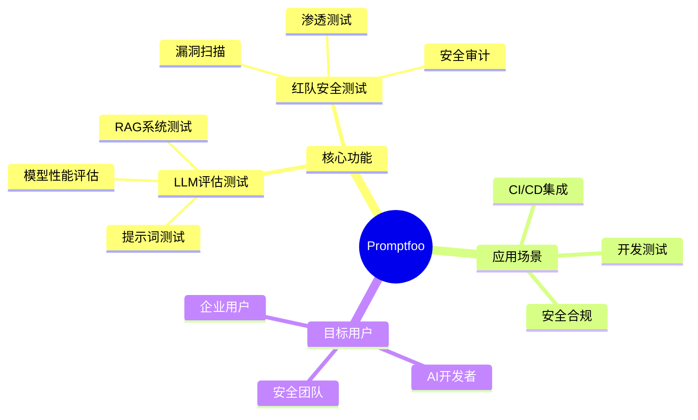
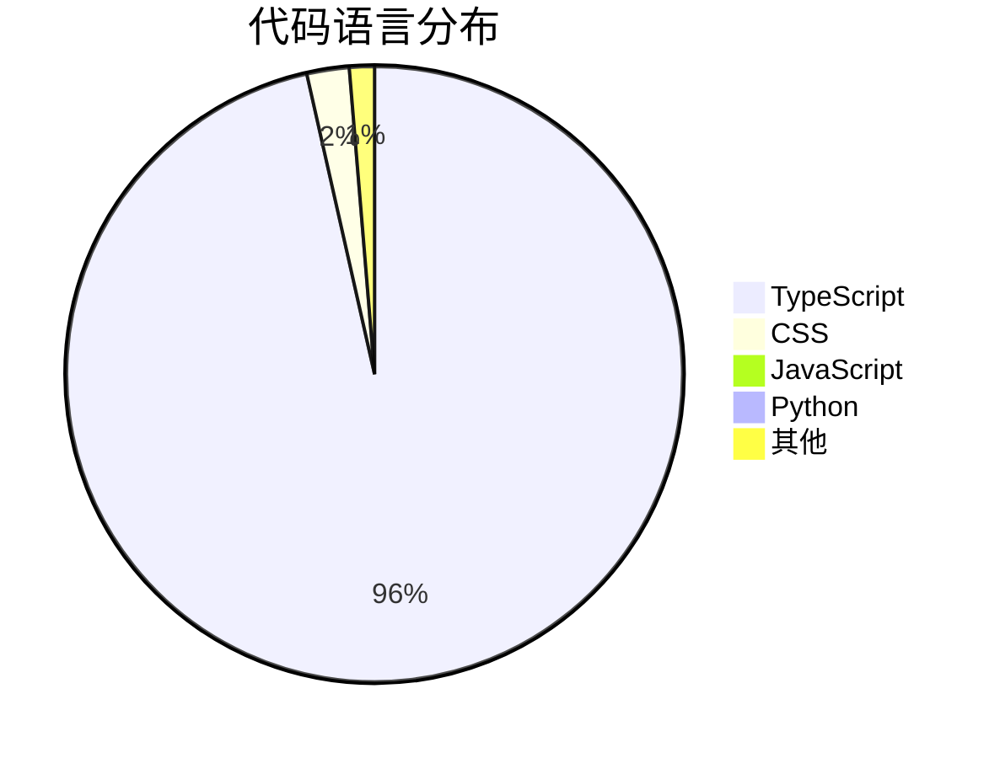
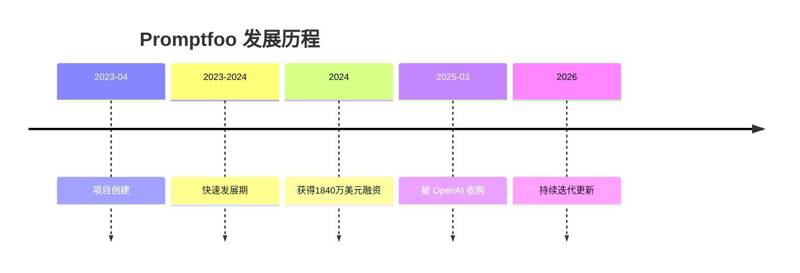
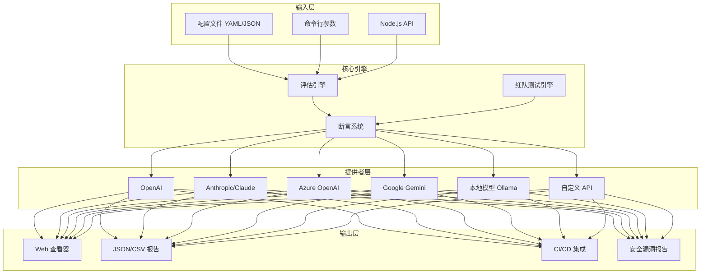
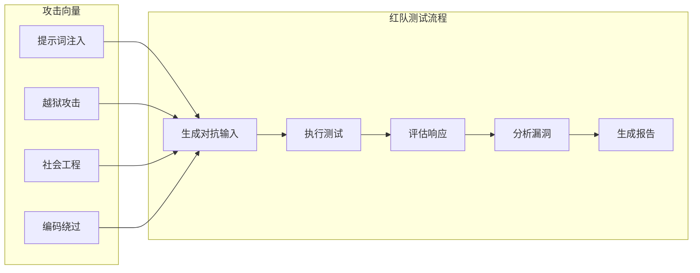
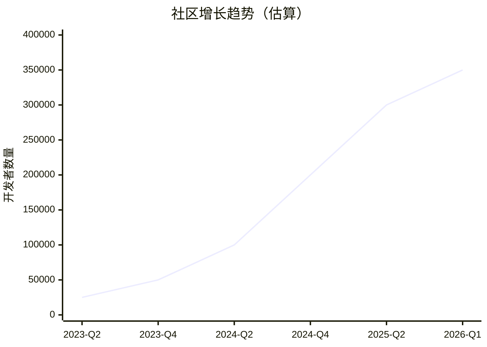
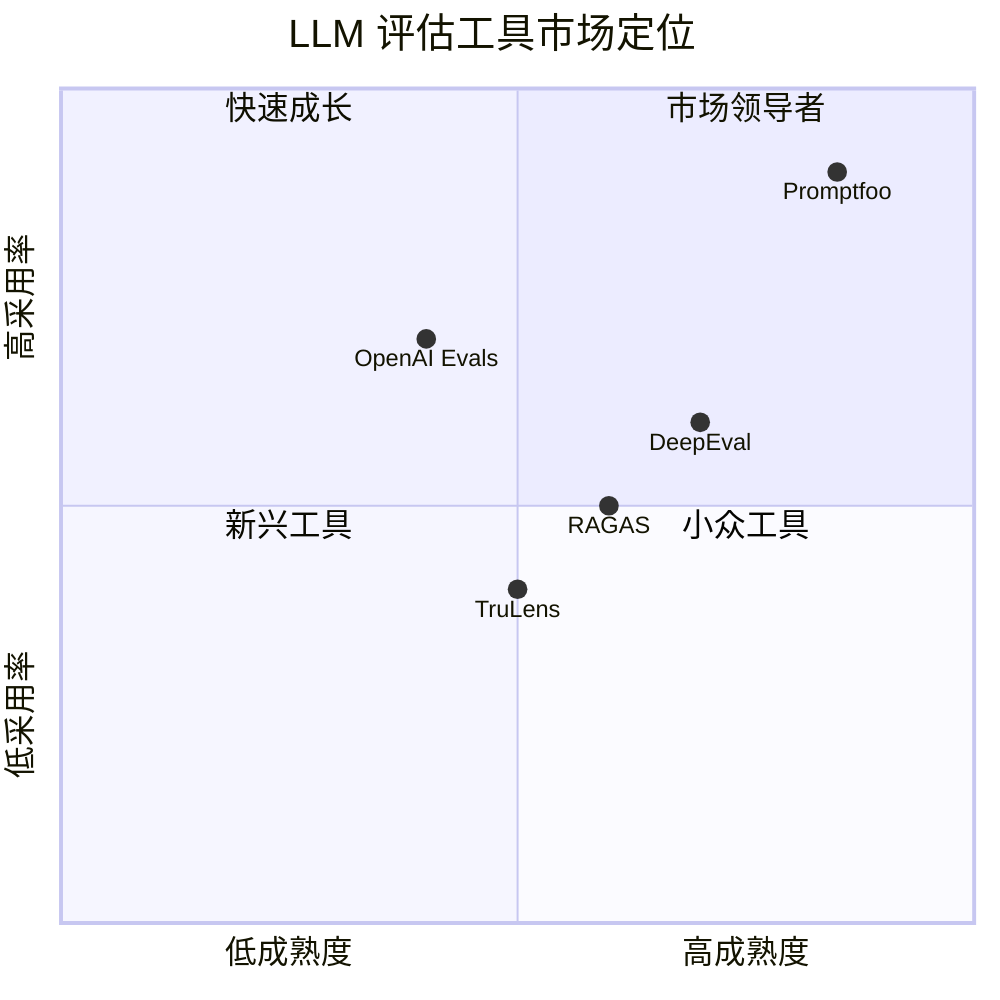
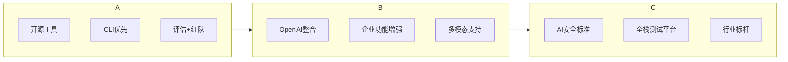
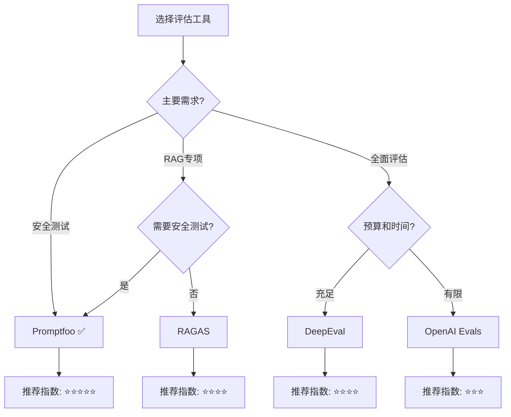
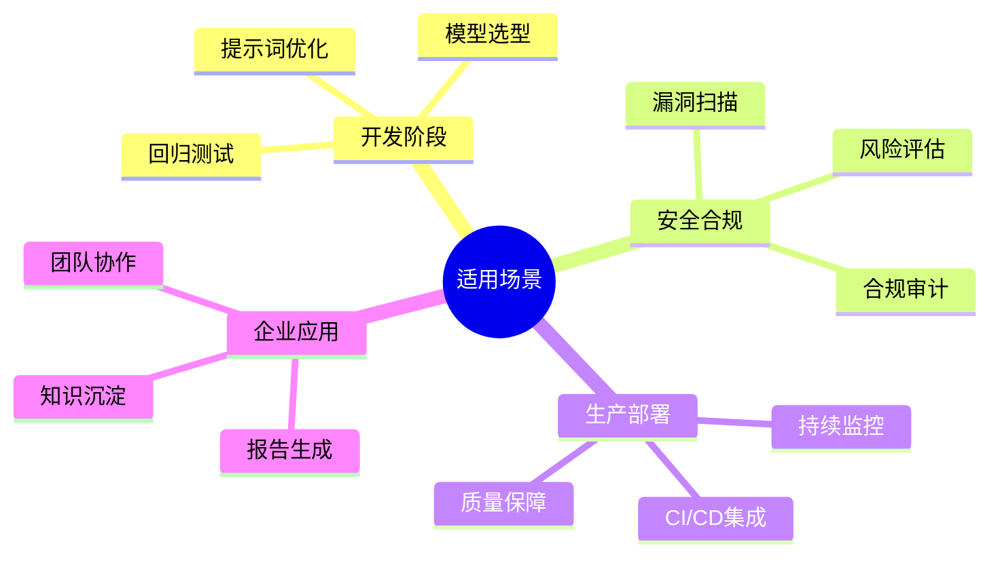

# Promptfoo 深度研究报告

> 研究日期：2026年3月17日  
> 项目地址：https://github.com/promptfoo/promptfoo

---

## 📋 目录

- [项目概述](#项目概述)
- [基本信息](#基本信息)
- [技术分析](#技术分析)
- [社区活跃度](#社区活跃度)
- [发展趋势](#发展趋势)
- [竞品对比](#竞品对比)
- [总结评价](#总结评价)

---

## 项目概述

### 简介

**Promptfoo** 是一个开源的 CLI 工具和库，专门用于评估和红队测试（Red Teaming）大语言模型（LLM）应用程序。它帮助开发者停止试错式的开发方法，开始构建安全、可靠的 AI 应用。

### 核心定位



### 项目使命

Promptfoo 的目标是实现**测试驱动的 LLM 开发**，而非传统的试错方法。它让开发者能够：

- 🧪 测试提示词、模型和 RAG 系统
- 🔒 通过红队测试和漏洞扫描保护 LLM 应用
- ⚖️ 并排比较多个模型（OpenAI、Anthropic、Azure、Bedrock、Ollama 等）
- 🔄 在 CI/CD 中自动化检查
- 📊 与团队共享评估结果

---

## 基本信息

### 项目统计

| 指标 | 数值 |
|------|------|
| ⭐ Stars | **16,956** |
| 🍴 Forks | **1,464** |
| 📝 Open Issues | 277 |
| 👥 贡献者 | 100+ |
| 📜 许可证 | MIT |
| 🏷️ 最新版本 | 0.121.2 |
| 📅 创建时间 | 2023-04-28 |
| 🔄 最后更新 | 2026-03-17 |

### 技术栈分布



### 项目标签

```
ci | ci-cd | cicd | evaluation | evaluation-framework | llm | llm-eval | 
llm-evaluation | llm-evaluation-framework | llmops | pentesting | 
prompt-engineering | prompt-testing | prompts | rag | red-teaming | 
testing | vulnerability-scanners
```

### 重要里程碑



---

## 技术分析

### 架构设计

Promptfoo 采用模块化架构设计，主要包含以下核心组件：



### 核心功能模块

#### 1. 评估系统 (Evaluation)

```yaml
prompts:
  - "写一篇关于{{topic}}的文章"
  - "请详细介绍{{topic}}"
providers:
  - openai:gpt-4
  - anthropic:claude-3-opus
tests:
  - description: "测试文章生成质量"
    vars:
      topic: "人工智能"
    assert:
      - type: contains
        value: "机器学习"
      - type: similar
        value: "人工智能是模拟人类智能的技术"
        threshold: 0.7
```

#### 2. 红队测试系统 (Red Teaming)

Promptfoo 的红队测试功能覆盖以下威胁类型：

| 威胁类型 | 描述 |
|----------|------|
| 提示词注入 | Prompt Injection |
| 越狱攻击 | Jailbreaking |
| 数据泄露 | PII Leaks |
| 有害内容生成 | Harmful Content |
| 幻觉问题 | Hallucinations |
| 权限提升 | Privilege Escalation |
| 工具滥用 | Tool Misuse |



#### 3. 断言系统

支持多种断言类型：

| 断言类型 | 用途 |
|----------|------|
| `contains` | 检查输出是否包含特定文本 |
| `not-contains` | 检查输出不包含特定文本 |
| `similar` | 语义相似度检查 |
| `regex` | 正则表达式匹配 |
| `javascript` | 自定义 JavaScript 验证 |
| `python` | 自定义 Python 验证 |
| `llm-rubric` | 使用 LLM 作为评判者 |

### 技术特点

#### 开发者友好

- ⚡ **快速执行**：支持缓存、并发和实时重载
- 🔒 **完全本地**：评估在本地运行，提示词不会离开您的机器
- 🌐 **语言无关**：支持 Python、JavaScript 或任何其他语言
- 📦 **多种安装方式**：npm、brew、pip、npx

#### 企业级特性

- 🔄 **CI/CD 集成**：支持 GitHub Actions、GitLab CI 等
- 📊 **可视化报告**：内置 Web 查看器
- 🔐 **安全合规**：符合 OWASP LLM Top 10、NIST AI RMF 等标准
- 👥 **团队协作**：支持结果共享和协作

---

## 社区活跃度

### 贡献者分析



### 社区指标

| 指标 | 数据 |
|------|------|
| Discord 成员 | 活跃社区 |
| NPM 周下载量 | 高频使用 |
| GitHub Stars 增长 | 收购后单日增长 500+ |
| 企业采用率 | 25%+ 财富 500 强企业 |

### 活跃度评估

- ✅ **代码提交**：持续活跃，最近提交时间 2026-03-16
- ✅ **版本发布**：频繁更新，最新版本 0.121.2（2026-03-12）
- ✅ **Issue 响应**：277 个开放 Issue，团队积极处理
- ✅ **文档完善**：完整的官方文档和教程

---

## 发展趋势

### 增长曲线



### 关键发展事件

#### OpenAI 收购（2025年3月）

2025年3月9日，OpenAI 宣布收购 Promptfoo，这一事件标志着：

1. **战略价值认可**：AI 安全测试成为核心需求
2. **技术整合**：Promptfoo 的攻击模拟与评测引擎并入 OpenAI Frontier
3. **市场验证**：覆盖提示词注入、数据泄露与越狱等高频风险

#### 企业采用

- 超过 **25% 的财富 500 强企业** 正在使用
- 开发者用户从 2.5 万增长到 **35 万+**
- Anthropic 等竞争对手也在使用该工具

### 未来展望



---

## 竞品对比

### 主流 LLM 评估工具对比

| 功能特性 | Promptfoo | DeepEval | RAGAS | TruLens | OpenAI Evals |
|----------|:---------:|:--------:|:-----:|:-------:|:------------:|
| 提示词测试 | ✅ | ✅ | ⚠️ | ⚠️ | ⚠️ |
| 模型比较 | ✅ | ✅ | ⚠️ | ⚠️ | ✅ |
| RAG 评估 | ✅ | ✅ | ✅ | ✅ | ❌ |
| 回归检测 | ✅ | ⚠️ | ❌ | ❌ | ❌ |
| 红队测试 | ✅ | ✅ | ❌ | ❌ | ⚠️ |
| 自定义指标 | ✅ | ⚠️ | ✅ | ✅ | ✅ |
| 批量测试 | ✅ | ✅ | ✅ | ✅ | ✅ |
| 可视化报告 | ✅ | ⚠️ | ⚠️ | ✅ | ✅ |
| CI/CD 集成 | ✅ | ✅ | ✅ | ✅ | ✅ |
| 开源免费 | ✅ | ✅ | ✅ | ✅ | ✅ |

### 详细对比分析


### 竞品特点分析

#### DeepEval
- **优势**：40+ 开箱即用指标，G-Eval 自定义指标框架
- **劣势**：安全测试功能相对较弱
- **适用场景**：需要全面评估套件的团队

#### RAGAS
- **优势**：RAG 专用指标丰富，与 LangChain 深度集成
- **劣势**：功能单一，不支持安全测试
- **适用场景**：RAG 管道专项评估

#### TruLens
- **优势**：深度洞察，反馈函数机制
- **劣势**：功能覆盖面较窄
- **适用场景**：LLM 应用质量评估

#### OpenAI Evals
- **优势**：与 OpenAI 生态深度集成
- **劣势**：功能基础，需要自行扩展
- **适用场景**：OpenAI 用户的轻量级评估

### 选择建议



---

## 总结评价

### 优势

| 优势 | 说明 |
|------|------|
| 🛡️ **安全测试领先** | 唯一同时提供评估和红队测试的开源工具 |
| ⚡ **开发者友好** | 快速、本地运行、实时重载、缓存支持 |
| 🔄 **CI/CD 原生** | 无缝集成到开发流程中 |
| 🌐 **多模型支持** | 支持所有主流 LLM 提供商 |
| 📊 **可视化报告** | 直观的 Web 界面和详细报告 |
| 🏢 **企业验证** | 25%+ 财富 500 强企业采用 |
| 🔓 **完全开源** | MIT 许可证，无商业绑定 |
| 🎯 **被 OpenAI 收购** | 技术价值得到顶级 AI 公司认可 |

### 劣势

| 劣势 | 说明 |
|------|------|
| 📚 学习曲线 | 配置文件语法需要学习 |
| 💰 Token 消耗 | 大规模红队测试可能消耗大量 Token |
| 🔧 定制复杂度 | 高级自定义断言需要编程能力 |
| 📱 无云服务 | 需要自行部署和管理 |

### 适用场景



### 推荐指数

| 维度 | 评分 | 说明 |
|------|:----:|------|
| 功能完整性 | ⭐⭐⭐⭐⭐ | 评估+安全测试全覆盖 |
| 易用性 | ⭐⭐⭐⭐ | CLI 优先，配置简单 |
| 文档质量 | ⭐⭐⭐⭐⭐ | 完善的官方文档和示例 |
| 社区活跃度 | ⭐⭐⭐⭐⭐ | 活跃的开发和社区支持 |
| 企业适用性 | ⭐⭐⭐⭐⭐ | 已被大量企业验证 |
| 创新性 | ⭐⭐⭐⭐⭐ | 红队测试功能独特 |

### 综合评分

<div align="center">

# ⭐⭐⭐⭐⭐ 9.2/10

**强烈推荐**

</div>

### 最终评价

Promptfoo 是目前**最全面的 LLM 评估和安全测试工具**。它不仅提供了强大的评估功能，还独树一帜地集成了红队测试能力，填补了 AI 安全测试工具的市场空白。

被 OpenAI 收购这一事件，充分证明了其技术价值和战略意义。对于任何认真对待 AI 应用质量和安全的团队来说，Promptfoo 都是**必备工具**。

**推荐人群**：
- AI 应用开发者
- 安全团队
- DevOps 工程师
- 企业 AI 项目负责人

---

## 参考资源

- 📖 [官方文档](https://www.promptfoo.dev/docs/)
- 🚀 [快速开始](https://www.promptfoo.dev/docs/getting-started/)
- 🔴 [红队测试指南](https://www.promptfoo.dev/docs/red-team/)
- 💬 [Discord 社区](https://discord.gg/promptfoo)
- 🐙 [GitHub 仓库](https://github.com/promptfoo/promptfoo)

---

*本报告基于 GitHub API 数据、官方文档及公开资料整理，研究日期：2026年3月17日*
