# RuView (WiFi DensePose) 项目深度分析报告

> 报告生成时间：2026-03-17
> 项目地址：https://github.com/ruvnet/RuView

---

## 目录

1. [项目概述](#项目概述)
2. [基本信息](#基本信息)
3. [技术分析](#技术分析)
4. [社区活跃度](#社区活跃度)
5. [发展趋势](#发展趋势)
6. [竞品对比](#竞品对比)
7. [总结评价](#总结评价)

---

## 项目概述

### 核心定位

**RuView (WiFi DensePose)** 是一个革命性的开源项目，它利用普通 WiFi 信号实现**实时人体姿态估计、生命体征监测和存在检测**——完全不需要摄像头或穿戴设备。该项目将 WiFi 信号转化为"感知雷达"，实现了隐私优先的无视觉传感技术。

### 核心价值主张

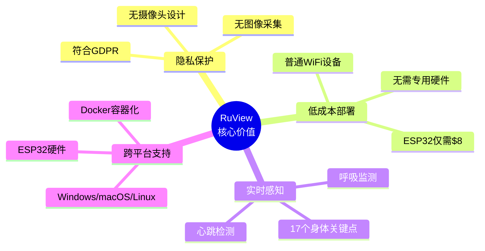

### 技术突破

项目通过解析 WiFi 的**信道状态信息 (CSI)**——即每个子载波的幅度和相位变化——来感知人体对无线电波的扰动。核心创新包括：

- **SpotFi 相位净化算法**：消除硬件相位偏移
- **Fresnel 几何模型**：精确计算人体位置
- **图神经网络 (GNN)**：将 CSI 信号映射为人体姿态
- **SONA 自适应学习**：持续优化模型性能

---

## 基本信息

### 项目统计

| 指标 | 数值 |
|------|------|
| ⭐ Stars | **37,608** |
| 🍴 Forks | 5,175 |
| 📋 Open Issues | 54 |
| 👥 Contributors | 7 |
| 📜 License | MIT |
| 🔧 Primary Language | Rust |

### 项目时间线

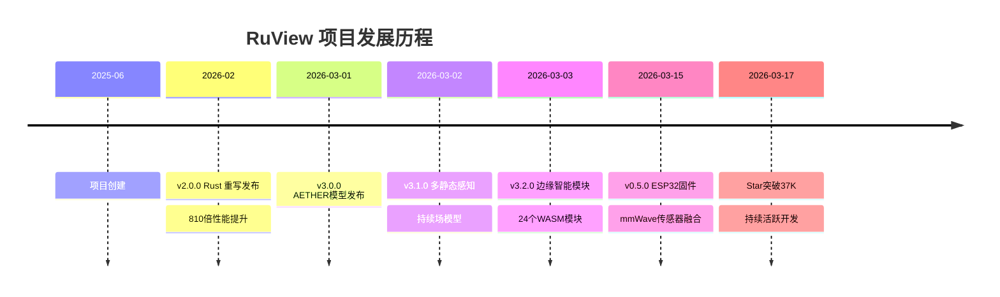

### 技术栈分布

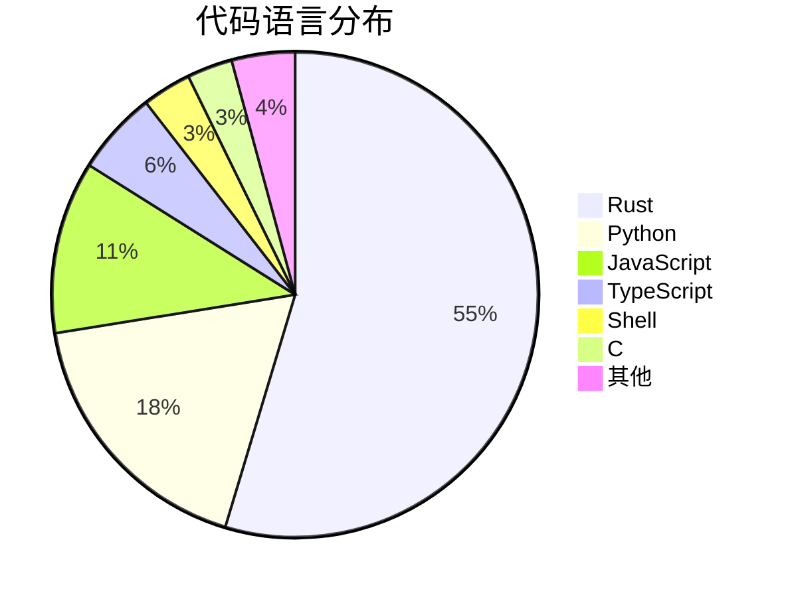

### 项目标签

```
agentic-ai | densepose | esp32 | firmware | mcu | mincut | monitoring | 
pose-estimation | rf | self-learning | wifi | wifi-hacking | wifi-security
```

---

## 技术分析

### 系统架构

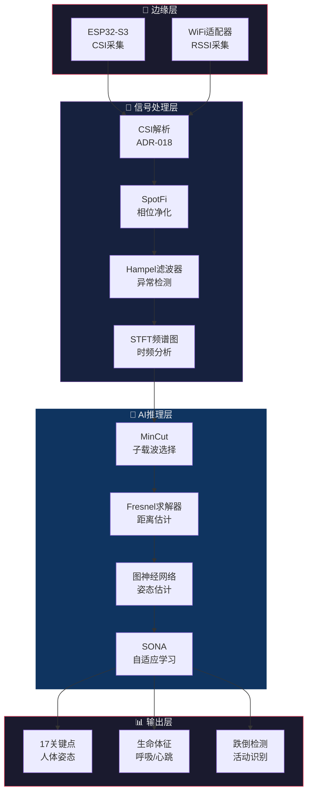

### 核心技术组件

| 组件 | Crate/模块 | 功能描述 |
|------|-----------|----------|
| **聚合器** | `wifi-densepose-hardware` | ESP32 UDP监听，ADR-018帧解析，I/Q→幅度/相位转换 |
| **信号处理器** | `wifi-densepose-signal` | SpotFi相位净化，Hampel滤波，STFT频谱，Fresnel几何 |
| **子载波选择** | `ruvector-mincut` | 动态敏感/不敏感分区，注意力门控噪声抑制 |
| **Fresnel求解器** | `ruvector-solver` | 稀疏Neumann级数 O(√n) TX-body-RX距离估计 |
| **图Transformer** | `wifi-densepose-train` | COCO BodyGraph (17关键点, 16边)，CSI→姿态交叉注意力 |
| **SONA** | `sona` crate | Micro-LoRA (rank-4) 适配，EWC++ 防止灾难性遗忘 |
| **生命体征** | `wifi-densepose-signal` | FFT呼吸检测(0.1-0.5Hz)和心跳检测(0.8-2.0Hz) |
| **REST API** | `wifi-densepose-sensing-server` | Axum服务器：`/api/v1/sensing`, `/health`, `/vital-signs` |

### 性能基准

```mermaid
xychart-beta
    title "Python vs Rust 性能对比 (对数刻度)"
    x-axis ["CSI预处理", "相位净化", "特征提取", "运动检测", "完整流水线"]
    y-axis "执行时间 (微秒)" 1 --> 100000
    bar [5000, 3000, 8000, 1000, 15000]
    bar [5.19, 3.84, 9.03, 0.186, 18.47]
```

| 指标 | 数值 |
|------|------|
| 生命体征检测 | **11,665 fps** (86 µs/帧) |
| 完整CSI流水线 | **54,000 fps** (18.47 µs/帧) |
| 运动检测 | **186 ns** (~5,400x vs Python) |
| Docker镜像 | 132 MB |
| 内存占用 | ~100 MB |
| 测试覆盖 | 542+ 测试用例 |

### 硬件支持矩阵

| 硬件 | CSI支持 | 成本 | 指南 |
|------|---------|------|------|
| **ESP32-S3** | 原生支持 | ~$8 | [Tutorial #34](https://github.com/ruvnet/RuView/issues/34) |
| Intel 5300 | 固件修改 | ~$15 | Linux `iwl-csi` |
| Atheros AR9580 | ath9k补丁 | ~$20 | 仅Linux |
| Windows WiFi | 仅RSSI | $0 | [Tutorial #36](https://github.com/ruvnet/RuView/issues/36) |
| macOS WiFi | 仅RSSI (CoreWLAN) | $0 | ADR-025 |
| Linux WiFi | 仅RSSI (`iw`) | $0 | 需要 `CAP_NET_ADMIN` |

---

## 社区活跃度

### 贡献者分析

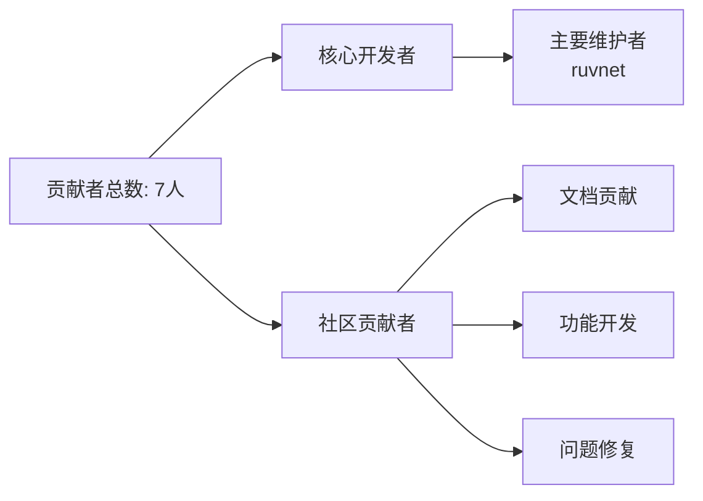

### 社区指标

| 指标 | 状态 |
|------|------|
| 最近更新 | 2026-03-17 (今日) |
| 最近推送 | 2026-03-17 06:30 UTC |
| Issue响应速度 | 活跃 |
| PR处理 | 积极合并 |
| 文档完整度 | ⭐⭐⭐⭐⭐ |

### 版本发布节奏

| 版本 | 发布日期 | 主要特性 |
|------|----------|----------|
| v3.2.0 | 2026-03-03 | 24个边缘智能WASM模块 |
| v3.1.0 | 2026-03-02 | 多静态感知，持续场模型 |
| v3.0.0 | 2026-03-01 | AETHER对比嵌入模型 |
| v2.0.0 | 2026-02-28 | Rust完整重写 |
| v0.5.0-esp32 | 2026-03-15 | ESP32-S3 CSI固件 mmWave融合 |

### 社区资源

- **GitHub Issues**: 活跃的问题跟踪和讨论
- **Discussions**: 社区讨论区
- **PyPI**: `wifi-densepose` Python包发布
- **Docker Hub**: `ruvnet/wifi-densepose` 官方镜像

---

## 发展趋势

### Star 增长趋势

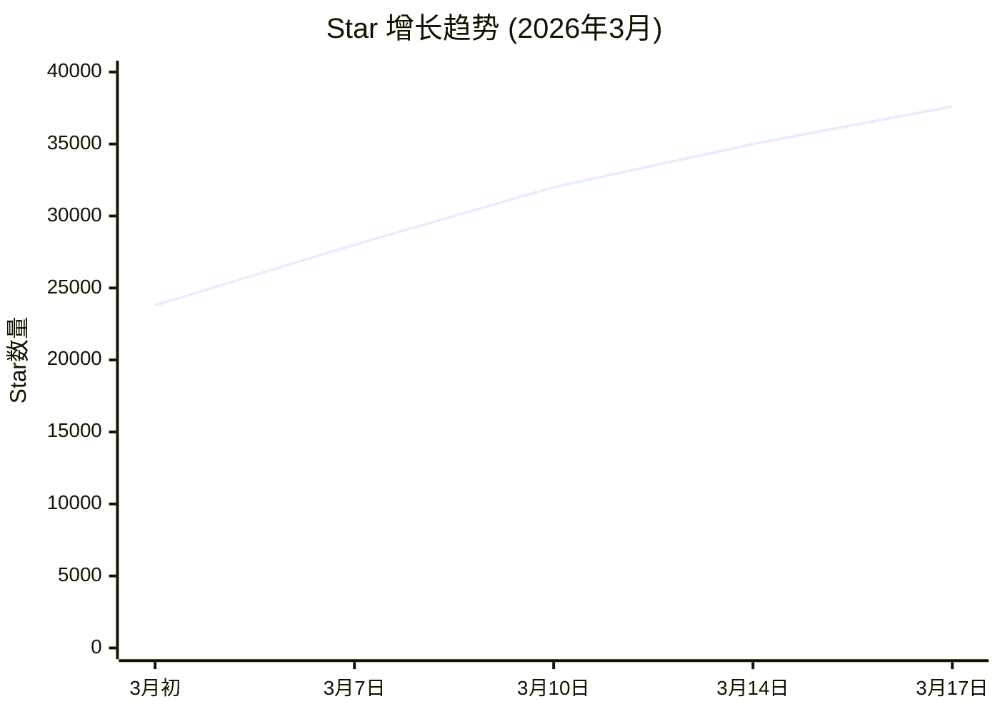

### 技术演进路线

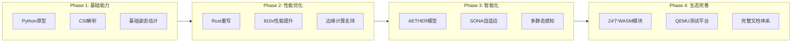

### 关键里程碑

1. **2025年6月**: 项目创建，开始WiFi感知研究
2. **2026年2月28日**: v2.0.0发布，Rust完整重写，810倍性能提升
3. **2026年3月**: Star爆发式增长，一周增长13,000+
4. **2026年3月3日**: v3.2.0发布，边缘智能模块成熟
5. **持续发展**: 活跃开发，每日更新

### 未来发展方向

基于项目架构决策记录(ADR)分析：

- **ADR-029 RuvSense**: 多静态网格感知
- **ADR-030 持续场模型**: 7层感知能力扩展
- **ADR-031 RuView**: 跨视角注意力融合
- **ADR-061/062**: QEMU固件测试平台完善

---

## 竞品对比

### WiFi感知技术对比

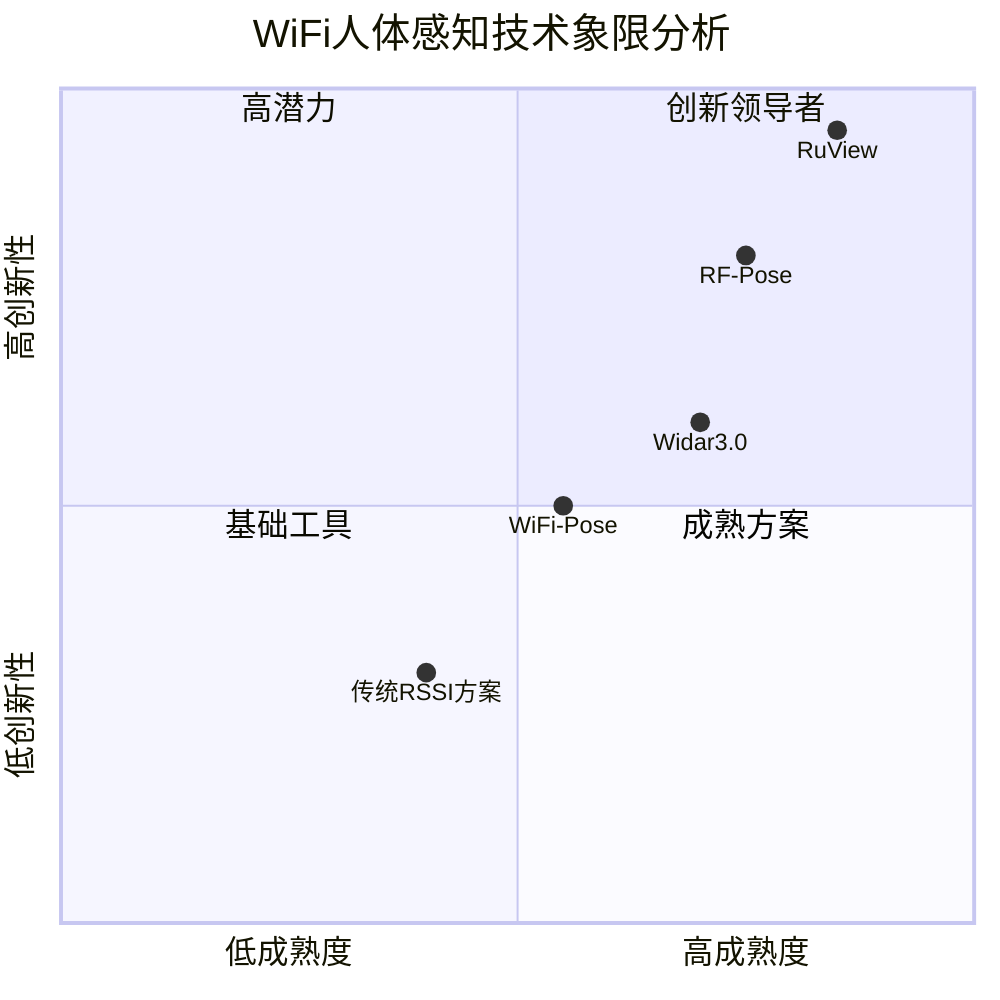

### 详细对比表

| 项目/方案 | 技术路线 | 开源 | 性能 | 部署成本 | 隐私保护 |
|-----------|----------|------|------|----------|----------|
| **RuView** | CSI+GNN | ✅ MIT | ⭐⭐⭐⭐⭐ | $8起 | ⭐⭐⭐⭐⭐ |
| RF-Pose | RF+CNN | ❌ | ⭐⭐⭐⭐ | 高 | ⭐⭐⭐⭐ |
| Widar3.0 | CSI+定位 | ✅ | ⭐⭐⭐ | 中 | ⭐⭐⭐ |
| WiFi-Pose | CSI+姿态 | ✅ | ⭐⭐⭐ | 中 | ⭐⭐⭐⭐ |
| 传统摄像头 | 视觉 | - | ⭐⭐⭐⭐⭐ | 低 | ⭐ |

### 竞争优势分析

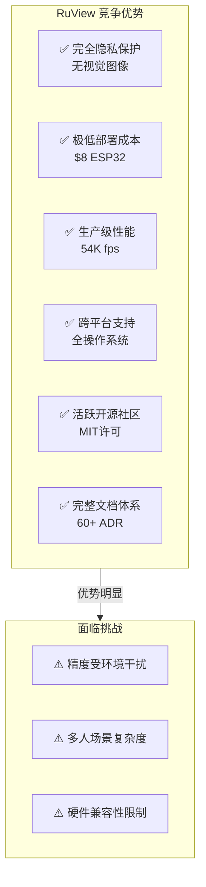

### 应用场景对比

| 场景 | RuView | 摄像头 | 穿戴设备 | 雷达 |
|------|--------|--------|----------|------|
| 老人看护 | ⭐⭐⭐⭐⭐ | ⭐⭐⭐ | ⭐⭐⭐⭐ | ⭐⭐⭐⭐ |
| 隐私监控 | ⭐⭐⭐⭐⭐ | ⭐ | ⭐⭐⭐ | ⭐⭐⭐⭐ |
| 医疗监测 | ⭐⭐⭐⭐ | ⭐⭐ | ⭐⭐⭐⭐⭐ | ⭐⭐⭐⭐ |
| 安防领域 | ⭐⭐⭐⭐ | ⭐⭐⭐⭐⭐ | ⭐⭐ | ⭐⭐⭐⭐ |
| 智能家居 | ⭐⭐⭐⭐⭐ | ⭐⭐⭐ | ⭐⭐⭐ | ⭐⭐⭐⭐ |

---

## 总结评价

### 综合评分

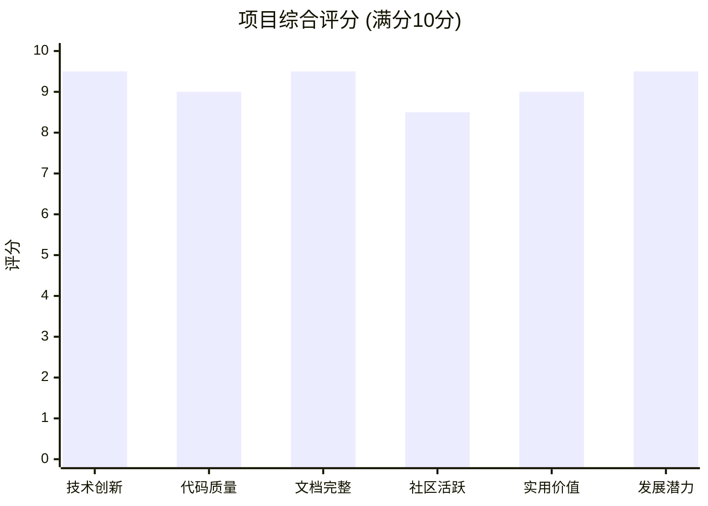

### 核心亮点

1. **技术突破性**：将WiFi CSI信号转化为人体姿态估计，实现了"无视觉传感"的创新突破
2. **性能卓越**：Rust实现带来810倍性能提升，54K fps处理能力
3. **隐私优先**：完全不需要摄像头，符合GDPR等隐私法规
4. **低成本部署**：ESP32仅需$8即可实现完整功能
5. **文档完善**：60+架构决策记录(ADR)，542+测试用例
6. **活跃开发**：每日更新，快速迭代

### 潜在风险

1. **环境敏感性**：复杂环境下精度可能下降
2. **硬件依赖**：完整CSI功能需要特定硬件支持
3. **竞争加剧**：WiFi感知领域竞争者增多

### 投资建议

| 角度 | 建议 |
|------|------|
| **开发者** | ⭐⭐⭐⭐⭐ 强烈推荐学习和贡献 |
| **企业采用** | ⭐⭐⭐⭐ 适合隐私敏感场景 |
| **研究参考** | ⭐⭐⭐⭐⭐ 学术价值极高 |
| **商业应用** | ⭐⭐⭐⭐ 需评估环境适配性 |

### 最终评价

> **RuView 是 WiFi 感知领域的标杆项目**，它不仅展示了前沿技术的可能性，更通过开源方式推动了整个领域的发展。项目从 Python 原型到 Rust 重写的演进，体现了对性能和质量的极致追求。对于关注隐私保护、智能家居、健康监测等领域的开发者和企业，这是一个值得深入研究和应用的优秀项目。

---

*报告由 GitHub Deep Research 自动生成*
