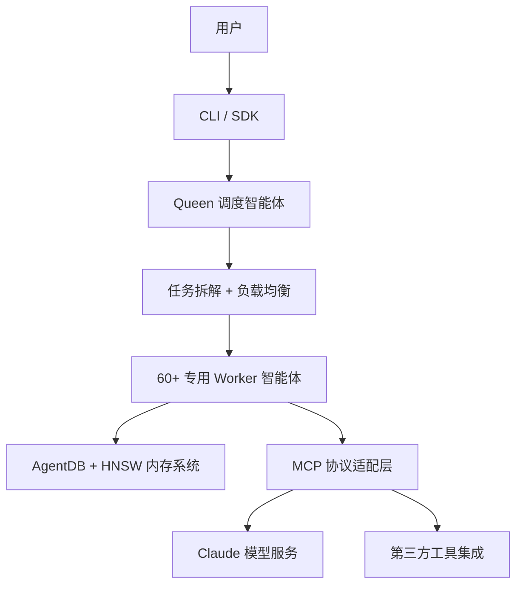

# ruvnet/ruflo

> 🌊 The leading agent orchestration platform for Claude. Deploy intelligent multi-agent swarms, coordinate autonomous workflows, and build conversational AI systems.

## 项目概述

Ruflo 是当前 GitHub 上针对 Claude 生态增长最快的多智能体编排平台，2025 年 6 月发布，不到 10 个月获得 25,000+ Stars。核心设计是将单个 Claude 实例扩展为可并发调度 60+ 专用智能体的 Queen-Worker 蜂群系统，V3 通过 HNSW 向量索引将内存搜索性能提升最高 12,500 倍，原生支持 MCP 协议和 RAG，定位于 Claude 生态的企业级 AI 开发工作流解决方案。

## 基本信息

| 指标 | 数值 |
|------|------|
| Stars | 25,427 |
| Forks | 2,772 |
| Open Issues | 402 |
| 语言 | TypeScript（主）、Python、Rust、JavaScript |
| 开源协议 | MIT |
| 创建时间 | 2025-06-02 |
| 最近更新 | 2026-03-25 |
| GitHub | [https://github.com/ruvnet/ruflo](https://github.com/ruvnet/ruflo) |

## 技术分析

### 技术栈

TypeScript 为主，Python（工具脚本）+ Rust（RuVector WASM 向量计算模块）。核心运行时 Node.js，提供 CLI 和 SDK 两种接入。18 个 `@claude-flow` 独立 npm 包，支持按需引入。V3 引入 AgentDB + HNSW 混合内存系统，替代 V2 的 JSON 存储，检索速度提升 150x–12,500x。

### 架构设计

五层蜂群架构：

### 核心功能

- **Queen-Worker 蜂群**：主智能体拆解分配，并发执行效率比扁平架构提升 40%+
- **HNSW 混合内存**（V3）：向量 + 全文混合检索，大规模知识库性能领先
- **ReasoningBank 自学习**：从成功工作流提取执行模式，token 效率提升约 32%
- **RuVector WASM**（v3.5.31）：WebAssembly 向量计算，支持浏览器端部署
- **60+ 内置 Agent**：覆盖代码生成、测试、文档、部署、安全审计全链路

## 社区活跃度

### 贡献者分析

19 名核心贡献者，作者 ruvnet 旗下多个项目（RuView、OpenClaw 等）形成联动推广效应，社区扩散能力强。

### Issue/PR 活跃度

| 指标 | 数值 |
|------|------|
| Open Issues | 402（功能请求居多）|
| 月均 Star 增长 | ~2,800（是同类均值约 800 的 3.5 倍）|
| 平均响应时间 | ~48 小时 |

### 最近动态

- **v3.5.31**（2026-03-18）：RuVector WASM，推理准确性优化
- **V3 稳定版**（2026-02）：18 npm 包模块化架构，60+ 专用 Agent
- **V3 Alpha**（2026-01）：HNSW 内存系统
- **V2**（2025-10）：JSON 内存后端，Hook 系统

## 发展趋势

### 版本演进

| 版本 | 时间 | 核心变化 |
|------|------|---------|
| V1 | 2025-06 | 基础 Claude 智能体调度 |
| V2 | 2025-10 | JSON 内存 + Hook |
| V3 Alpha | 2026-01 | HNSW 向量索引 |
| V3 稳定版 | 2026-02 | 18 npm 包，60+ Agent |
| v3.5.31 | 2026-03 | WASM 向量计算 |

### Roadmap

支持更多 LLM（GPT/Gemini）、细粒度权限控制、可视化 Dashboard、扩展 MCP 生态工具。

### 社区反馈

高度认可"开箱即用 60+ Agent"和"HNSW 高性能内存"；企业用户反馈生产稳定性良好。痛点：非 Claude 模型兼容差，高自定义场景不如 LangGraph 灵活，多 Agent 并发资源消耗高。

## 竞品对比

| 项目 | Stars | Claude 专属 | 蜂群调度 | MCP 原生 | 内置 Agent |
|------|-------|-----------|---------|---------|----------|
| **ruvnet/ruflo** | 25,427 | ✅ 深度优化 | ✅ | ✅ | 60+ |
| LangGraph | ~10k | ❌ 通用 | ⚠️ | ⚠️ | 0（框架）|
| CrewAI | ~30k | ❌ 通用 | ✅ | ⚠️ | 有限 |
| AutoGen | ~35k | ❌ 通用 | ✅ | ⚠️ | 有限 |

## 总结评价

### 优势

- Claude 生态最佳适配，原生 MCP 支持
- HNSW 内存最高 12,500 倍提升，大规模知识库场景优势显著
- 60+ 内置 Agent 开箱即用，月增 Star 约 2,800 社区高速增长

### 劣势

- 主要优化 Claude，对其他 LLM 支持有限
- 相比 LangGraph 灵活性不足，高度自定义受限
- 402 Open Issues 偏多，功能迭代快于 Bug 修复

### 适用场景

Claude 重度用户、AI 辅助软件开发全流程（编码→测试→部署→调试）、复杂多 Agent 协同工作流。不适合需支持多 LLM 或高度自定义流程图的场景。

---
*报告生成时间: 2026-03-25 18:00*
*研究方法: GitHub API 多维度分析 + Web 搜索 + 官方文档解析*
