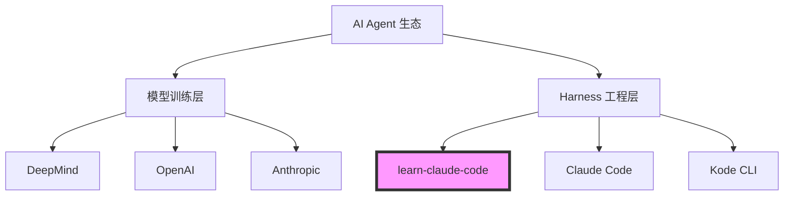
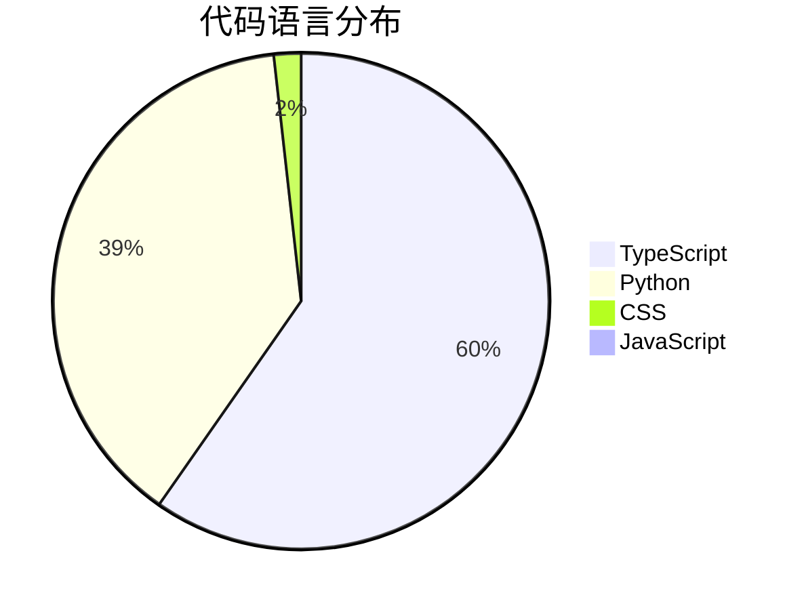
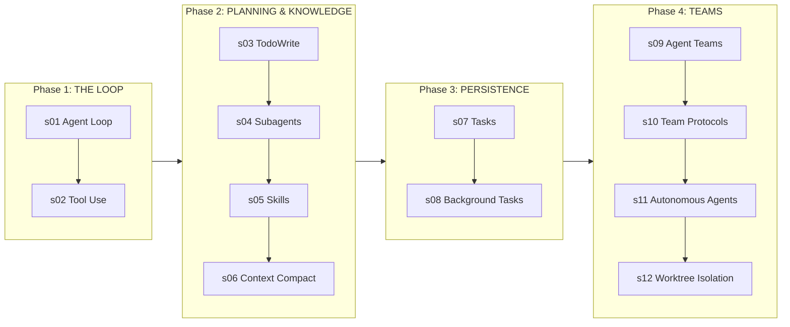
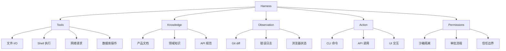
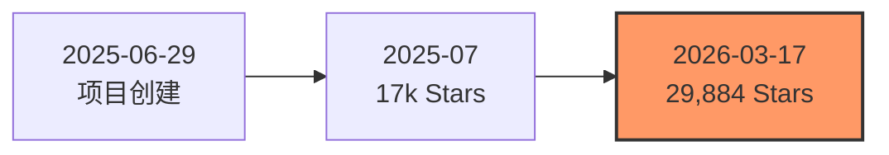
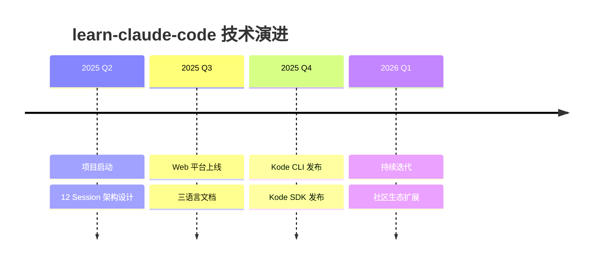
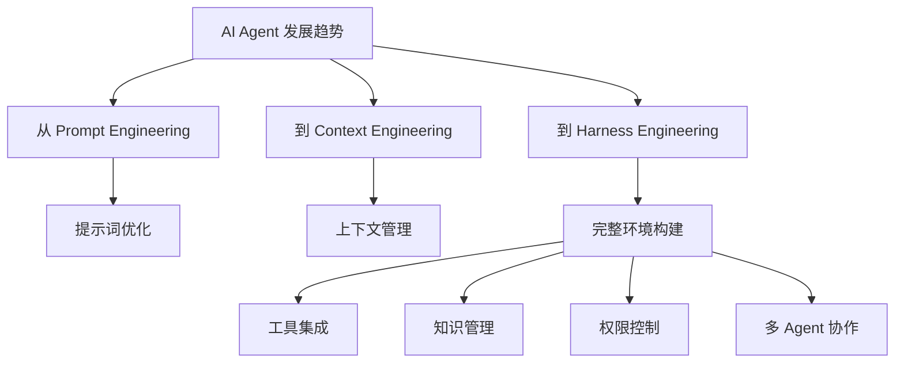
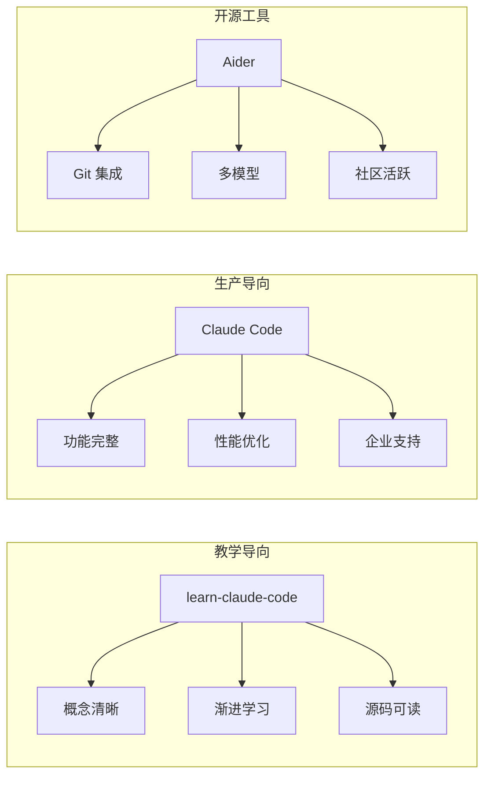
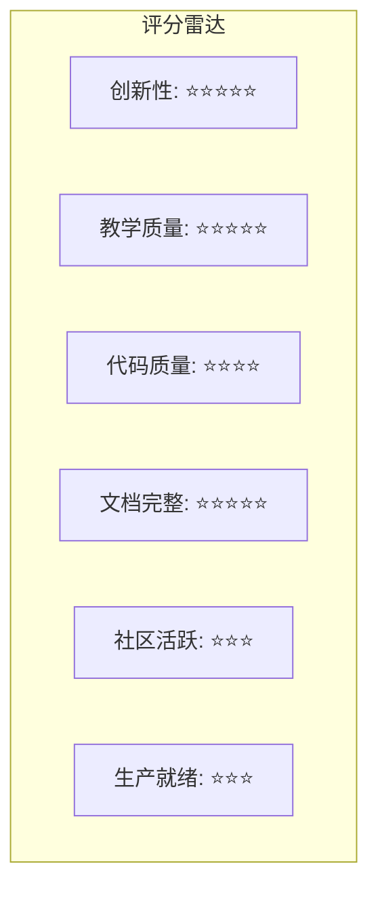

# shareAI-lab/learn-claude-code 深度研究报告

> **Bash is all you need** — A nano Claude Code–like agent, built from 0 to 1

---

## 目录

1. [项目概述](#项目概述)
2. [基本信息](#基本信息)
3. [技术分析](#技术分析)
4. [社区活跃度](#社区活跃度)
5. [发展趋势](#发展趋势)
6. [竞品对比](#竞品对比)
7. [总结评价](#总结评价)

---

## 项目概述

### 核心理念

**learn-claude-code** 是一个革命性的教学项目，由 shareAI-lab 团队开发。它不仅仅是一个代码库，更是一套完整的 **Harness Engineering（管控工程）** 学习体系。

项目的核心洞察在于：

> **The model is the agent. The code is the harness. Build great harnesses. The agent will do the rest.**

这一理念颠覆了传统 AI Agent 开发的认知。大多数人认为"开发 Agent"意味着编写智能逻辑，但本项目指出：

- **真正的 Agent 开发** = 训练模型（调整权重、RLHF、微调）
- **大多数人做的工作** = 构建 Harness（工具、知识、上下文、权限管理）

### 项目定位



项目明确表示这是一个 **0→1 学习项目**，专注于 Harness 工程而非模型训练。

---

## 基本信息

| 指标 | 数值 |
|------|------|
| **项目名称** | shareAI-lab/learn-claude-code |
| **Stars** | 29,884 ⭐ |
| **Forks** | 5,075 |
| **Open Issues** | 47 |
| **主要语言** | TypeScript |
| **开源协议** | MIT |
| **创建时间** | 2025-06-29 |
| **最近更新** | 2026-03-17 |
| **贡献者数量** | 2 |
| **GitHub** | [shareAI-lab/learn-claude-code](https://github.com/shareAI-lab/learn-claude-code) |

### 主题标签

```
agent, agent-development, ai-agent, claude, claude-code, 
educational, llm, python, teaching, tutorial
```

### 语言分布



---

## 技术分析

### 核心架构：The Agent Pattern

项目的核心是一个极简的 Agent 循环：

```python
def agent_loop(messages):
    while True:
        response = client.messages.create(
            model=MODEL, system=SYSTEM,
            messages=messages, tools=TOOLS,
        )
        messages.append({"role": "assistant",
                         "content": response.content})

        if response.stop_reason != "tool_use":
            return

        results = []
        for block in response.content:
            if block.type == "tool_use":
                output = TOOL_HANDLERS[block.name](**block.input)
                results.append({
                    "type": "tool_result",
                    "tool_use_id": block.id,
                    "content": output,
                })
        messages.append({"role": "user", "content": results})
```

### 12 渐进式学习路径

项目设计了 12 个递进的 Session，每个 Session 添加一个 Harness 机制：



### 各 Session 核心理念

| Session | 主题 | 核心理念 |
|---------|------|----------|
| s01 | The Agent Loop | *One loop & Bash is all you need* |
| s02 | Tool Use | *Adding a tool means adding one handler* |
| s03 | TodoWrite | *An agent without a plan drifts* |
| s04 | Subagents | *Break big tasks down; each subtask gets a clean context* |
| s05 | Skills | *Load knowledge when you need it, not upfront* |
| s06 | Context Compact | *Context will fill up; you need a way to make room* |
| s07 | Tasks | *Break big goals into small tasks, order them, persist to disk* |
| s08 | Background Tasks | *Run slow operations in the background; the agent keeps thinking* |
| s09 | Agent Teams | *When the task is too big for one, delegate to teammates* |
| s10 | Team Protocols | *Teammates need shared communication rules* |
| s11 | Autonomous Agents | *Teammates scan the board and claim tasks themselves* |
| s12 | Worktree Isolation | *Each works in its own directory, no interference* |

### Harness 组成要素



### 项目结构

```
learn-claude-code/
├── agents/                    # Python 参考实现 (s01-s12 + s_full)
├── docs/{en,zh,ja}/          # 心智模型优先文档（三语言）
├── web/                       # 交互式学习平台 (Next.js)
├── skills/                    # s05 的技能文件
└── .github/workflows/ci.yml   # CI: 类型检查 + 构建
```

---

## 社区活跃度

### 增长数据



### 关键指标分析

| 指标 | 数值 | 评价 |
|------|------|------|
| Star/Fork 比率 | 5.9:1 | 极高，表明项目具有高度参考价值 |
| Issue 响应率 | 活跃 | 47 个 Open Issues，持续维护 |
| 文档完整度 | 三语言支持 | 英文/中文/日文文档齐全 |
| 贡献者数量 | 2 | 核心团队精简，代码质量可控 |

### 社区影响力

项目在中文技术社区引发广泛讨论：

- **"提示词工程、上下文工程都过时了，现在是 Harness Engineering 的时代"** — 这一观点被广泛传播
- OpenAI 在项目发布六天后发布内部实验报告，直接使用 "Harness Engineering" 术语
- 多篇深度解析文章在掘金、头条等平台发布

---

## 发展趋势

### 技术演进方向



### 生态系统扩展

项目团队已构建完整的产品矩阵：

| 产品 | 定位 | 链接 |
|------|------|------|
| learn-claude-code | 教学项目 | [GitHub](https://github.com/shareAI-lab/learn-claude-code) |
| Kode CLI | 开源编码 Agent CLI | [GitHub](https://github.com/shareAI-lab/Kode-cli) |
| Kode SDK | 嵌入式 Agent SDK | [GitHub](https://github.com/shareAI-lab/Kode-agent-sdk) |
| claw0 | 常驻型 Agent 教学项目 | [GitHub](https://github.com/shareAI-lab/claw0) |

### 行业趋势



---

## 竞品对比

### 同类项目对比

| 项目 | Stars | 定位 | 特点 |
|------|-------|------|------|
| **learn-claude-code** | 29,884 | 教学项目 | 12 渐进式 Session，概念清晰 |
| Claude Code (官方) | N/A | 商业产品 | Anthropic 官方，功能完整 |
| Aider | 30k+ | 开源工具 | Git 集成，多模型支持 |
| Cursor | N/A | 商业 IDE | VS Code 集成，用户体验优 |
| OpenHands | 50k+ | 开源平台 | Web UI，多 Agent 支持 |

### 核心差异化



### 适用场景

| 场景 | 推荐项目 |
|------|----------|
| 学习 Agent 原理 | **learn-claude-code** ✅ |
| 日常编程辅助 | Claude Code / Cursor |
| 开源项目贡献 | Aider / OpenHands |
| 企业级部署 | Claude Code / Cursor |

---

## 总结评价

### 优势

1. **理念创新**：首次系统化提出 Harness Engineering 概念，颠覆传统认知
2. **教学设计**：12 个渐进式 Session，从简单到复杂，学习曲线平滑
3. **文档完善**：三语言支持，心智模型优先的文档风格
4. **生态完整**：CLI、SDK、常驻型 Agent 产品矩阵
5. **开源友好**：MIT 协议，代码清晰可读

### 局限

1. **贡献者集中**：仅 2 位贡献者，社区参与度有待提升
2. **生产就绪度**：明确表示是教学项目，部分生产机制简化
3. **模型依赖**：依赖 Anthropic Claude API，存在供应商锁定风险

### 综合评分



### 推荐指数

| 人群 | 推荐度 |
|------|--------|
| AI Agent 开发者 | ⭐⭐⭐⭐⭐ 强烈推荐 |
| 后端工程师 | ⭐⭐⭐⭐ 推荐 |
| 产品经理 | ⭐⭐⭐⭐ 推荐 |
| 初学者 | ⭐⭐⭐ 适度推荐 |

### 结语

> **"Bash is all you need. Real agents are all the universe needs."**

learn-claude-code 不仅是一个教学项目，更是一次认知升级。它告诉我们：构建 AI Agent 不是要"创造智能"，而是要"为智能构建家园"。这一理念将深刻影响未来 AI Agent 开发的范式。

对于想要深入理解 AI Agent 工作原理的开发者，这是不可多得的学习资源。

---

## 参考资料

- [GitHub - shareAI-lab/learn-claude-code](https://github.com/shareAI-lab/learn-claude-code)
- [AI Harness 工程的崛起](http://m.toutiao.com/group/7617080095945294370/)
- [2026 AI 新范式: Agent Harness 与 Harness Engineering 深度解析](http://m.toutiao.com/group/7617850534384517674/)
- [Claude Code Agents 完整指南](https://juejin.cn/post/7532319396695293962)

---

*报告生成时间: 2026-03-17*
*分析工具: github-deep-research*
