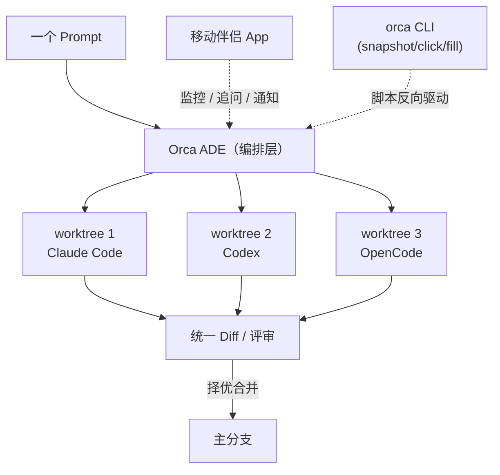

# stablyai/orca 深度研究报告

> Orca is the ADE for working with a fleet of parallel agents. Run any coding agent with your own subscription. Available on desktop and mobile. —— 面向"并行 AI 编码 agent 舰队"的 ADE（Agent Development Environment）。

## 项目概述

stablyai/orca 是 YC 背景的 Stably AI 推出的开源 **ADE（Agent Development Environment，agent 开发环境）**——它把自己定位为相对于传统 IDE 的下一代形态：开发者不再亲手敲代码，而是同时编排"一支并行运行的 AI 编码 agent 舰队"。核心理念是 README 中的那句口号——"The AI Orchestrator for 100x builders"——把 Codex、Claude Code、OpenCode、Pi 等任意 CLI agent 并排运行，每个 agent 跑在自己独立的 git worktree 里，统一在一个界面中追踪、对比与合并。

它的差异化主要有三点：其一，**"自带订阅"模式**——不转售 token，而是直接复用你已登录的 Claude / Codex 等账号，规避了同类工具的 API 计费与转售问题；其二，**桌面 + 移动双端**——配套 iOS/Android 移动伴侣应用，可在手机上监控、收到 agent 完成通知并发追问；其三，**"agent 也能驱动 Orca"**——提供 `orca` CLI（`worktree create`、`snapshot`、`click`、`fill`），让自动化脚本反向操控编辑器本身。

项目以 TypeScript 为绝对主语言（约 4877 万字节，另含 Swift/Kotlin 用于移动端），采用 MIT 协议，于 2026 年 3 月 17 日创建。截至 2026 年 6 月 25 日已获 7117 Stars、514 Forks、662 个开放 Issue，贡献者超过 100 人，最新预发布版本为 v1.4.98-rc.1（2026-06-25）——是一个仅三个月就高速放量、几乎每天发版的活跃商业开源项目。

---

## 基本信息

| 指标 | 数值 |
|------|------|
| Stars | 7117 |
| Forks | 514 |
| 开放 Issues | 662 |
| 语言 | TypeScript（移动端含 Swift / Kotlin） |
| 开源协议 | MIT |
| 创建时间 | 2026-03-17 |
| 最近推送 | 2026-06-25 |
| 默认分支 | main |
| 维护方 | Stably AI（YC-backed） |
| 官网 | [https://onorca.dev](https://onorca.dev) |
| 平台 | macOS / Windows / Linux + iOS / Android |
| 最新版本 | v1.4.98-rc.1（2026-06-25） |
| GitHub | [https://github.com/stablyai/orca](https://github.com/stablyai/orca) |

---

## 技术分析

### 技术栈

- **桌面端**：基于 Electron + TypeScript（约 4877 万字节 TypeScript，772 KB JavaScript），内置 VS Code 风格编辑器与嵌入式 Chromium 浏览器。
- **终端**：自研 "Ghostty-class" 终端，采用 WebGL 渲染，支持无限分屏，scrollback 可在重启后保留。
- **移动端**：iOS 用 Swift（约 206 KB），Android 用 Kotlin（约 22.9 KB），作为桌面端的伴侣应用。
- **隔离机制**：以 **git worktree** 为核心，每个 agent 在独立 worktree 中工作，避免文件冲突与上下文串扰。
- **远程执行**：支持 SSH worktree，可把 agent 跑在远端高配机器上，含自动重连与端口转发。

### 架构与编排模型

Orca 的核心抽象是"**一个 prompt 扇出（fan-out）到多个 agent，每个 agent 一个 worktree，最后择优合并（merge the winner）**"。它对 agent 本身保持中立——README 自述"works with any CLI agent，if it runs in a terminal, it runs in Orca"，列出的支持列表超过 25 种（Claude Code、Codex、Grok、Cursor、Copilot、OpenCode、Amp、Devin、Goose、Cline、Continue、Kimi、MiMo 等）。

### 核心功能

- **Parallel Worktrees**：一个 prompt 扇出到多个 agent，各自隔离，结果横向对比后合并。
- **Design Mode**：在嵌入的 Chromium 窗口中点选任一 UI 元素，把其 HTML/CSS 与裁剪截图直接喂给 agent。
- **GitHub & Linear 原生集成**：在应用内浏览 PR、Issue、项目看板，从任务直接开 worktree。
- **Annotate AI Diffs**：在 diff 行上批注并回传给 agent，评审、编辑、提交不离开 Orca。
- **账号切换与用量追踪**：查看 Claude/Codex 用量与限流重置，热切换账号无需重新登录。

---

## 社区活跃度

### 贡献者分析

项目贡献者**超过 100 人**（API 单页上限即返回满 100）。提交高度集中于核心团队，呈典型的"商业开源 + 自动化发版"形态：

| 贡献者 | Commits（contributions） |
|--------|--------------------------|
| nwparker | 2065 |
| AmethystLiang | 1175 |
| Jinwoo-H | 699 |
| brennanb2025 | 529 |
| github-actions[bot] | 449 |
| buf0-bot[bot] | 90 |
| tmchow | 66 |

头部四位人类贡献者合计约 4468 次提交，构成绝对主力；`github-actions[bot]` 与 `buf0-bot[bot]` 合计约 539 次提交，说明发布与代码生成已高度自动化。`tmchow`（Stably 联合创始人 Tom Chow）亦在贡献者列表中，印证其为公司主导项目。

### Issue/PR 活跃度

截至 2026-06-25，开放 Issue 高达 662 个。结合 7117 Stars 与三个月的项目年龄看，这一数字更多反映**高速迭代下需求与反馈的快速涌入**，而非维护停滞——最近提交几乎全部带 PR 编号（如 #6340、#6339、#6334），编号已逾 6300，说明 PR 吞吐极高。

### 最近动态

最新 10 条提交集中在 2026-06-25 单日，主题包括统一终端主题、修复 diff 标签重选、本地化多语言、AI Vault 会话增强等，并由 bot 自动打出 `v1.4.98-rc.1` 等候选版本——开发节奏为"按日发版"。

---

## 发展趋势

### 版本演进

近期 release 显示出"rc 候选 → 正式版"的高频发布工程，正式版与移动端版本并行推进：

| 版本 | 类型 | 发布日期 |
|------|------|----------|
| v1.4.98-rc.1 | 候选 | 2026-06-25 |
| v1.4.97 | 正式版 | 2026-06-24 |
| v1.4.96-rc.1 | 候选 | 2026-06-24 |
| v1.4.95 | 正式版 | 2026-06-24 |
| mobile-android-v0.0.16 | 移动端 | 2026-06-24 |
| v1.4.94 | 正式版 | 2026-06-23 |

短短数日内连发多个 patch 版本，且桌面端（v1.4.x）与 Android 移动端（mobile-android-v0.0.x）分轨发布，发布流水线成熟。

### 演进方向

从功能墙与 README 自述（"we ship daily, so this list is perpetually behind"）看，重心在于：**多 agent 编排深度**（worktree 扇出、择优合并）、**评审闭环**（Design Mode、Annotate Diff、GitHub/Linear 原生集成）、**跨端与远程**（移动伴侣、SSH worktree）以及**可编程性**（orca CLI、Computer Use）。

### 社区反馈与商业背景

项目 topics 中明确标注 `yc-backed`，配有官网、Discord、X 账号与多语言 README（含中文），并已上架 iOS App Store——这是典型的"商业公司以 MIT 开源核心 + 托管/品牌增值"路线。[推测：盈利点可能在团队版、托管 SSH 或企业支持，README 未明确]

---

## 竞品对比

| 项目 | Stars | 语言 | 协议 | 特点 |
|------|-------|------|------|------|
| [stablyai/orca](https://github.com/stablyai/orca) | 7117 | TypeScript | MIT | 本项目；桌面+移动双端 ADE，agent 中立，自带订阅 |
| [BloopAI/vibe-kanban](https://github.com/BloopAI/vibe-kanban) | 27140 | Rust | Apache-2.0 | 看板式编排多 agent，生态最大，Rust 实现 |
| [winfunc/opcode](https://github.com/winfunc/opcode) | 22104 | TypeScript | AGPL-3.0 | 原 Claudia，Claude Code 桌面 GUI，会话/检查点管理 |
| [stravu/crystal](https://github.com/stravu/crystal) | 3090 | TypeScript | MIT | Electron + worktree 的开源多 agent GUI |
| Conductor（conductor.build） | 闭源 | — | 闭源 | YC 背景的 macOS 原生并行 agent 应用，Claude/Codex/Cursor |

**定位差异**：vibe-kanban 以看板隐喻和 Rust 性能见长、生态最大；opcode（原 Claudia）聚焦 Claude Code 单一生态的桌面管理；crystal 是轻量开源 GUI；Conductor 是闭源 macOS 原生应用。Orca 的差异化在于**同时押注"全 agent 中立 + 桌面/移动双端 + 自带订阅 + 可编程 CLI"四点**，把工具定位从"Claude Code 的壳"上抬到"通用 ADE"，这是其在三个月内冲到 7117 Star 的核心叙事。

---

## 总结评价

### 优势

1. **agent 中立 + 编排能力强**：支持 25+ CLI agent，worktree 扇出/择优合并的编排模型完整，不锁定单一供应商。
2. **桌面 + 移动双端**：移动伴侣应用是同类中少见的能力，契合"异步编排、随时介入"的工作流。
3. **自带订阅、无转售**：复用用户已有 Claude/Codex 账号，规避计费与合规风险。
4. **迭代极快**：几乎每日发版、PR 编号逾 6300，功能演进迅猛。

### 劣势

1. **开放 Issue 高达 662**：高速迭代伴随大量未决反馈，稳定性与回归风险需关注。
2. **巴士因子集中**：提交高度集中于 4 名核心贡献者，社区贡献占比相对有限。
3. **商业开源的可持续性存疑**：MIT 核心 + YC 资本驱动，长期商业化路径（如付费墙、托管收费）尚不明朗。[推测]
4. **Electron 资源占用**：内置 Chromium + 多 worktree + 多 agent，对内存/磁盘要求较高。

### 适用场景

- **重度 AI 编码者 / "100x builder"**：需要同时跑多个 agent、横向对比产出并快速合并的开发者。
- **多 agent 工作流研究**：研究 worktree 隔离、agent 编排与评审闭环的优秀参考实现。
- **不适合**：只用单一 agent、追求极简零依赖终端工具的用户（CCManager/Claude Squad 更轻量）。

---

*报告生成时间: 2026-06-25*
*研究方法: github-deep-research 多轮深度研究*
