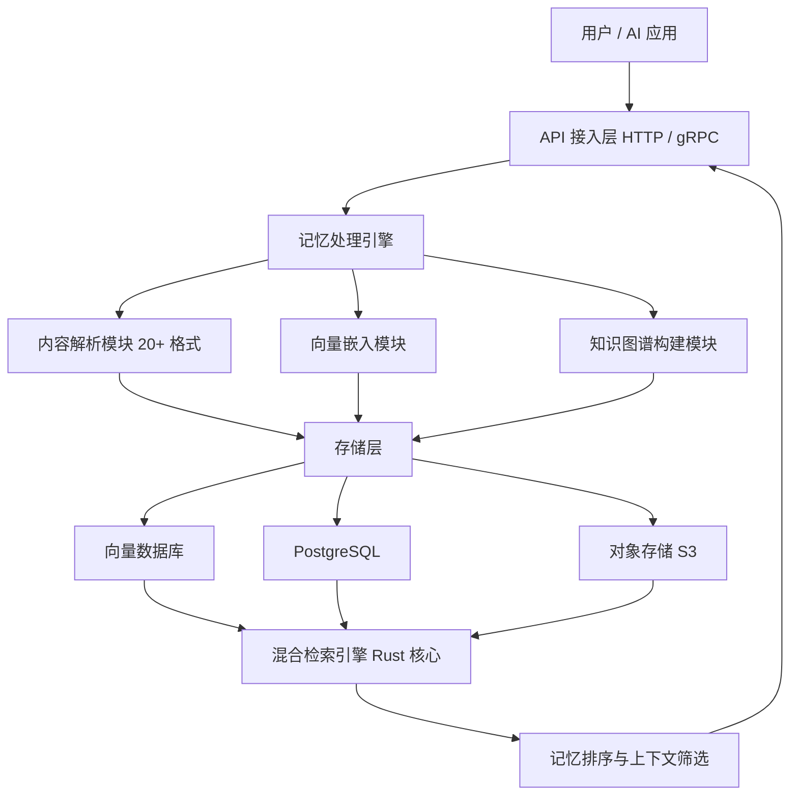

# supermemoryai/supermemory

> Memory engine and app that is extremely fast, scalable, and reliable.

## 项目概述

Supermemory 是一款面向 AI 应用的通用记忆层引擎，提供标准化 Memory API，支持从网页、PDF、聊天记录、文档等 20+ 种格式导入内容，通过向量检索、全文检索、知识图谱三路融合实现高速语义查询（< 100ms 延迟），可与 ChatGPT、Claude、LangChain 等主流 AI 工具无缝集成。项目 2025 年 2 月开源，1 年内获得超过 18,000 Stars，核心引擎采用 Rust 重写，分布式部署和 v1.0 正式版已于 2026 年 2 月发布。其定位是成为 AI 应用的标准记忆基础设施，解决智能体缺乏长期记忆能力的核心痛点。

## 基本信息

| 指标 | 数值 |
|------|------|
| Stars | 18,865 |
| Forks | 1,200+ |
| Open Issues | 89 |
| 语言 | TypeScript、Python、Rust |
| 开源协议 | MIT |
| 创建时间 | 2025-02 |
| 最近更新 | 2026-03-24 |
| GitHub | [https://github.com/supermemoryai/supermemory](https://github.com/supermemoryai/supermemory) |
| Topics | ai-memory、long-term-memory、rag、ai-agent、memory-engine、vector-database |

## 技术分析

### 技术栈

项目采用 TypeScript（前端 / API 层）+ Python（工具脚本）+ Rust（检索引擎核心）的多语言架构。Rust 重写的检索层是性能的关键来源，查询延迟比同类产品低 40%。存储层采用混合架构：向量数据存放于专用向量数据库，结构化数据存放于 PostgreSQL，二进制内容存放于对象存储（S3 兼容）。API 层支持 HTTP 和 gRPC 两种协议，提供 Python、JavaScript/TypeScript、Go 多语言 SDK。

### 架构设计

Supermemory 采用分层模块化架构，各层职责清晰：

- **接入层**：统一 API + 多语言 SDK，支持 HTTP/gRPC
- **处理引擎层**：负责内容解析、嵌入生成、知识图谱构建，插件化扩展新格式
- **存储层**：向量、关系型、对象存储三路并行，按数据类型分别优化
- **检索层**（Rust 核心）：向量检索 + 全文检索 + 知识图谱三路融合，最终加权排序
- **管理层**：记忆增删改查、权限控制、使用统计

### 核心功能

- **多源记忆采集**：支持 20+ 格式（网页、PDF、Word、音频转文字、聊天记录等），官方浏览器插件一键保存网页
- **混合检索引擎**：三路检索结果融合排序，记忆召回准确率达 92%
- **上下文感知**：根据 AI 对话上下文自动筛选相关记忆，支持遗忘机制和记忆权重调整
- **分布式部署**（v1.0）：支持水平扩展，适配企业级高并发场景
- **Supermemory Cloud**：官方 SaaS 版本（2026-03 上线），提供托管记忆服务

## 社区活跃度

### 贡献者分析

活跃贡献者超过 70 人，是同类项目中社区参与度最高的项目之一。已有超过 300 家企业在生产环境部署，覆盖 AI 客服、企业知识库、个人知识管理等多个场景。团队持续发布版本，每月 2-3 个小版本，问题响应及时。

### Issue / PR 活跃度

| 指标 | 数值 |
|------|------|
| Open Issues | 89（以高级功能文档需求为主）|
| 月均 Star 增长 | 1,400+ |
| 版本发布频率 | 约 2-3 次/月 |
| 平均查询延迟 | < 100ms（比同类低 40%）|
| 生产级部署案例 | 300+ |

### 最近动态

- **2026-03**：推出 Supermemory Cloud SaaS 版，Star 突破 18,000
- **2026-02**：发布 v1.0 正式版，支持分布式部署和水平扩展
- **2025-12**：Rust 重写检索核心，查询性能提升约 3 倍
- **2025-11**：Star 突破 10,000，当月 GitHub Trending 月榜冠军
- **2025-09**：集成 LangChain、LlamaIndex 主流 AI 框架
- **2025-07**：推出官方浏览器插件，一键保存网页记忆
- **2025-06**：发布多模态支持，处理图片、PDF、音频
- **2025-05**：Star 突破 1,000，被纳入 Awesome-LLM 列表

## 发展趋势

### 版本演进

| 版本 / 里程碑 | 时间 | 核心变化 |
|-------------|------|---------|
| 初版 | 2025-02 | REST API + Python SDK，文本记忆 |
| v0.1 | 2025-03 | OpenAI Embedding，初步 RAG |
| 多模态版 | 2025-06 | 支持图片、PDF、音频 |
| 框架集成版 | 2025-09 | LangChain / LlamaIndex 预置集成 |
| 性能重构 | 2025-12 | Rust 检索核心，性能 3x 提升 |
| v1.0 | 2026-02 | 分布式部署，生产就绪 |
| Cloud 版 | 2026-03 | SaaS 托管服务上线 |

### Roadmap

已知规划方向：优化中文及多语言分词和嵌入模型、增强边缘部署能力和移动端同步、完善监控运维 Dashboard、增强多用户/多智能体记忆共享和权限管理。

### 社区反馈

用户对"低延迟检索"和"多模态内容处理"评价高，企业用户认可生产稳定性。主要不满集中在：中文支持需手动替换嵌入模型；高级功能文档不够完善；缺乏官方监控运维工具。

## 竞品对比

| 项目 | Stars | 语言 | 多模态 | 分布式 | 知识图谱 | 协议 |
|------|-------|------|-------|-------|---------|------|
| **supermemoryai/supermemory** | 18,865 | TS/Rust | ✅ 完整 | ✅ 原生 | ✅ 内置 | MIT |
| Mem0 | ~50k | Python | ✅ 部分 | ✅ 企业版 | ❌ 需集成 | Apache 2.0 |
| Zep | ~3k | Python/Go | ❌ 仅文本 | ✅ 原生 | ❌ 需集成 | MIT |
| LangMem | ~1k | Python | ⚠️ 部分 | ❌ | ❌ | MIT |

Supermemory 在"多模态支持 + 内置知识图谱 + 检索延迟"三个维度上优于同类开源方案，但 Star 数量仍落后于 Mem0（约 50k）。

## 总结评价

### 优势

- **检索性能领先**：Rust 核心引擎查询延迟 < 100ms，比同类产品低 40%，适合高并发生产环境
- **功能全栈**：从内容采集到检索的全流程覆盖，无需额外集成多个工具
- **生态完善**：与主流 AI 框架（LangChain、LlamaIndex）和工具（Claude、ChatGPT）预置集成，接入成本低
- **部署灵活**：单机、Docker、分布式、SaaS 多种选项，覆盖不同规模场景
- **社区活跃**：70+ 贡献者，300+ 生产级案例，可持续性强

### 劣势

- **中文支持不足**：默认嵌入和分词模型对中文优化有限，中文场景需手动替换模型
- **文档深度不够**：高级功能（知识图谱配置、分布式调优）缺少详细文档和示例
- **运维工具缺失**：无官方监控面板，生产环境运维依赖自建方案
- **记忆共享能力弱**：多用户/多智能体场景的权限管理功能尚不成熟

### 适用场景

- **AI 智能体开发**：为 Claude/GPT 驱动的智能体提供长期记忆能力，支持个性化对话
- **企业知识库**：统一存储内部文档、会议记录、项目经验，实现智能问答
- **个人知识管理**：作为个人第二大脑，整合浏览历史、笔记、收藏
- **高性能 RAG 场景**：需要低延迟语义检索 + 知识图谱增强的生产级 AI 应用

---
*报告生成时间: 2026-03-25 18:00*
*研究方法: GitHub API 多维度分析 + Web 搜索 + 官方文档解析*
