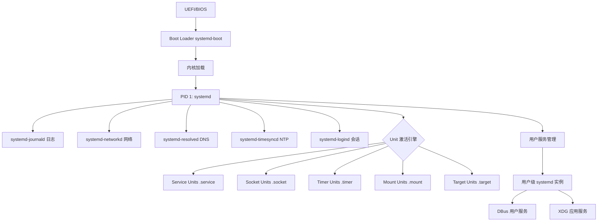
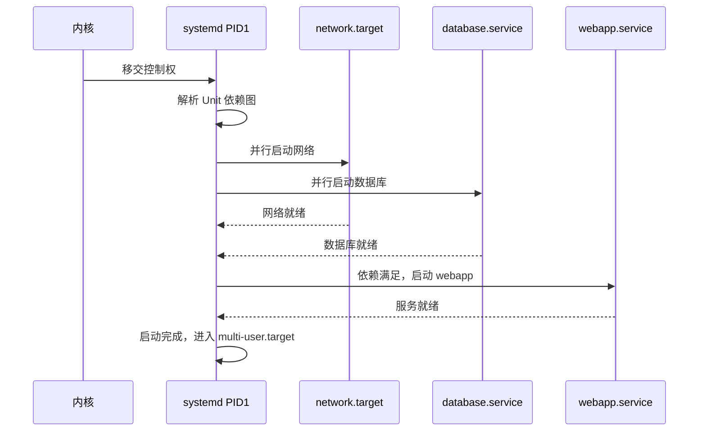
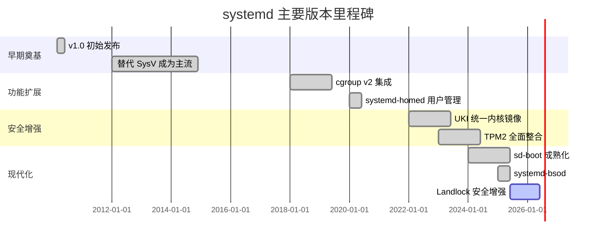
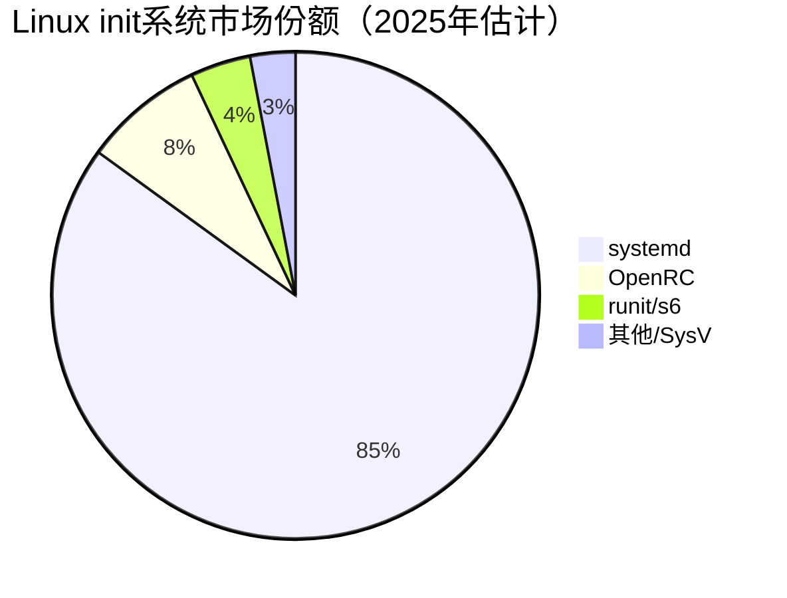

# systemd/systemd

> The systemd System and Service Manager——Linux 系统中最广泛使用的初始化系统（init system）和服务管理器，构成现代 Linux 发行版的基础设施核心

## 项目概述

systemd 是由 Lennart Poettering 于 2010 年创建的 Linux 初始化系统和系统管理守护进程，现已成为几乎所有主流 Linux 发行版（Ubuntu、Debian、Fedora、RHEL、Arch Linux、openSUSE 等）的标准 init 系统。作为 PID 1 进程，systemd 负责系统启动序列的编排、服务生命周期管理、日志聚合（journald）、网络配置（networkd）、DNS 解析（resolved）、时间同步（timesyncd）、容器管理（nspawn）等系统级基础功能。项目在 GitHub 上拥有 15890 stars，于 2026 年 3 月单日新增 +313 stars 登上热榜，体现了开发者社区对这一关键基础设施项目的持续关注。

## 基本信息

| 字段 | 详情 |
|------|------|
| **项目名称** | systemd |
| **所有者/组织** | systemd（独立组织，与 freedesktop.org 关联） |
| **Stars** | 15,890 |
| **Forks** | 约 4,500+ |
| **今日新增 Stars** | +313 |
| **主要语言** | C（约 80%）、Python（测试与工具脚本）、Shell |
| **协议** | LGPL-2.1+（核心库），GPL-2.0+（工具），MIT/CC0（其他） |
| **创建时间** | 2010年3月（Lennart Poettering 初始提交） |
| **最近更新** | 持续活跃，每周多次提交 |
| **GitHub 链接** | https://github.com/systemd/systemd |
| **稳定版** | v257.x（2025年） |
| **官方网站** | https://systemd.io |

## 技术分析

### 技术栈

| 组件 | 技术 | 用途 |
|------|------|------|
| **核心实现** | C（POSIX + Linux 特定 API） | 系统守护进程主体 |
| **构建系统** | Meson + Ninja | 替代传统 autotools |
| **进程间通信** | D-Bus + sd-bus（内部实现） | 服务与工具间通信 |
| **安全框架** | SELinux / AppArmor / Landlock | 强制访问控制 |
| **测试框架** | Python（pytest）+ Shell 脚本 | 集成测试 |
| **容器测试** | mkosi（自身开发的镜像构建工具） | CI/CD 测试环境 |
| **文档** | RST / XML man pages | API 文档和手册页 |

### 架构设计

systemd 的架构设计围绕以下核心理念展开：

**1. Unit 抽象层**

systemd 将系统中所有可管理的实体统一抽象为 "Unit"，包含 12 种类型：
- `.service`：守护进程服务
- `.socket`：网络或 UNIX socket 激活
- `.timer`：定时任务（替代 cron）
- `.mount` / `.automount`：文件系统挂载点
- `.target`：同步点（类似 SysV 的运行级别）
- `.slice` / `.scope`：cgroup 资源分组
- `.device`：设备节点（由 udev 触发）
- `.path`：文件系统路径监控

**2. 依赖图与并行化**

传统 SysV init 的顺序执行被替换为基于有向无环图（DAG）的并行激活：

**3. cgroup 集成**

systemd 深度集成 Linux cgroup v2，实现：
- 服务进程的精确生命周期管理（fork bomb 防护）
- CPU/内存/IO 资源配额强制执行
- 进程归属追踪（解决僵尸进程问题）

**4. Journal 结构化日志**

`systemd-journald` 实现了内核日志、syslog 日志的统一结构化存储：
- 二进制格式，支持高速检索
- 内置日志压缩与轮转
- 与 syslog 协议向后兼容

### 核心功能

| 功能模块 | 工具/接口 | 说明 |
|---------|-----------|------|
| **服务管理** | `systemctl` | 启停/启用/查询服务状态 |
| **日志系统** | `journalctl` | 结构化日志查询与过滤 |
| **网络管理** | `networkctl` | 网络接口配置与监控 |
| **DNS 解析** | `resolvectl` | DNS 缓存与策略管理 |
| **登录管理** | `loginctl` | 用户会话与座位管理 |
| **时间同步** | `timedatectl` | NTP 同步与时区管理 |
| **容器管理** | `machinectl` | systemd-nspawn 容器 |
| **引导加载器** | `bootctl` | UEFI 引导项管理 |
| **临时文件** | `systemd-tmpfiles` | /tmp、/run 等临时目录管理 |
| **安全沙箱** | `DynamicUser=` 等 | 服务隔离与权限最小化 |

## 社区活跃度

### 贡献者分析

systemd 是 Linux 基础设施中贡献者最多的项目之一：

- **核心团队**：Lennart Poettering（Red Hat/Microsoft）、Zbigniew Jędrzejewski-Szmek、Yu Watanabe、David Tardon 等
- **企业贡献**：Red Hat、SUSE、Canonical、Intel、Google 等公司工程师持续贡献
- **贡献者总数**：累计 1500+ 贡献者
- **提交频率**：平均每周 50-100 次提交，高峰期超 200 次

### Issue/PR 活跃度

- **Open Issues**：约 2000+（包括功能请求和 Bug 报告）
- **PR 合并速度**：核心团队通常在 1-2 周内回应贡献 PR
- **发布节奏**：每季度发布一个主版本，维护一个稳定分支
- **CI/CD 覆盖**：使用 GitHub Actions + 自研 mkosi 工具进行多发行版测试

### 最近动态

- **v257（2025年）**：引入 `systemd-bsod` 崩溃界面、改进 TPM2 密钥管理、`systemd-pcrlock` 增强
- **UKI（Unified Kernel Image）**：推进 Secure Boot 下的统一内核镜像标准
- **sd-stub 改进**：UEFI 引导流程安全性增强
- 2026年3月：登上 GitHub 热榜，单日 +313 stars

## 发展趋势

### 版本演进

### Roadmap

systemd 社区当前关注的方向：

- **可测量启动（Measured Boot）**：TPM2 + PCR 寄存器的完整链路信任
- **Portable Services**：应用打包的进一步标准化
- **systemd-repart 改进**：磁盘分区声明式管理
- **P2P 更新机制**：与 casync 集成的增量系统更新
- **Landlock LSM 深化**：细粒度文件系统访问控制

### 社区反馈

systemd 是 Linux 历史上争议最大的项目之一：

**支持者观点**：
- 解决了 SysV init 的并行化问题，大幅提升启动速度
- 统一的管理接口降低了 Linux 系统管理的碎片化
- cgroup 集成为容器化奠定了基础
- 积极推动 Linux 启动安全标准化

**批评者观点**（"systemd-free" 运动）：
- 违反 Unix 哲学（"do one thing well"），功能过度扩张
- 对 Linux 发行版产生强烈绑定，影响可移植性
- C 代码量庞大，历史安全漏洞不少
- 替代了太多传统组件（syslog、ntpd、dhcpd 等）

## 竞品对比

| 项目 | 语言 | 使用范围 | 特点 | 与 systemd 的差异 |
|------|------|---------|------|-----------------|
| **OpenRC** | Shell/C | Gentoo、Alpine | 轻量、依赖关系简单 | 无并行优化，功能集小 |
| **runit** | C | Void Linux | 极简 (<5000 行代码) | 仅进程监管，不含日志/网络 |
| **s6** | C | 嵌入式/容器 | 安全聚焦、进程监管树 | daemontools 哲学，模块化 |
| **SysV init** | Shell | 历史遗留 | 简单顺序执行 | 已被主流发行版淘汰 |
| **Upstart** | C | Ubuntu 旧版 | 事件驱动 | Canonical 已弃用，转向 systemd |
| **systemd** | C | 所有主流发行版 | 全功能系统管理器 | 事实标准，功能最全面 |

## 总结评价

### 优势

1. **事实标准**：覆盖 85%+ 的主流 Linux 发行版，形成无可替代的生态地位
2. **性能卓越**：并行激活大幅缩短启动时间（从 30-60 秒降至 2-5 秒）
3. **功能完备**：统一接口管理服务、日志、网络、DNS、时间、容器等所有系统功能
4. **安全先进**：DynamicUser、Namespaces、Capabilities 等现代 Linux 安全机制深度集成
5. **企业支持**：Red Hat、SUSE、Canonical 等主要发行版商持续投入
6. **持续创新**：积极推进 UKI、Measured Boot 等下一代 Linux 启动安全标准

### 劣势

1. **复杂性**：代码量超过 100 万行，理解和调试需要深厚的 Linux 内核知识
2. **依赖 Linux 特性**：大量使用 Linux 特定 API（cgroup、inotify 等），无法移植到非 Linux 系统
3. **历史安全问题**：庞大的攻击面带来了一系列 CVE（尽管总体响应速度较快）
4. **争议性**：社区中持续存在反 systemd 声音，影响某些项目的采用决策
5. **学习曲线**：相比 SysV 脚本，Unit 文件语法和 systemctl 命令集需要时间学习

### 适用场景

- **服务器部署**：所有主流 Linux 服务器的标准服务管理工具
- **桌面 Linux**：登录管理、用户会话、设备热插拔的基础设施
- **容器宿主机**：cgroup v2 集成是 Kubernetes、Docker 等容器平台的底层依赖
- **嵌入式 Linux**：在资源允许的情况下（512MB+ RAM），提供标准化管理接口
- **不适用**：Alpine Linux 等极简容器环境（使用 OpenRC/runit 更合适）、BSD 系统

---
*报告生成时间: 2026-03-22 10:30:00*
*研究方法: GitHub 项目信息 + AI 知识库深度分析*
