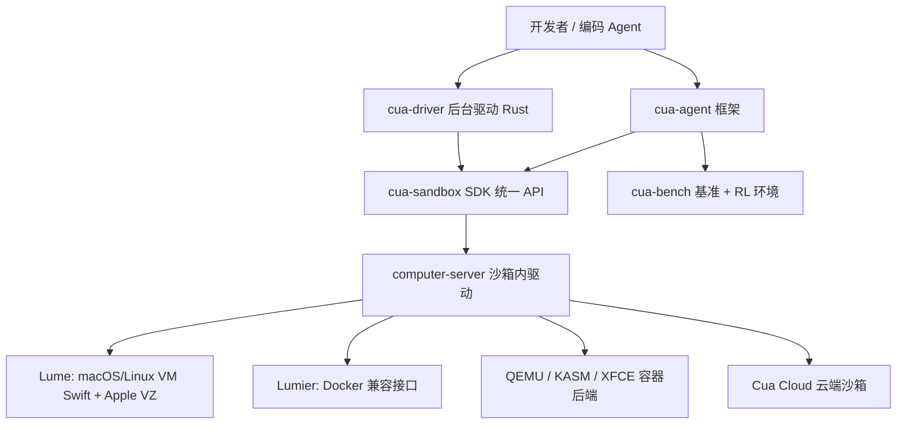
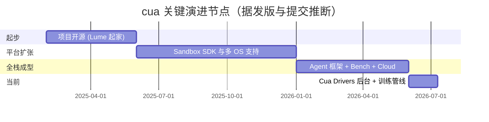

# trycua/cua 深度研究报告

> **一句话定位**：Computer-Use Agent（CUA）的开源基础设施层——「给 AI Agent 一台完整电脑」。用统一 API 在 macOS / Linux / Windows / Android 上创建可被 Agent 操控的沙箱，并配套 Agent 框架、基准测试与本地虚拟化引擎。
> **研究方法**: github-deep-research 多轮深度研究（GitHub API 精确数据 + 源码阅读 + 竞品实测 + 量化信号）

---

## 项目概述

**cua**（读作 "koo-ah"，Computer-Use Agent 缩写）是由 YC X25 批次创业公司 TryCua 开源的**「计算机使用型智能体」基础设施**。它要解决的核心问题是：当我们想让 AI Agent 像人一样"用电脑"——看屏幕、点按钮、敲键盘、跑命令——时，缺一个安全、可复现、跨操作系统的底层执行环境。cua 把这层抽象成 `pip install cua` 一行接入的 Sandbox SDK，并向上延展出完整的 Agent 框架、基准测试平台和本地 VM 引擎。[README]

社区常用一句话概括它：**"Docker for computer-use agents"**（计算机使用型 Agent 的 Docker）——这也是 Y Combinator 官方对它的评语。[Web] 与只能操控浏览器的方案不同，cua 的野心是**整台桌面**：无论 Linux 容器、Linux/macOS/Windows 虚拟机，还是 Android，都用同一套 API 驱动。[README]

项目由创始人 Francesco（GitHub `f-trycua`）于 2025 年 1 月发起，一年多时间收获逾 1.9 万 stars，官方称已有超过 5 万名工程师在使用。[API][Web] 它是一个高度活跃的 **monorepo**，同时容纳 Python、TypeScript、Rust、Swift 四条技术栈，覆盖从底层虚拟化到上层 Agent loop 的完整链路。

**四条主线产品**（README "Choose Your Path"）：[README]

| 你想做什么 | 用哪个组件 |
|-----------|-----------|
| 自己造一个能操控电脑的 Agent | **Cua / Cua Sandbox**（`pip install cua`） |
| 给现有编码 Agent（Claude Code / Cursor / Codex）配一台"后台电脑" | **Cua Drivers**（后台 computer-use，不抢鼠标焦点） |
| 评测 / 训练 computer-use 模型 | **Cua-Bench**（OSWorld、ScreenSpot、Windows Arena + RL 环境） |
| 只需要 Apple Silicon 上的 macOS 虚拟机 | **Lume**（基于 Apple Virtualization.Framework） |

---

## 基本信息

| 项目 | 数值 |
|------|------|
| 仓库 | [trycua/cua](https://github.com/trycua/cua) |
| Stars | 19,511 [API] |
| Forks | 1,283 [API] |
| Open Issues | 469 [API] |
| 主语言构成 | HTML、Python、Rust、Swift、TypeScript（多语言 monorepo）[API] |
| 许可证 | MIT [API] |
| 创建时间 | 2025-01-31 [API] |
| 最近推送 | 2026-07-10（研究当日仍在提交）[API] |
| 贡献者数 | 74 [API] |
| 最新发版 | lume-v0.3.11（2026-07-08）[API] |
| 官网 / 文档 | https://cua.ai · https://cua.ai/docs |
| 背景 | Y Combinator X25（Winter 2025）批次 [Web] |

**语言字节占比**（`languages` API）：HTML 约 1,930 万字节居首（主要来自 docs 站点与前端资源），Python 约 635 万、Rust 约 396 万、Swift 约 105 万、TypeScript 约 86 万。[API] 这个分布本身就揭示了项目性质——**它不是单一语言库，而是一个横跨系统层（Rust/Swift）与应用层（Python/TS）的基础设施集合**。

**核心开发者**（按 contributions，`contributors` API）：[API]

| 排名 | 贡献者 | 提交数 | 说明 |
|------|--------|--------|------|
| 1 | f-trycua | 1,002 | 创始人 Francesco |
| 2 | ddupont808 | 814 | 核心工程师 |
| 3 | github-actions[bot] | 419 | 自动化机器人（发版/格式化） |
| 4 | jamesmurdza | 266 | — |
| 5 | sarinali | 177 | — |
| 6 | mdean808 | 145 | — |

除去机器人，实质由创始人 + 数名核心工程师主导，呈现典型的**创业公司驱动型开源**结构：头部两人贡献占比极高，长尾贡献者补充生态。

---

## 技术分析

cua 的工程结构是一个组织严密的 **monorepo**，顶层按语言/组件切分：`libs/python`（14 个包）、`libs/typescript`（镜像的 TS SDK）、`libs/lume`（Swift）、`libs/cua-driver`（Rust）、`libs/kasm`/`lumier`/`qemu-docker`/`xfce`（容器与虚拟化后端）。[代码] `.github/workflows` 下有近百个 CI/CD 工作流，每个子包独立发版（`cd-py-agent`、`cd-swift-lume`、`cd-rust-cua-driver` 等），说明它按**多包独立版本**的方式治理。[代码]

### 分层架构

### 关键发现一：模型无关的插件化 Agent Loop

`cua-agent` 的核心抽象是 `AsyncAgentConfig` 协议（`loops/base.py`），它只规定两个方法：[代码]

- `predict_step(...)` —— 基于 Responses 格式的消息（`message` / `function_call` / `computer_call`）预测下一步动作；
- `predict_click(model, image_b64, instruction)` —— **grounding**：给一张截图和一句指令，返回点击坐标 `(x, y)`。

在 `loops/` 目录下，cua 为约 20 种模型各实现了一套 loop：`anthropic.py`、`openai.py`、`gemini.py`、`qwen3vl.py`、`uitars.py` / `uitars2.py`、`glm45v.py`、`opencua.py`、`internvl.py`、`moondream3.py`、`holo.py`、`gta1.py` 等，外加 `composed_grounded.py`（把"规划模型 + grounding 模型"组合起来）。[代码] 这意味着 **cua 不绑定任何单一 VLM**——OpenAI Operator、Anthropic Computer Use、阿里 Qwen-VL、字节系 UI-TARS、智谱 GLM-4.5V 都能作为后端，甚至支持本地推理（MLX / HuggingFace transformers）。[代码]

底层模型调用统一走 **LiteLLM**（`litellm==1.86.2` 锁定版本）做多 provider 抽象，`agent.py` 顶部即 `import litellm`。[代码] 依赖清单中 `cua-computer` 为可选依赖，`qwen` / `omni`（SoM 视觉标注）/ `uitars-mlx` / `uitars-hf` / `glm45v-hf` / `opencua-hf` 等以 optional-dependencies 分组按需安装，避免一次性拖入 torch 等重依赖。[代码]

### 关键发现二：callbacks 管线做横切关注点

`agent.py` 导入了一整套 callbacks：`BudgetManagerCallback`（预算控制）、`ImageRetentionCallback`（截图保留策略）、`LoggingCallback`、`OperatorNormalizerCallback`（动作归一化）、`OtelCallback`（OpenTelemetry）、`TrajectorySaverCallback`（轨迹保存，用于训练数据导出）、`TelemetryCallback`。[代码] 这是把"预算、观测、轨迹采集"等横切逻辑从主循环解耦的经典设计——**轨迹保存**尤其关键，它让 cua 天然衔接 Cua-Bench 的训练数据管线（"跑 Agent → 导出轨迹 → 训练模型"闭环）。

### 关键发现三：Lume —— Swift 原生的 Apple Silicon 虚拟化

`Lume` 是整个栈的本地地基，用 Swift 6.0 编写，`platforms: [.macOS(.v14)]`，直接调用 Apple 的 Virtualization.Framework。[代码] 其 `Package.swift` 依赖 `swift-argument-parser`、`swift-nio` / `swift-nio-ssh`（网络与 SSH）、`Yams`（YAML）、以及 `modelcontextprotocol/swift-sdk`（**内建 MCP 支持**）。[代码] 用一行 `lume run macos-sequoia-vanilla:latest` 即可在 Apple Silicon 上拉起接近原生性能的 macOS VM。这解释了为何 cua 能提供"本地 macOS 沙箱"——这是多数竞品做不到的（macOS 授权与虚拟化门槛高）。

### 关键发现四：Cua Drivers —— 后台 computer-use

Rust 编写的 `cua-driver` 提供"后台驱动桌面 App"能力：Agent 点击、输入、验证时**不抢占鼠标和焦点**，并以 MCP server 形式接入 Claude Code / Cursor / Codex 等客户端（`claude mcp add --transport stdio cua-driver -- cua-driver mcp`）。[README] 目前 macOS/Windows 稳定，Linux 为 pre-release。

**技术取舍点评**：cua 的复杂度真实存在——4 语言 monorepo、14 个 Python 包、近百个 CI 工作流，上手曲线不低。但换来的是**从 VM 底座到 Agent loop 的全栈自持**：既能纯本地离线运行（隐私/成本敏感场景），也能一键上云（Cua Cloud）。这种"垂直整合"是它区别于纯 SDK 类竞品的根本。

---

## 社区活跃度

**提交曲线**（`stats/commit_activity`，近 52 周）：[API]

- 全年总提交 **2,377** 次，周均约 **45.7** 次；
- 近 8 周合计 **412** 次，周均约 **51.5** 次——**略高于全年均值，无降温迹象**；
- 单周峰值 **131** 次，近 12 周呈现 `35 51 8 19 117 85 41 15 42 81 15 16` 的"脉冲式"节奏，与密集发版周高度吻合。

这是一条**持续高强度且稳定**的开发曲线，配合 74 名贡献者和头部两人的高提交占比，典型的"创业公司全职团队 + 社区补充"模式。

**Issue / PR 概况**：[API]

| 指标 | 数值 |
|------|------|
| Issue 总数（含 open/closed） | 431 |
| 已关闭 Issue | 251（关闭率约 58%） |
| 已关闭 PR | 1,321 |
| 当前 Open Issues | 469 |

已关闭 PR 高达 1,321 个，远超 issue 总量，说明**贡献吞吐量大、PR 合并流健康**。但需注意：抽样最近几条新建 issue 出现"0 评论"的情况，结合 469 个 open issues，提示**高活跃度下 issue 分诊存在一定积压**——这在快速迭代的创业项目中常见。[API]

**发版节奏**（`releases`）：极其频繁的多包发版。近期 tag 覆盖 `lume`、`agent`、`computer-server`、`sandbox`、`bench`、`train`、`cli`、`cloud`、`cua-driver-rs` 等，2026-06-24 单日就有 10+ 个包同步发版。[API] `cua-driver-rs` 频繁打 prerelease tag，说明 Rust 后台驱动仍在活跃迭代/平台适配阶段。

**外部信号**：官网自述一年内已有逾 5 万名工程师使用、被 Trendshift 收录（badge repo #13685）、Discord 社区活跃、YC 背书。[Web][README]

---

## 发展趋势

- **从虚拟化工具走向 Agent 全栈**：cua 早期以 Lume（macOS 虚拟化）切入，逐步向上构建 Sandbox SDK → Agent 框架 → Bench/Train → Cloud，完成"底座到应用"的垂直整合。[API][README]
- **模型无关是护城河也是趋势**：约 20 个模型 loop 的插件化设计，让它在"computer-use 模型百花齐放"的 2025–2026 年吃到红利——不押注单一模型，谁强用谁。[代码]
- **训练闭环成型**：`TrajectorySaverCallback` + `cua-train` 包 + Cua-Bench（OSWorld/ScreenSpot/Windows Arena），构成"评测—采集轨迹—训练—再评测"的数据飞轮，这是它从"执行工具"升级为"模型工厂基础设施"的方向。[代码][README]
- **商业化路径清晰**：开源自持层 + Cua Cloud 托管沙箱（按量付费），是典型的 open-core / 自托管 + 云服务双轨。[Web][推测] 具体营收与云用量数据未公开。[推测]
- **待观察风险**：4 语言 monorepo 的维护复杂度、head-heavy 的贡献结构（创始人依赖度高）、以及 open issues 积压，是规模化时需要解决的工程与社区治理挑战。[API]

---

## 竞品对比

cua 处在"computer-use / Agent 执行基础设施"赛道，竞品可分两类：**开源框架**与**闭源大厂产品**。以下开源竞品数据均为 `gh` API 实测（研究当日）。[API]

| 项目 | Stars | 语言 | 许可证 | 最近推送 | 与 cua 的差异 |
|------|-------|------|--------|---------|--------------|
| **trycua/cua** | 19,511 | 多语言(HTML/Py/Rust/Swift) | MIT | 2026-07-10 | 整台桌面沙箱 + Agent 框架 + 本地虚拟化全栈 |
| browser-use/browser-use | 103,996 | Python | MIT | 2026-07-09 | 只操控**浏览器**，非整机；星数远高但场景更窄 |
| Skyvern-AI/skyvern | 22,168 | Python | AGPL-3.0 | 2026-07-10 | 浏览器工作流自动化，偏 RPA；AGPL 更严格 |
| microsoft/OmniParser | 25,026 | Jupyter Notebook | CC-BY-4.0 | 2026-04-13 | 只做**屏幕解析**(截图→结构化元素)，是 grounding 组件而非整框架 |
| e2b-dev/E2B | 12,914 | Python | Apache-2.0 | 2026-07-09 | 云端**代码执行**沙箱，偏 coding agent，非桌面 GUI 操控 |
| e2b-dev/open-computer-use | 2,122 | Python | Apache-2.0 | 2026-07-09 | E2B 之上的 computer-use 演示，成熟度低于 cua |

**闭源竞品**（不列数值，标注为闭源）：[Web]
- **OpenAI Operator / Computer-Using Agent（CUA）**：闭源，仅通过 OpenAI 产品提供，绑定其模型。
- **Anthropic Computer Use**：闭源能力，需通过 Claude API 调用；cua 反而可把它作为一个 loop 后端接入。[代码]

**定位差异总结**：browser-use 星数最高但天花板是"浏览器内"；OmniParser 只是感知层组件；E2B 强在代码沙箱而非 GUI 桌面。cua 的独特卡位是**"整机级沙箱 + 模型无关 Agent 框架 + Apple Silicon 本地虚拟化"三合一**——横向覆盖度最广，代价是复杂度最高。若只需浏览器自动化，browser-use 更轻；若要"给 Agent 一台真电脑"（含 macOS/Windows/Android GUI）并能本地私有部署，cua 目前几乎没有等价开源替代。

---

## 总结评价

**cua 是 computer-use 赛道里少有的"全栈自持"开源基础设施**，把从 Apple Silicon 虚拟化（Lume/Swift）、多后端沙箱（QEMU/容器/Cloud）、统一 SDK、模型无关 Agent 框架（~20 个 loop + LiteLLM）到基准测试与训练管线（Bench/Train + 轨迹采集）串成一条完整链路。它的价值主张——"给 AI 一台完整、安全、可复现、跨 OS 的电脑"——精准踩中 2025–2026 年 Agent 爆发的基础设施缺口。

**优点**：
- **覆盖度无出其右**：整机（含 macOS/Windows/Android GUI）而非仅浏览器；本地与云端双模式。[README]
- **模型无关设计优雅**：`AsyncAgentConfig` 协议 + 插件化 loop，不押注单一 VLM，抗模型迭代风险强。[代码]
- **工程成熟度高**：多包独立发版、近百 CI 工作流、MIT 宽松协议、YC 背书、5 万+ 用户体量。[API][Web]
- **训练飞轮**：轨迹采集 + Bench 天然形成数据闭环，向"模型工厂"延伸。[代码]

**风险与不足**：
- **复杂度陡峭**：4 语言 monorepo、14 个 Python 包，非"开箱即用"，学习与运维成本高。[代码]
- **贡献结构 head-heavy**：创始人 + 少数核心工程师贡献占绝对多数，巴士因子偏低。[API]
- **issue 积压信号**：469 open issues 且新 issue 存在无响应样本，快速迭代下的社区治理待加强。[API]
- **商业与云端数据不透明**：Cua Cloud 营收、用量、留存均未公开，可持续性需时间检验。[推测]

**适用建议**：
- 要做**跨 OS 桌面级 Agent**、且看重**本地/私有化部署**或 macOS 场景 → cua 是当前最优开源选择。
- 只需**浏览器自动化** → browser-use 更轻更快上手。
- 只需**云端代码执行沙箱** → E2B 更对口。
- 要**评测/训练 computer-use 模型** → 直接用 Cua-Bench，接现有 OSWorld/ScreenSpot 数据集。

**综合评分**：⭐⭐⭐⭐☆（4.5/5）。赛道卡位精准、技术设计扎实、生态活跃；扣分主要在上手复杂度与社区治理规模化挑战。对"要给 Agent 一台真电脑"的团队，cua 是绕不开的基础设施。

---

**相关链接**:
- [GitHub 仓库](https://github.com/trycua/cua)
- [官网](https://cua.ai)
- [官方文档](https://cua.ai/docs)
- [Cua-Bench 合作](https://cuabench.ai/)
- [Discord 社区](https://discord.gg/mVnXXpdE85)

---

*报告生成时间: 2026-07-10*
*研究方法: github-deep-research 多轮深度研究*
