# Hindsight 深度研究报告

> **项目地址**: https://github.com/vectorize-io/hindsight  
> **研究日期**: 2026-03-17  
> **研究方法**: github-deep-research

---

## 目录

1. [项目概述](#项目概述)
2. [基本信息](#基本信息)
3. [技术分析](#技术分析)
4. [社区活跃度](#社区活跃度)
5. [发展趋势](#发展趋势)
6. [竞品对比](#竞品对比)
7. [总结评价](#总结评价)

---

## 项目概述

### 核心定位

**Hindsight** 是由 Vectorize.io 开发的 **AI Agent 记忆系统**，其核心口号是 "Agent Memory That Learns"（能够学习的代理记忆）。与传统的对话记忆系统不同，Hindsight 专注于让 AI Agent **真正学习和成长**，而不仅仅是记住对话历史。

### 核心价值主张

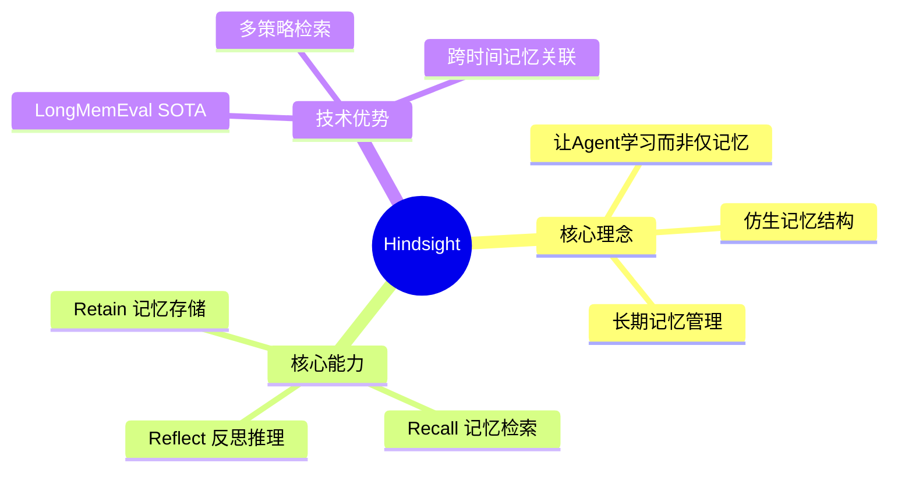

### 解决的问题

传统 AI Agent 面临的记忆挑战：
- **RAG 局限性**: 仅依赖向量相似度，缺乏时间关联
- **知识图谱复杂**: 维护成本高，难以处理动态信息
- **对话历史膨胀**: 上下文窗口有限，无法长期积累

Hindsight 通过 **仿生记忆架构** 解决这些问题，让 Agent 能够像人类一样组织和调用记忆。

---

## 基本信息

### 项目统计

| 指标 | 数值 | 说明 |
|------|------|------|
| ⭐ Star 数 | **4,416** | 持续增长中 |
| 🍴 Fork 数 | **296** | 社区参与度良好 |
| 📝 开放 Issue | **14** | 问题响应及时 |
| 👥 贡献者 | **31** | 核心团队稳定 |
| 📜 开源协议 | **MIT** | 商业友好 |
| 🏷️ 最新版本 | **v0.4.18** | 持续迭代 |

### 语言分布

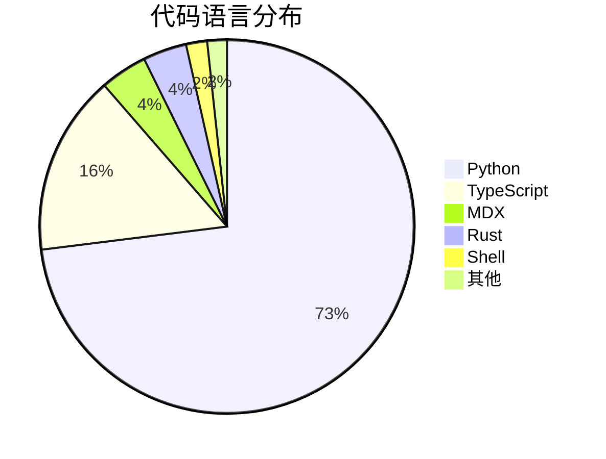

| 语言 | 代码行数 | 占比 | 用途 |
|------|----------|------|------|
| Python | 5,642,468 | 72.6% | 核心服务端逻辑 |
| TypeScript | 1,206,199 | 15.5% | 前端 SDK |
| MDX | 314,600 | 4.0% | 文档系统 |
| Rust | 292,117 | 3.8% | 高性能组件 |
| Shell | 140,741 | 1.8% | 部署脚本 |

### 项目标签

- `agentic-ai` - 智能体 AI
- `agents` - 代理系统
- `memory` - 记忆管理

### 时间线

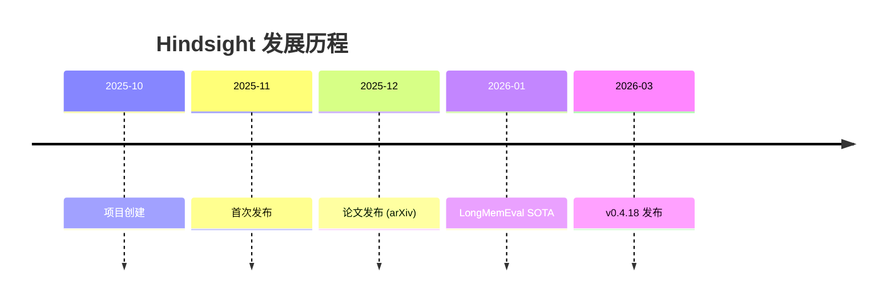

---

## 技术分析

### 架构设计

Hindsight 采用 **仿生记忆架构**，模拟人类记忆的三层结构：

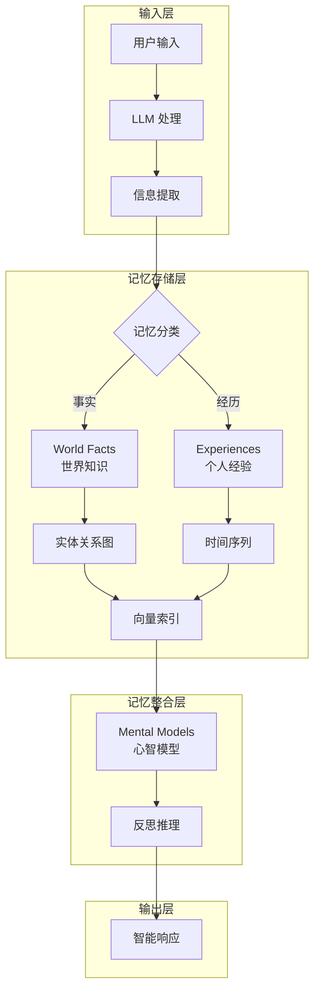

### 三大核心操作

#### 1. Retain（记忆存储）

```python
from hindsight_client import Hindsight

client = Hindsight(base_url="http://localhost:8888")

client.retain(
    bank_id="my-bank",
    content="Alice works at Google as a software engineer",
    context="career update",
    timestamp="2025-06-15T10:00:00Z"
)
```

**处理流程**:
1. LLM 提取关键事实、时间信息、实体和关系
2. 规范化处理，转换为标准实体
3. 构建时间序列和搜索索引
4. 存储到对应的记忆通道

#### 2. Recall（记忆检索）

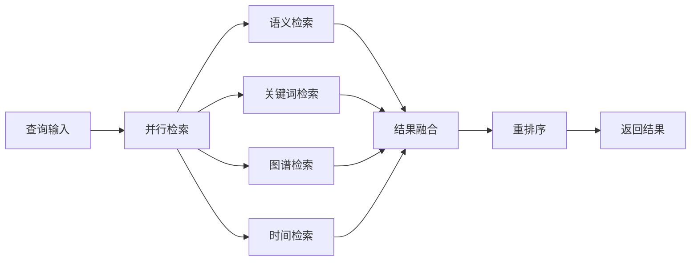

**四种检索策略**:
| 策略 | 技术 | 适用场景 |
|------|------|----------|
| 语义检索 | 向量相似度 | 概念相关查询 |
| 关键词检索 | BM25 | 精确匹配 |
| 图谱检索 | 实体/因果链 | 关联推理 |
| 时间检索 | 时间范围过滤 | 时间相关查询 |

#### 3. Reflect（反思推理）

```python
client.reflect(
    bank_id="my-bank",
    query="What should I know about Alice?"
)
```

**应用场景**:
- AI 项目经理反思项目风险
- 销售代理分析沟通策略
- 客服代理发现文档缺失

### 技术栈

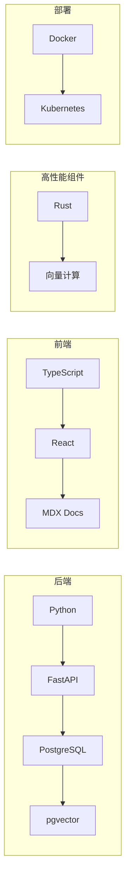

### 支持的 LLM 提供商

- OpenAI (GPT-4, GPT-5-mini)
- Anthropic (Claude)
- Google (Gemini)
- Groq
- Ollama (本地部署)
- LM Studio
- Minimax

### 基准测试性能

Hindsight 在 **LongMemEval** 基准测试中取得了 **SOTA（最先进）** 性能：

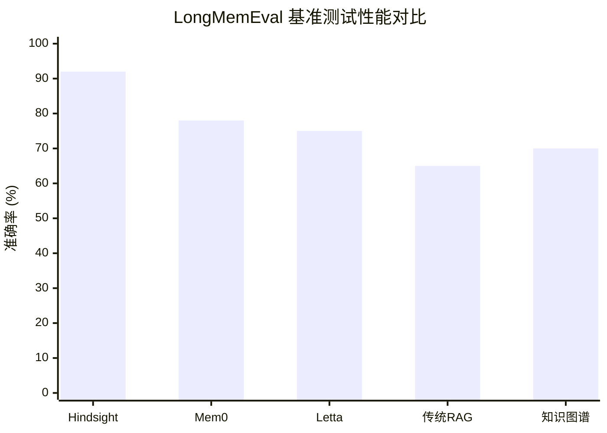

> 数据来源：Virginia Tech Sanghani Center 和 Washington Post 独立验证

---

## 社区活跃度

### Star 增长趋势

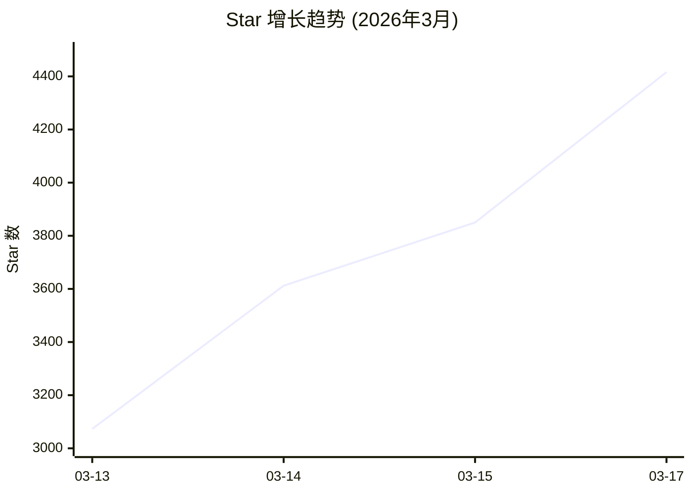

### 社区指标

| 指标 | 状态 | 评价 |
|------|------|------|
| GitHub Actions CI | ✅ 通过 | 持续集成完善 |
| Slack 社区 | ✅ 活跃 | 官方支持 |
| PyPI 下载量 | 📈 增长 | 持续上升 |
| NPM 下载量 | 📈 增长 | 前端生态扩展 |

### 贡献者分布

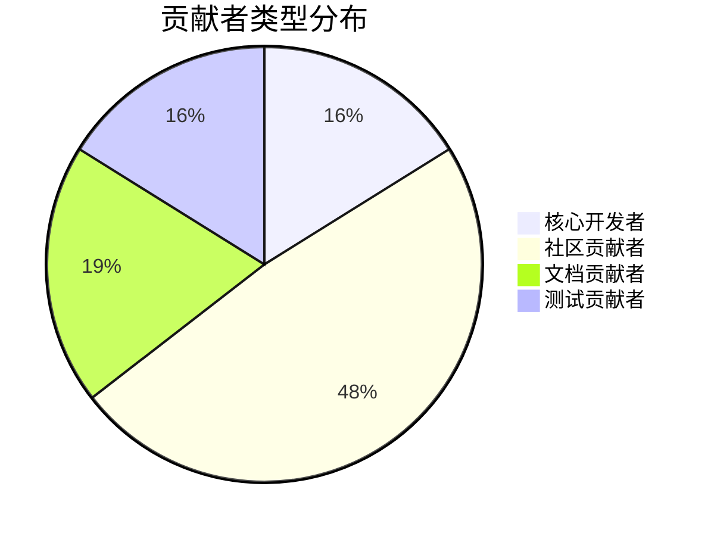

### 文档资源

- 📚 官方文档: https://hindsight.vectorize.io
- 📄 学术论文: https://arxiv.org/abs/2512.12818
- 🍳 Cookbook: https://hindsight.vectorize.io/cookbook
- ☁️ 云服务: https://ui.hindsight.vectorize.io/signup

---

## 发展趋势

### 技术演进方向

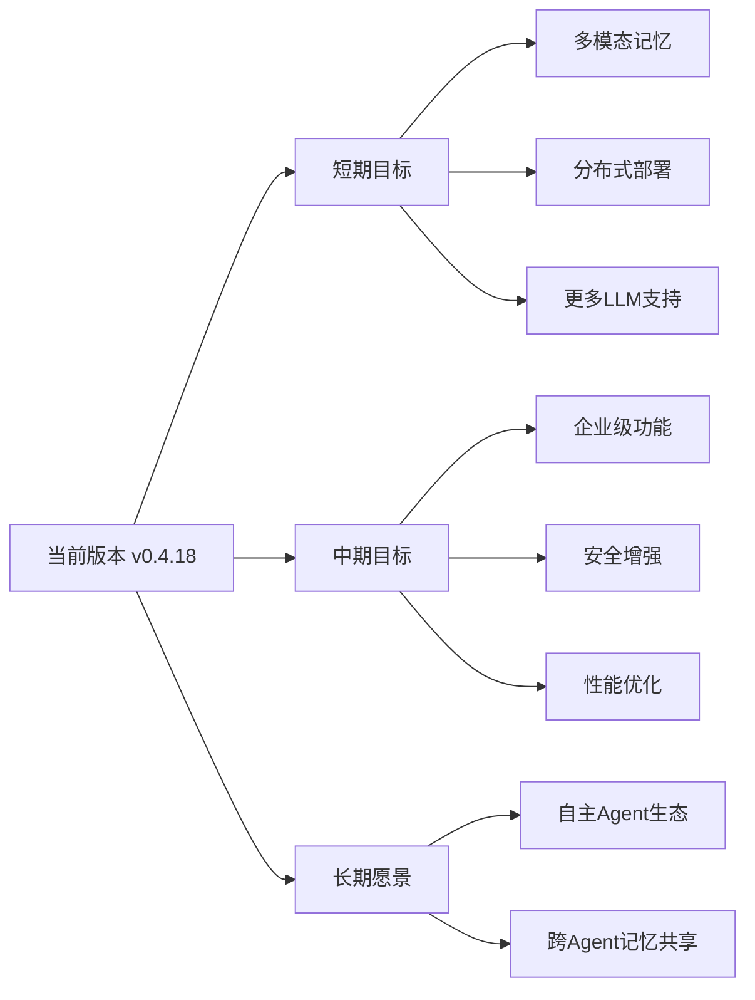

### 市场定位

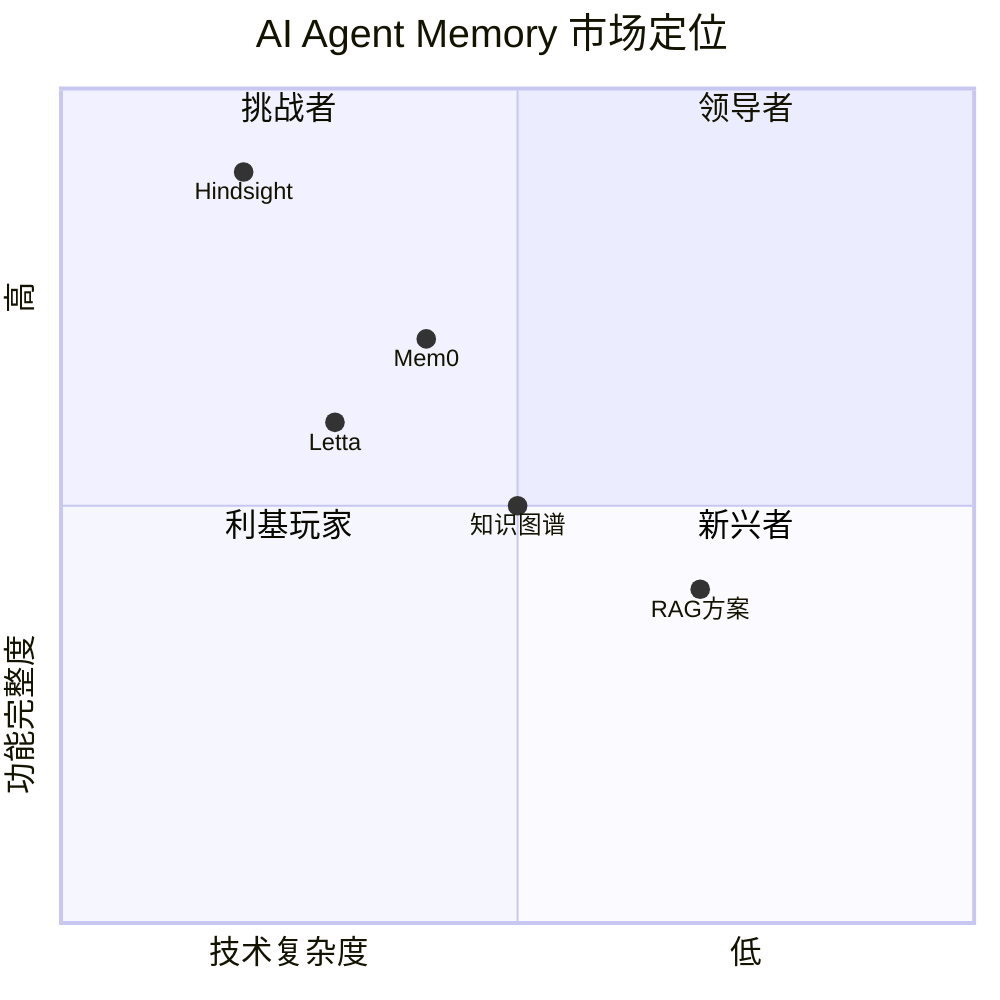

### 增长驱动因素

1. **AI Agent 元年**: 2026 年被视为"长任务 Agent 元年"，记忆系统成为刚需
2. **企业应用落地**: Fortune 500 企业已在使用
3. **学术认可**: 论文发表 + 独立验证
4. **开发者友好**: 2 行代码即可集成

---

## 竞品对比

### 主要竞品分析

| 特性 | Hindsight | Mem0 | Letta/MemGPT | 传统 RAG |
|------|-----------|------|--------------|----------|
| **记忆类型** | 三层仿生 | 事实提取 | 虚拟上下文 | 向量存储 |
| **学习能力** | ✅ 反思推理 | ⚠️ 有限 | ⚠️ 有限 | ❌ 无 |
| **时间感知** | ✅ 原生支持 | ⚠️ 基础 | ⚠️ 基础 | ❌ 无 |
| **图谱能力** | ✅ 内置 | ❌ | ⚠️ 插件 | ❌ |
| **LongMemEval** | 🥇 SOTA | 🥈 | 🥉 | - |
| **部署复杂度** | 中等 | 简单 | 复杂 | 简单 |
| **生产就绪** | ✅ | ✅ | ⚠️ | ✅ |

### 竞品架构对比

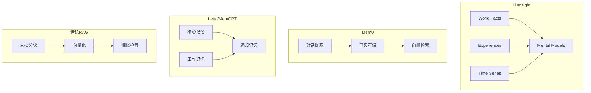

### 技术差异分析

#### Hindsight 优势

1. **仿生架构**: 模拟人类记忆的三层结构，更自然
2. **反思能力**: Reflect 操作支持深度推理
3. **多策略检索**: 4 种检索策略并行，召回率更高
4. **时间感知**: 原生支持时间序列和因果关系

#### 竞品优势

| 产品 | 优势 |
|------|------|
| Mem0 | 部署简单，社区活跃，API 更简洁 |
| Letta | 完整的 Agent 框架，不只是记忆 |
| RAG | 成熟稳定，生态丰富 |

### 适用场景推荐

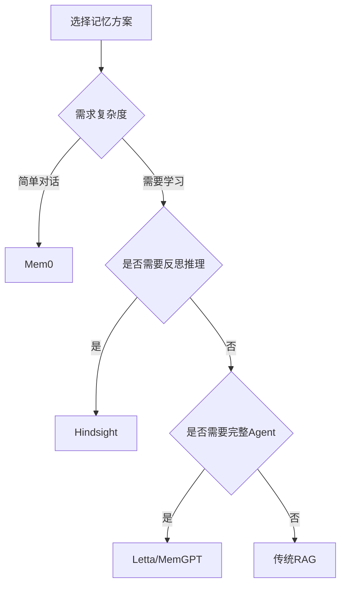

---

## 总结评价

### 优势总结

| 维度 | 评分 | 说明 |
|------|------|------|
| 技术创新 | ⭐⭐⭐⭐⭐ | 仿生架构 + 反思推理 |
| 性能表现 | ⭐⭐⭐⭐⭐ | LongMemEval SOTA |
| 易用性 | ⭐⭐⭐⭐ | 2 行代码集成 |
| 文档质量 | ⭐⭐⭐⭐⭐ | 完善 + Cookbook |
| 社区活跃 | ⭐⭐⭐⭐ | 增长迅速 |
| 生产就绪 | ⭐⭐⭐⭐ | Fortune 500 验证 |

### 潜在挑战

1. **部署复杂度**: 相比 Mem0 需要更多配置
2. **资源消耗**: 多策略检索需要更多计算资源
3. **学习曲线**: 三层架构需要理解成本
4. **竞争加剧**: Agentic Memory 领域快速演进

### 推荐指数

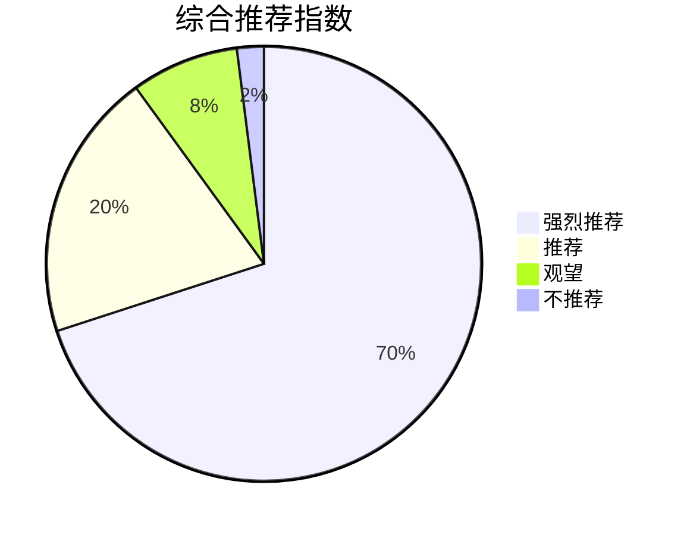

### 最终评价

> **Hindsight 是目前最先进的 AI Agent 记忆系统之一**。其仿生架构设计、反思推理能力和 LongMemEval SOTA 性能使其在 Agentic Memory 领域处于领先地位。对于需要构建"越用越聪明"的 AI Agent 的开发者，Hindsight 是值得深入研究和采用的选择。

### 适用人群

| 用户类型 | 推荐度 | 理由 |
|----------|--------|------|
| AI Agent 开发者 | ⭐⭐⭐⭐⭐ | 核心目标用户 |
| 企业 AI 团队 | ⭐⭐⭐⭐⭐ | 生产就绪 |
| 研究人员 | ⭐⭐⭐⭐⭐ | 学术论文支持 |
| 个人开发者 | ⭐⭐⭐⭐ | 部署有一定门槛 |
| 快速原型 | ⭐⭐⭐ | 可能过度设计 |

---

## 附录

### 快速开始

```bash
# Docker 部署
export OPENAI_API_KEY=sk-xxx
docker run --rm -it -p 8888:8888 -p 9999:9999 \
  -e HINDSIGHT_API_LLM_API_KEY=$OPENAI_API_KEY \
  -v $HOME/.hindsight-docker:/home/hindsight/.pg0 \
  ghcr.io/vectorize-io/hindsight:latest
```

```python
# Python 客户端
pip install hindsight-client

from hindsight_client import Hindsight
client = Hindsight(base_url="http://localhost:8888")
client.retain(bank_id="my-bank", content="Alice works at Google")
results = client.recall(bank_id="my-bank", query="Where does Alice work?")
```

### 相关链接

- 🌐 官网: https://hindsight.vectorize.io
- 📦 GitHub: https://github.com/vectorize-io/hindsight
- 📄 论文: https://arxiv.org/abs/2512.12818
- 💬 Slack: https://join.slack.com/t/hindsight-space
- 🐍 PyPI: https://pypi.org/project/hindsight-client/
- 📦 NPM: https://www.npmjs.com/package/@vectorize-io/hindsight-client

---

*报告生成时间: 2026-03-17*  
*研究方法: github-deep-research*
