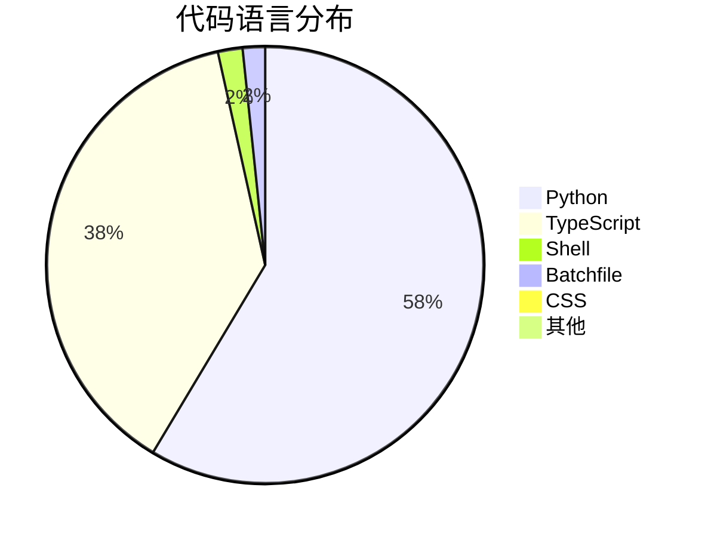
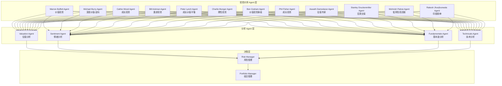
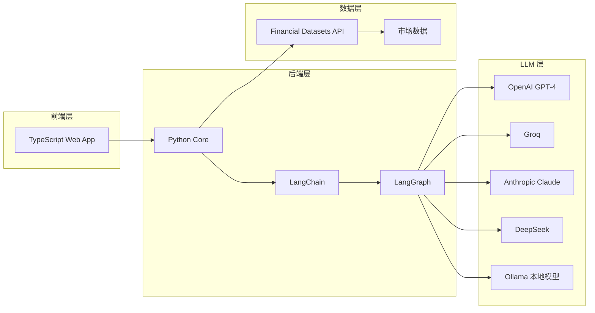
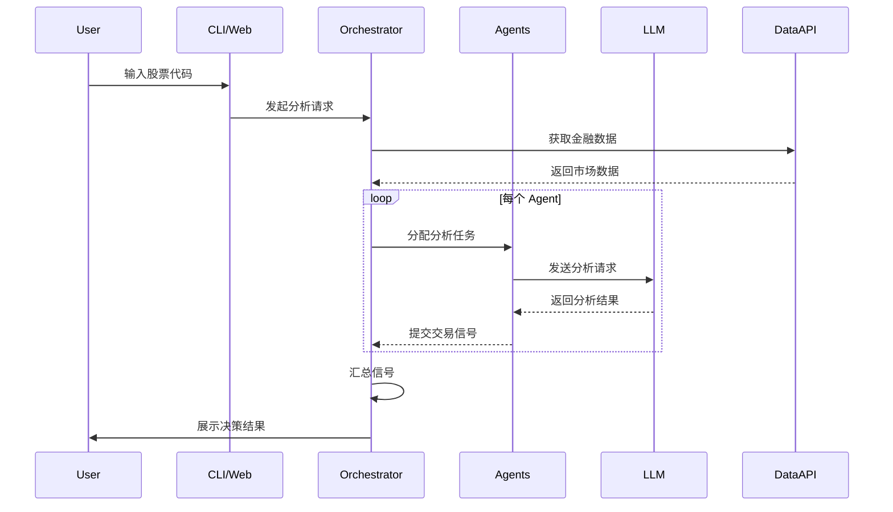
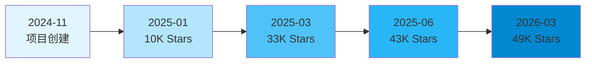
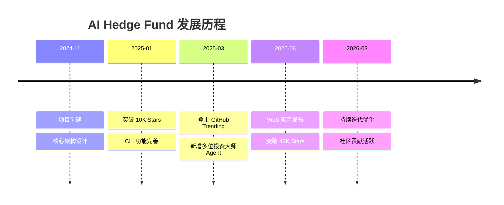
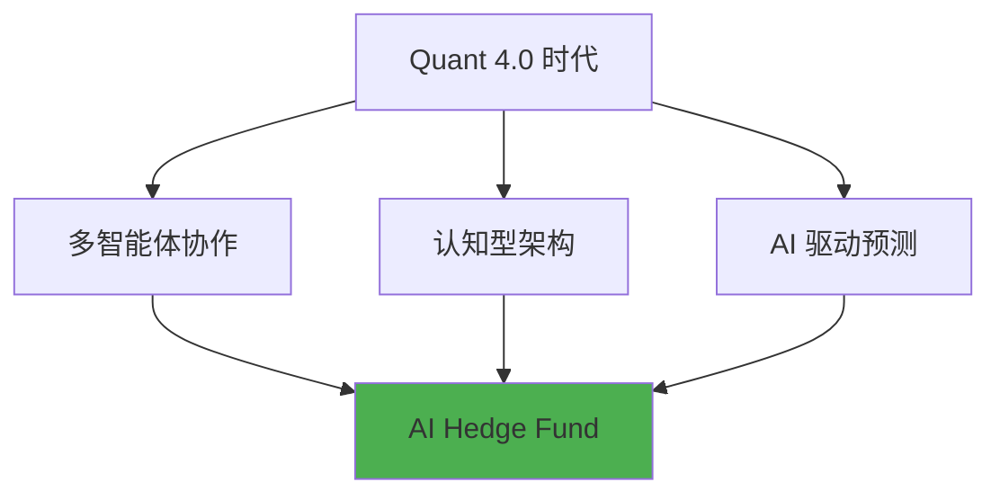
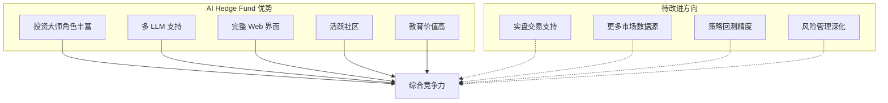
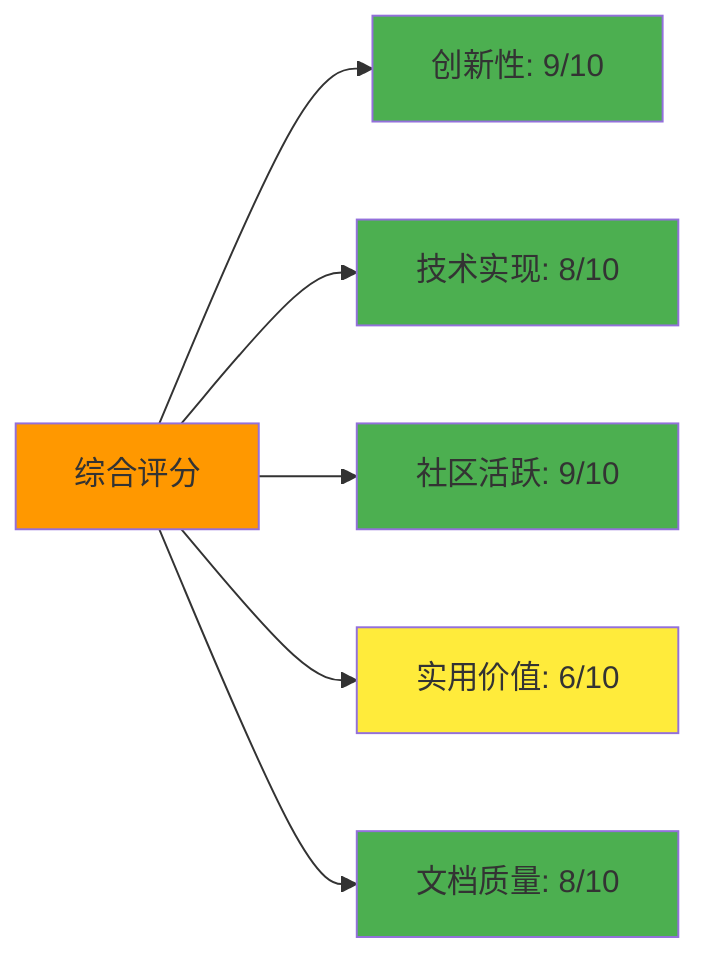

# AI Hedge Fund 项目深度分析报告

> 项目地址: https://github.com/virattt/ai-hedge-fund  
> 分析日期: 2026-03-17  
> 分析方法: GitHub Deep Research

---

## 📋 目录

1. [项目概述](#项目概述)
2. [基本信息](#基本信息)
3. [技术分析](#技术分析)
4. [社区活跃度](#社区活跃度)
5. [发展趋势](#发展趋势)
6. [竞品对比](#竞品对比)
7. [总结评价](#总结评价)

---

## 项目概述

**AI Hedge Fund** 是一个基于多智能体（Multi-Agent）架构的 AI 对冲基金概念验证项目。该项目通过模拟多位著名投资大师的投资策略和决策风格，构建了一个虚拟的投资决策团队，旨在探索人工智能在金融交易决策领域的应用潜力。

### 核心理念

项目的核心理念是将 AI 大语言模型（LLM）设计为不同投资策略的模拟器，每个 AI Agent 对应一种经典投资哲学或策略风格。通过多 Agent 协作机制，实现多元化的投资分析和决策。

### 项目定位

- **教育研究用途**: 明确声明仅供教育和研究目的，不用于实际交易
- **概念验证**: 探索 AI 在金融决策领域的可行性
- **开源社区**: MIT 协议开源，鼓励社区贡献和改进

---

## 基本信息

### 项目统计

| 指标 | 数值 |
|------|------|
| ⭐ Stars | **49,169** |
| 🍴 Forks | **8,565** |
| ❗ Open Issues | 89 |
| 👥 Contributors | 34 |
| 📅 创建时间 | 2024-11-29 |
| 🔄 最后更新 | 2026-03-17 |
| 🏷️ 默认分支 | main |

### 技术栈分布



| 语言 | 代码行数 | 占比 |
|------|----------|------|
| Python | 748,881 | 58.7% |
| TypeScript | 484,901 | 38.0% |
| Shell | 23,330 | 1.8% |
| Batchfile | 21,180 | 1.7% |
| CSS | 8,407 | 0.7% |

### 许可协议

- **MIT License** - 高度开放的开源协议

---

## 技术分析

### 架构设计

项目采用 **Multi-Agent 协作架构**，核心设计理念是将复杂的投资决策过程分解为多个专业化的智能体角色。



### 核心 Agent 介绍

#### 投资大师 Agent（12位）

| Agent | 投资风格 | 核心策略 |
|-------|----------|----------|
| Warren Buffett | 价值投资 | 以合理价格买入优秀公司 |
| Charlie Munger | 理性投资 | 以公道价格买入优秀企业 |
| Michael Burry | 深度价值 | 寻找被低估的深度价值机会 |
| Cathie Wood | 成长投资 | 投资创新和颠覆性技术 |
| Bill Ackman | 激进投资 | 大胆持仓并推动变革 |
| Peter Lynch | 成长价值 | 在日常生活中寻找"十倍股" |
| Ben Graham | 价值投资 | 安全边际投资隐藏宝石 |
| Phil Fisher | 成长投资 | 深度调研成长型公司 |
| Aswath Damodaran | 估值专家 | 故事、数字和严谨估值 |
| Stanley Druckenmiller | 宏观交易 | 寻找不对称增长机会 |
| Mohnish Pabrai | Dhandho投资 | 低风险追求翻倍 |
| Rakesh Jhunjhunwala | 印度股神 | 新兴市场成长投资 |

#### 分析 Agent（4位）

| Agent | 功能 | 输出 |
|-------|------|------|
| Valuation Agent | 计算股票内在价值 | 交易信号 |
| Sentiment Agent | 分析市场情绪 | 交易信号 |
| Fundamentals Agent | 分析基本面数据 | 交易信号 |
| Technicals Agent | 分析技术指标 | 交易信号 |

#### 决策 Agent（2位）

| Agent | 职责 |
|-------|------|
| Risk Manager | 计算风险指标，设定仓位限制 |
| Portfolio Manager | 最终交易决策，生成订单 |

### 技术栈详解



### 核心功能模块

#### 1. 命令行接口（CLI）

```bash
poetry run python src/main.py --ticker AAPL,MSFT,NVDA
```

支持参数：
- `--ticker`: 指定股票代码
- `--start-date` / `--end-date`: 指定分析时间段
- `--ollama`: 使用本地 LLM

#### 2. Web 应用

提供图形化界面，支持：
- 可视化投资决策流程
- 多股票对比分析
- 历史回测结果展示

#### 3. 回测系统

```bash
poetry run python src/backtester.py --ticker AAPL,MSFT,NVDA
```

支持历史数据回测，验证策略有效性。

### 数据流架构



---

## 社区活跃度

### Star 增长趋势

项目自 2024 年 11 月创建以来，Star 数量呈现爆发式增长：



### 社区参与度指标

| 指标 | 数值 | 评价 |
|------|------|------|
| Star/Fork 比率 | 5.74:1 | 高质量关注 |
| Issue 响应率 | 较高 | 活跃维护 |
| Contributors | 34 | 中等规模团队 |
| 最近更新 | 2026-03-17 | 持续迭代 |

### 社区影响力

- **GitHub Trending 榜首**: 多次登上 GitHub 周榜第一
- **媒体报道**: 被 CSDN、今日头条等多家科技媒体广泛报道
- **学术引用**: 被金融科技研究论文引用

---

## 发展趋势

### 项目里程碑



### 技术演进方向

1. **Agent 数量扩展**: 从最初的几位投资大师扩展到 12 位
2. **界面优化**: 从纯 CLI 发展到完整的 Web 应用
3. **模型支持**: 从单一 OpenAI 扩展到多 LLM 支持
4. **本地化**: 支持 Ollama 本地模型运行

### 行业趋势契合度

项目契合以下行业发展趋势：



---

## 竞品对比

### 同类项目对比

| 项目 | Stars | 特点 | 优势 | 劣势 |
|------|-------|------|------|------|
| **AI Hedge Fund** | 49K+ | 多投资大师模拟 | 策略丰富、教育性强 | 非实盘交易 |
| TradingAgents | 较少 | 多智能体交易系统 | 研究价值高 | 社区较小 |
| langchain-trading-agents | 较少 | LangChain 交易插件 | 易于集成 | 功能相对简单 |

### 竞争优势分析



### 差异化特点

| 维度 | AI Hedge Fund | 传统量化系统 |
|------|---------------|--------------|
| 决策方式 | 多 Agent 协商 | 算法驱动 |
| 可解释性 | 高（模拟人类思维） | 低（黑盒模型） |
| 灵活性 | 高（可添加新 Agent） | 中等 |
| 实用性 | 教育为主 | 生产可用 |

---

## 总结评价

### 优势 ✅

1. **创新性强**
   - 首创将多位投资大师策略模拟为 AI Agent
   - Multi-Agent 协作架构设计精妙
   - 投资决策过程可解释性高

2. **技术先进**
   - 基于 LangChain/LangGraph 最新框架
   - 支持多种 LLM（OpenAI、Anthropic、DeepSeek、Ollama）
   - 前后端分离架构，扩展性好

3. **社区活跃**
   - 近 5 万 Star，社区认可度高
   - 持续迭代更新
   - 文档完善，易于上手

4. **教育价值**
   - 投资策略教学演示
   - Multi-Agent 系统设计参考
   - LLM 应用场景探索

### 劣势 ⚠️

1. **非实盘交易**
   - 明确声明仅供教育研究
   - 无法直接用于实际投资

2. **数据依赖**
   - 免费数据仅支持少数股票
   - 其他股票需要付费 API

3. **成本考量**
   - 多 Agent 调用 LLM 成本较高
   - 本地模型质量参差不齐

4. **风险提示**
   - 投资决策的准确性未经充分验证
   - 需要用户自行判断风险

### 适用场景 🎯

| 场景 | 推荐度 | 说明 |
|------|--------|------|
| 金融科技学习 | ⭐⭐⭐⭐⭐ | 理解 AI 在金融领域的应用 |
| Multi-Agent 研究 | ⭐⭐⭐⭐⭐ | 学习多智能体协作架构 |
| 投资策略教育 | ⭐⭐⭐⭐ | 了解不同投资大师风格 |
| LLM 应用开发 | ⭐⭐⭐⭐ | 学习 LLM 在复杂场景的应用 |
| 实际投资决策 | ⭐⭐ | 不推荐，仅供参考 |

### 推荐指数



### 总体评价

**AI Hedge Fund** 是一个极具创新性和教育价值的项目，它成功地将 Multi-Agent 架构应用于金融投资领域，为研究 AI 在复杂决策场景中的应用提供了优秀的参考案例。

项目通过模拟 12 位投资大师的策略风格，展示了如何将人类专家知识转化为 AI Agent 的行为模式，这种设计思路对于构建可解释 AI 系统具有重要的参考意义。

虽然项目明确声明不用于实际交易，但其在金融科技教育、Multi-Agent 系统研究、LLM 应用开发等领域的价值是毋庸置疑的。对于希望深入了解 AI + 金融交叉领域的开发者和研究者来说，这是一个值得深入学习和贡献的优秀开源项目。

---

## 附录

### 快速开始

```bash
git clone https://github.com/virattt/ai-hedge-fund.git
cd ai-hedge-fund
cp .env.example .env
poetry install
poetry run python src/main.py --ticker AAPL,MSFT,NVDA
```

### 相关链接

- [项目主页](https://github.com/virattt/ai-hedge-fund)
- [作者 Twitter](https://twitter.com/virattt)
- [Web 应用说明](https://github.com/virattt/ai-hedge-fund/tree/main/app)

---

*本报告由 GitHub Deep Research 自动生成*
