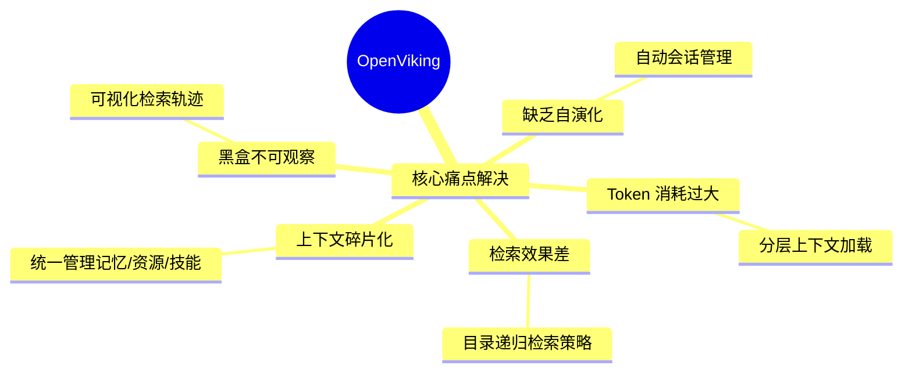
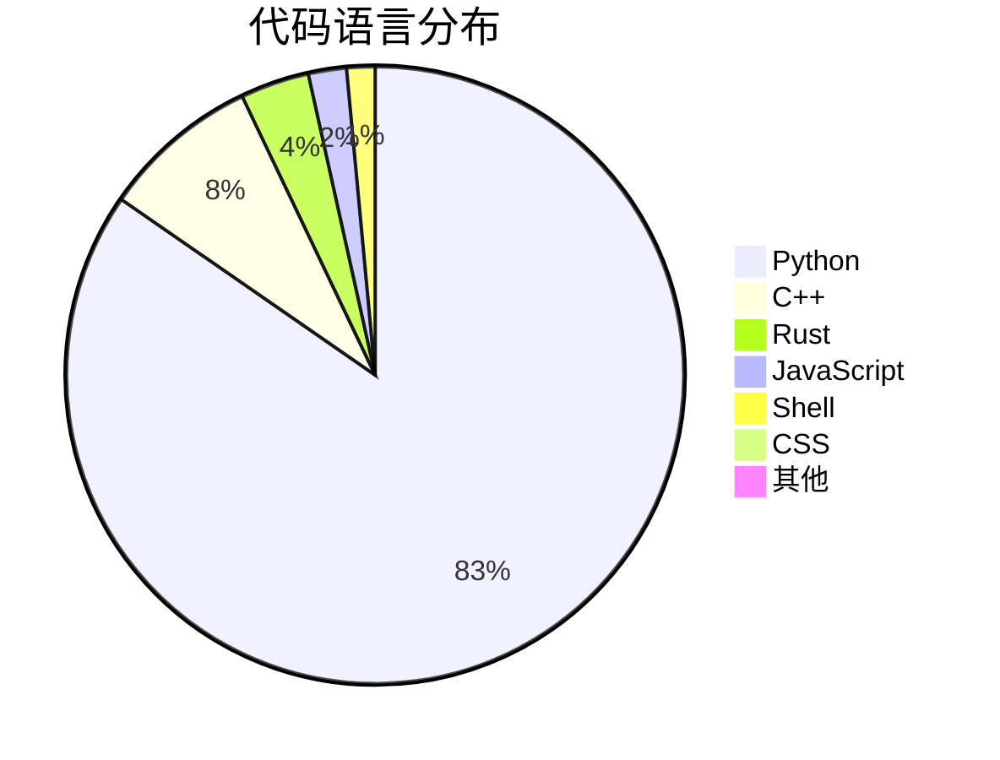
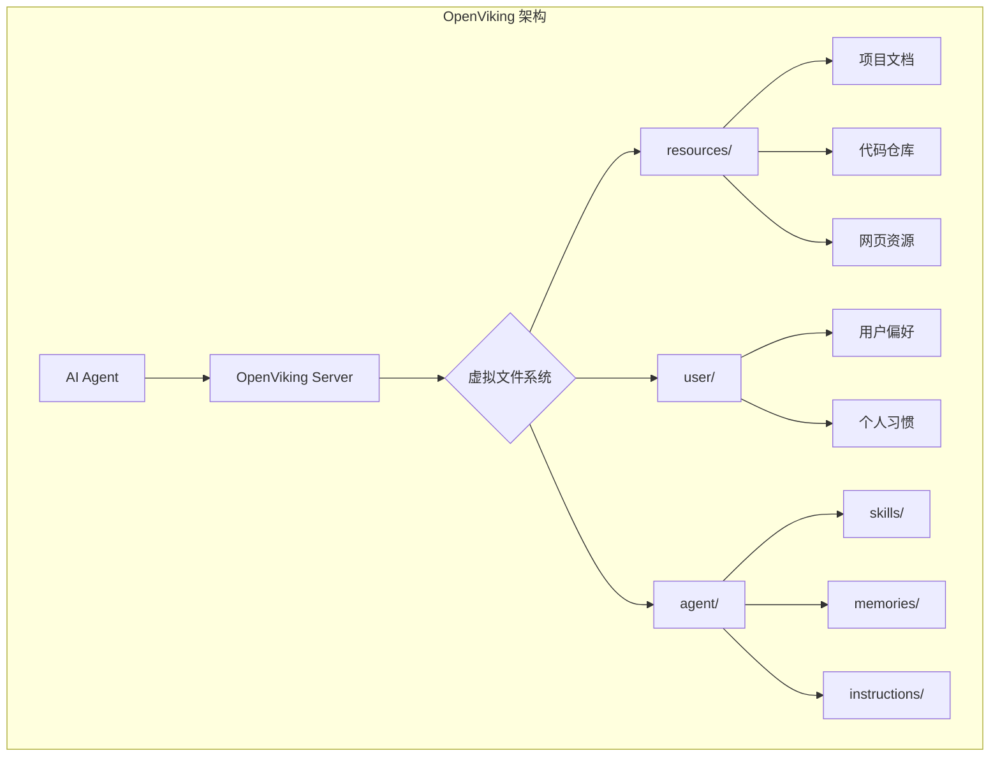
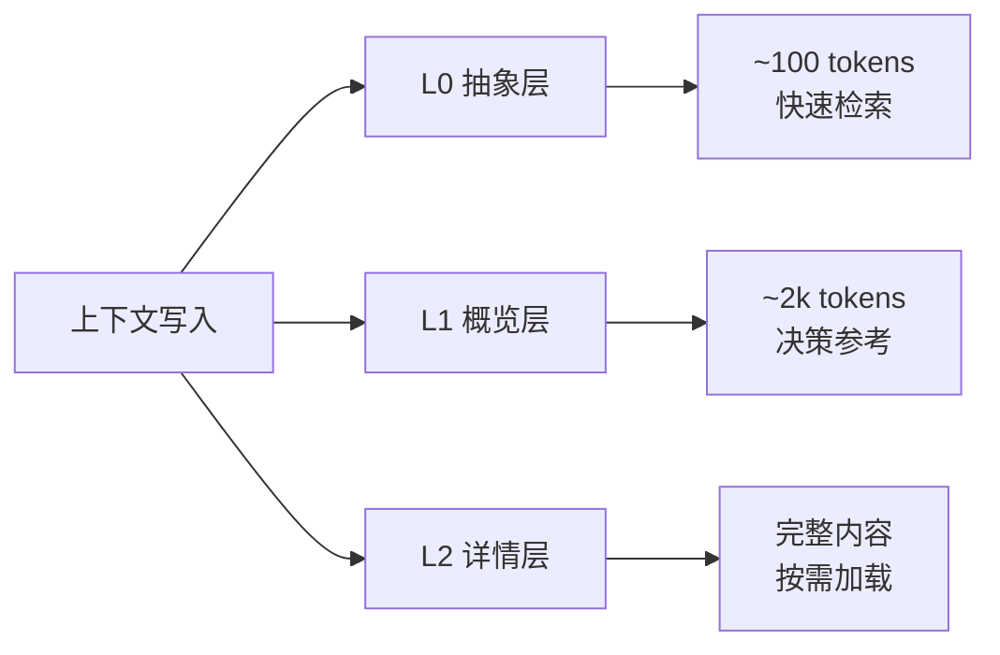
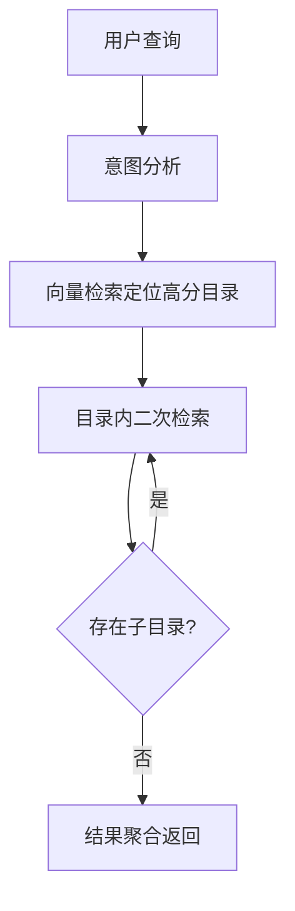
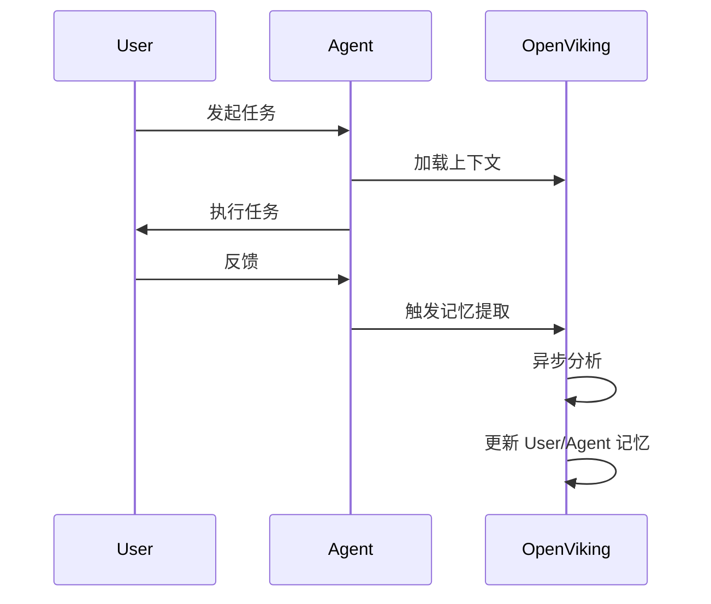
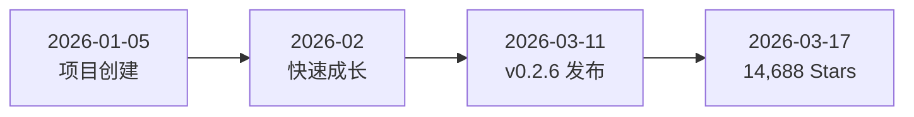
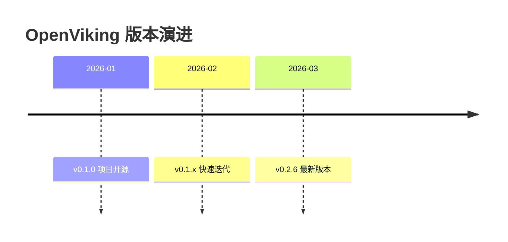
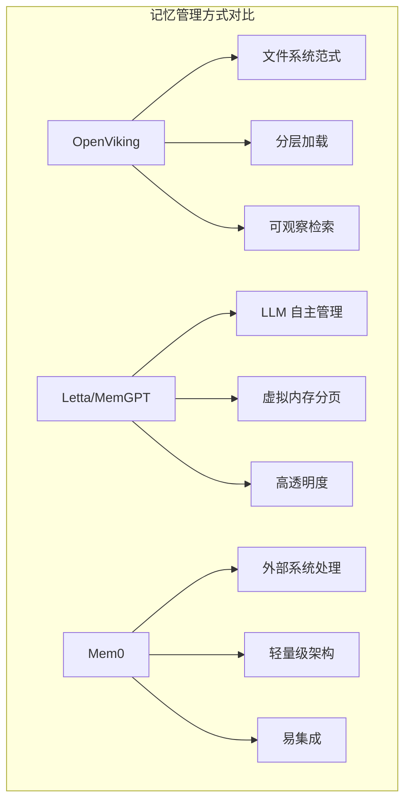
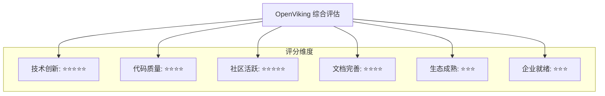

# volcengine/OpenViking 深度研究报告

> OpenViking 是字节跳动火山引擎开源的 AI Agent 上下文数据库，采用文件系统范式统一管理 Agent 的记忆、资源和技能。

---

## 一、项目概述

### 1.1 项目定位

OpenViking 是一个专为 AI Agent 设计的开源上下文数据库（Context Database），旨在解决 AI Agent 在长期任务执行过程中面临的上下文管理难题。项目由字节跳动火山引擎 Viking 团队开发，于 2026 年 1 月正式开源。

### 1.2 核心价值主张



### 1.3 解决的核心问题

| 痛点 | 传统方案 | OpenViking 方案 |
|------|----------|-----------------|
| 上下文碎片化 | 记忆存于代码、资源放向量库、技能分散各处 | 文件系统范式统一管理 |
| Token 消耗大 | 每次全量加载所有上下文 | L0/L1/L2 分层按需加载 |
| 检索效果差 | 单一向量检索，语义匹配不精准 | 目录递归检索策略 |
| 过程不透明 | 黑盒操作，难以调试 | 可视化检索轨迹 |
| 无法进化 | 静态记忆，无学习能力 | 自动会话管理与记忆迭代 |

---

## 二、基本信息

### 2.1 项目元数据

| 指标 | 数值 |
|------|------|
| **项目名称** | volcengine/OpenViking |
| **Stars** | 14,688 ⭐ |
| **Forks** | 1,000 |
| **Open Issues** | 67 |
| **主要语言** | Python |
| **开源协议** | Apache-2.0 |
| **创建时间** | 2026-01-05 |
| **最近更新** | 2026-03-17 |
| **最新版本** | v0.2.6 |
| **贡献者数量** | 70 人 |

### 2.2 技术栈分布



### 2.3 项目标签

```
agent, agentic-rag, ai-agents, clawbot, context-database, 
context-engineering, filesystem, llm, memory, openclaw, 
opencode, rag, skill
```

---

## 三、技术分析

### 3.1 核心架构



### 3.2 五大核心概念

#### 1. 文件系统管理范式

将所有上下文映射到 `viking://` 协议下的虚拟目录：

```
viking://
├── resources/          # 资源：项目文档、仓库、网页等
├── user/               # 用户：个人偏好、习惯等
└── agent/              # Agent：技能、指令、任务记忆等
```

#### 2. 分层上下文加载



| 层级 | Token 消耗 | 用途 |
|------|-----------|------|
| L0 (Abstract) | ~100 tokens | 一句话摘要，快速相关性判断 |
| L1 (Overview) | ~2k tokens | 核心信息与使用场景，规划阶段决策 |
| L2 (Details) | 完整内容 | 深度阅读，仅在必要时加载 |

#### 3. 目录递归检索策略



检索流程：
1. **意图分析**：生成多个检索条件
2. **初始定位**：向量检索快速定位高分目录
3. **精细探索**：目录内二次检索
4. **递归下钻**：逐层递归子目录
5. **结果聚合**：返回最相关上下文

#### 4. 可视化检索轨迹

- 层级虚拟文件系统结构
- 每个条目对应唯一 URI
- 完整保留检索浏览轨迹
- 便于问题定位与优化

#### 5. 自动会话管理



### 3.3 技术实现亮点

| 特性 | 实现方式 |
|------|----------|
| 多模型支持 | Volcengine、OpenAI、LiteLLM（支持 Claude、DeepSeek、Gemini、Qwen 等） |
| 本地模型 | 支持 vLLM、Ollama 部署 |
| Embedding | 支持 Volcengine、OpenAI、Jina |
| 并发控制 | 可配置最大并发请求数 |
| 部署方式 | 支持 Docker、源码安装、PyPI |

### 3.4 性能测试数据

基于 LoCoMo10 数据集的测试结果：

| 实验组 | 任务完成率 | 输入 Token 成本 |
|--------|-----------|----------------|
| OpenClaw (memory-core) | 35.65% | 24,611,530 |
| OpenClaw + LanceDB | 44.55% | 51,574,530 |
| OpenClaw + OpenViking (禁用原生记忆) | **52.08%** | 4,264,396 |
| OpenClaw + OpenViking (启用原生记忆) | 51.23% | 2,099,622 |

**关键结论**：
- 任务完成率提升 **43-49%**
- Token 成本降低 **83-96%**

---

## 四、社区活跃度

### 4.1 增长趋势



### 4.2 社区数据

| 指标 | 数值 | 说明 |
|------|------|------|
| Star 增长 | ~610/日 | 2026-03-15 日榜数据 |
| Fork 数 | 1,000 | 社区参与度高 |
| 贡献者 | 70 人 | 核心开发团队稳定 |
| Issues | 67 个 | 活跃的问题反馈 |

### 4.3 社区渠道

| 渠道 | 链接 |
|------|------|
| GitHub | [volcengine/OpenViking](https://github.com/volcengine/OpenViking) |
| 官网 | [openviking.ai](https://www.openviking.ai) |
| Discord | [Join Server](https://discord.com/invite/eHvx8E9XF3) |
| Twitter/X | [@openvikingai](https://x.com/openvikingai) |
| 飞书群 | 扫码加入 |
| 微信群 | 扫码添加助手 |

---

## 五、发展趋势

### 5.1 版本演进



### 5.2 发展方向

1. **生态集成**
   - 与 OpenClaw 深度集成
   - 支持 OpenCode 记忆插件
   - 扩展更多 Agent 框架支持

2. **功能增强**
   - VikingBot AI Agent 框架
   - 多模态上下文支持
   - 更丰富的检索策略

3. **企业级特性**
   - 云端部署方案
   - 高可用架构
   - 安全与权限管理

### 5.3 市场热度

- GitHub 日榜持续上榜
- 技术媒体广泛报道
- 开发者社区积极反馈

---

## 六、竞品对比

### 6.1 主要竞品概览

| 项目 | 开发者 | 核心理念 | Star 数 |
|------|--------|----------|---------|
| **OpenViking** | 字节跳动 | 文件系统范式管理上下文 | ~14.7k |
| **Letta (MemGPT)** | UC Berkeley | LLM 自主管理记忆文件系统 | ~12k |
| **Mem0** | Mem0 | 轻量级记忆提取+检索 | ~25k |
| **Zep** | Zep | 对话记忆与知识图谱 | ~3k |

### 6.2 技术对比



### 6.3 详细对比分析

| 维度 | OpenViking | Letta/MemGPT | Mem0 |
|------|------------|--------------|------|
| **核心理念** | 文件系统范式统一管理 | LLM 自主管理记忆 | 轻量级提取+检索 |
| **记忆管理** | Agent 主动读写 | Agent 主动读写 | 外部系统自动处理 |
| **透明度** | 高（可观察检索轨迹） | 高（可观察推理过程） | 中（记忆可审计） |
| **上下文类型** | 记忆+资源+技能 | 记忆为主 | 记忆为主 |
| **分层加载** | ✅ L0/L1/L2 | ✅ 分页机制 | ❌ |
| **检索策略** | 目录递归检索 | 向量检索 | 向量检索 |
| **自演化** | ✅ 自动会话管理 | ✅ 自我更新 | ⚠️ 需手动触发 |
| **企业支持** | 火山引擎官方 | 商业化产品 | 商业化产品 |

### 6.4 竞争优势

**OpenViking 的差异化优势**：

1. **统一管理范式**：不仅管理记忆，还统一管理资源和技能
2. **分层加载**：显著降低 Token 消耗（实测降低 83-96%）
3. **可观察性**：检索轨迹可视化，便于调试优化
4. **性能验证**：任务完成率提升 43-49%
5. **字节生态**：与 OpenClaw、火山引擎深度集成

---

## 七、总结评价

### 7.1 项目优势

| 优势 | 说明 |
|------|------|
| 🎯 **定位精准** | 专注 AI Agent 上下文管理痛点 |
| 🏗️ **架构创新** | 文件系统范式带来直观操作体验 |
| ⚡ **性能卓越** | Token 成本大幅降低，任务完成率显著提升 |
| 🔧 **易于集成** | 支持多种 LLM 后端，提供丰富插件 |
| 📊 **可观察性强** | 检索轨迹可视化，便于调试优化 |
| 🌐 **生态完善** | 官方文档、社区支持、持续迭代 |

### 7.2 潜在挑战

| 挑战 | 说明 |
|------|------|
| 🆕 **项目较新** | 2026年1月开源，生态仍在建设中 |
| 📚 **学习曲线** | 文件系统范式需要开发者适应 |
| 🔄 **竞争激烈** | Mem0、Letta 等竞品已有先发优势 |
| 🏢 **企业采用** | 需要更多企业级案例验证 |

### 7.3 综合评分



### 7.4 推荐场景

✅ **强烈推荐**：
- AI Agent 长期任务执行
- 需要上下文自演化的应用
- Token 成本敏感的场景
- 需要可观察检索过程的调试场景

⚠️ **谨慎评估**：
- 简单的短期对话场景
- 对稳定性要求极高的生产环境

### 7.5 总结

OpenViking 是字节跳动火山引擎在 AI Agent 基础设施领域的重要布局。项目以**文件系统范式**为核心创新，通过**分层加载**和**目录递归检索**解决了 AI Agent 上下文管理的关键痛点。实测数据显示，OpenViking 能够显著降低 Token 成本（83-96%）并提升任务完成率（43-49%）。

作为 2026 年初开源的新项目，OpenViking 在短时间内获得了极高的社区关注度（14,688 Stars），体现了市场对 AI Agent 上下文管理解决方案的强烈需求。虽然项目生态仍在建设中，但其创新的技术架构和字节跳动的技术背书，使其成为 AI Agent 开发者值得关注的重要项目。

---

## 参考链接

- [GitHub 仓库](https://github.com/volcengine/OpenViking)
- [官方文档](https://www.openviking.ai/docs)
- [Discord 社区](https://discord.com/invite/eHvx8E9XF3)
- [OpenClaw 集成示例](https://github.com/volcengine/OpenViking/tree/main/examples/openclaw-memory-plugin)

---

*报告生成时间: 2026-03-17*  
*数据来源: GitHub API、Web Search、项目文档*
