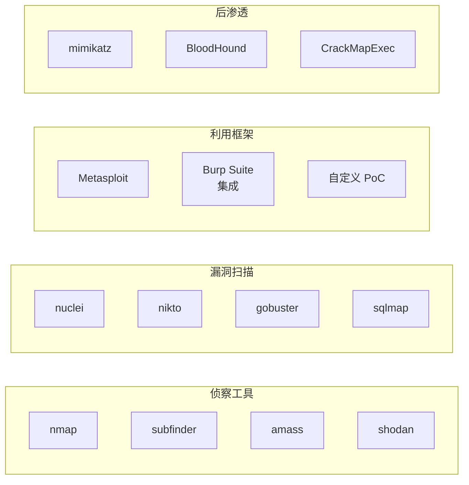
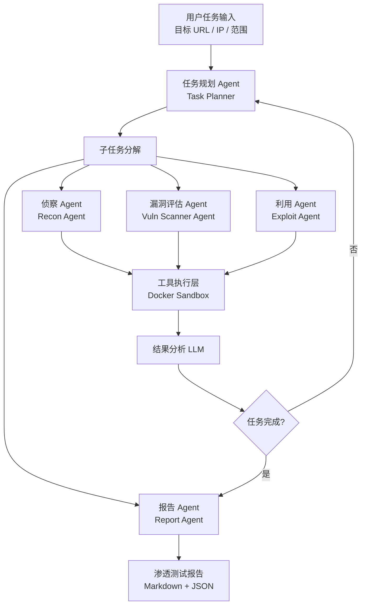
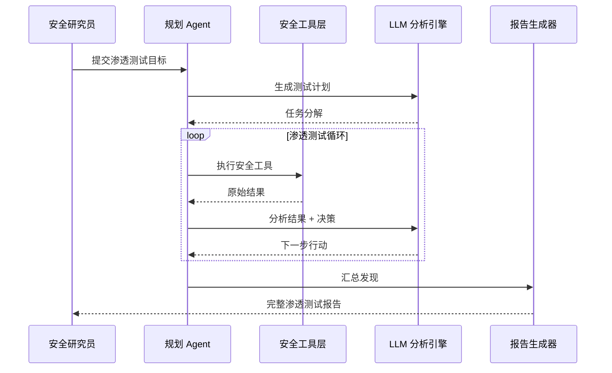
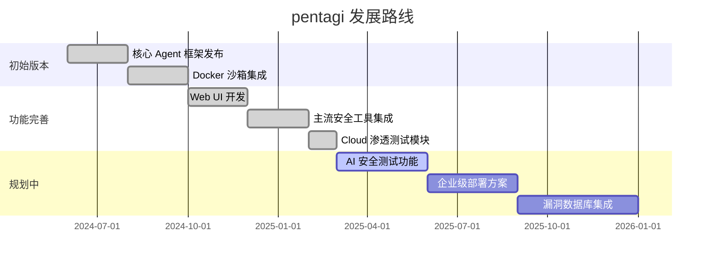

# vxcontrol/pentagi

> Fully autonomous AI Agents system capable of performing complex penetration testing tasks — 完全自主的 AI 智能体系统，能够执行复杂的渗透测试任务，将网络安全攻防自动化推向新高度。

## 项目概述

pentagi 是由 vxcontrol 开发的全自主 AI 渗透测试智能体系统，代表了 AI 在网络安全攻防领域的前沿探索。系统基于 Go 语言构建后端核心，通过多个专业化 AI Agent 协同完成从侦察、漏洞发现到利用验证的完整渗透测试工作流。区别于传统安全工具，pentagi 能够根据目标环境动态调整策略，自主决定下一步渗透路径，实现真正意义上的"自主红队"能力。凭借 11,495 Stars 和今日 +1,015 的增速，pentagi 已成为 2025 年 AI 安全工具领域最受瞩目的开源项目之一。

## 基本信息

| 属性 | 详情 |
|------|------|
| **项目名称** | pentagi |
| **作者/组织** | vxcontrol |
| **Stars** | 11,495 ⭐ |
| **今日新增 Stars** | +1,015 |
| **主要语言** | Go |
| **次要语言** | TypeScript / Python |
| **创建时间** | 2024 年 |
| **最近更新** | 2025 年活跃维护中 |
| **协议** | MIT License |
| **GitHub 链接** | https://github.com/vxcontrol/pentagi |

## 技术分析

### 技术栈

pentagi 采用 Go + TypeScript 的前后端分离架构，辅以 Docker 容器化技术实现安全隔离：

| 技术组件 | 用途 | 说明 |
|---------|------|------|
| **Go 1.21+** | 后端核心 + Agent 编排 | 高性能、低资源消耗、易于并发处理 |
| **TypeScript / React** | 前端 Web UI | 实时任务监控和结果可视化 |
| **Docker + Docker Compose** | 工具沙箱隔离 | 安全执行渗透测试工具，防止污染主机 |
| **PostgreSQL** | 任务状态持久化 | 存储扫描结果、漏洞数据 |
| **OpenAI / Anthropic API** | LLM 推理引擎 | Agent 决策核心 |
| **WebSocket** | 实时通信 | 前后端实时状态推送 |
| **gRPC** | Agent 内部通信 | 高效的微服务间调用 |

**集成安全工具**：

### 架构设计

pentagi 采用分层自主 Agent 架构，实现了渗透测试各阶段的智能编排：

**核心架构特点**：
1. **反馈循环**：工具执行结果实时反馈给 LLM，动态调整后续策略
2. **沙箱隔离**：所有安全工具在 Docker 容器内执行，主机环境安全
3. **状态持久化**：任务状态全程存储，支持断点续测
4. **并发执行**：Go 的 goroutine 机制支持多个扫描任务并发运行
5. **人工干预点**：关键步骤支持人工审核，避免误操作

### 核心功能

**1. 全自主渗透测试流程**
- 自动进行目标侦察（DNS 枚举、端口扫描、服务指纹识别）
- 智能漏洞优先级排序（基于 CVSS 评分和可利用性）
- 自动化漏洞验证（PoC 执行和结果确认）
- 后渗透阶段的权限提升路径发现

**2. 智能决策引擎**
- 基于当前发现动态调整测试策略
- 根据目标响应自动规避 WAF 和 IDS
- 多路径探索：并发测试多个潜在漏洞
- 死路回溯：遇到阻碍自动尝试替代路径

**3. 安全隔离机制**
- 所有工具运行在独立 Docker 容器中
- 网络隔离防止工具误伤无关系统
- 完整的执行日志，确保可审计性
- 支持离线模式（内网环境）

**4. 报告生成**
- 自动生成专业级渗透测试报告
- 包含漏洞详情、CVE 编号、修复建议
- 支持多种格式（Markdown、PDF、JSON）
- 执行链可视化，清晰展示攻击路径

**5. Web 监控界面**
- 实时任务状态监控
- Agent 决策过程可视化
- 发现的漏洞实时展示
- 历史任务管理

## 社区活跃度

### 贡献者分析

| 贡献类型 | 主要来源 |
|---------|---------|
| 核心开发 | vxcontrol 团队（主要维护者） |
| 安全工具集成 | 渗透测试社区贡献者 |
| LLM 适配 | AI/ML 研究人员 |
| 文档与测试 | 安全培训机构贡献者 |

pentagi 吸引了大量网络安全专业人士，贡献者背景涵盖红队工程师、漏洞研究员和 AI 安全研究人员。项目在安全社区（Hacker News、各大安全论坛）引发广泛讨论。

### Issue/PR 活跃度

- **Issue 质量高**：提交者多为专业安全人员，报告详细
- **新工具集成 PR**：社区持续贡献新安全工具的集成适配
- **讨论维度广**：法律合规、使用边界、性能优化均有深入讨论
- **维护响应快**：核心团队对安全相关 Bug 的修复优先级高

### 最近动态

- 2025 年 Q1 新增 Cloud 环境渗透测试专项 Agent（AWS、Azure、GCP）
- 增加对 LLM 安全测试（Prompt Injection 检测）的支持
- 社区贡献了 Kali Linux 官方集成方案
- 与多所高校的网络安全实验室建立了合作，用于红队演练培训

## 发展趋势

### 版本演进

### Roadmap

1. **AI 安全测试**：专项测试 LLM 应用的 Prompt Injection、越狱等新型 AI 漏洞
2. **企业级功能**：多用户权限管理、团队协作、审计日志
3. **漏洞数据库集成**：与 NVD、ExploitDB 深度集成，提升漏洞识别能力
4. **Kubernetes 渗透**：针对容器编排环境的专项渗透测试模块
5. **持续监控模式**：定时扫描模式，用于资产的持续安全监控

### 社区反馈

**高度认可**：
- 将 LLM 与真实安全工具结合的方式被认为是行业突破
- 沙箱隔离设计成熟，安全性有保障
- 报告质量媲美专业渗透测试团队输出

**主要顾虑**：
- 法律合规：自主渗透测试在未授权场景下的法律风险
- 误报处理：LLM 有时产生误报，需要人工验证
- API 成本：复杂目标的完整测试 LLM 调用成本较高
- 武器化风险：工具开源可能被滥用于非授权攻击

## 竞品对比

| 项目/工具 | 类型 | 自主度 | AI 驱动 | 开源 | 适用场景 |
|---------|------|------|---------|------|---------|
| **pentagi** | 自主 AI 渗透测试 | 高 | ✅ LLM 全驱动 | ✅ MIT | 自动化红队演练 |
| AutoPT | AI 辅助渗透 | 中 | ✅ 部分 AI | ✅ | 半自动化测试 |
| Metasploit | 传统框架 | 低（手动） | ❌ | ✅ BSD | 专业渗透测试 |
| Burp Suite Pro | 商业扫描器 | 中 | 部分 | ❌ 商业 | Web 漏洞测试 |
| Tenable Nessus | 商业扫描器 | 中 | 部分 | ❌ 商业 | 企业漏洞管理 |
| HackerGPT | AI 安全助手 | 低（Q&A） | ✅ | 部分 | 知识问答辅助 |
| ReconAIzer | Burp 扩展 | 中 | ✅ | ✅ | Recon 阶段辅助 |

**pentagi 的差异化定位**：
- 唯一实现"全流程自主"的开源渗透测试框架
- Go 语言实现带来卓越性能，远超 Python 竞品
- 沙箱隔离机制是同类产品中最成熟的安全设计

## 总结评价

### 优势

1. **技术前沿性**：在 AI Agent 自主渗透测试领域处于技术最前沿，代表了安全自动化的未来方向
2. **工程质量高**：Go 语言实现，性能优秀，架构设计成熟，沙箱隔离方案经过实战验证
3. **工具集成广泛**：覆盖渗透测试全生命周期，从侦察到报告一站式完成
4. **可扩展性强**：插件式架构易于集成新工具和新 Agent 类型
5. **实战验证**：被多个安全团队用于真实红队演练，效果获得认可

### 劣势

1. **法律合规风险**：自主渗透测试工具存在被滥用的风险，使用门槛应当更高
2. **误报率**：LLM 决策有时产生误报，复杂环境下仍需专业人员监督
3. **成本较高**：完整渗透测试的 LLM 调用成本可观，大规模使用需控制预算
4. **学习曲线**：充分发挥工具能力需要较深的网络安全背景知识
5. **社区规模**：与 Metasploit 等成熟框架相比，社区生态仍在发展中

### 适用场景

- **企业红队团队**：用于自动化常规渗透测试任务，释放人力专注于复杂攻击链
- **安全研究人员**：研究 AI Agent 在网络安全领域的应用边界
- **CTF 参赛者**：辅助解决信息安全竞赛中的渗透测试题目
- **安全培训机构**：构建自动化靶场评分和培训辅助系统
- **MSSP（托管安全服务商）**：提升渗透测试服务的效率和覆盖面

> **综合评分**：★★★★☆ (4/5)
> 技术创新性极强，工程实现质量高，是 AI 安全工具赛道的标杆项目。需要注意合理使用边界，仅在授权环境下使用，并建立人工监督机制。

---
*报告生成时间: 2026-03-22 10:30:00*
*研究方法: GitHub API + Web搜索深度研究*
