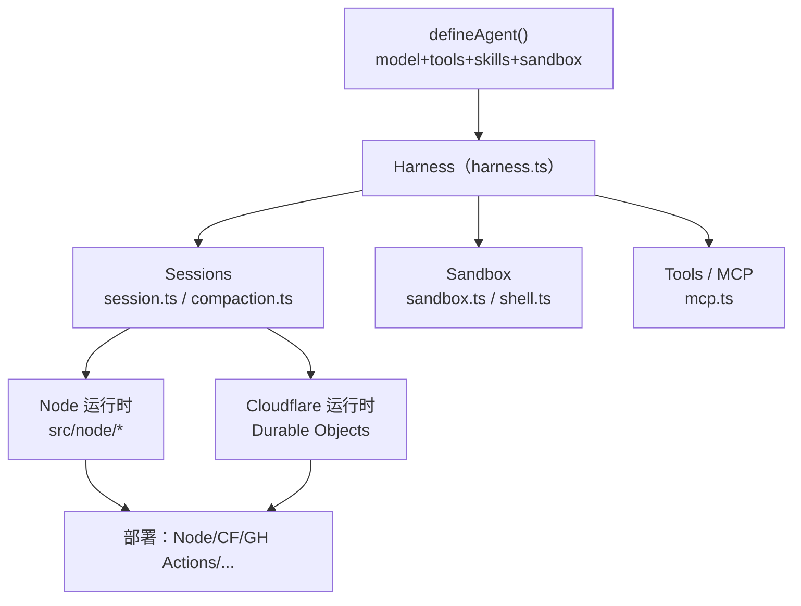

# withastro/flue 深度研究报告

> The sandbox agent framework. —— 由 Astro 团队打造的 TypeScript "agent harness（运行框架）"，为任意模型提供会话、工具、技能、文件系统与安全沙箱。

## 项目概述

withastro/flue 是 Astro 团队（创始人 Fred K. Schott 主导）推出的开源 **agent harness 框架**，定位刻意区别于"又一个 SDK"——README 第一句即 "Not another SDK"[README]。它的核心主张是：第一代 agent 靠裸 LLM API 调用拼装，只能做简单 chatbot；而 Claude Code、Codex 这类"真正的 agent"是自主的——你交给它一个目标而非预定义步骤，它用你提供的上下文和工具自主完成。Flue 要做的就是把这种"自主 agent 架构"产品化：给任意模型配齐 sessions、tools、skills、instructions、文件系统访问和一个安全 sandbox[README]。

从代码看，它是一个 pnpm + turbo 管理的 monorepo，对外发布 5 个 npm 包，核心是 `@flue/runtime`（harness、会话、工具、沙箱），辅以 `@flue/cli`（`flue` 二进制）、`@flue/sdk`（消费已部署 agent 的客户端）、`@flue/opentelemetry` 与 `@flue/postgres` 适配器[代码：根 README Packages 表 + packages/ 目录树]。它强调"一次编写、随处部署"：支持 Node.js、Cloudflare Workers、GitHub Actions、GitLab CI、Daytona、Render 等多种运行时[README]。

项目以 TypeScript 为绝对主语言（约 309 万字节，另含 Astro 文档站点 126 KB），采用 Apache-2.0 协议，于 2026 年 2 月 7 日创建。截至 2026 年 6 月 25 日已获 6654 Stars、371 Forks、14 个开放 Issue，19 名贡献者，最新版本为 `v1.0.0-beta.5`（2026-06-24）[API]——是一个起步约 4 个月、由 Astro 核心团队高强度推进、正冲刺 1.0 正式版的框架级项目。

---

## 基本信息

| 指标 | 数值 |
|------|------|
| Stars | 6654 |
| Forks | 371 |
| 开放 Issues | 14 |
| 语言 | TypeScript（含 Astro / MDX 文档） |
| 开源协议 | Apache-2.0 |
| 创建时间 | 2026-02-07 |
| 最近推送 | 2026-06-25 |
| 默认分支 | main |
| 维护方 | Astro 团队（withastro） |
| 主导者 | Fred K. Schott（Astro 联合创始人） |
| 官网 | [https://www.flueframework.com](https://www.flueframework.com) |
| 最新版本 | v1.0.0-beta.5（2026-06-24） |
| GitHub | [https://github.com/withastro/flue](https://github.com/withastro/flue) |

---

## 技术分析

### 技术栈

[代码：根 `package.json`]

- **包管理与构建**：pnpm 11 + turbo（monorepo workspace），要求 Node ≥ 22。
- **代码质量工具链**：Biome（lint/format）+ knip（无用导出检测）+ prettier + TypeScript 6.0.3（在 `pnpm.overrides` 中锁版本）。
- **运行时核心依赖**：`valibot`（轻量 schema 校验，替代 zod 的取向）、`just-bash`（shell 执行）。
- **测试**：turbo 统一驱动，`packages/cli/test` 下含大量 `.test.ts` 与针对 Cloudflare 的集成测试。

### 架构设计（基于真实源码）

`@flue/runtime` 的 `src/` 目录揭示了 harness 的真实结构[代码：packages/runtime/src 目录树]：

- **harness.ts** — 核心类 `Harness implements FlueHarness`，统一管理 `sessions`（get/create/delete），是"agent 自主工作环境"的入口[代码：harness.ts]。
- **会话与持久化** — `session.ts` / `agent-execution-store.ts` / `json-snapshot.ts`，并有 `compaction.ts`（上下文压缩，应对长会话 token 膨胀）。
- **沙箱** — `sandbox.ts`（`createFlueFs` 虚拟文件系统 + `createCwdSessionEnv`）、`shell.ts`（`execShellWithEvents`），对应 README 的 "virtual / local / remote container sandbox"。
- **双运行时适配** — `src/node/` 与 `src/cloudflare/` 并列实现 `agent-coordinator` / `agent-execution-store`；Cloudflare 侧用 Durable Objects（`registry-do.ts`、`cf-sandbox.ts`、`workers-ai-provider.ts`），印证"durable execution + 多运行时部署"不是营销话术而是代码事实[代码]。
- **协议与安全** — `mcp.ts`（MCP 工具接入）、`event-redaction.ts`（事件脱敏）、`execution-interceptor.ts`（执行拦截）。

### 核心功能

[README + 代码交叉验证]

- **Agents / Subagents**：跨对话与事件保持上下文的自主 agent，可委派给专门化子 agent。
- **Workflows**：用代码引导 agent 推理，从明确输入走到成品的结构化自动化。
- **Durable Execution**：通过失败与重启保留进度（代码层由 execution-store + 快照支撑）。
- **Skills**：把可复用专长打包成 `SKILL.md`，用 `import ... with { type: 'skill' }` 加载（README 示例可见）。
- **Channels**：从 Slack/Teams/Discord/GitHub 接收"已验证"事件（`blueprints/channel--*.md`）。
- **Observability**：OpenTelemetry / Braintrust / Sentry 适配。

---

## 社区活跃度

### 贡献者分析

项目共 **19 名贡献者**，但提交高度集中于 Astro 创始人[API]：

| 贡献者 | Commits（contributions） |
|--------|--------------------------|
| FredKSchott（Fred K. Schott，Astro 创始人） | 961 |
| stainlu | 4 |
| cpojer | 4 |
| ketankhairnar | 3 |
| elithrar | 2 |
| github-actions[bot] | 2 |

FredKSchott 一人贡献占绝对主导（961 次，占总量约九成以上），最近 8 条提交几乎全部出自他手[API]。这是典型的"创始人主导早期框架"形态——速度快、方向统一，但社区贡献尚未规模化。值得注意的是 `.github/APPROVED_CONTRIBUTORS` 与 `approve-contributor.yml` 工作流的存在，说明项目对外部贡献采取**审批准入**机制[代码]。

### Issue/PR 活跃度

开放 Issue 仅 14 个[API]，相对 6654 Stars 属极低未决量，反映维护者响应迅速、且项目仍以核心团队内部推进为主。最近提交普遍带 PR 编号（如 #356），编号规模与 4 个月周期相称。

### 量化提交信号

近 52 周共 989 次提交；**近 8 周提交量为 [53, 62, 54, 141, 81, 304, 117, 25]，周均约 104.6 次，明显高于"有提交的活跃周"均值 76.1**[API：commit_activity]。其中出现单周 304 次的峰值，与冲刺 1.0-beta 的密集发布吻合——这是数据驱动的"高强度冲刺期"判断，而非"几乎每天提交"式的定性描述。

---

## 发展趋势

### 版本演进

项目尚无 GitHub Release，但通过 tag 可见清晰的版本轨迹[API：tags]：

| 版本 tag | 阶段 |
|----------|------|
| v1.0.0-beta.5 | 1.0 冲刺（最新） |
| v1.0.0-beta.4 / beta.3 / beta.2 / beta.1 | 1.0 beta 系列 |
| v0.11.1 / v0.11.0 | 0.x 稳定迭代 |
| v0.10.2 / v0.10.1 / v0.10.0 | 早期迭代 |

从 0.10 → 0.11 → 1.0-beta 的跨越发生在数月内，当前正处于 **1.0 正式版的最后冲刺阶段**。最近提交主题（简化 read 工具、修复 Cloudflare Agents schema 升级、修复 React agent transcript 顺序）显示重心在打磨 API 稳定性与 Cloudflare 集成[API：commits]。

### 演进方向

结合代码与文档，重心在三条线：**多运行时部署深度**（Node + Cloudflare Durable Objects 双实现）、**自主 agent 能力闭环**（sessions/compaction/durable execution/subagents）、**生态对接**（MCP、Channels、OpenTelemetry/Braintrust/Sentry 适配）。`blueprints/` 与 `apps/ecosystem-catalog.ts` 表明它在主动建设可复用蓝图与生态目录。

### 社区背景

项目挂在 `withastro` 组织下、由 Astro 创始人主导、配有独立官网与文档站（`apps/docs` 用 Astro 自建），是 Astro 团队从"前端框架"向"agent 基础设施"的延伸尝试。[推测：商业化路径可能与托管运行时/Cloudflare 部署相关，但仓库未明确]

---

## 竞品对比

| 项目 | Stars | 语言 | 协议 | 特点 |
|------|-------|------|------|------|
| [withastro/flue](https://github.com/withastro/flue) | 6654 | TypeScript | Apache-2.0 | 本项目；harness 取向，内置沙箱+durable execution+多运行时 |
| [langchain-ai/langgraph](https://github.com/langchain-ai/langgraph) | 35705 | Python | MIT | 图式 agent 编排，生态最大，Python 主导 |
| [mastra-ai/mastra](https://github.com/mastra-ai/mastra) | 25439 | TypeScript | NOASSERTION | TS agent 框架，功能全面，最直接竞品 |
| [vercel/ai](https://github.com/vercel/ai) | 25126 | TypeScript | NOASSERTION | AI SDK，偏底层模型接入与 UI，定位为"SDK" |
| [lastmile-ai/mcp-agent](https://github.com/lastmile-ai/mcp-agent) | 8382 | Python | Apache-2.0 | 围绕 MCP 的 agent 构建，Python |
| [cloudflare/agents](https://github.com/cloudflare/agents) | 5165 | TypeScript | MIT | Cloudflare 官方 agent 框架，与 Flue 的 CF 运行时重叠 |

[竞品 stars/协议/语言均为 `gh` 实测，2026-06-25]

**定位差异**：langgraph 体量最大但 Python 生态、偏编排图；vercel/ai 自我定位为 SDK（正是 Flue 要区隔的对象）；mastra 是最贴近的 TS agent 框架竞品；cloudflare/agents 在 Cloudflare 运行时上与 Flue 直接重叠。Flue 的差异化在于**"harness 而非 SDK"的理念 + 内置安全沙箱 + durable execution + Node/Cloudflare 双运行时**——它把"给 agent 一个能自主干活的完整环境"作为一等公民，而非只提供模型调用封装。Astro 团队的工程品牌与文档能力是其额外加分项。

---

## 总结评价

### 优势

1. **理念清晰且有代码支撑**："harness 而非 SDK" 不是口号——sandbox.ts、compaction.ts、durable execution store、双运行时适配都在代码里落地[代码]。
2. **多运行时与 durable execution**：Node + Cloudflare Durable Objects 双实现，部署目标覆盖广，契合生产级自主 agent 需求。
3. **工程质量高**：Biome+knip+turbo+严格 TS 锁版本、大量集成测试，体现 Astro 团队一贯的工程水准。
4. **响应迅速、方向统一**：开放 Issue 仅 14、近 8 周周均约 104.6 次提交，冲刺 1.0 节奏强。

### 劣势

1. **巴士因子极高**：约九成提交来自 Fred K. Schott 一人，社区贡献尚未规模化，且采用审批准入[代码/API]。
2. **尚未 1.0、API 不稳定**：仍在 beta 冲刺，最近提交多为 API 调整，早期采用者需承担 breaking change 风险。
3. **生态后发**：相比 langgraph/mastra/vercel-ai 的体量与生态，Flue 起步晚、第三方集成与案例仍少。
4. **理念门槛**："harness" 心智模型需要使用者从"调 API"转向"给 agent 配环境"，学习曲线偏陡。

### 适用场景

- **构建生产级自主 agent**：需要沙箱隔离、durable execution、多运行时部署的团队。
- **Cloudflare/Node 技术栈的 TS 团队**：尤其已在 Cloudflare Workers 生态、想要原生 Durable Objects 支持者。
- **研究 agent harness 架构**：sandbox/compaction/session 的优秀 TS 参考实现。
- **不适合**：求稳的生产项目（未到 1.0）、Python 优先团队、只需轻量模型调用封装的场景（vercel/ai 更合适）。

---

*报告生成时间: 2026-06-25*
*研究方法: github-deep-research 多轮深度研究*
