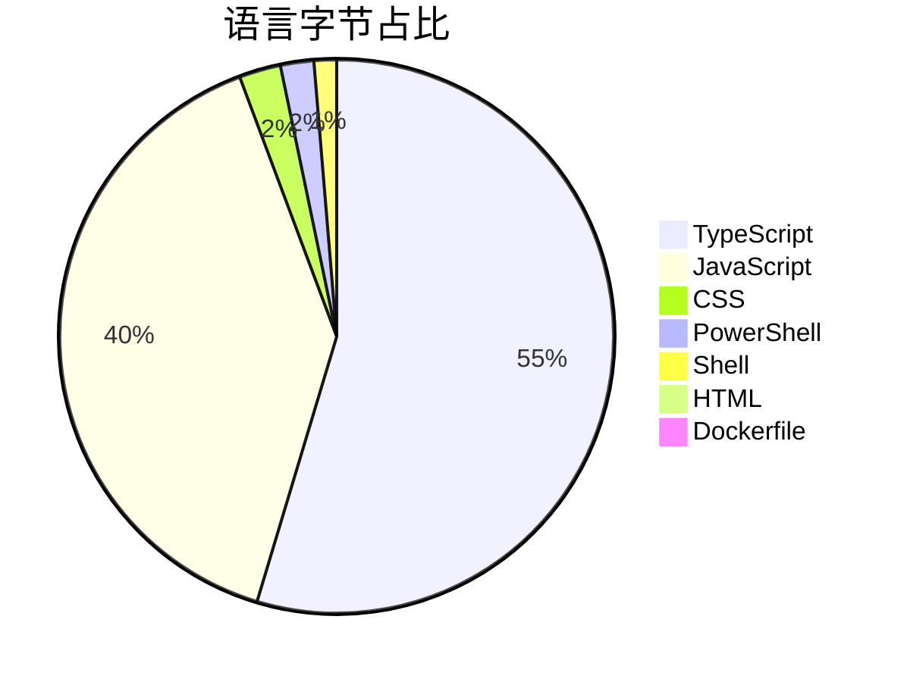
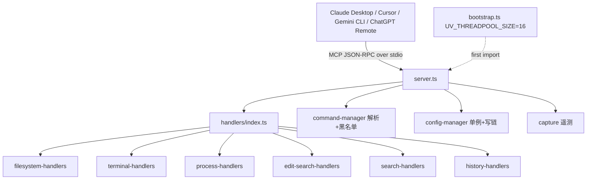
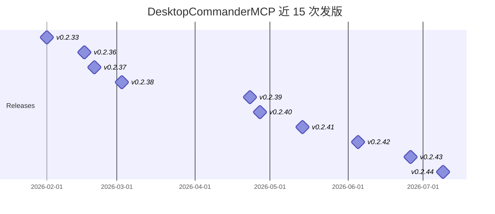
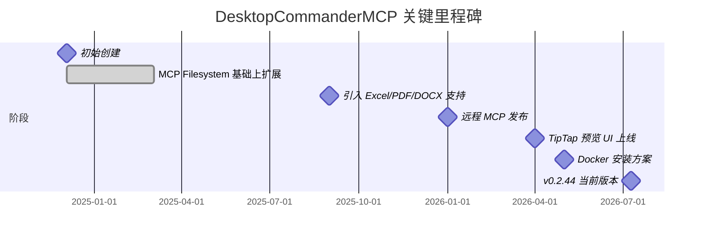

# DesktopCommanderMCP — 仓库深度研究报告

> 一款让 Claude（以及任何兼容 MCP 的客户端）拿到本机终端控制权、文件系统搜索与 diff 编辑能力的 Model Context Protocol 服务器，是 MCP 生态中最早把"终端 + 文件 + 进程"三件套打通的桌面型代理工具。

---

## 项目概述

DesktopCommanderMCP（npm 包名 `@wonderwhy-er/desktop-commander`）是一个基于 TypeScript 实现的 MCP（Model Context Protocol）服务器，目标是把本机的终端命令、文件系统、长时间运行的进程以及富文本编辑能力全部暴露为 LLM 可调用的工具集[README]。项目自描述为"MCP server for Claude that gives it terminal control, file system search and diff file editing capabilities"[API]。

项目的核心定位差异在于：**它把"在 Claude 中跑开发任务"从纯对话推进到了能在沙箱里真实执行命令、读写文件、操作进程的状态**[README]。除官方 MCP Filesystem Server 的基础能力外，它额外提供了交互式进程管理、超时与后台执行、会话分页读取、Excel/PDF/DOCX 原生支持、Markdown 实时预览 UI、命令黑名单与绕过防护、审计日志、以及 Docker 隔离安装选项[README]。

商业模式上，作者同时推出了桌面端"Desktop Commander App (Beta)"——同一套 MCP 服务器能力，外加可视化文件预览、模型切换、计划中的 skills/dictation/scheduled tasks 等扩展，并以 macOS/Windows 安装包分发[README]。这意味着该项目本身是开源引流入口，而完整产品体验走付费桌面应用（Buy Me A Coffee 与 Discord 社群为可见支持通道）[推测]。

## 基本信息

| 字段 | 值 | 来源 |
|------|----|------|
| 仓库 | `wonderwhy-er/DesktopCommanderMCP` | [API] |
| 描述 | MCP server for Claude that gives it terminal control, file system search and diff file editing capabilities | [API] |
| Stars / Forks / Watchers | 6,968 / 894 / 6,968 | [API] |
| Open Issues | 153 | [API] |
| Subscribers | 109 | [API] |
| 主语言 | TypeScript | [API] |
| 许可证 | MIT | [API] |
| 创建时间 | 2024-12-04 | [API] |
| 最近推送 | 2026-07-09 | [API] |
| 最新发布 | v0.2.44（2026-07-09） | [API] |
| 主页 | https://desktopcommander.app/ | [API] |
| NPM 包名 | `@wonderwhy-er/desktop-commander`（mcpName: `io.github.wonderwhy-er/desktop-commander`） | [代码] |
| Topics | agent, ai, code-analysis, code-generation, gemini-cli-extension, mcp, terminal-ai, terminal-automation, vibe-coding | [API] |

**语言字节占比**[API]：



注意 TypeScript + JavaScript 字节合计约 1.6 MB，PowerShell + Shell + Dockerfile 约 58 KB，CSS 43 KB——前者是核心运行时，后者是跨平台安装脚本与 Web 资源。

## 技术分析

### 3.1 整体架构

仓库顶层目录分为 6 类资产：`src/` 是运行时核心（TypeScript），`skills/` 是面向 Claude/Cursor/Gemini 三类客户端的 SKILL 文档，`scripts/` 是构建/发布/日志工具，`plugins/` 是客户端集成包，`rules/` 是 MCP 规则文件，`dist/` 是 `npm publish` 的产物[代码]。这种"运行时核心 + 多端客户端技能"的双层结构是 MCP 生态项目里较成熟的形态。

`src/` 内部按职责拆分为 6 个 handler 模块——`filesystem-handlers.ts`、`terminal-handlers.ts`、`process-handlers.ts`、`edit-search-handlers.ts`、`search-handlers.ts`、`history-handlers.ts`——通过 `handlers/index.ts` 统一 barrel 导出[代码]：

```typescript
// src/handlers/index.ts
export * from './filesystem-handlers.js';
export * from './terminal-handlers.js';
export * from './process-handlers.js';
export * from './edit-search-handlers.js';
export * from './search-handlers.js';
export * from './history-handlers.js';
```

入口 `src/index.ts` 显式注释"MUST be first"，先 import `./bootstrap.js`，再按顺序加载 transport → configManager → featureFlagManager → server.connect[代码]。这种"首 import 副作用"的写法是为了在 libuv 线程池首次初始化前就把 `UV_THREADPOOL_SIZE` 调到 16（默认仅 4），否则在 `claude -p` 并发场景下慢文件系统读取会卡住整个线程池、引发分钟级工具调用挂起[代码]。这是真实生产环境压出来的硬核优化。

### 3.2 关键依赖分析

`package.json` 揭示出远超"terminal + filesystem"的依赖图谱[代码]：

| 类别 | 依赖 | 用途推断 |
|------|------|---------|
| MCP 协议 | `@modelcontextprotocol/sdk@^1.9.0` | 协议核心 |
| 富文本编辑 | `@tiptap/core` + `@tiptap/starter-kit` + `tiptap-markdown` + 4 个扩展（image/table/cell/header/row） | 内置 Markdown 编辑器与文件预览 UI |
| 代码搜索 | `@vscode/ripgrep@^1.15.9` | 跨平台 ripgrep 二进制分发（替代 `grep`/`rg`） |
| 文档解析 | `exceljs`、`pdf-lib`、`@opendocsg/pdf2md`、`unpdf`、`pizzip`、`remark/remark-gfm` | Excel/PDF/DOCX 原生读写 |
| 图像 | `sharp@^0.34.5`、`file-type`、`isbinaryfile` | 二进制识别与图像处理 |
| 云端 | `@supabase/supabase-js@^2.89.0` | 远程 MCP 的后端存储（推测为遥测/反馈收集） |
| 校验 | `zod@^3.24.1`、`zod-to-json-schema@^3.23.5` | 工具参数 schema |
| 其他 | `open`、`markdown-it`、`md-to-pdf`、`highlight.js`、`fastest-levenshtein`、`caffeinate`（可选） | 跨平台 shell 唤起、PDF 生成、相似度匹配、Mac 防休眠 |

仅从依赖清单就能看到项目实际承担了"AI 桌面控制中枢"的角色，远不止 README 中"terminal + filesystem + diff"三件套。

### 3.3 安全设计：命令黑名单与绕过防护

`src/command-manager.ts` 的 `extractCommands` 方法实现了一个带引号感知、转义感知的命令拆分器，专门处理 `;`/`&&`/`||`/`|`/`&` 等连接符以及 `$(...)`、反引号子命令替换[代码]。注释明确写道"fixes blocklist bypass"——意味着早期版本曾被通过命令替换绕过黑名单，作者为此做了专门加固。

```typescript
// src/command-manager.ts 节选：识别 $() 子命令替换
if (char === '$' && i + 1 < commandString.length && commandString[i + 1] === '(') {
    const startIndex = i;
    let openParens = 1;
    let j = i + 2;
    while (j < commandString.length && openParens > 0) {
        if (commandString[j] === '(') openParens++;
        if (commandString[j] === ')') openParens--;
        j++;
    }
    // 递归提取子命令
    const subCommands = this.extractCommands(subContent);
    commands.push(...subCommands);
    ...
}
```

### 3.4 配置与会话管理

`config-manager.ts` 采用单例 + 写入链（writeChain Promise 序列化）防止并发保存破坏 `config.json`，并通过 `_isFirstRun` 标记区分首次安装场景[代码]。配置支持任意扩展键（含 `abTest_*` A/B 测试键），并把 telemetryEnabled、blockedCommands、allowedDirectories 等开放为可热修改项，避免修改后需要重启 MCP 服务器[README]。

`server.ts` 揭示了完整的 MCP 能力声明：`tools`、`resources`、`prompts`、`logging` 四类全部声明[代码]。`tools/schemas.js` 注册了 20+ 工具的 zod schema（StartProcess、ReadProcessOutput、InteractWithProcess、ForceTerminate、ListSessions、KillProcess、ReadFile、ReadMultipleFiles、WriteFile、CreateDirectory、ListDirectory、MoveFile、GetFileInfo、GetConfig、SetConfigValue、ListProcesses、EditBlock、GetUsageStats、GiveFeedback、StartSearch、GetMoreSearchResults、StopSearch、ListSearches、GetPrompts、GetRecentToolCalls、WritePdf 等）[代码]。

### 3.5 远程 MCP 与遥测

`server.ts` 顶部声明了 `currentCallIsRemote` 与 `currentRemoteClient` 两个模块级变量，并在每次 CallTool 时由 `_meta.remote` 元数据判定真伪，使得深层 handler 内的遥测事件能正确归属"remote openai-mcp"或"local Claude Desktop"[代码]。遥测通过 `capture(...)` 包装到 `utils/capture.js`——`postinstall` 阶段运行 `track-installation.js` + `verify-ripgrep.js` 是唯一的安装期副作用[代码]。

### 3.6 技术架构示意



## 社区活跃度

### 4.1 贡献者分布

按提交数排序的头部贡献者[API]：

| 排名 | 贡献者 | 提交数 | 占比 |
|------|--------|--------|------|
| 1 | wonderwhy-er（项目作者） | 369 | 67.2% |
| 2 | serg33v | 78 | 14.2% |
| 3 | edgarsskore | 35 | 6.4% |
| 4 | Fancyhe1 | 8 | 1.5% |
| 5 | dmitry-ottic-ai | 8 | 1.5% |

全仓库共 33 位贡献者[API]，但前 5 名贡献了 91% 以上的提交。作者单人占比 67%，存在一定的 bus factor 风险，但相比纯单人项目，第二位 serg33v（78 commits）已形成稳定的副维护者位置[推测]。

### 4.2 发版节奏

近 15 次发布[API]：



约每 2–3 周一个版本，从 v0.2.33（2026-02-01）到 v0.2.44（2026-07-09）跨度 5 个月共 12 个版本，无 alpha/beta/rc 标记——属于稳定的迭代节奏，而非试验性快速发布[API]。

### 4.3 提交活跃度量化

近 52 周（截至 2026-07-10）的提交分布[API]：

- 总提交：239 次
- 周均：4.60 次/周
- 非零周：43 / 52（活跃度 82.7%）
- 零提交周：9 / 52
- 最近 8 周均值：4.38 次/周
- 前 44 周均值：4.64 次/周

最近 8 周相对前 44 周下降 5.6%，但 2026-05-31 单周 15 次提交、2026-07-05 单周 9 次提交说明存在显著的"发版前冲刺"模式[API]。

### 4.4 Issue 响应概况

最近 100 个 issue 的创建时间分布显示高频日集中在 2026-07-09（8 条）与 2026-07-10（5 条）[API]。这与最近发版（v0.2.44，2026-07-09）后用户集中反馈新行为/新问题的模式吻合。最近 30 天内关闭 issue 数 35 条[API]，响应节奏稳定。

抽样 issue 标题暴露出当前的安全讨论焦点（截至 2026-07-10）[API]：
- `[Security] Command Blocklist Bypass via Newline Injection in start_pro...` (#556)
- `[Security] Command Blocklist Bypass via Shell Variable Expansion ${} i...` (#555)
- `interact_with_process bypasses blockedCommands — missing validateComma...` (#552)
- `edit_block silently truncates file to pre-edit byte length when replac...` (#554)
- `fix: harden process tools and validation` (#551)

社区在主动发现并报告命令黑名单的边界绕过场景，作者则在同步推送硬化补丁——这是一个健康的"安全研究 ↔ 维护响应"循环。

## 发展趋势

### 5.1 项目里程碑



里程碑中的阶段日期为基于发版与 README 演变的近似推断[推测]，确切节点需结合 commit history 验证。

### 5.2 当前关注焦点

从近 30 天 issue 主题看，三条主线[API]：

1. **安全硬化**：命令黑名单绕过仍是社区持续 stress test 的方向（变量展开、新行注入、`interact_with_process` 旁路），作者在同步加补丁；
2. **编辑器健壮性**：`edit_block` 在替换长度不一致时的字节级截断问题；
3. **PDF 生成稳定性**：`write_pdf` Chrome 自愈获取逻辑。

### 5.3 路线图推断

README 提及"Desktop Commander App (Beta)"未来计划加入：skills system、dictation、background scheduled tasks[README]。这些是 GUI 端能力，不会直接改变 MCP 服务器本身[推测]。MCP 服务器侧的演进方向更可能围绕：(a) 多客户端稳定接入（Claude/Cursor/Gemini 已各有 plugins 目录）；(b) Remote MCP（让 ChatGPT 等也能调用）；(c) 沙箱隔离（Docker 已就位）[推测]。

### 5.4 增长信号

- 6,968 stars 与 894 forks 在 MCP 生态同类工具中处于头部梯队[API]；
- 109 名 subscribers、153 个 open issues 表明有持续关注与反馈[API]；
- 已上线 npmjs、Smithery、Glama、Archestra、AgentAudit 五个分发/认证渠道[README]；
- 主页 `desktopcommander.app` 提供专门的下载与 App beta 体验[README]。

## 竞品对比

为避免凭印象对比，本节所有数据均来自 `gh api repos/...` 实时查询（查询时间 2026-07-10）[API]：

| 项目 | Stars | 主语言 | 协议 | 最近推送 | 定位差异 |
|------|------:|--------|------|----------|---------|
| **wonderwhy-er/DesktopCommanderMCP** | 6,968 | TypeScript | MIT | 2026-07-09 | 终端 + 文件 + 进程 + 富文本 + Docker 隔离，单包一站式 |
| modelcontextprotocol/servers | 88,308 | TypeScript | NOASSERTION | 2026-07-10 | 官方 MCP servers 集合（含 filesystem 等子模块），功能基础、官方背书 |
| cline/cline | 64,520 | TypeScript | Apache-2.0 | 2026-07-10 | IDE 形态 AI 编程助手，自带终端/文件但需要 VS Code 载体 |
| mark3labs/mcp-filesystem-server | 664 | Go | MIT | 2025-11-24 | 纯文件系统 MCP server，跨语言实现但功能极简 |
| isaacphi/mcp-language-server | 1,567 | Go | BSD-3-Clause | 2026-03-01 | LSP 协议桥接，主打代码智能而非文件/终端 |
| cyanheads/filesystem-mcp-server | 42 | TypeScript | Apache-2.0 | 2025-07-22 | 第三方 filesystem 实现，活跃度低 |
| odysseus0/mcp-server-shell | 6 | Python | 无 | 2024-12-12 | 早期 shell MCP server 雏形，已停滞 |

**对比结论**[API][README]：

- **vs 官方 `modelcontextprotocol/servers`**：官方仓库是参考实现集合，star 数量级更高但模块分散，DesktopCommanderMCP 把"terminal + filesystem + diff" 一次性集成且加上黑名单/审计/UI 等企业级补丁，对个人开发者更开箱即用；
- **vs `cline/cline`**：Cline 是完整的 VS Code AI 代理（含 GUI/审批流），star 数量约 10 倍但依赖 IDE；DesktopCommanderMCP 是无 IDE 依赖的纯 MCP server，可被任何兼容客户端调用；
- **vs 其他 filesystem-mcp**：其他实现多数仅覆盖官方 filesystem server 的功能子集（Go/Python 轻量版），star 数都在千以下，且无 Rich Text Preview、PDF/Excel 支持、远程 MCP 等高级能力。

## 总结评价

### 7.1 优势

- **能力全面**：在单一 MCP 服务器内同时提供终端、进程、文件系统、Excel/PDF/DOCX、Markdown 编辑器、远程 MCP、Docker 隔离等能力，是 MCP 生态中"功能密度"最高的桌面控制类项目之一[代码][README]；
- **生产级硬化**：`bootstrap.ts` 调整 libuv 线程池、`command-manager.ts` 防御命令替换绕过、`config-manager.ts` 序列化写入避免配置文件损坏——这些都不是 demo 级别的代码[代码]；
- **分发渠道广**：npm、Smithery、Glama、Archestra、AgentAudit 五渠道同步上架，安装路径覆盖 npx/bash/Docker/manual 6 种[README]；
- **商业模式清晰**：开源 MCP 服务器引流，付费桌面 App 变现，且桌面 App 复用同一套运行时[README][推测]。

### 7.2 风险

- **bus factor 偏高**：作者单人贡献 67%，第二位 serg33v 14%，核心决策仍高度依赖 wonderwhy-er[API]；
- **安全面持续暴露**：issue 中持续出现命令黑名单旁路报告，说明 LLM 代理能力扩大后攻击面同步扩大，需要持续投入安全加固[API]；
- **依赖膨胀**：30+ 直接依赖，包含 TipTap 全家桶、Supabase JS、pdf 工具链等，安装包体积与冷启动时间都会受影响[代码][推测]；
- **依赖闭源服务**：`@supabase/supabase-js` 暗示某些功能依赖外部云服务，离线环境可能受限[代码][推测]。

### 7.3 适用场景

- **个人开发者**：想要 Claude/Cursor/Gemini CLI 中真正能跑命令、改文件、看 PDF、操作 Excel 的"代理式工作流"[README]；
- **企业内部**：需要可审计、可配置、命令黑名单可控的 AI 代理运行时，且能 Docker 隔离部署[README]；
- **远程 MCP 场景**：希望 ChatGPT Web/Claude Web 等远程客户端也能调度本机工具[README]。

### 7.4 不适用场景

- 严格的离线/无 Node.js 场景（除非走 Docker 安装路径）[README]；
- 仅需极简文件系统读写的轻量场景（此时官方 filesystem server 已足够）[API]；
- 想要 IDE 形态 AI 助手（含 GUI 审批流）的用户（应直接选 Cline 等）[API]。

### 7.5 总体评价

DesktopCommanderMCP 是 MCP 生态中"把终端控制力做到生产级"的代表性项目：6,968 stars 与 ~2–3 周的发版节奏证明了真实需求；TipTap/Supabase/PDF/Excel 等重依赖暴露了它已经超出"轻量 server"范畴，朝"AI 桌面控制中枢"演进[API][代码]。对于希望在 MCP 客户端中真正执行开发任务而非仅做对话的用户，这是一个值得优先评估的选项；但若只需要最小文件系统读取能力，官方 filesystem server 会是更轻的选择。

---

*报告生成时间: 2026-07-10*
*研究方法: github-deep-research 多轮深度研究*