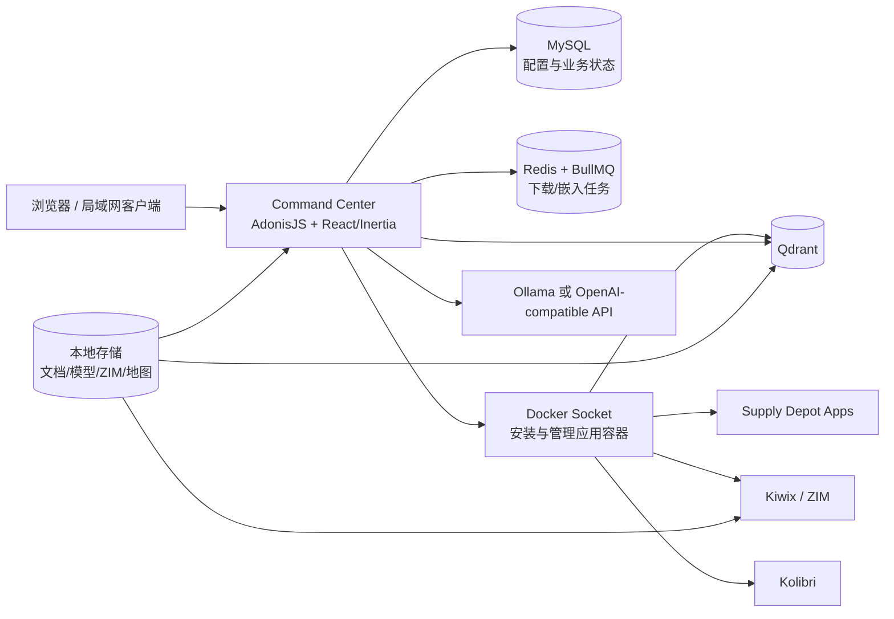

# Crosstalk-Solutions/project-nomad

> **一句话定位**：Project N.O.M.A.D. 不是单纯的“离线 LLM 知识库”，而是一台由 Docker 驱动的离线知识与教育服务器；本地 AI/RAG 只是其能力之一，Kiwix、Kolibri、离线地图、笔记和工具应用同样重要。

> **本次更新重点**：基于 `v1.33.0` 稳定线、`v1.34.0-rc.3` 预发布线、真实源代码、GitHub API 与 Apple Silicon 社区部署资料，重新评估其架构、RAG 质量、维护状态和在 MacBook Pro 上的可部署性。

## 项目概述

Project N.O.M.A.D. 全称 **Node for Offline Media, Archives, and Data**，目标是在断网后仍提供知识检索、教育课程、地图、文档处理和本地 AI。[README] 它通过一个名为 Command Center 的 Web 管理面统一安装和编排多个 Docker 容器，用户可按需下载 Wikipedia 等 ZIM 内容、Kolibri 课程、PMTiles 地图和本地模型。

它更接近“离线数字图书馆 + 本地应用商店 + AI 问答层”，而非 AnythingLLM、PrivateGPT 那种以文档 RAG 为中心的单用途产品。[代码] `admin/database/seeders/service_seeder.ts` 中的默认服务不仅有 Ollama 和 Qdrant，还包括 Kiwix、Kolibri、CyberChef、FlatNotes、Stirling PDF、File Browser、Calibre-Web、Excalidraw、Homebox、Vaultwarden、Jellyfin 等。

项目的真正价值在于**把多个成熟开源组件编排成一台可离线使用的知识设备**。它没有重新发明 Wikipedia、向量数据库或模型运行时，而是补上安装、内容管理、更新、监控和统一入口。[代码]

但它也有一个必须先理解的边界：截至 2026-08-01，官方只承诺 Debian/Ubuntu x86-64，官方三张核心 GHCR 镜像也只有 `linux/amd64`。[API][Web] Apple Silicon 可以通过社区 fork 或自建镜像运行，但不是官方支持路径。

## 基本信息

| 指标 | 当前值 |
|---|---:|
| GitHub | https://github.com/Crosstalk-Solutions/project-nomad |
| Stars | 35,302 |
| Forks | 3,535 |
| Watchers | 207 |
| 创建时间 | 2025-06-24 |
| 默认分支 | `main` |
| 默认分支最新提交 | 2026-07-24，`56cafe5` |
| 最新稳定版 | `v1.33.0`，2026-06-23 |
| 最新预发布版 | `v1.34.0-rc.3`，2026-07-27 |
| 主语言 | TypeScript，1,805,094 bytes，占 94.6766% |
| 第二语言 | Shell，80,791 bytes，占 4.2375% |
| 开源协议 | Apache-2.0 |
| 本次审阅文件量 | 默认分支 419 个 tracked files |

以上数字均来自 GitHub API 或本地克隆的仓库树，而非 README 中的模糊描述。[API]

### 分支现实

默认分支并非空壳，但它不是最新开发线：[API]

- `main`：419 个 blob，稳定线 `v1.33.0` 之后只有 3 个提交。
- `dev`：515 个 blob，包含 `v1.34.0-rc.3`。
- `rc`：516 个 blob。

因此，评估稳定部署应以 `v1.33.0`/`main` 为准；评估正在修复的 RAG、远程 Ollama 和 ARM 相关能力，则必须同时看 `dev`/RC。不能把预发布分支已经修复的能力误写成稳定版已有。

## 技术分析

### 总体架构

Command Center 后端是 AdonisJS 6，前端是 React 19 + Inertia，数据库使用 MySQL，后台任务使用 Redis + BullMQ。[代码] 管理容器挂载 `/var/run/docker.sock`，然后通过 `dockerode` 动态创建、更新和删除兄弟容器；这正是“一键装应用”的基础，也意味着 Command Center 实际拥有接近宿主机 root 的 Docker 控制权。

官方 compose 的核心服务包括：[代码]

- `nomad_admin`：Command Center，容器内监听 `8080`。
- `nomad_mysql`：持久化服务、设置、聊天等业务状态。
- `nomad_redis`：BullMQ 队列和实时状态。
- `nomad_dozzle`：容器日志查看。
- `nomad_updater`：从 UI 更新 Command Center。
- `nomad_disk_collector`：读取宿主文件系统信息。

后台 worker 不是漏配：稳定版 `install/entrypoint.sh` 会先迁移、seed 数据库，再以后台进程运行 `node ace queue:work --all`，最后启动 Web 服务。[代码]

### 离线内容层

Kiwix 负责 ZIM 格式的 Wikipedia、医学、技术文档和书籍；Kolibri 提供可跟踪进度的教育课程；PMTiles 提供离线地图。[代码] 内容、应用配置和模型通过 host bind mount 持久化，不随容器重建丢失。

`v1.33.0` 还加入 Supply Depot、可自定义 Docker 应用、核心/应用/内容三类自动更新和自定义存储路径。[API] 这让它从固定工具集合逐步变成离线家庭服务器控制面。

### AI 与 RAG 数据流

AI 后端并不强绑定容器内 Ollama。`OllamaService` 会先读取 `ai.remoteOllamaUrl`；若存在，就连接远程 Ollama、LM Studio、llama.cpp 或其他 OpenAI-compatible 服务，否则才寻找 `nomad_ollama` 容器。[代码]

远程服务通过 `/v1/models` 做连通性测试，聊天走 `/v1/chat/completions`，embedding 优先走 Ollama 原生 `/api/embed`，失败后回退 `/v1/embeddings`。[代码] 这对 Apple Silicon 很重要：控制面可以在 Linux 容器里，模型则在 macOS 原生运行以使用 Metal。

稳定版可识别的入库类型包括：[代码]

- 图片：JPG、PNG、GIF、BMP、TIFF、WebP，使用 Tesseract OCR。
- PDF：先提取文本；文本过少时转图片再 OCR。
- EPUB：解压 EPUB，按 spine/manifest 抽取 XHTML 正文。
- 纯文本：TXT、Markdown。
- ZIM：通过 `@openzim/libzim` 分批抽取文章与章节层级。
- `.docx` / `.rtf` 在稳定版被归为 `text`，但直接按 UTF-8 buffer 处理，不能视为可靠解析；`dev` 已为 DOCX 引入 `mammoth` 专门解析。[代码]

入库流程如下：[代码]

1. 提取文本并清理控制字符。
2. 以约 1,500 token 为目标切块，保留约 150 token overlap。
3. 每批 8 个 chunk 调用 `nomic-embed-text:v1.5`。
4. 生成 768 维向量，写入 Qdrant 的 `nomad_knowledge_base` collection。
5. 同时保存来源、chunk 序号、标题层级、关键词等 payload。

检索流程不是纯向量 Top-K：[代码]

1. 多轮对话先让聊天模型改写检索 query。
2. 为 query 加 `search_query:` 前缀，生成 embedding。
3. 从 Qdrant 取 `limit × 3` 个候选，默认阈值 0.3。
4. 叠加关键词命中、原始 query 词命中和标题命中三类保守加分。
5. 对同一来源重复结果施加 `0.85^n` 多样性惩罚。
6. 根据聊天模型参数规模，最多注入 2、4 或 5 个上下文块。

这是一个可理解、可维护的“dense retrieval + 手工特征 rerank”方案，不依赖额外 cross-encoder。[代码] 它的优点是离线、依赖少；局限是检索质量高度依赖固定 embedding 模型、手工阈值和英文关键词逻辑。

### RAG 对个人知识库的局限

当前实现明显带有“生存/应急知识设备”的产品偏好，而不是通用研究知识库：[代码]

- query expansion 词典内置 `BOB`、`EDC`、`SHTF`、`IFAK`、`CBRN` 等应急领域缩写。
- Tesseract worker 固定使用英语 `eng`。
- chunk 粒度与阈值是全局常量，没有按文档类型或中文语料校准。
- `nomic-embed-text:v1.5` 的 collection 维度固定为 768，换 embedding 模型通常需要重建索引。
- 截至 2026-08-01，聊天回答底部展示来源与日期仍是开放需求 #1179；模型能看到 context 标题，但用户端没有完整、持久化的 citation 列表。[API]

另有两个需要关注的数据治理问题：[API]

- #1119：ZIM 与 AI 知识库的入库同意粒度仍在讨论；项目已有全局 Always/Manual 策略，但本地上传路径曾绕过策略。
- #1170：删除或替换 ZIM 后，旧 Qdrant vectors 可能残留，参与后续检索。

因此，N.O.M.A.D. 适合做 EverAgent 的**离线阅览与辅助检索副本**，不适合直接替代 EverAgent 现有 Markdown 报告、原始来源、证据标签与 Git 历史。N.O.M.A.D. 的答案应视为导航，不应成为唯一事实源。[推测]

### 安全边界

README 明确说明系统默认**无身份认证**，不应直接暴露到公网。[README] 这不是普通 Web 应用的小缺陷，因为：

- Admin 挂载 Docker socket，可创建带任意 bind mount 的容器。
- Dozzle 可读取所有相关容器日志。
- 多个应用默认映射到宿主端口。
- Command Center 与部分子应用依赖“局域网可信”假设。

官方 compose 已关闭 Dozzle 的 action 和 shell，但这不能替代网络隔离。[代码] 合理部署应只绑定 loopback 或受控 LAN，并由防火墙、Tailscale ACL 或反向代理认证保护；绝不能把默认端口直接映射到公网。[推测]

### Apple Silicon 兼容性

截至本次核验：[API][Web]

- 官方 README/FAQ：只支持 Debian-based OS，推荐 Ubuntu。
- 官方安装脚本检测到非 x86-64 会明确警告；ARM 支持 PR #419 仍为 OPEN。
- 官方 `project-nomad`、`sidecar-updater`、`disk-collector` 的 `latest` 镜像均只有 `linux/amd64`。
- 维护者在 #419、#416、#644、#477 中多次确认：ARM/macOS 是未来方向，但当前不做端到端支持。
- Dockerfile 本身已出现 `TARGETARCH=arm64` 的 `go-pmtiles` 下载分支，服务更新代码也能识别 `aarch64 → arm64`，说明代码正在为多架构铺路，但发布链尚未完成。[代码]

社区已有两类 Apple Silicon 路径：[Web]

1. **macOS fork**：`caweis/project-nomad` 使用 OrbStack + 原生 Ollama/Metal，可选 MLX，并维护自己的多架构 admin image。
2. **Ubuntu ARM64 VM**：在 UTM 中构建 ARM64 容器，macOS 上用 LM Studio 做原生推理。

两者都证明“能跑”，但都不等于官方支持。`caweis` fork 自述 merge-base 仍在 2026-03，后续功能采用挑选式 forward-port；它有独立版本线、单维护者和未解决的卸载安全缺陷 #29。[API][Web]

## 社区活跃度

### 贡献者与巴士因子

GitHub contributors API 返回 31 名贡献者、659 次计入统计的 contributions：[API]

| 排名 | 贡献者 | Contributions | 占总数 |
|---|---|---:|---:|
| 1 | `jakeaturner` | 320 | 48.5584% |
| 2 | `chriscrosstalk` | 172 | 26.1002% |
| 3 | `cosmistack-bot` | 79 | 11.988% |

前两名合计 74.6586%，前三名合计 86.6464%。项目不是单人仓库，但核心开发高度集中，持续性仍明显依赖少数维护者。[API]

### Release 节奏

近 12 个 release 展示出“多轮 RC → GA”的明确节奏：[API]

- `v1.32.0-rc.2` 至 `rc.6`：2026-05-05 至 05-18。
- `v1.32.0`：2026-05-20。
- `v1.32.1`：2026-05-27。
- `v1.33.0-rc.1`：2026-06-09。
- `v1.33.0`：2026-06-23。
- `v1.34.0-rc.1` 至 `rc.3`：2026-07-21 至 07-27。

它不是“只发 latest、不做版本”的实验仓库；稳定版和 RC 分流清晰，这是部署可维护性的加分项。

### Commit 与 Issue 信号

默认分支近 52 周共 648 次提交，周均 12.4615；最近 8 周共 50 次，周均 6.25。[API] 但这个下降不能简单解释为项目衰退，因为 `dev`/`rc` 才承载 `v1.34` 开发，默认分支统计会低估实际开发活跃度。

Issue 搜索显示 38 个 open、465 个 closed（排除 PR）。[API] 对最近 100 个已关闭 Issue 的关闭周期计算：

- 中位数：8.1726 天。
- 25 分位：2.2375 天。
- 75 分位：19.5439 天。
- 17 个在 24 小时内关闭。
- 46 个在 7 天内关闭。

响应速度总体不错，但 38 个 open Issue 中不乏 RAG 数据一致性、自动入库、远程 Ollama 和 ARM 支持等结构性工作，不能只看关闭率。

## 发展趋势

### 从“离线生存电脑”走向离线应用平台

`v1.33.0` 的最大变化不是新增一个模型，而是 Supply Depot、自定义容器、应用更新、内容更新和存储迁移。[API] 这意味着项目中心正在从固定功能包转向“离线家庭服务器控制面”。

地图、书库、教育、PDF 工具、文件管理、密码管理和媒体服务器共同出现，使 N.O.M.A.D. 与典型 RAG 产品逐渐分化：AI 是统一入口之一，但不是唯一产品。

### RAG 正从“能用”走向数据治理

`v1.34` RC 线正在修复：[API][代码]

- 远程 Ollama thinking 字段兼容和客户端断开后的生成取消。
- Qdrant payload index 在每个文档上重复创建导致的大规模入库性能浪费。
- DOCX 的专门解析。
- 知识库 subject/collection 组织。
- 更细的模型 thinking 控制。

同时，来源展示、孤儿 vector 清理、ZIM 入库同意仍未完全落地。[API] 这说明项目已经越过“把文档塞进向量库”的原型阶段，开始面对真正知识库必然出现的 provenance、consent、reconciliation 和 lifecycle 问题。

### ARM/macOS 会来，但时间未定

ARM 多架构 PR #419 自 2026-03-20 开放至今仍未合并，维护者 7 月仍表示“会支持，但当前先把 x64 做好”。[Web] 因此不能把即将支持 ARM 当成短期确定事件。

更现实的判断是：社区 fork 会继续先行，官方逐步吸收通用修复；Apple Silicon 用户短期仍要承担自建镜像、fork 漂移和兼容性验证成本。[推测]

### 作为独立离线知识设备的价值

N.O.M.A.D. 与 EverAgent 没有产品集成关系。本报告保存在 EverAgent，只因为 EverAgent 是当前的研究知识库；实际部署目标是一套独立的离线知识服务器。[推测]

它适合在一台大内存、大硬盘设备上集中保存并提供：

1. **离线百科与参考资料**：Wikipedia、医学、维修、生存、技术文档等 Kiwix/ZIM 内容。
2. **离线课程**：Kolibri 与 Khan Academy 等教育资源。
3. **离线地图**：PMTiles 地图包。
4. **离线书库和工具**：电子书、PDF、笔记、文件管理与数据工具。
5. **可选本地 AI**：让 Ollama/LM Studio 对已下载资料进行问答和辅助检索。

其首要价值是“断网后资料仍在且可浏览”，AI/RAG 属于增强功能，不应反过来限定内容库的建设。

## 竞品对比

下表数值均于 2026-08-01 通过 GitHub API 实测：[API]

| 项目 | Stars | Forks | 语言 | 协议 | 最近推送 | 定位 |
|---|---:|---:|---|---|---|---|
| `Crosstalk-Solutions/project-nomad` | 35,302 | 3,535 | TypeScript | Apache-2.0 | 2026-07-31 | 离线知识、教育、地图、工具与 AI 的一体化服务器 |
| `iiab/iiab` | 1,915 | 138 | Jinja | GPL-2.0 | 2026-08-01 | 面向学校/社区和低功耗设备的 Internet-in-a-Box |
| `Mintplex-Labs/anything-llm` | 64,173 | 7,046 | JavaScript | MIT | 2026-07-31 | 以文档、workspace 和 Agent 为中心的本地/自托管 AI 知识库 |
| `open-webui/open-webui` | 147,485 | 21,426 | Python | API 返回 `NOASSERTION` | 2026-08-01 | 多模型聊天与知识库前端，生态与连接器更强 |
| `zylon-ai/private-gpt` | 57,391 | 7,599 | Python | Apache-2.0 | 2026-07-30 | 隐私优先的本地文档问答/RAG |

### 怎么选

- **想要断网后仍有 Wikipedia、地图、课程和一整套工具**：N.O.M.A.D. 最完整。
- **想在 Raspberry Pi/ARM 低功耗设备上稳定部署**：IIAB 的官方适配更成熟。
- **主要目标是个人文档 RAG 与多模型知识问答**：AnythingLLM、Open WebUI 或 PrivateGPT 更聚焦。
- **想把一台高性能主机变成家庭离线知识节点**：N.O.M.A.D. 的产品形态最接近目标，但目前 Apple Silicon 需要自行承担兼容层。

## 总结评价

### 核心优势

- **产品拼装完整**：不是只给一个聊天框，而是把离线内容、下载、服务、模型、地图和更新统一起来。
- **真实离线能力**：安装和内容下载完成后，核心功能可不依赖互联网。
- **复用成熟组件**：Kiwix、Kolibri、Qdrant、Ollama 等均有独立成熟生态。
- **RAG 代码可理解**：切块、embedding、Qdrant、手工 rerank 和来源多样性都有明确实现。
- **Release 与 Issue 响应健康**：稳定版/RC 分明，最近 100 个关闭 Issue 的中位周期约 8.17 天。
- **远程 AI 后端设计合理**：控制面与推理解耦，使原生 Metal、独立 GPU 主机或 LM Studio 成为可能。

### 主要风险

- **Apple Silicon 非官方支持**：官方镜像只有 amd64，不能把社区方案当零风险安装。
- **安全模型偏家电化**：默认无认证，同时握有 Docker socket，不宜直接暴露到不可信网络。
- **知识库 provenance 未完成**：用户端 citation、删除后的向量一致性和逐文件入库控制仍在演进。
- **RAG 偏英文应急语料**：关键词扩展、OCR 和默认 embedding 没有针对中文个人知识库优化。
- **核心贡献集中**：前两名贡献者占 74.6586%。
- **社区 macOS fork 漂移**：功能丰富但独立版本、单维护者、安装面和后台服务较大。

### 对 MBP 部署的判断

**硬件适合，官方软件路径不适合直接照抄。**

推荐的首轮方案不是执行任何 `curl | bash`，而是做一个**可回滚的最小 PoC**：

1. 固定官方 `v1.33.0` 源码与 commit。
2. 复用已安装的 Docker Desktop，不再引入第二套 OrbStack。
3. 尝试从官方源码本地构建 `linux/arm64` admin image；构建不过才评估固定 commit 的社区镜像。
4. 只启动 Admin + MySQL + Redis + Dozzle，暂不启用 updater、disk-collector 和 Supply Depot。
5. 宿主端口改为 `9090`，避开已有的 `127.0.0.1:8080` 服务。
6. 模型使用 macOS 原生 Ollama/Metal，经 `host.docker.internal:11434` 接入；不在 Docker 里再跑一套 Ollama。
7. 第一批只拉 `nomic-embed-text:v1.5`，复用一个现有聊天模型，不批量下载模型。
8. 先下载小型 Wikipedia/ZIM、少量课程或地图样本，验证离线浏览、内容管理、更新和 RAG；通过后再扩展到完整内容库。
9. 所有入口先限本机；通过后再讨论 LAN/Tailscale 访问和备份。
10. 验证通过后，才决定继续维护最小官方适配层，还是转向经审计的 macOS fork。

### 最终结论

Project N.O.M.A.D. 值得在高性能 MBP 上试，其价值点应定位为：

> **独立的离线知识与教育服务器：先把百科、书籍、课程、地图真正下载到本地，再用本地 AI 做增强检索。**

首轮 PoC 的成功标准不是“页面能打开”，而是：

- 原生 Metal 推理确实生效；
- 小型 ZIM、课程和地图样本可稳定下载、离线浏览和更新；
- 本地 AI 能检索已下载内容；
- 来源能回到原文；
- 删除/重建不产生幽灵向量；
- 不干扰 MBP 现有 Whisper、OpenClaw、Docker/Ollama 和端口；
- 停止 PoC 后能完整回滚。

满足这些门禁后，它才值得升级为 MBP 的长期常驻服务。

---
*报告生成时间: 2026-08-01*
*研究方法: github-deep-research 多轮深度研究*
