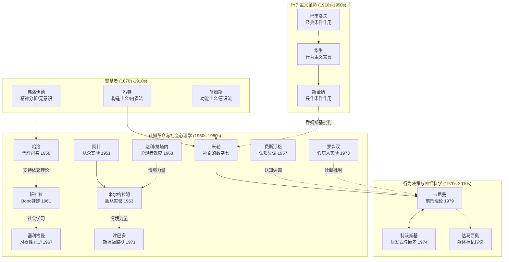

# 心理学关键人物图谱（更新版）

> 从冯特到卡尼曼：心理学 150 年的思想传承、范式冲突与理论演化
> 本版更新：加入 Bandura / Seligman / Harlow 等新精读作者，按领域与时代双重维度重新组织
> 创建日期：2026-03-24 | 更新日期：2026-04-22

---

## 阅读指南

本图谱不是简单的人名罗列，而是一张**思想关系网络**：
- 谁在回应谁？
- 谁推翻了谁？
- 谁因什么决裂？
- 谁的学生改变了整个领域？

带着"**这个人在和谁对话？**"的问题来读，会得到更深的理解。

---

## 第一代：奠基者（1870s–1910s）

### 威廉·冯特（Wilhelm Wundt, 1832–1920）
**核心贡献**：建立世界第一个心理学实验室（1879，莱比锡）；创立构造主义；将心理学从哲学中独立出来

**方法论遗产**：内省法（Introspection）——尽管后来被批判，但他坚持"心理学必须是实验科学"的信念塑造了整个学科

**学生网络**（冯特培育了第一代心理学家）：
- **铁钦纳（E.B. Titchener）** → 将构造主义带入美国（康奈尔大学）
- **斯坦利·霍尔（G. Stanley Hall）** → 美国第一位心理学 PhD；创立美国心理学会（APA）
- **卡特尔（James McKeen Cattell）** → 心理测量学先驱

**局限**：内省法的主观性导致"实验室之间结果互相矛盾"——这一矛盾直接催生了行为主义的革命

---

### 威廉·詹姆斯（William James, 1842–1910）
**核心贡献**：《心理学原理》（1890）；功能主义；意识流；情绪的詹姆斯-兰格理论

**关键洞察**：心理不应研究"结构是什么"，而应研究"功能是什么"——为进化心理学埋下伏笔

**与冯特的分歧**：冯特寻找意识的元素，詹姆斯关注意识的流动与功能。詹姆斯评价冯特的工作为"无聊至极的事实堆砌"

**影响链**：
- 实用主义哲学（杜威、皮尔斯）
- 行为主义（间接）——功能主义→关注行为功能
- 人本主义（间接）——对人类潜能的关注

---

### 西格蒙德·弗洛伊德（Sigmund Freud, 1856–1939）
**核心贡献**：精神分析；无意识理论；防御机制；人格三元结构（本我/自我/超我）；梦的解析；童年经历的决定性作用

**弗洛伊德的创新**：在一个只关注意识的时代，他说"最重要的心理活动发生在你看不见的地方"

**关键决裂：弗洛伊德与其学生**

```
弗洛伊德
    ├── 阿德勒（Alfred Adler）
    │   决裂原因：阿德勒强调"社会因素与自卑感"，而非性驱力
    │   → 个体心理学；"自卑与超越"
    │
    └── 荣格（Carl Jung）
        决裂原因：荣格拒绝弗洛伊德的泛性论；引入"集体无意识"
        → 分析心理学；原型；内向/外向人格类型（MBTI 的远祖）
```

**与行为主义的冲突**：弗洛伊德关注无法观察的内部过程；行为主义者认为这不是科学

**当代遗产**：防御机制概念被现代认知科学部分吸收（情绪调节领域）；依恋理论受其母婴关系理论影响；但大量具体主张（如恋母情结）缺乏实证支持

---

## 第二代：行为主义革命（1910s–1950s）

### 约翰·华生（John B. Watson, 1878–1958）
**核心贡献**：行为主义宣言（1913）；经典条件作用在人类情绪中的应用（小艾伯特实验）

**革命性主张**："给我打印出任意一打健康的婴儿……我保证能把其中任何一个训练成我所选择的任何类型的专家——医生、律师、艺术家、商人、乞丐或窃贼——而不论他的才能、倾向、能力、祖先种族。"

**影响**：将"先天论"与"后天论"的争论推向极端后天论；广告心理学的先驱（离开学术界后）

---

### 伊万·巴甫洛夫（Ivan Pavlov, 1849–1936）
**背景**：俄国生理学家，研究消化系统时意外发现条件反射

**核心贡献**：经典条件作用（Classical Conditioning）的实验基础——为行为主义提供了严格的生理学证据

**与华生的关系**：巴甫洛夫的发现被华生借用，作为行为主义的理论基础之一（尽管两人学术传统不同）

---

### 伯尔赫斯·斯金纳（B.F. Skinner, 1904–1990）
**核心贡献**：操作条件作用（Operant Conditioning）；斯金纳箱；强化程序；行为塑造（Shaping）；《超越自由与尊严》（1971）

**与华生的区别**：华生研究经典条件作用（被动），斯金纳研究操作条件作用（主动）

**关键争论：斯金纳 vs. 乔姆斯基（1959）**
```
斯金纳（1957）：《言语行为》
  主张：语言通过强化习得
      ↓
乔姆斯基（1959）：长篇书评批判
  反驳：儿童能产生从未听过的句子；语言有"贫乏刺激"问题
        → 语言必有先天的"语法装置"（LAD）
      ↓
结果：这场辩论是"认知革命"的标志性事件
     行为主义开始衰退；认知心理学兴起
```

---

## 第三代：认知革命与社会心理学黄金时代（1950s–1980s）

### 乔治·米勒（George A. Miller, 1920–2012）
**核心贡献**：《神奇的数字七》（1956）；工作记忆容量限制；认知科学奠基人之一

**历史地位**：将信息论方法引入心理学研究——这是认知革命的核心举措之一

**传承**：培育了认知科学家一代

---

### 所罗门·阿什（Solomon Asch, 1907–1996）
**核心贡献**：从众实验（1951）；群体压力下的知觉从众；规范性社会影响

**关键发现**：即使在客观明确的知觉判断任务中，群体的一致错误回答也能让约 75% 的被试至少从众一次

**影响链**：
```
阿什（1951）：在明显错误面前，人会服从群体压力（从众）
    ↓
米尔格拉姆（1963）：在道德上错误的命令面前，人会服从权威（服从）
    → 米尔格拉姆将阿什的实验推向了极致
```

---

### 斯坦利·米尔格拉姆（Stanley Milgram, 1933–1984）
**核心贡献**：服从权威实验系列（1963–1974）；六度分隔理论

**背景**：米尔格拉姆的导师是所罗门·阿什——米尔格拉姆想研究"从众在大屠杀中的作用"，于是设计了更极端的服从实验

**历史影响**：服从实验至今是心理学最著名的研究；直接推动了 APA 伦理准则的制定（1973年）

---

### 利昂·费斯汀格（Leon Festinger, 1919–1989）
**核心贡献**：认知失调理论（1957）；社会比较理论（1954）

**一个少为人知的故事**：费斯汀格最著名的早期研究是**潜入一个末世邪教**——当预言失败后，信徒反而更坚定了信仰。这一观察直接启发了认知失调理论。

**认知失调与自我辩护**：
```
"我做了一件与信念不符的事"
    ↓
心理不适（Dissonance）
    ↓
减少不适的三种方式：
  1. 改变行为（困难的）
  2. 改变信念（更容易）
  3. 加入新的合理化认知（最常见）
```

---

### 哈里·哈洛（Harry Harlow, 1905–1981）
**核心贡献**：恒河猴代理母亲实验（1958）；接触舒适（Contact Comfort）理论；安全基地效应

**实验设计**：将幼猴与两个"母亲"放在一起——一个由铁丝制成但提供奶瓶，一个由绒布制成但不提供食物

**关键发现**：幼猴绝大多数时间依附于绒布"母亲"，仅在饥饿时才去铁丝"母亲"处进食。受到惊吓时，幼猴会跑向绒布"母亲"寻求安慰

**理论冲击**：直接反驳了当时主流的驱力降低理论（认为依恋源于食物满足），支持了鲍尔比的依恋理论——依恋是独立的进化机制，而非次级驱力

**影响链**：
```
哈洛（1958）：接触舒适 > 食物满足
    ↓
鲍尔比（1969）：依恋是独立进化机制
    ↓
安斯沃斯（1970s）：陌生情境实验；依恋类型分类
```

---

### 阿尔伯特·班杜拉（Albert Bandura, 1925–2021）
**核心贡献**：社会学习理论；Bobo娃娃实验（1961）；自我效能感（Self-Efficacy）；社会认知理论

**从行为主义到认知心理学的桥梁**：
```
传统行为主义：只有直接强化才能改变行为
    ↓
班杜拉（1961, Bobo娃娃）：观察他人（无需直接强化）也能学习新行为
    ↓
社会学习理论：人是认知的主体，而非被动的刺激-反应机器
```

**Bobo娃娃实验关键设计**：
- 被试：斯坦福大学幼儿园 3-6 岁儿童 36 名男孩 + 36 名女孩
- 实验条件：观察成人攻击充气娃娃 vs. 观察非攻击行为 vs. 无榜样
- 核心发现：观察攻击榜样的儿童，后续表现出显著更多的攻击行为（p < .001）

**自我效能感**（其最重要的晚期贡献）：
- 不是"我有没有这个能力"，而是"我相信自己有这个能力吗"
- 影响选择（是否尝试）、努力程度、坚持时间
- 是动机心理学与认知心理学的交汇点

---

### 马丁·塞利格曼（Martin E.P. Seligman, 1942–）
**职业轨迹**：习得性无助研究者（1967）→ 抑郁认知模型开发者 → 积极心理学创始人

**从"习得性无助"到"积极心理学"的弧线**：
```
1967：发现习得性无助——无法控制会摧毁主动性
    ↓
问题：同样经历无助环境，为什么有些人崩溃，有些人反弹？
    ↓
1990s：研究解释风格（Explanatory Style）：悲观者将失败归因为
        持续的、普遍的、内部的原因
    ↓
1998：APA 主席演讲——呼吁心理学关注"什么让人幸福"
        积极心理学运动正式启动
    ↓
2011：PERMA 模型；《蓬勃》（Flourish）
```

**习得性无助实验关键设计**：
- 被试：狗（三组：可逃避电击 / 不可逃避电击 / 无电击对照）
- 核心发现：经历不可逃避电击的狗，在后续可逃避情境中也不尝试逃避——约 2/3 出现"习得性无助"
- 理论意义：揭示了"控制感"对行为动机的核心作用，为抑郁症的认知模型奠定基础

---

### 约翰·达利 & 比布·拉塔内（John Darley & Bibb Latané, 1968）
**核心贡献**：旁观者效应（Bystander Effect）；责任扩散；紧急情境中的社会心理机制

**关键发现**：多人在场反而降低帮助概率。单独被试报告紧急事件的比例为 85%，而四人一组时仅 31%

**理论机制**：
1. **注意分散**：他人存在分散了对紧急事件的注意力
2. **责任扩散**：多人分担责任，个体责任感降低
3. **评价焦虑**：担心在他人面前做出错误判断

**与米尔格拉姆/阿什的关联**：同属"情境力量"研究传统——社会情境对个体行为的决定性影响

---

### 戴维·罗森汉（David Rosenhan, 1932–2012）
**核心贡献**：假病人实验（1973）；On Being Sane in Insane Places；诊断标签效应

**实验设计**：8 名"假病人"（包括罗森汉本人）伪装幻听到院就诊，全部被诊断为精神分裂症并被收治入院

**核心发现**：
- 假病人入院后表现正常，但医护人员将正常行为"病理化"解读
- 平均住院 19 天；出院诊断均为"精神分裂症，缓解期"
- 标签一旦贴上，就决定了他人对行为的解释框架

**历史影响**：直接推动了 DSM-III（1980）的制定——从描述性症状清单取代精神分析式诊断

---

### 菲利普·津巴多（Philip Zimbardo, 1933–2024）
**核心贡献**：斯坦福监狱实验（1971）；情境力量理论；《路西法效应》（2007）

**与米尔格拉姆的比较**：
| 米尔格拉姆 | 津巴多 |
|---------|--------|
| 服从权威的力量 | 角色与情境的力量 |
| 单次实验任务 | 持续6天的角色扮演 |
| 电击（模拟）| 监狱虐待（真实发生） |
| 实验者控制更多变量 | 津巴多自己也成为"监狱长" |

**晚年转向**：津巴多从"什么让好人变坏"转向"什么让普通人成为英雄"——英雄主义心理学

---

## 第四代：认知神经科学与行为经济学（1970s–2010s）

### 丹尼尔·卡尼曼（Daniel Kahneman, 1934–2024）& 阿莫斯·特沃斯基（Amos Tversky, 1937–1996）

**这是心理学史上最重要的学术合作之一**

```
卡尼曼（擅长直觉与认知）+ 特沃斯基（擅长数学与逻辑）
    ↓
1971-1996：共同发表一系列改变经济学与心理学的论文
    ↓
主要成就：启发式与偏差（1974）+ 前景理论（1979）+ 框架效应
    ↓
1996年：特沃斯基因癌症去世（享年59岁）
2002年：卡尼曼获诺贝尔经济学奖（特沃斯基未能分享）
    ↓
2011年：卡尼曼出版《快思慢想》——将毕生研究总结为"双系统理论"
2024年：卡尼曼去世（享年90岁）
```

**特沃斯基的影响力**：卡尼曼曾说，获奖时最悲伤的是无法和特沃斯基分享——"他是我见过最聪明的人"

**与传统经济学的关系**：他们的研究系统性地证明了"理性经济人"假设的错误，直接催生了"行为经济学"作为独立学科

---

### 安东尼奥·达马西奥（Antonio Damasio, 1944–）
**核心贡献**：躯体标记假说；《笛卡尔的错误》（1994）；情绪作为认知基础

**最重要的病人：菲尼亚斯·盖奇（Phineas Gage）**

1848年，铁路工人盖奇脑部前额叶被铁棒贯穿——身体存活，但人格和决策能力完全改变（从可靠、负责任变为冲动、无法计划未来）。达马西奥用现代神经影像重新分析此案，建立了"前额叶-情绪-决策"的关系框架。

**与哲学的对话**：笛卡尔的"我思故我在"预设了理性与情绪的分离——达马西奥用神经科学证明这是错误的

---

## 精读作者全景关系图



---

## 按领域分类的人物矩阵

| 领域 | 代表人物 | 核心贡献 | 精读状态 |
|------|---------|---------|---------|
| **认知心理学** | 米勒（1956） | 工作记忆容量限制 | ✅ 已精读 |
| | 卡尼曼/特沃斯基（1974, 1979） | 启发式与偏差、前景理论 | ✅ 已精读 |
| **社会心理学** | 阿什（1951） | 从众实验 | ✅ 已精读 |
| | 米尔格拉姆（1963） | 服从权威 | ✅ 已精读 |
| | 费斯汀格（1959） | 认知失调 | ✅ 已精读 |
| | 达利/拉塔内（1968） | 旁观者效应 | ✅ 已精读 |
| | 津巴多（1971） | 斯坦福监狱实验 | ✅ 已精读 |
| **发展/动机心理学** | 哈洛（1958） | 接触舒适、依恋基础 | ✅ 已精读 |
| | 班杜拉（1961） | 观察学习、自我效能 | ✅ 已精读 |
| | 塞利格曼（1967） | 习得性无助→积极心理学 | ✅ 已精读 |
| **临床/异常心理学** | 罗森汉（1973） | 假病人实验、诊断标签 | ✅ 已精读 |
| | 弗洛伊德 | 精神分析（未精读） | ⬜ |

---

## 关键思想传承图谱

```
冯特（1879）——实验心理学奠基
    │
    ├──→ 铁钦纳——构造主义（美国）
    │
    └──→ 霍尔——美国心理学会

詹姆斯（1890）——功能主义
    │
    └──→ 实用主义影响了行为主义的实践取向

弗洛伊德（1900）——精神分析
    ├──→ 阿德勒——个体心理学
    ├──→ 荣格——分析心理学
    └──→ 新弗洛伊德派（霍妮、沙利文、弗洛姆）

华生（1913）——行为主义革命
    │
    ├──→ 斯金纳——操作条件作用（极端行为主义）
    │       │
    │       └──→ 应用行为分析（ABA）、行为治疗
    │
    └──→ 托尔曼（Tolman）——认知地图（行为主义内部的异见者）

巴甫洛夫（1900s）——经典条件作用
    └──→ 斯金纳借用 → 系统脱敏疗法（沃尔普）

米勒（1956）——认知革命起点
    └──→ 认知科学（心理学+计算机+语言学+神经科学）

乔姆斯基（1959）——推翻行为主义语言观

阿什（1951）——从众
    └──→ 米尔格拉姆（1963）——服从

费斯汀格（1957）——认知失调
    └──→ 归因理论（海德尔、凯利）→ 自我服务偏差、基本归因错误

哈洛（1958）——接触舒适 > 食物满足
    └──→ 鲍尔比（1969）——依恋理论
              └──→ 安斯沃斯——依恋类型（陌生情境）

班杜拉（1961-）——社会学习→自我效能
    └──→ 社会认知疗法（认知行为治疗的一支）

塞利格曼（1967→1998）——习得性无助→积极心理学
    └──→ 品格优势测量（VIA）；积极心理干预（PPIs）

卡尼曼 & 特沃斯基（1974-1979）——行为决策
    └──→ 行为经济学；助推（Thaler & Sunstein）；神经经济学

达马西奥（1994）——情绪神经科学
    └──→ 认知神经科学中的情绪-决策关系研究
```

---

## 三组重要的思想对立

### 对立1：行为主义 vs. 认知心理学

| | 行为主义 | 认知心理学 |
|--|---------|---------|
| 研究对象 | 可观察的行为 | 内部心理过程 |
| 核心比喻 | 有机体 = 反射弧 | 有机体 = 计算机 |
| 主要方法 | 行为观察 | 实验任务 + 反应时 |
| 核心代表 | 华生、斯金纳 | 米勒、奈瑟尔 |
| 最终结果 | 1960年代后地位下降 | 成为现代心理学主流 |

---

### 对立2：精神分析 vs. 实证心理学

| | 精神分析 | 实证心理学 |
|--|---------|---------|
| 研究方法 | 临床案例、解释 | 实验、量化测量 |
| 可证伪性 | 低（波普尔的批评） | 高（关键特征）|
| 对无意识的态度 | 核心研究对象 | 可通过间接测量研究 |
| 影响领域 | 文化、艺术、文学治疗 | 实验室、教科书 |
| 当代状态 | 作为文化思想有影响力，但科学地位争议大 | 主流 |

---

### 对立3：情境力量 vs. 人格特质（人-情境争论）

```
米尔格拉姆/津巴多/达利-拉塔内一派：
  情境决定行为——同样的人在不同情境下行为截然不同

米歇尔（Walter Mischel, 1968《人格与评估》）：
  特质跨情境的一致性被高估（"特质系数"通常低于0.3）

大五人格研究者（Costa & McCrae）：
  特质具有跨情境和跨时间的稳定性

现代共识：
  人-情境交互（Person-Situation Interaction）
  某些人在某些情境下行为更受特质影响
  关键变量：情境的"强度"——强情境（如火警）消除个体差异
```

---

## 诺贝尔奖与心理学

心理学家直接获诺贝尔奖的案例：
- **2002年经济学奖**：丹尼尔·卡尼曼——"将心理学研究的洞见整合进经济学科"（与弗农·史密斯分享）
- **2017年经济学奖**：理查德·泰勒——行为经济学；基于卡尼曼-特沃斯基研究的实践应用

*[注：其他诺贝尔奖获得者中，巴甫洛夫（1904）以生理学/医学奖获奖，是为心理学相关领域的间接关联。]*

---

## 更新说明

**本次更新（2026-04-22）新增内容**：
1. 加入 12 位已精读作者：米勒、阿什、哈洛、班杜拉、米尔格拉姆、塞利格曼、达利/拉塔内、费斯汀格、津巴多、罗森汉、卡尼曼、特沃斯基
2. 新增 Mermaid 关系图，可视化人物间的学术传承与影响
3. 新增"按领域分类的人物矩阵"，便于按研究方向检索
4. 补充哈洛、班杜拉、塞利格曼、达利/拉塔内、罗森汉的详细贡献描述
5. 强化"情境力量"研究传统的内在联系（阿什→米尔格拉姆→津巴多→达利/拉塔内）

---

*"心理学的历史是一部关于争议的历史：意识还是行为？先天还是后天？个体还是情境？每一次争议，都让我们对人性的理解更进一步。"*
