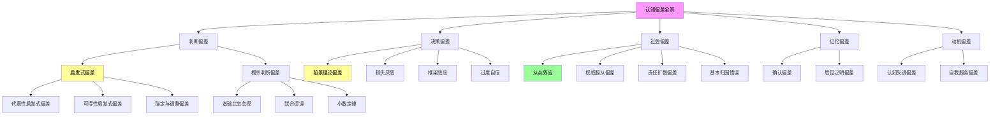
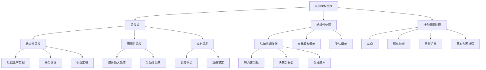

# 认知偏差全景图

> 报告版本：v1.0 | 创建日期：2026-04-05 | 整合：psychology-learning 已完成精读报告 | 数据来源：Tversky & Kahneman (1974, 1979)、Festinger & Carlsmith (1959)、Milgram (1963)、Asch (1951)、Darley & Latane (1968)、Seligman & Maier (1967) 等

---

## 1. 认知偏差定义与分类框架

### 1.1 什么是认知偏差

认知偏差（Cognitive Bias）是指人类在判断、决策和推理过程中，系统性偏离理性标准或最优解的倾向。这些偏差并非随机错误，而是**可预测的、可重复的模式**，源于大脑处理信息的认知捷径（启发式）。

认知偏差的核心特征：
- **系统性**：偏差不是随机噪声，而是按可预测方向偏离
- **起源古老**：大多数偏差根植于人类进化形成的认知架构
- **双面性**：同一偏差在多数场景中提高适应效率，在特定情境中导致系统性错误
- **难以消除**：知晓偏差存在不足以自动消除它

### 1.2 偏差的分类层次

以下是基于精读报告整理的偏差分类层次图：



---

## 2. 核心偏差矩阵

以下矩阵整合本项目已有精读报告中的核心实验发现：

| 偏差名称 | 代表实验 | 核心机制 | 效应量 | 复现状况 |
|---------|---------|---------|--------|---------|
| 代表性启发式偏差 | Tversky & Kahneman (1974) - Steve职业判断 | 忽视基础比率，以相似性替代概率 | d ≈ 1.2–1.5（强效应） | 高度可复现，50年广泛验证 |
| 联合谬误 | Tversky & Kahneman (1974) - Linda问题 | P(A∩B) > P(A)违反概率公理 | 约85%受试者犯错 | 稳健，但措辞敏感 |
| 可得性启发式偏差 | Tversky & Kahneman (1974) - 字母K频率 | 高估易提取事件频率 | r > 0.90（与媒体曝光相关） | 极稳健，多文化验证 |
| 锚定效应 | Tversky & Kahneman (1974) - 幸运轮盘 | 调整不足，依赖初始锚点 | 20–45个百分点差距 | 最稳健偏差之一 |
| 损失厌恶 | Kahneman & Tversky (1979) | 损失负效用约为等量收益的2倍 | α ≈ 2.25（损失侧斜率/收益侧斜率） | 跨文化稳健 |
| 框架效应 | Kahneman & Tversky (1979) | 同一问题不同表述导致偏好反转 | 约20–40%偏好翻转 | 稳健 |
| 反射效应 | Kahneman & Tversky (1979) | 收益域风险厌恶 vs 损失域风险寻求 | 显著偏好系统性反转 | 稳健 |
| 认知失调 | Festinger & Carlsmith (1959) | 不足理由效应，低报酬导致更强态度改变 | 小报酬组态度评分显著更正面 | 经典验证，后续广泛复制 |
| 从众效应 | Asch (1951) | 规范性+信息性社会影响，公开判断附和 | 约35–75%至少一次从众 | 稳健，但文化差异大 |
| 权威服从偏差 | Milgram (1963) | 代理状态转换，道德责任上移权威 | 65%受试者服从至450V | Burger(2009)复制至150V节点，70%吻合 |
| 责任扩散 | Darley & Latane (1968) | 旁观者人数增加，责任心理分摊 | 帮助率随人数增加而下降 | 稳健，多场景复制 |
| 习得性无助 | Seligman & Maier (1967) | 不可控创伤经验导致控制感丧失 | 逃避失败率显著高于对照组 | 稳健，延伸至人类抑郁研究 |
| 基本归因错误 | 来源于Milgram(1963)观察 | 过度归因个人性格，低估情境因素 | 预测与实际偏差超60个百分点 | 稳健 |
| 沉没成本偏差 | 前景理论延伸 | 已投入资源继续投入而非止损 | 系统性非理性承诺升级 | 行为金融广泛验证 |

---

## 3. Kahneman / Tversky 理论贡献

### 3.1 思想传承脉络

```text
Simon (1955): 有限理性
    "人类理性是有限度的，不是最优解"
           │
           ↓
Tversky & Kahneman (1974): 启发式与偏差
    "三种认知捷径导致系统性判断错误"
           │
     ┌─────┼─────────────────┐
     ↓     ↓                 ↓
  前景理论    行为经济学       助推理论
  (1979)     (Thaler)        (Nudge)
```

### 3.2 两位核心人物

**Daniel Kahneman (1934–2024)**
- 以色列裔美国心理学家，普林斯顿大学荣誉教授
- 因"把心理学引入经济学，特别是关于不确定条件下判断与决策的研究"获2002年诺贝尔经济学奖
- 2011年出版《思考，快与慢》，将毕生研究向公众普及
- 核心贡献：启发式与偏差程序、的前景理论、双过程理论

**Amos Tversky (1937–1996)**
- 以色列裔美国心理学家，斯坦福大学教授
- 与Kahneman近30年合作，行为经济学奠基人之一
- 1994年获心理学界最高奖William James奖
- 1996年去世，未能共享诺奖
- 核心贡献：启发式分类、联合谬误、概率权重函数

### 3.3 理论里程碑

**1974年《Science》：启发式与偏差**
- 首次系统证明人类概率判断系统性偏离贝叶斯标准
- 三种核心启发式：代表性、可得性、锚定
- 引用量60000+，心理学史上被引最高的论文之一

**1979年《Econometrica》：前景理论**
- 提出参考点依赖的价值函数（S形）
- 损失厌恶（loss aversion）：损失α ≈ 2.25倍于等量收益
- 概率加权函数：确定性效应与小概率高估
- 反射效应：风险偏好随收益/损失框架反转
- 为行为经济学提供微观理论基础

**1992年：累积前景理论**
- 对1979年版本的概率加权部分做了更精细的累积处理
- 更好地处理不同结果范围的概率权重

---

## 4. 主要偏差详解

### 4.1 代表性启发式偏差（Representativeness Heuristic Bias）

**定义**：判断某事物属于某类别的概率时，过度依赖其与该类别原型相似程度，忽视统计基础信息。

**经典实验：Steve问题**
- 描述："Steve非常害羞内向，乐于助人，对现实世界不感兴趣，温顺整洁，注重细节秩序"
- 问题：Steve更可能是图书管理员还是农民？
- 结果：绝大多数人选图书管理员
- 分析：图书管理员形象与描述完美吻合，但美国男性农民与图书管理员比例约20:1，贝叶斯后验仍应偏向农民

**偏差类型**：
- **基础比率忽视**：忽视类别的事先概率
- **小数定律**：相信小样本反映总体特征
- **联合谬误**：认为P(A∩B) > P(A)

**效应量来源**：Tversky & Kahneman (1974)，85%受试者犯联合谬误

### 4.2 可得性启发式偏差（Availability Heuristic Bias）

**定义**：判断事件频率或概率时，依赖从记忆提取相关信息的容易程度，而非客观统计。

**经典实验：字母K频率**
- 问题：英语单词中，以K开头的多还是第三个字母是K的多？
- 结果：大多数认为以K开头的多
- 事实：第三个字母是K的单词是以K开头的2倍多
- 原因：提取"以K开头"比"第三个字母是K"容易得多

**现实表现**：
- 新闻高频报道的事件（飞机失事、恐怖袭击）被高估频率
- 医生高估能回忆起的疾病发病率
- 离婚率被高估，因朋友离婚事件更易想起

**关键数据**：受试者估计与媒体报道频率相关性r > 0.90，与真实发生率相关性低

### 4.3 锚定与调整启发式偏差（Anchoring and Adjustment Bias）

**定义**：在数值估计时，从初始锚点向上或向下调整，但调整往往不充分，导致估计偏向锚点。

**经典实验：幸运轮盘**
- 操控：被试转动标有0–100的轮盘（实际被操纵停在10或65）
- 任务：估计联合国中非洲国家比例
- 结果：锚点10组估计25%，锚点65组估计45%
- 关键：随机数字竟产生20个百分点差距

**乘法估计顺序效应**：
- 8×7×6×5×4×3×2×1：中位数估计2250（实际40320）
- 1×2×3×4×5×6×7×8：中位数估计512
- 原因：降序起始高（8×7=56）vs 升序起始低（1×2=2），锚定导致4倍差距

**现实表现**：
- 谈判中的起始报价强烈影响最终成交价
- 股票价格锚定于历史高点或近期价格
- 促销标签"原价XXX，现价YYY"中的原价即为锚点

### 4.4 前景理论核心偏差

**参考点依赖**：
- 人们按相对参考点的变化而非绝对财富水平评估结果
- 参考点通常由当前状态或期望水平决定
- 同一绝对结果，参考点不同，体验完全不同

**S形价值函数**：
- 收益区间凹形：边际效用递减
- 损失区间凸形：边际痛苦递增慢于损失增加
- **损失侧更陡**：损失厌恶的核心

**概率加权函数**：
- 小概率被高估（解释彩票购买行为）
- 中高概率被低估（解释保险购买行为）
- 确定性拥有特殊心理权重（确定性效应）

**反射效应**：
- 同一风险选择，在收益框架下表现为风险厌恶
- 在损失框架下表现为风险寻求
- 风险偏好不是稳定特质，而是框架依赖的

### 4.5 认知失调偏差（Cognitive Dissonance）

**定义**：当行为与态度不一致时，个体体验心理不适，并通过调整态度来恢复一致性。

**Festinger & Carlsmith (1959) 经典发现**：
- 任务：完成枯燥重复工作后，向他人撒谎说任务有趣
- 1美元组：外部理由极不充分 → 内部态度显著改变
- 20美元组：外部理由充分 → 态度改变较少
- 控制组：仅完成任务，无认知失调诱发

**不足理由效应**：外部理由越少，内部态度改变越大

**扩展现象**：
- 努力正当化：投入越多努力，对成果评价越高
- 决策后失调：做出选择后，提高对所选对象的评价
- 沉没成本：已投入资源导致非理性承诺升级

### 4.6 社会偏差

**从众效应（Asch, 1951）**：
- 经典范式：线段长度匹配，8名同谋者给出明显错误答案
- 结果：约35–75%被试至少一次给出与明显事实不符的答案
- 机制：规范性影响（避免冲突）+ 信息性影响（群体作为信息源）

**权威服从偏差（Milgram, 1963）**：
- 65%被试服从至最高450V电击
- 代理状态：将自己定义为权威的执行工具，道德责任上移
- 预测与实际偏差超60个百分点（专家预测约1%服从）

**责任扩散（Darley & Latane, 1968）**：
- 紧急情境中，旁观者人数增加，单人帮助概率下降
- 机制：心理责任分摊，"应该有人会去管"
- 多元无知：观察他人反应导致集体迟疑

**基本归因错误（Fundamental Attribution Error）**：
- 观察者过度归因行为于个人性格，低估情境因素
- 来源于Milgram实验的惊人发现：专家预测与实际65%服从率相差悬殊

---

## 5. 偏差之间的关联与层次结构

### 5.1 偏差层次关系图



### 5.2 偏差之间的关联

| 关联类型 | 偏差A | 偏差B | 关联说明 |
|---------|-------|-------|---------|
| 共同根源 | 可得性启发 | 锚定效应 | 都源于认知系统的"节能"策略 |
| 层层递进 | 锚定效应 | 损失厌恶 | 锚定导致参考点固定，进而放大损失感受 |
| 并列表现 | 从众效应 | 责任扩散 | 都是社会情境下的决策偏差 |
| 机制互补 | 认知失调 | 确认偏差 | 失调降低驱动选择性信息搜索，确认偏差则维持既有信念 |
| 框架依赖 | 前景理论偏差 | 锚定效应 | 两者都受问题呈现方式影响 |
| 极端化 | 基本归因错误 | 权威服从 | FAE导致低估情境作用，服从则进一步放大情境力量 |

### 5.3 核心理论框架对比

| 理论模型 | 代表人物 | 核心主张 | 与偏差的关系 |
|---------|---------|---------|-------------|
| 有限理性 | Simon (1955) | 认知资源有限，用启发式替代最优计算 | 偏差的认知根源 |
| 启发式与偏差 | Tversky & Kahneman (1974) | 三种启发式导致系统性判断偏差 | 偏差研究的奠基框架 |
| 前景理论 | Kahneman & Tversky (1979) | 价值函数参考点依赖，损失厌恶，风险偏好框架反转 | 决策偏差的核心理论 |
| 生态理性 | Gigerenzer (1990s) | 启发式在自然环境中是适应最优，非偏差 | 对偏差观的竞争性解释 |
| 双过程理论 | Kahneman (2011) | System 1直觉判断 vs System 2分析判断 | 偏差主要来自System 1的快速启发式 |

---

## 6. 实践应用

### 6.1 行为经济学

**损失厌恶的应用**：
- 订阅服务：强调"当前订阅将失去"而非"新功能你将获得"
- 促销文案："不要错过"比"快来抢购"更有效
- 养老金计划：默认加入+损失框架提高参与率

**框架效应的应用**：
- 医疗决策：存活率（positive frame）vs 死亡率（negative frame）
- 食品标签：90%瘦肉 vs 10%脂肪
- 环境政策："每加仑油节省X元" vs "每年多花X元"

**锚定效应的应用**：
- 定价策略：高定价创造锚点，实际折扣显得更有吸引力
- 工资谈判：先出价方设定锚点，影响最终结果
- 房产估值：挂牌价作为锚点影响成交价

### 6.2 临床心理学

**认知失调的临床应用**：
- 治疗中的认知重构：帮助患者识别不一致信念
- 药物依从性：低认知失调患者更可能遵医嘱服药
- 心理同意：外部理由（付费）可能减少治疗动机内化

**习得性无助的临床应用**：
- 抑郁认知模型：习得性无助是抑郁的核心机制
- 治疗设计：强调可控经验，重建控制感
- 慢性疼痛管理：避免患者形成"努力无用"信念

**确认偏差的临床应用**：
- 治疗师需警惕自己的确认偏差
- 诊断过程中的先入为主可能扭曲信息解读
- 动机访谈技术：利用偏差打破僵化信念

### 6.3 教育

**锚定效应的教育应用**：
- 设定学习目标时，高锚点可能提升长期表现
- 成绩反馈中的锚定：与同学比较影响自我评估

**从众效应的教育应用**：
- 课堂问答顺序影响学生独立判断
- 同伴学习的设计：需避免盲目从众
- 评估方式：匿名评估减少规范性影响

**可得性启发式的教育应用**：
- 生动案例比统计数据更易被记住（但未必更真实）
- 媒体报道影响公众对风险的感知
- 媒体素养教育：帮助学生识别可得性偏差

### 6.4 决策与组织

**框架效应的组织应用**：
- 会议决策：不同框架描述同一选项导致不同选择
- 绩效反馈：positive vs negative framing效果差异
- 战略沟通：收益框架vs损失框架影响风险接受度

**责任扩散的组织应用**：
- 任务分配：必须明确"这是你的责任"
- 紧急预案：指定具体响应角色，避免"大家都能管"
- 绩效考核：个人绩效 vs 团队绩效设计影响动机

**权威服从偏差的组织应用**：
- 医疗指令执行规程：Hofling等发现21/22护士服从未核实电话指令
- 企业合规：仅"遵循政策"不足以防止道德失误
- 授权机制：明确责任归属，减少代理状态

**损失厌恶的组织应用**：
- 薪酬设计：避免将现有薪酬变为"损失"
- 变革管理：强调当前状态将失去什么，而非新状态将得到什么
- 投资决策：止损规则对冲损失厌恶

---

## 7. 局限性与争议

### 7.1 方法论局限

**实验任务的人工性**：
- 大多数偏差研究使用假设性文字问题（"你会怎么选？"）
- 现实决策涉及真实激励、情感卷入和社会情境
- 结果可能低估或高估真实世界中的偏差强度

**样本代表性问题**：
- 大量研究以大学生为被试（WEIRD人群：Western, Educated, Industrialized, Rich, Democratic）
- 跨文化复制显示部分偏差效应量存在文化差异
- 专家（医生、统计学家）仍犯基础比率忽视等偏差

**激励相容问题**：
- 实验室选择通常无物质激励认真推理
- 有激励的研究显示偏差可能减轻但不会消失

### 7.2 核心争议

**Gigerenzer的生态理性批评**：
- 在自然环境中，启发式往往比复杂统计推理更准确
- "Fast and Frugal Heuristics"运动认为偏差框架过于负面
- 核心分歧：什么是衡量"正确"的标准（贝叶斯 vs 生态效度）

**双过程理论的简化批评**：
- System 1/System 2框架被批评为过于粗糙
- 实际认知过程比两系统模型更复杂
- 偏差并非仅来自System 1，System 2也有自身偏差

**"偏差"一词的规范性争议**：
- "偏差"一词暗含偏离标准的前提，但标准本身并非中性
- 贝叶斯推理作为标准不一定是人类认知的合理目标
- 批评者认为偏差研究有时过于精英主义

### 7.3 可复现性问题

| 偏差 | 可复现性评估 | 主要来源 |
|------|------------|---------|
| 锚定效应 | 极强 | 多实验室元分析支持 |
| 联合谬误 | 中强 | 措辞敏感，但效应持续存在 |
| 损失厌恶 | 中强 | 跨文化存在效应量差异 |
| 框架效应 | 中 | 效应大小受框架类型调节 |
| 认知失调 | 中强 | 不足理由效应稳健，机制复杂化 |
| 从众效应 | 中强 | 文化差异显著 |

### 7.4 未解问题

1. **偏差的神经基础**：偏差在大脑中如何实现？是否存在"偏差相关"的特定神经回路？
2. **偏差的进化起源**：启发式在多大程度上是适应性的产物而非缺陷？
3. **偏差的可纠正性**：何种干预能最有效减轻偏差？元认知训练有效吗？
4. **偏差与AI的类比**：大型语言模型中是否出现类似的系统性偏差？其机制是否同源？
5. **偏差的个体差异**：哪些人格特质或认知风格预测更强的偏差敏感性？

---

## 8. 延伸知识库索引

本项目已精读的相关报告：

| 报告文件 | 核心偏差 |
|---------|---------|
| `07_tversky_kahneman_heuristics_1974.md` | 代表性、可得性、锚定三大启发式及各自偏差 |
| `05_kahneman_tversky_prospect_theory_1979.md` | 前景理论：参考点依赖、损失厌恶、反射效应、框架效应 |
| `03_festinger_carlsmith_cognitive_dissonance_1959.md` | 认知失调、不足理由效应、自我合理化 |
| `14_asch_conformity_1951.md` | 从众效应（规范性+信息性影响） |
| `02_milgram_obedience_1963.md` | 权威服从、代理状态、基本归因错误 |
| `10_darley_latane_bystander_1968.md` | 责任扩散、旁观者效应 |
| `06_seligman_maier_learned_helplessness_1967.md` | 习得性无助、控制感丧失、动机/认知/情绪三缺陷 |

---

*报告整合：psychology-learning 项目 T008 任务*
*核心数据来源：Tversky & Kahneman (1974, 1979)、Festinger & Carlsmith (1959)、Milgram (1963)、Asch (1951)、Darley & Latane (1968)、Seligman & Maier (1967)*
